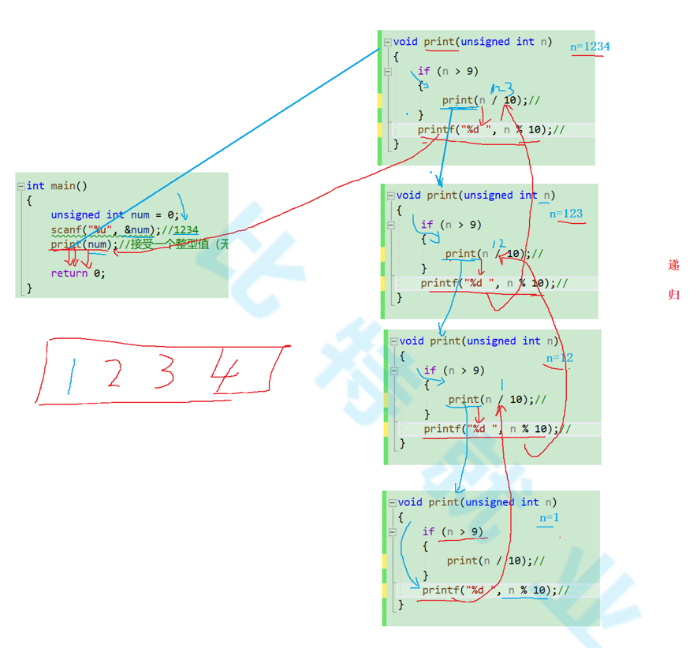

[toc]


# 操作符

++

--

## 后置++

```c
#include <stdio.h>

int main() {
    int a = 10;
    int b = a++;	// 后置++，先使用，后++ 等价于 int b = a; a = a + 1
    printf("%d\n", b);	// 10
    printf("%d\n", a);	// 11
}
```

## 前置++

```c
#include <stdio.h>

int main() {
    int a = 10;
    int b = ++a;	// 前置++，先++，后使用 等价于 a = a + 1; int b = a 
    printf("%d\n", b);	// 11
    printf("%d\n", a);	// 11
}
```

## 后置--

```c
#include <stdio.h>

int main() {
    int a = 10;
    int b = a--;	// 后置--，先使用，后-- 等价于 int b = a; a = a - 1
    printf("%d\n", b);	// 10
    printf("%d\n", a);	// 9
}
```

## 前置--

```c
#include <stdio.h>

int main() {
    int a = 10;
    int b = --a;	// 前置--，先--，后使用 等价于 a = a - 1; int b = a 
    printf("%d\n", b);	// 9
    printf("%d\n", a);	// 9
}
```


## 三目操作符

exp1 ? exp2 : exp3

```c
int main() {
    int a = 10;
    int b = 20;
    int r = (a > b ? a : b) // if (a>b); r = a; else r = b
    return 0;
}
```


## 逗号操作符

逗号表达式的特点是：从左向右依次计算，整个表达式的结果是最后一个表达式的结果。


# 32位为什么最大寻址是4GB

32位表示有32根地址总线，每根地址总线可以传输0或者1，内存的最小单位是1byte，每个1byte都会有内存地址。

00000000 00000000 00000000 00000000

00000000 00000000 00000000 00000001

...

11111111 11111111 11111111 11111111

上面一共可以表示（寻址） 2<sup>32</sup> 个内存地址，也就是说可以表示2<sup>32</sup> 个1byte

2<sup>32</sup>/1024/1024/1024 = 4GB，所以一共可以表示4GB内存


# 选择和循环

## if else 匹配问题

```c
#include <stdio.h>

int main() {
    int a = 10;
    int b = 20;
    if (a==1)
        if (b==20)
            printf("hehe");
    else	
        printf("haha")
     return 0;
     
}

// 此时执行结果什么也不打印，因为else 只和离他最近的if进行匹配，而不是看和哪个if对齐。

// 如果想要控制 else 的匹配，则必须加上 {}

int main() {
    int a = 10;
    int b = 20;
    if (a==1) 
    {
        if (b==20)
            printf("hehe");
    }
    else 
    {
        printf("haha");
    }
    return 0;
}

// 此时 else 会和第一个 if匹配，结果输出 "haha"
```


```c
int main()
{	
	int age = 0;
	scanf("%d", &age);
	if (age < 18)
	{
		printf("少年");
	}
	//else if (18 <= age < 30) // 这里写法错误，输入31 也会走到这里
	else if (age>=18 && age<30)
	{
		printf("中年");
	}
	else 
	{
		printf("老年");
	}
	return 0;
}
```


## for 执行流程

```c
int main()
{
	// while 执行流程
	int n = 1;
	while (n < 10)
	{
		printf("%d\n", n);
		n++;
	}
	// for执行流程
	int i = 0;
	for (i = 1; i < 10; i++)
	{
		printf("%d\n", i);
	}
}
// for 执行的具体流程和 while 一样
```


## do ... while

```c
do 
    循环语句;
while(表达式)
   
    
// 1. 首先执行 do 后面的循环语句
// 2. 然后执行 while(表达式) 判断语句，然后再次执行 do 循环语句，然后执行while语句，依次执行
// 注意: 此循环至少循环一次;
```


# pragma

```c
#pragma once // 防止头文件被重复包含

#pragma comment(lib, "add.lib")	// 主函数导入静态库

```


# 函数递归



