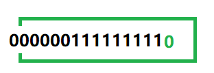
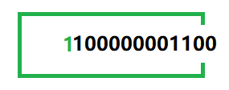
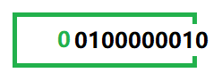

[toc]


# 操作符

++

--

## 后置++

```c
#include <stdio.h>

int main() {
    int a = 10;
    int b = a++;	// 后置++，先使用，后++ 等价于 int b = a; a = a + 1
    printf("%d\n", b);	// 10
    printf("%d\n", a);	// 11
}
```

## 前置++

```c
#include <stdio.h>

int main() {
    int a = 10;
    int b = ++a;	// 前置++，先++，后使用 等价于 a = a + 1; int b = a 
    printf("%d\n", b);	// 11
    printf("%d\n", a);	// 11
}
```

## 后置--

```c
#include <stdio.h>

int main() {
    int a = 10;
    int b = a--;	// 后置--，先使用，后-- 等价于 int b = a; a = a - 1
    printf("%d\n", b);	// 10
    printf("%d\n", a);	// 9
}
```

## 前置--

```c
#include <stdio.h>

int main() {
    int a = 10;
    int b = --a;	// 前置--，先--，后使用 等价于 a = a - 1; int b = a 
    printf("%d\n", b);	// 9
    printf("%d\n", a);	// 9
}
```


```c
int main()
{
	int a = 10;
	printf("%d\n", a--);	// 10
	printf("%d\n", a);		// 9
    
    return 0;
}
```


```c
void test(n)
{
    // 此时 n 是10
}

int main()
{
    int a = 10;
    test(a--); // 此时传进test函数的是10
}
```


## 三目操作符

exp1 ? exp2 : exp3

```c
int main() {
    int a = 10;
    int b = 20;
    int r = (a > b ? a : b) // if (a>b); r = a; else r = b
    return 0;
}
```


## 逗号操作符

逗号表达式的特点是：从左向右依次计算，整个表达式的结果是最后一个表达式的结果。


# 32位为什么最大寻址是4GB

32位表示有32根地址总线，每根地址总线可以传输0或者1，内存的最小单位是1byte，每个1byte都会有内存地址。

00000000 00000000 00000000 00000000

00000000 00000000 00000000 00000001

...

11111111 11111111 11111111 11111111

上面一共可以表示（寻址） 2<sup>32</sup> 个内存地址，也就是说可以表示2<sup>32</sup> 个1byte

2<sup>32</sup>/1024/1024/1024 = 4GB，所以一共可以表示4GB内存


# 选择和循环

## if else 匹配问题

```c
#include <stdio.h>

int main() {
    int a = 10;
    int b = 20;
    if (a==1)
        if (b==20)
            printf("hehe");
    else	
        printf("haha")
     return 0;
     
}

// 此时执行结果什么也不打印，因为else 只和离他最近的if进行匹配，而不是看和哪个if对齐。

// 如果想要控制 else 的匹配，则必须加上 {}

int main() {
    int a = 10;
    int b = 20;
    if (a==1) 
    {
        if (b==20)
            printf("hehe");
    }
    else 
    {
        printf("haha");
    }
    return 0;
}

// 此时 else 会和第一个 if匹配，结果输出 "haha"
```


```c
int main()
{	
	int age = 0;
	scanf("%d", &age);
	if (age < 18)
	{
		printf("少年");
	}
	//else if (18 <= age < 30) // 这里写法错误，输入31 也会走到这里
	else if (age>=18 && age<30)
	{
		printf("中年");
	}
	else 
	{
		printf("老年");
	}
	return 0;
}
```


## for 执行流程

```c
int main()
{
	// while 执行流程
	int n = 1;
	while (n < 10)
	{
		printf("%d\n", n);
		n++;
	}
	// for执行流程
	int i = 0;
	for (i = 1; i < 10; i++)
	{
		printf("%d\n", i);
	}
}
// for 执行的具体流程和 while 一样
```


## do ... while

```c
do 
    循环语句;
while(表达式)
   
    
// 1. 首先执行 do 后面的循环语句
// 2. 然后执行 while(表达式) 判断语句，然后再次执行 do 循环语句，然后执行while语句，依次执行
// 注意: 此循环至少循环一次;
```


# pragma

```c
#pragma once // 防止头文件被重复包含

#pragma comment(lib, "add.lib")	// 主函数导入静态库

```


# 函数递归


# sizeof & strlen

sizeof 是一个操作符，是用来计算变量所占内存空间大小，不关注内存中存放的具体内容，单位是字节；

strlen 是一个库函数，是专门求字符串长度的，只能针对字符串，从参数给定的地址，一直找 \0，统计 \0 之前出现的字符的个数。


# 数组名

```c
// 数组名确实能表示首元素地址
// 但有2个例外情况
// 1. sizeof(数组名)，这里的数组名表示整个数组，计算的是整个数组的大小，单位是字节；
// 2. &数组名，这里的数组名表示整个数组，取出的是整个数组的地址；和首元素区别很大，详细见代码

int main()
{
	int arr[10] = { 0 };
	printf("%p\n", arr);	// 数组首元素地址 0053F8C8
	printf("%p\n", arr+1);	// 			    0053F8CC	+4，跳到下一个元素地址

	printf("%p\n", &arr[0]);// 数组首元素地址 0053F8C8
	printf("%p\n", &arr[0]+1);//			0053F8CC	+4，跳到下一个元素地址

	printf("%p\n", &arr);	// 数组地址		  0053F8C8
	printf("%p\n", &arr+1);	//				 0053F8F0	+40	这个表示数组结尾地址

	return 0;
}

// F0-C8 = 0X28 -->10进制表示 2*16^1 + 8*16^0 = 40


// 二维数组名理解,也表示数组元素首地址
int main()
{
	int arr[3][4] = { 0 };
	// 行数
	printf("%d\n", sizeof(arr) / sizeof(arr[0]));			//3
	
	// 列数
	printf("%d\n", sizeof(arr[0]) / sizeof(arr[0][0]));		// 4
	// 二维数组名理解
	printf("%p\n", arr);			// 0079F708
	printf("%p\n", &arr[0]);		// 0079F708
	printf("%p\n", &arr[0][0]);		// 0079F708

	printf("%p\n", arr+1);			// 0079F718			+16, 跳到了下一行地址
	printf("%p\n", &arr[0]+1);		// 0079F718			同上
	printf("%p\n", &arr[0][0]+1);	// 0079F70C			+4，跳到了下一个元素地址
	printf("%p\n", &arr + 1);		// 0079F738			+48,跳到了数组末尾地址

	return 0;
}
// 38 -08 = 0x30; -->十进制，3*16^1 = 48
```


# 二进制表示形式

正整数原码、反码、补码 相同；

负整数原码、反码、补码需要计算；

整数在内存中存储的是二进制的补码形式，参与运算也是以补码形式，但是打印显示到屏幕上的是原码,所以需要从补码转换为原码；


举例：7

7在内存中占用 4个字节，32 bits

原码：00000000 00000000 00000000 00000111

反码：00000000 00000000 00000000 00000111

补码：00000000 00000000 00000000 00000111


-7 

负整数最高位是1

原码：10000000 00000000 00000000 00000111

反码：11111111 11111111 11111111 11111000 （除最高位符号位之外，其他位取反）

补码：11111111 11111111 11111111 11111001 （反码+1）


左移：左边丢弃，右边补0；左移1位相当于乘以2



7的补码：00000000 00000000 00000000 00000111

7<<1  	   00000000 00000000 00000000 00001110，最高位丢弃，第二位补上最高位，最低位补0（左边丢弃，右边补0），计算机显示的时候显示的是原码，因为正整数的原码、反码、补码相同，所以显示的补码也就是原码，不需要重新计算。

-7的补码：11111111 11111111 11111111 11111001 

-7<<1  	   11111111 11111111 11111111 11110010 ，最高位丢弃，第二位补上最高位，最低位补0（左边丢弃，右边补0），得到的是补码，计算机显示（printf）的时候显示的是原码，所以得计算从补码到原码：由补码-->反码需要减1，11111111 11111111 11111111 11110001，然后由反码-->原码：符号位不变，其他位取反：10000000 00000000 00000000 00001110


右移：

- 算数移位：右边丢弃，左边补原符号位，正整数补0，负整数补1；vs2019 编译器采用这种方式
- 逻辑移位：右边丢弃，左边补0；






# 算数操作符

除号 /  ，除号得到的是商；

% 得到的是余数；


# 位操作符

&	按（2进制）位与，只有1&1等于1，其他为0；  

|	按（2进制）位或，只有0|0 等于1，其他为1；

^    按（2进制）位异或，相同为0（例如 1^1等于0，0^0等于0），不同为1（1^0等于1，0^1等于1）；

参与计算的为补码，打印出来的为原码；

正整数原码、反码、补码相同

负整数原码-->反码：最高位(最右位)不变，其他位取反；反码-->补码：反码+1为补码；

负整数补码-->原码：补码-->反码：补码-1为反码；反码-->原码：反码除最高位(最右位)不变，其他位取反；


- 异或特点

```c
int main()
{
	int a = 3;
	int b = 5;
	// 数字交换
	a = a ^ b;	// a = 3 ^ 5
	b = a ^ b;	// b = 3 ^ 5 ^ 5 ==> b = 3
	a = a ^ b;	// a = 3 ^ 5 ^ 3 ==> a = 5
	printf("%d,%d", a, b);	// 5,3

	return 0;
}

// 3 ^ 3 = 0	==> a^a = 0
// 010
// 010
// 000

// 0^5 = 5, 0^3=3 ==> 0^a=a

// 3^3^5 = 5
// 3^5^3 = 5	异或操作符支持交换律
// 011	3
// 101	5
// 110
// 011	3
// 101	5
```


# 单目操作符

! 逻辑反操作，!0 等于1，!非0 等于0，主要用于真假值的判断

```c
int main()
{
	printf("%d\n", !2);	// 0
	printf("%d\n", !-1);// 0
	printf("%d\n", !0); // 1
	
	return 0;
}
```


~ 对一个数的二进制按位取反, 所有位都取反，包括符号位

```c
int main()
{
	int a = 0;
	int b = ~a;
	printf("%d\n", b); // -1
	
	return 0;
	// 00000000000000000000000000000000  a 的补码
	// 11111111111111111111111111111111	 ~a  补码形式
	// 11111111111111111111111111111110	 ~a 的反码
	// 10000000000000000000000000000001	 ~a 的原码 -1
}
```

```c
// ~ 的作用
int main()
{
	int a = 13;
	int b = 0;
	a |= (1 << 4);
	printf("%d\n", a); // 29
	// 00000000000000000000000000001011	a的补码
	// 现在想让13的二进制第五位变成1, 可以 或 上一个二进制
	// 00000000000000000000000000010000	1<<4 
	// 00000000000000000000000000011011
	// 现在想让29的二进制第五位变成0, 可以 与 上一个二进制
	// 11111111111111111111111111101111	// 这个数可以通过
	// 00000000000000000000000000010000 取反得到 (~(1<<4))
	a &= (~(1 << 4));
	printf("%d\n", a);	// 13

}
```


# 表达式求值-隐式类型转换

## 整型类型提升

表达式中的字符和短整型操作数在使用（求表达式）之前被转换为普通整型，这种转换称为整形提升

### 如何进行整型提升


```c
// 1. 负整数的整型提升
char c1 = -1;
// 变量 c1 的二进制位(补码)中只有8个比特位：
// 11111111   c1的原码: 10000001 反码: 11111110 补码: 11111111
// 因为char 为有符号的 char ，所以整型提升的时候，高位补充符号位，即为 1
// 提升后的结果:
// 11111111111111111111111111111111

// 2. 正整数的整型提升
char c2 = 1;
// 变量 c2 的二进制(补码)中只有8个比特位:
// 00000001 正整数的原码、反码、补码相同
// 因为 char 为有符号 char ，所以整型提升的时候，高位补充符号位: 即为 0
// 提升后的结果:
// 00000000000000000000000000000001


//3. 无符号整型提升，高位补 0
```

例子:

```c
int main()
{
	char a = 5;
	// 5是int类型，一共有32bit
	// 00000000000000000000000000000101		补码
	// 但是因为 a 是 char类型 只能存储8bit，所以需要截断，从低位截断8bit
	// 00000101
	char b = 126;
	// 126是int类型，一共有32bit
	// 00000000000000000000000001111110		补码	
	// 但是因为 b是 char类型只能存储8bit，所以需要截断，从低位截断8bit
	// 01111110
	char c = a + b;
	// 根据整型提升
	// 00000101		a最高位是0，所以提升时高位全部补 0
	// 00000000000000000000000000000101		a
	// 01111110		b最高位是0，所以提升时高位全部补 0
	// 00000000000000000000000001111110		b
	// 00000000000000000000000010000011		c因为是 char 类型，需要截断，从低位截断8bit
	// 10000011
	printf("%d\n", c);	// -125
	// 此时打印的 %d 表示打印 c 的整型，所以c需要整型提升
	// c的最高位是1，所以提升时高位全部补充1
	// 11111111111111111111111110000011		c 的补码
	// 11111111111111111111111110000010		c 的反码
	// 10000000000000000000000001111101		c 的原码	打印的是c的原码 -125
}
```


# 逻辑操作符

&& 逻辑与：计算时存在短路操作，即第一个表达式为假，后面的表达式不会计算

```c
int main()
{
    int a = 1;
    int b = 0;
    int c = b && ++a;	// 此时 b 为假，++a 不会被计算
    printf("a=%d, b=%d, c=%d\n", a,b,c);    // a=1, b=0, c=0

    return 0;
}
```


|| 逻辑或: 计算时存在短路操作，即第一个表达式为真，后面的表达式不会计算

```c

int main()
{
    int a = 1;
    int b = 0;
    int c = a ||  ++b;
    printf("a=%d, b=%d, c=%d\n", a, b, c);  // a=1, b=0, c=1

    return 0;
}
```


# 指针

指针类型决定了指针在被解引用的时候访问几个字节：

如果是int* 的指针，解引用访问4个字节；

如果是char* 的指针，解引用访问1个字节；

推广其他类型；

指针的类型决定了指针加1或者减1操作的时候，跳过几个字节，决定了指针的步长；


```C
int main()
{
    int a = 0;
    int* pi = &a;
    *pi++ = 0;	// 等价于 *pi = 0; pi++
    // *--pi = 0;	// 等价于 --pi;*pi = 0;
    
    return 0;
}
```


