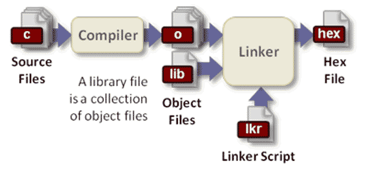

[toc]

代码变成可执行文件，叫做编译（compile）；先编译这个，还是先编译那个（即编译的安排），叫做[构建](https://en.wikipedia.org/wiki/Software_build)（build）。

[Make](https://en.wikipedia.org/wiki/Make_(software))是最常用的构建工具，诞生于1977年，主要用于C语言的项目。但是实际上 ，任何只要某个文件有变化，就要重新构建的项目，都可以用Make构建。


# 编译器

源码要运行，必须先转成二进制的机器码。这是编译器的任务。

比如，下面这段源码（假定文件名叫做test.c）。

> ```clike
> #include <stdio.h>
> 
> int main(void)
> {
>   fputs("Hello, world!\n", stdout);
>   return 0;
> }
> ```

要先用编译器处理一下，才能运行。

> ```bash
> $ gcc test.c
> $ ./a.out
> Hello, world!
> ```

对于复杂的项目，编译过程还必须分成三步。

> ```bash
> $ ./configure
> $ make  
> $ make install
> ```

这些命令到底在干什么？大多数的书籍和资料，都语焉不详，只说这样就可以编译了，没有进一步的解释。

本文将介绍编译器的工作过程，也就是上面这三个命令各自的任务。我主要参考了Alex Smith的文章[《Building C Projects》](http://nethack4.org/blog/building-c.html)。需要声明的是，本文主要针对gcc编译器，也就是针对C和C++，不一定适用于其他语言的编译。



## 第一步 配置（configure）

编译器在开始工作之前，需要知道当前的系统环境，比如标准库在哪里、软件的安装位置在哪里、需要安装哪些组件等等。这是因为不同计算机的系统环境不一样，通过指定编译参数，编译器就可以灵活适应环境，编译出各种环境都能运行的机器码。这个确定编译参数的步骤，就叫做"配置"（configure）。

这些配置信息保存在一个配置文件之中，约定俗成是一个叫做configure的脚本文件。通常它是由[autoconf](https://zh.wikipedia.org/wiki/Autoconf)工具生成的。编译器通过运行这个脚本，获知编译参数。

configure脚本已经尽量考虑到不同系统的差异，并且对各种编译参数给出了默认值。如果用户的系统环境比较特别，或者有一些特定的需求，就需要手动向configure脚本提供编译参数。

> ```bash
> $ ./configure --prefix=/www --with-mysql
> ```

上面代码是php源码的一种编译配置，用户指定安装后的文件保存在www目录，并且编译时加入mysql模块的支持。

## 第二步 确定标准库和头文件的位置

源码肯定会用到标准库函数（standard library）和头文件（header）。它们可以存放在系统的任意目录中，编译器实际上没办法自动检测它们的位置，只有通过配置文件才能知道。

编译的第二步，就是从配置文件中知道标准库和头文件的位置。一般来说，配置文件会给出一个清单，列出几个具体的目录。等到编译时，编译器就按顺序到这几个目录中，寻找目标。

## 第三步 确定依赖关系

对于大型项目来说，源码文件之间往往存在依赖关系，编译器需要确定编译的先后顺序。假定A文件依赖于B文件，编译器应该保证做到下面两点。

> （1）只有在B文件编译完成后，才开始编译A文件。
>
> （2）当B文件发生变化时，A文件会被重新编译。

编译顺序保存在一个叫做makefile的文件中，里面列出哪个文件先编译，哪个文件后编译。而makefile文件由configure脚本运行生成，这就是为什么编译时configure必须首先运行的原因。

在确定依赖关系的同时，编译器也确定了，编译时会用到哪些头文件。

## 第四步 头文件的预编译（precompilation）

不同的源码文件，可能引用同一个头文件（比如stdio.h）。编译的时候，头文件也必须一起编译。为了节省时间，编译器会在编译源码之前，先编译头文件。这保证了头文件只需编译一次，不必每次用到的时候，都重新编译了。

不过，并不是头文件的所有内容，都会被预编译。用来声明宏的#define命令，就不会被预编译。

## 第五步 预处理（Preprocessing）

预编译完成后，编译器就开始替换掉源码中bash的头文件和宏。以本文开头的那段源码为例，它包含头文件stdio.h，替换后的样子如下。

> ```clike
> extern int fputs(const char *, FILE *);
> extern FILE *stdout;
> 
> int main(void)
> {
>     fputs("Hello, world!\n", stdout);
>     return 0;
> }
> ```

为了便于阅读，上面代码只截取了头文件中与源码相关的那部分，即fputs和FILE的声明，省略了stdio.h的其他部分（因为它们非常长）。另外，上面代码的头文件没有经过预编译，而实际上，插入源码的是预编译后的结果。编译器在这一步还会移除注释。

这一步称为"预处理"（Preprocessing），因为完成之后，就要开始真正的处理了。

## 第六步 编译（Compilation）

预处理之后，编译器就开始生成机器码。对于某些编译器来说，还存在一个中间步骤，会先把源码转为汇编码（assembly），然后再把汇编码转为机器码。

下面是本文开头的那段源码转成的汇编码。

> ```clike
>     .file   "test.c"
>     .section    .rodata
> .LC0:
>     .string "Hello, world!\n"
>     .text
>     .globl  main
>     .type   main, @function
> main:
> .LFB0:
>     .cfi_startproc
>     pushq   %rbp
>     .cfi_def_cfa_offset 16
>     .cfi_offset 6, -16
>     movq    %rsp, %rbp
>     .cfi_def_cfa_register 6
>     movq    stdout(%rip), %rax
>     movq    %rax, %rcx
>     movl    $14, %edx
>     movl    $1, %esi
>     movl    $.LC0, %edi
>     call    fwrite
>     movl    $0, %eax
>     popq    %rbp
>     .cfi_def_cfa 7, 8
>     ret
>     .cfi_endproc
> .LFE0:
>     .size   main, .-main
>     .ident  "GCC: (Debian 4.9.1-19) 4.9.1"
>     .section    .note.GNU-stack,"",@progbits
> ```

这种转码后的文件称为对象文件（object file）。

## 第七步 连接（Linking）

对象文件还不能运行，必须进一步转成可执行文件。如果你仔细看上一步的转码结果，会发现其中引用了stdout函数和fwrite函数。也就是说，程序要正常运行，除了上面的代码以外，还必须有stdout和fwrite这两个函数的代码，它们是由C语言的标准库提供的。

编译器的下一步工作，就是把外部函数的代码（通常是后缀名为.lib和.a的文件），添加到可执行文件中。这就叫做连接（linking）。这种通过拷贝，将外部函数库添加到可执行文件的方式，叫做[静态连接](https://zh.wikipedia.org/zh-cn/靜態連結函式庫)（static linking），后文会提到还有[动态连接](https://zh.wikipedia.org/wiki/动态链接库)（dynamic linking）。

make命令的作用，就是从第四步头文件预编译开始，一直到做完这一步。

## 第八步 安装（Installation）

上一步的连接是在内存中进行的，即编译器在内存中生成了可执行文件。下一步，必须将可执行文件保存到用户事先指定的安装目录。

表面上，这一步很简单，就是将可执行文件（连带相关的数据文件）拷贝过去就行了。但是实际上，这一步还必须完成创建目录、保存文件、设置权限等步骤。这整个的保存过程就称为"安装"（Installation）。

## 第九步 操作系统连接

可执行文件安装后，必须以某种方式通知操作系统，让其知道可以使用这个程序了。比如，我们安装了一个文本阅读程序，往往希望双击txt文件，该程序就会自动运行。

这就要求在操作系统中，登记这个程序的元数据：文件名、文件描述、关联后缀名等等。Linux系统中，这些信息通常保存在/usr/share/applications目录下的.desktop文件中。另外，在Windows操作系统中，还需要在Start启动菜单中，建立一个快捷方式。

这些事情就叫做"操作系统连接"。make install命令，就用来完成"安装"和"操作系统连接"这两步。

## 第十步 生成安装包

写到这里，源码编译的整个过程就基本完成了。但是只有很少一部分用户，愿意耐着性子，从头到尾做一遍这个过程。事实上，如果你只有源码可以交给用户，他们会认定你是一个不友好的家伙。大部分用户要的是一个二进制的可执行程序，立刻就能运行。这就要求开发者，将上一步生成的可执行文件，做成可以分发的安装包。

所以，编译器还必须有生成安装包的功能。通常是将可执行文件（连带相关的数据文件），以某种目录结构，保存成压缩文件包，交给用户。

## 第十一步 动态连接（Dynamic linking）

正常情况下，到这一步，程序已经可以运行了。至于运行期间（runtime）发生的事情，与编译器一概无关。但是，开发者可以在编译阶段选择可执行文件连接外部函数库的方式，到底是静态连接（编译时连接），还是动态连接（运行时连接）。所以，最后还要提一下，什么叫做动态连接。

前面已经说过，静态连接就是把外部函数库，拷贝到可执行文件中。这样做的好处是，适用范围比较广，不用担心用户机器缺少某个库文件；缺点是安装包会比较大，而且多个应用程序之间，无法共享库文件。动态连接的做法正好相反，外部函数库不进入安装包，只在运行时动态引用。好处是安装包会比较小，多个应用程序可以共享库文件；缺点是用户必须事先安装好库文件，而且版本和安装位置都必须符合要求，否则就不能正常运行。

现实中，大部分软件采用动态连接，共享库文件。这种动态共享的库文件，Linux平台是后缀名为.so的文件，Windows平台是.dll文件，Mac平台是.dylib文件。


# Make

## 一、Make的概念

Make这个词，英语的意思是"制作"。Make命令直接用了这个意思，就是要做出某个文件。比如，要做出文件a.txt，就可以执行下面的命令。

> ```bash
> $ make a.txt
> ```

但是，如果你真的输入这条命令，它并不会起作用。因为Make命令本身并不知道，如何做出a.txt，需要有人告诉它，如何调用其他命令完成这个目标。

比如，假设文件 a.txt 依赖于 b.txt 和 c.txt ，是后面两个文件连接（cat命令）的产物。那么，make 需要知道下面的规则。

> ```bash
> a.txt: b.txt c.txt
>     cat b.txt c.txt > a.txt
> ```

也就是说，make a.txt 这条命令的背后，实际上分成两步：第一步，确认 b.txt 和 c.txt 必须已经存在，第二步使用 cat 命令 将这个两个文件合并，输出为新文件。

像这样的规则，都写在一个叫做Makefile的文件中，Make命令依赖这个文件进行构建。Makefile文件也可以写为makefile， 或者用命令行参数指定为其他文件名。

> ```bash
> $ make -f rules.txt
> # 或者
> $ make --file=rules.txt
> ```

上面代码指定make命令依据rules.txt文件中的规则，进行构建。

总之，make只是一个根据指定的Shell命令进行构建的工具。它的规则很简单，你规定要构建哪个文件、它依赖哪些源文件，当那些文件有变动时，如何重新构建它。

## 二、Makefile文件的格式

构建规则都写在Makefile文件里面，要学会如何Make命令，就必须学会如何编写Makefile文件。

### 2.1 概述

Makefile文件由一系列规则（rules）构成。每条规则的形式如下。

> ```bash
> <target> : <prerequisites> 
> [tab]  <commands>
> ```

上面第一行冒号前面的部分，叫做"目标"（target），冒号后面的部分叫做"前置条件"（prerequisites）；第二行必须由一个tab键起首，后面跟着"命令"（commands）。

"目标"是必需的，不可省略；"前置条件"和"命令"都是可选的，但是两者之中必须至少存在一个。

每条规则就明确两件事：构建目标的前置条件是什么，以及如何构建。下面就详细讲解，每条规则的这三个组成部分。

### 2.2 目标（target）

一个目标（target）就构成一条规则。目标通常是文件名，指明Make命令所要构建的对象，比如上文的 a.txt 。目标可以是一个文件名，也可以是多个文件名，之间用空格分隔。

除了文件名，目标还可以是某个操作的名字，这称为"伪目标"（phony target）。

> ```bash
> clean:
>       rm *.o
> ```

上面代码的目标是clean，它不是文件名，而是一个操作的名字，属于"伪目标 "，作用是删除对象文件。

> ```bash
> $ make  clean
> ```

但是，如果当前目录中，正好有一个文件叫做clean，那么这个命令不会执行。因为Make发现clean文件已经存在，就认为没有必要重新构建了，就不会执行指定的rm命令。

为了避免这种情况，可以明确声明clean是"伪目标"，写法如下。

> ```bash
> .PHONY: clean
> clean:
>         rm *.o temp
> ```

声明clean是"伪目标"之后，make就不会去检查是否存在一个叫做clean的文件，而是每次运行都执行对应的命令。像.PHONY这样的内置目标名还有不少，可以查看[手册](http://www.gnu.org/software/make/manual/html_node/Special-Targets.html#Special-Targets)。

如果Make命令运行时没有指定目标，默认会执行Makefile文件的第一个目标。

> ```bash
> $ make
> ```

上面代码执行Makefile文件的第一个目标。

### 2.3 前置条件（prerequisites）

前置条件通常是一组文件名，之间用空格分隔。它指定了"目标"是否重新构建的判断标准：只要有一个前置文件不存在，或者有过更新（前置文件的last-modification时间戳比目标的时间戳新），"目标"就需要重新构建。

> ```bash
> result.txt: source.txt
>     cp source.txt result.txt
> ```

上面代码中，构建 result.txt 的前置条件是 source.txt 。如果当前目录中，source.txt 已经存在，那么`make result.txt`可以正常运行，否则必须再写一条规则，来生成 source.txt 。

> ```bash
> source.txt:
>     echo "this is the source" > source.txt
> ```

上面代码中，source.txt后面没有前置条件，就意味着它跟其他文件都无关，只要这个文件还不存在，每次调用`make source.txt`，它都会生成。

> ```bash
> $ make result.txt
> $ make result.txt
> ```

上面命令连续执行两次`make result.txt`。第一次执行会先新建 source.txt，然后再新建 result.txt。第二次执行，Make发现 source.txt 没有变动（时间戳晚于 result.txt），就不会执行任何操作，result.txt 也不会重新生成。

如果需要生成多个文件，往往采用下面的写法。

> ```bash
> source: file1 file2 file3
> ```

上面代码中，source 是一个伪目标，只有三个前置文件，没有任何对应的命令。

> ```bash
> $ make source
> ```

执行`make source`命令后，就会一次性生成 file1，file2，file3 三个文件。这比下面的写法要方便很多。

> ```bash
> $ make file1
> $ make file2
> $ make file3
> ```

### 2.4 命令（commands）

命令（commands）表示如何更新目标文件，由一行或多行的Shell命令组成。它是构建"目标"的具体指令，它的运行结果通常就是生成目标文件。

每行命令之前必须有一个tab键。如果想用其他键，可以用内置变量.RECIPEPREFIX声明。

> ```bash
> .RECIPEPREFIX = >
> all:
> > echo Hello, world
> ```

上面代码用.RECIPEPREFIX指定，大于号（>）替代tab键。所以，每一行命令的起首变成了大于号，而不是tab键。

需要注意的是，每行命令在一个单独的shell中执行。这些Shell之间没有继承关系。

> ```bash
> var-lost:
>     export foo=bar
>     echo "foo=[$$foo]"
> ```

上面代码执行后（`make var-lost`），取不到foo的值。因为两行命令在两个不同的进程执行。一个解决办法是将两行命令写在一行，中间用分号分隔。

> ```bash
> var-kept:
>     export foo=bar; echo "foo=[$$foo]"
> ```

另一个解决办法是在换行符前加反斜杠转义。

> ```bash
> var-kept:
>     export foo=bar; \
>     echo "foo=[$$foo]"
> ```

最后一个方法是加上`.ONESHELL:`命令。

> ```bash
> .ONESHELL:
> var-kept:
>     export foo=bar; 
>     echo "foo=[$$foo]"
> ```

## 三、Makefile文件的语法

### 3.1 注释

井号（#）在Makefile中表示注释。

> ```bash
> # 这是注释
> result.txt: source.txt
>     # 这是注释
>     cp source.txt result.txt # 这也是注释
> ```

### 3.2 回声（echoing）

正常情况下，make会打印每条命令，然后再执行，这就叫做回声（echoing）。

> ```bash
> test:
>     # 这是测试
> ```

执行上面的规则，会得到下面的结果。

> ```bash
> $ make test
> # 这是测试
> ```

在命令的前面加上@，就可以关闭回声。

> ```bash
> test:
>     @# 这是测试
> ```

现在再执行`make test`，就不会有任何输出。

由于在构建过程中，需要了解当前在执行哪条命令，所以通常只在注释和纯显示的echo命令前面加上@。

> ```bash
> test:
>     @# 这是测试
>     @echo TODO
> ```

### 3.3 通配符

通配符（wildcard）用来指定一组符合条件的文件名。Makefile 的通配符与 Bash 一致，主要有星号（*）、问号（？）和 [...] 。比如， *.o 表示所有后缀名为o的文件。

> ```bash
> clean:
>         rm -f *.o
> ```

### 3.4 模式匹配

Make命令允许对文件名，进行类似正则运算的匹配，主要用到的匹配符是%。比如，假定当前目录下有 f1.c 和 f2.c 两个源码文件，需要将它们编译为对应的对象文件。

> ```bash
> %.o: %.c
> ```

等同于下面的写法。

> ```bash
> f1.o: f1.c
> f2.o: f2.c
> ```

使用匹配符%，可以将大量同类型的文件，只用一条规则就完成构建。

### 3.5 变量和赋值符

Makefile 允许使用等号自定义变量。

> ```bash
> txt = Hello World
> test:
>     @echo $(txt)
> ```

上面代码中，变量 txt 等于 Hello World。调用时，变量需要放在 $( ) 之中。

调用Shell变量，需要在美元符号前，再加一个美元符号，这是因为Make命令会对美元符号转义。

> ```bash
> test:
>     @echo $$HOME
> ```

有时，变量的值可能指向另一个变量。

> ```bash
> v1 = $(v2)
> ```

上面代码中，变量 v1 的值是另一个变量 v2。这时会产生一个问题，v1 的值到底在定义时扩展（静态扩展），还是在运行时扩展（动态扩展）？如果 v2 的值是动态的，这两种扩展方式的结果可能会差异很大。

为了解决类似问题，Makefile一共提供了四个赋值运算符 （=、:=、？=、+=），它们的区别请看[StackOverflow](http://stackoverflow.com/questions/448910/makefile-variable-assignment)。

> ```bash
> VARIABLE = value
> # 在执行时扩展，允许递归扩展。
> 
> VARIABLE := value
> # 在定义时扩展。
> 
> VARIABLE ?= value
> # 只有在该变量为空时才设置值。
> 
> VARIABLE += value
> # 将值追加到变量的尾端。
> ```

### 3.6 内置变量（Implicit Variables）

Make命令提供一系列内置变量，比如，$(CC) 指向当前使用的编译器，$(MAKE) 指向当前使用的Make工具。这主要是为了跨平台的兼容性，详细的内置变量清单见[手册](https://www.gnu.org/software/make/manual/html_node/Implicit-Variables.html)。

> ```bash
> output:
>     $(CC) -o output input.c
> ```

### 3.7 自动变量（Automatic Variables）

Make命令还提供一些自动变量，它们的值与当前规则有关。主要有以下几个。

**（1）$@**

$@指代当前目标，就是Make命令当前构建的那个目标。比如，`make foo`的 $@ 就指代foo。

> ```bash
> a.txt b.txt: 
>     touch $@
> ```

等同于下面的写法。

> ```bash
> a.txt:
>     touch a.txt
> b.txt:
>     touch b.txt
> ```

**（2）$<**

$< 指代第一个前置条件。比如，规则为 t: p1 p2，那么$< 就指代p1。

> ```bash
> a.txt: b.txt c.txt
>     cp $< $@ 
> ```

等同于下面的写法。

> ```bash
> a.txt: b.txt c.txt
>     cp b.txt a.txt 
> ```

**（3）$?**

$? 指代比目标更新的所有前置条件，之间以空格分隔。比如，规则为 t: p1 p2，其中 p2 的时间戳比 t 新，$?就指代p2。

**（4）$^**

$^ 指代所有前置条件，之间以空格分隔。比如，规则为 t: p1 p2，那么 $^ 就指代 p1 p2 。

**（5）$\***

$* 指代匹配符 % 匹配的部分， 比如% 匹配 f1.txt 中的f1 ，$* 就表示 f1。

**（6）$(@D) 和 $(@F)**

$(@D) 和 $(@F) 分别指向 $@ 的目录名和文件名。比如，$@是 src/input.c，那么$(@D) 的值为 src ，$(@F) 的值为 input.c。

**（7）$(<D) 和 $(<F)**

$(<D) 和 $(<F) 分别指向 $< 的目录名和文件名。

所有的自动变量清单，请看[手册](https://www.gnu.org/software/make/manual/html_node/Automatic-Variables.html)。下面是自动变量的一个例子。

> ```bash
> dest/%.txt: src/%.txt
>     @[ -d dest ] || mkdir dest
>     cp $< $@
> ```

上面代码将 src 目录下的 txt 文件，拷贝到 dest 目录下。首先判断 dest 目录是否存在，如果不存在就新建，然后，$< 指代前置文件（src/%.txt）， $@ 指代目标文件（dest/%.txt）。

### 3.8 判断和循环

Makefile使用 Bash 语法，完成判断和循环。

> ```bash
> ifeq ($(CC),gcc)
>   libs=$(libs_for_gcc)
> else
>   libs=$(normal_libs)
> endif
> ```

上面代码判断当前编译器是否 gcc ，然后指定不同的库文件。

> ```bash
> LIST = one two three
> all:
>     for i in $(LIST); do \
>         echo $$i; \
>     done
> 
> # 等同于
> 
> all:
>     for i in one two three; do \
>         echo $i; \
>     done
> ```

上面代码的运行结果。

> ```bash
> one
> two
> three
> ```

### 3.9 函数

Makefile 还可以使用函数，格式如下。

> ```bash
> $(function arguments)
> # 或者
> ${function arguments}
> ```

Makefile提供了许多[内置函数](http://www.gnu.org/software/make/manual/html_node/Functions.html)，可供调用。下面是几个常用的内置函数。

**（1）shell 函数**

shell 函数用来执行 shell 命令

> ```bash
> srcfiles := $(shell echo src/{00..99}.txt)
> ```

**（2）wildcard 函数**

wildcard 函数用来在 Makefile 中，替换 Bash 的通配符。

> ```bash
> srcfiles := $(wildcard src/*.txt)
> ```

**（3）subst 函数**

subst 函数用来文本替换，格式如下。

> ```bash
> $(subst from,to,text)
> ```

下面的例子将字符串"feet on the street"替换成"fEEt on the strEEt"。

> ```bash
> $(subst ee,EE,feet on the street)
> ```

下面是一个稍微复杂的例子。

> ```bash
> comma:= ,
> empty:=
> # space变量用两个空变量作为标识符，当中是一个空格
> space:= $(empty) $(empty)
> foo:= a b c
> bar:= $(subst $(space),$(comma),$(foo))
> # bar is now `a,b,c'.
> ```

**（4）patsubst函数**

patsubst 函数用于模式匹配的替换，格式如下。

> ```bash
> $(patsubst pattern,replacement,text)
> ```

下面的例子将文件名"x.c.c bar.c"，替换成"x.c.o bar.o"。

> ```bash
> $(patsubst %.c,%.o,x.c.c bar.c)
> ```

**（5）替换后缀名**

替换后缀名函数的写法是：变量名 + 冒号 + 后缀名替换规则。它实际上patsubst函数的一种简写形式。

> ```bash
> min: $(OUTPUT:.js=.min.js)
> ```

上面代码的意思是，将变量OUTPUT中的后缀名 .js 全部替换成 .min.js 。

## 四、Makefile 的实例

**（1）执行多个目标**

> ```bash
> .PHONY: cleanall cleanobj cleandiff
> 
> cleanall : cleanobj cleandiff
>         rm program
> 
> cleanobj :
>         rm *.o
> 
> cleandiff :
>         rm *.diff
> ```

上面代码可以调用不同目标，删除不同后缀名的文件，也可以调用一个目标（cleanall），删除所有指定类型的文件。

**（2）编译C语言项目**

> ```bash
> edit : main.o kbd.o command.o display.o 
>     cc -o edit main.o kbd.o command.o display.o
> 
> main.o : main.c defs.h
>     cc -c main.c
> kbd.o : kbd.c defs.h command.h
>     cc -c kbd.c
> command.o : command.c defs.h command.h
>     cc -c command.c
> display.o : display.c defs.h
>     cc -c display.c
> 
> clean :
>      rm edit main.o kbd.o command.o display.o
> 
> .PHONY: edit clean
> ```

