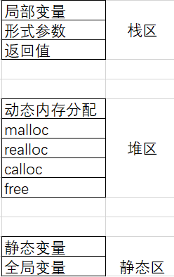
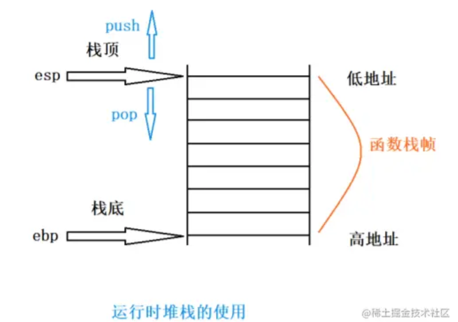
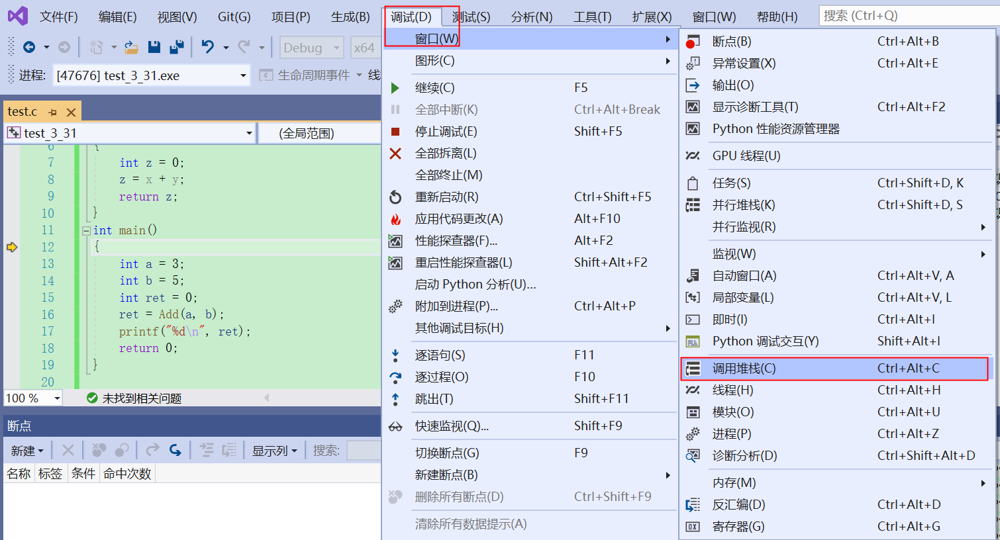

[toc]


## 什么是栈

**在学习C语言中，我们关注内存中的3个区域，栈区、堆区和静态区**



栈（stack）是现代计算机程序里最为重要的概念之一，几乎每一个程序都使用了栈，没有栈就没有函 数，没有局部变量，也就没有我们如今看到的所有的计算机语言。

在经典的计算机科学中，栈被定义为一种特殊的容器，用户可以将数据压入栈中（入栈，push），也可 以将已经压入栈中的数据弹出（出栈，pop），但是栈这个容器必须遵守一条规则：先入栈的数据后出 栈（First In Last Out， FIFO）。就像叠成一叠的书，先叠上去的书在最下面，因此要最后才能取出。

在计算机系统中，栈则是一个具有以上属性的动态内存区域。程序可以将数据压入栈中，也可以将数据 从栈顶弹出。压栈操作使得栈增大，而弹出操作使得栈减小。 在经典的操作系统中，栈总是向下增长（由高地址向低地址）的。 在我们常见的i386或者x86-64下，栈顶由成为 esp 的寄存器进行定位的。

## 什么是函数的栈帧

**函数栈帧（stack frame）就是函数调用过程中在程序的调用栈（call stack）所开辟的空间，这些空间 是用来存放：**

**函数参数和函数返回值**

**临时变量（包括函数的非静态的局部变量以及编译器自动生产的其他临时变量）**

**保存上下文信息（包括在函数调用前后需要保持不变的寄存器）。**

## 认识相关寄存器和汇编指令

### 寄存器

寄存器是**计算机中尺寸最小、存储容量也最小（通常 4~8 个字节）、但读写效率最高的存储器，位于 CPU 内部**。寄存器无法永久性地存储数据（属于易失性存储器），它的主要工作是暂时存储当前 CPU 正在处理的指令以及 CPU 将要使用的数据或者指令。

相关寄存器介绍

> **eax：** 通用寄存器，保留临时数据，常用于返回值
>
> **ebx：** 通用寄存器，保留临时数据
>
> **ebp：** 栈底寄存器
>
> **esp：** 栈顶寄存器
>
> **eip：** 指令寄存器，保存当前指令的下一条指令的地址

小知识：

1. 每一次函数调用，都要为本次函数调用开辟空间，就是函数栈帧的空间。

2. 这块空间的维护是使用了2个寄存器： esp 和 ebp ， ebp 记录的是栈底的地址， esp 记录的是栈顶的地址。




### 相关的汇编指令：

> mov：数据转移指令
>
> push：数据入栈，同时esp栈顶寄存器也要发生改变
>
> pop：数据弹出至指定位置，同时esp栈顶寄存器也要发生改变
>
> sub：减法命令
>
> add：加法命令
>
> call：函数调用，1. 压入返回地址 2. 转入目标函数
>
> jump：通过修改eip，转入目标函数，进行调用
>
> ret：恢复返回地址，压入eip，类似pop eip命令
>
> lea：传递地址指令，用于加载有效地址

## 函数的调用堆栈

```c
#define _CRT_SECURE_NO_WARNINGS 1


#include <stdio.h>
int Add(int x, int y)
{
	int z = 0;
	z = x + y;
	return z;
}
int main()
{
	int a = 3;
	int b = 5;
	int ret = 0;
	ret = Add(a, b);
	printf("%d\n", ret);
	return 0;
}

```

以上面代码为例子，进入调试，进入窗口，就可以开始调用堆栈了！

注意：函数栈帧的创建和销毁过程，在不同的编译器上实现的方法大同小异。本篇博客基于VS2019编译器



右击勾选【显示外部代码】），如下图：

https://blog.csdn.net/weixin_62700590/article/details/121432788