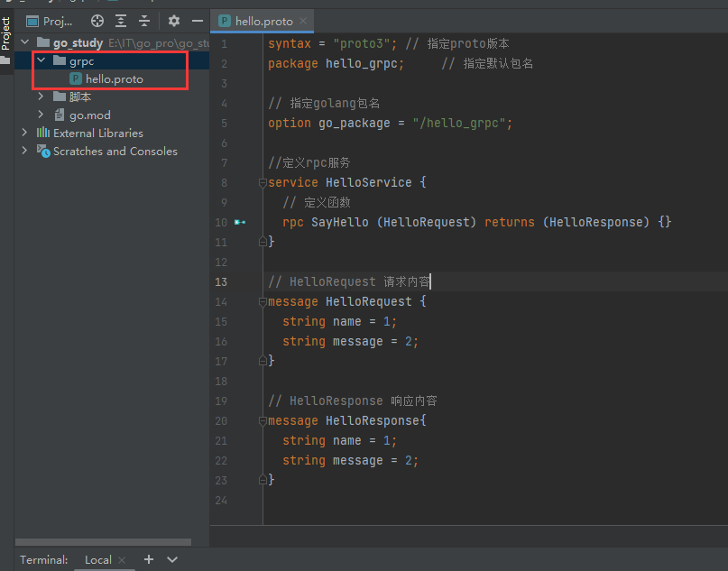
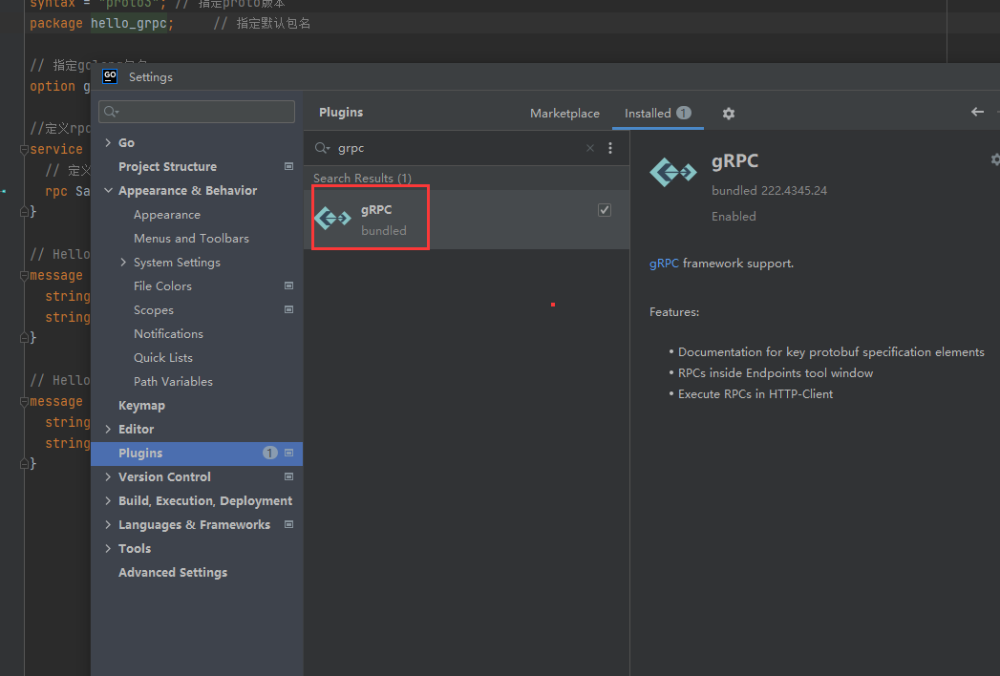
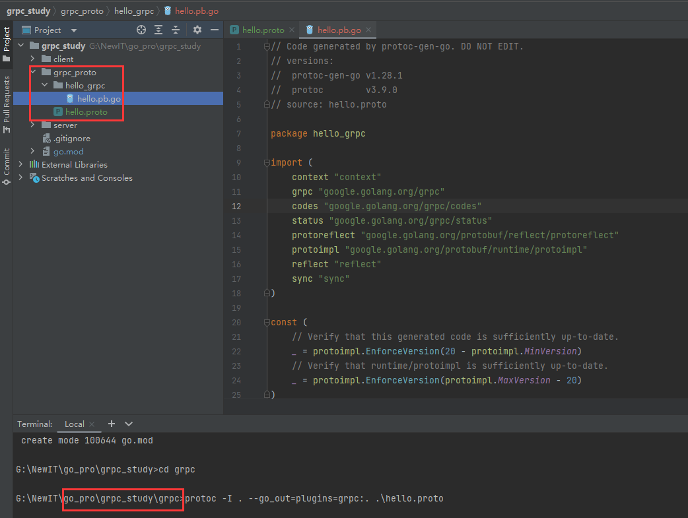
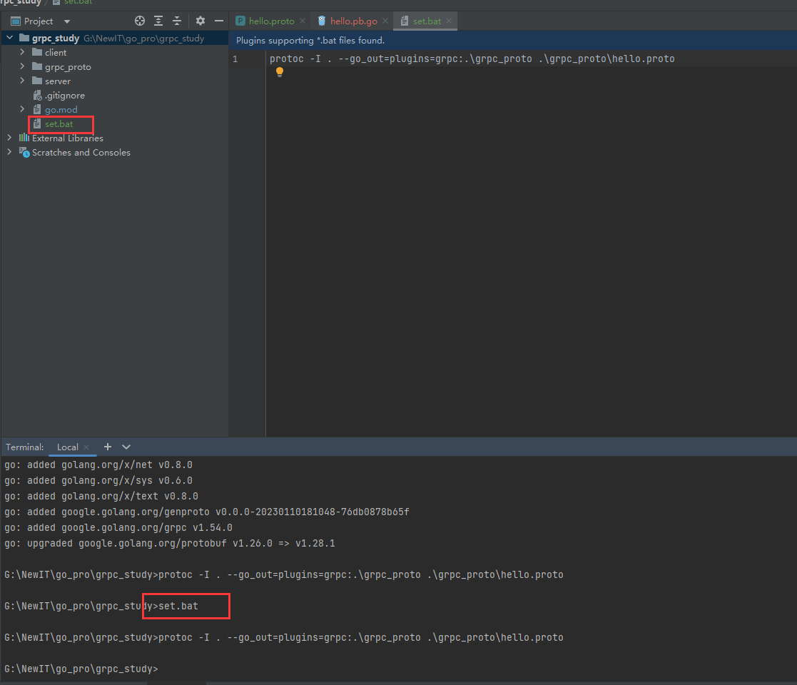

grpc


# 1. grpc安装

`RPC`是`Remote Procedure Call`的简称，中文叫远程过程调用

简单的说，就是调用远程方法和调用本地方法一样

那么grpc就是由 `google`开发的一个高性能、通用的开源`RPC`框架

# [环境准备](https://docs.fengfengzhidao.com/#/docs/grpc文档/1.grpc安装?id=环境准备)

只需要在windows上安装protoc转换工具

```go
https://github.com/protocolbuffers/protobuf/releases/download/v3.9.0/protoc-3.9.0-win64.zip

// 都需要安装的依赖
go get github.com/golang/protobuf/proto
go get google.golang.org/grpc
go install github.com/golang/protobuf/protoc-gen-go
CopyErrorOK!
```

安装好之后，需要将protoc的bin目录添加到环境变量中

还需要将protoc-gen-go.exe的目录添加到环境变量中

刚刚添加之后，可能需要重启电脑或者重启goland，才能在goland的terminal中使用

## [编写protobuf文件](https://docs.fengfengzhidao.com/#/docs/grpc文档/1.grpc安装?id=编写protobuf文件)

现在还没有学过怎么编写，不用担心，先复制粘贴就行了

主要是用于测试环境是否正常

```protobuf
syntax = "proto3"; // 指定proto版本
package hello_grpc;     // 指定默认包名

// 指定golang包名
option go_package = "/hello_grpc";

//定义rpc服务
service HelloService {
  // 定义函数
  rpc SayHello (HelloRequest) returns (HelloResponse) {}
}

// HelloRequest 请求内容
message HelloRequest {
  string name = 1;
  string message = 2;
}

// HelloResponse 响应内容
message HelloResponse{
  string name = 1;
  string message = 2;
}

CopyErrorOK!
```



注意看我的路径

在grpc路径下执行

通过protobuf生成go文件

```go
// protoc -I . --go_out=plugins=grpc:. .\hello.protoCopyErrorOK!
```

或者是在项目根目录下

```Protocol
// protoc -I . --go_out=plugins=grpc:.\grpc .\grpc\hello.protoCopyErrorOK!
```


如果生成了这个文件，那么恭喜你，难倒50%人的环境问题已经搞定了


# 2. 原始的grpc

服务端

```go
package main

import (
  "fmt"
  "net"
  "net/http"
  "net/rpc"
)

type Server struct {
}
type Req struct {
  Num1 int
  Num2 int
}
type Res struct {
  Num int
}

func (s Server) Add(req Req, res *Res) error {
  res.Num = req.Num1 + req.Num2
  return nil
}

func main() {
  // 注册rpc服务
  rpc.Register(new(Server))
  rpc.HandleHTTP()
  listen, err := net.Listen("tcp", ":8080")
  if err != nil {
    fmt.Println(err)
    return
  }
  http.Serve(listen, nil)
}
CopyErrorOK!
```

客户端

```go
package main

import (
  "fmt"
  "net/rpc"
)

type Req struct {
  Num1 int
  Num2 int
}
type Res struct {
  Num int
}

func main() {
  req := Req{1, 2}
  client, err := rpc.DialHTTP("tcp", ":8080")
  if err != nil {
    fmt.Println(err)
    return
  }
  var res Res
  client.Call("Server.Add", req, &res)
  fmt.Println(res)
}
CopyErrorOK!
```

原生rpc的问题：

1. 编写相对复杂，需要自己去关注实现过程
2. 没有代码提示，容易写错


# 3. hello world

## [编写protobuf文件](https://docs.fengfengzhidao.com/#/docs/grpc文档/3.hello_world?id=编写protobuf文件)

```protobuf
syntax = "proto3"; // 指定proto版本
package hello_grpc;     // 指定默认包名

// 指定golang包名
option go_package = "/hello_grpc";

//定义rpc服务
service HelloService {
  // 定义函数
  rpc SayHello (HelloRequest) returns (HelloResponse) {}
}

// HelloRequest 请求内容
message HelloRequest {
  string name = 1;
  string message = 2;
}

// HelloResponse 响应内容
message HelloResponse{
  string name = 1;
  string message = 2;
}
CopyErrorOK!
```

proto文件没有高亮的话去下载一个grpc的插件



在grpc_proto目录下执行

```go
protoc -I . --go_out=plugins=grpc:. .\hello.proto
CopyErrorOK!
```

或者在根目录下执行

```go
protoc -I . --go_out=plugins=grpc:.\grpc_proto .\grpc_proto\hello.protoCopyErrorOK!
```



我们可以编写一个bat文件，方便转换

set.bat

```Bash
protoc -I . --go_out=plugins=grpc:.\grpc_proto .\grpc_proto\hello.protoCopyErrorOK!
```



## [服务端](https://docs.fengfengzhidao.com/#/docs/grpc文档/3.hello_world?id=服务端)

1. 编写一个结构体，名字叫什么不重要
2. 重要的是得实现protobuf中的所有方法
3. 监听端口
4. 注册服务

```go
package main

import (
  "context"
  "fmt"
  "google.golang.org/grpc"
  "google.golang.org/grpc/grpclog"
  "grpc_study/grpc_proto/hello_grpc"
  "net"
)

// HelloServer1 得有一个结构体，需要实现这个服务的全部方法,叫什么名字不重要
type HelloServer1 struct {
}

func (HelloServer1) SayHello(ctx context.Context, request *hello_grpc.HelloRequest) (pd *hello_grpc.HelloResponse, err error) {
  fmt.Println("入参：", request.Name, request.Message)
  pd = new(hello_grpc.HelloResponse)
  pd.Name = "你好"
  pd.Message = "ok"
  return
}

func main() {
  // 监听端口
  listen, err := net.Listen("tcp", ":8080")
  if err != nil {
    grpclog.Fatalf("Failed to listen: %v", err)
  }
  
  // 创建一个gRPC服务器实例。
  s := grpc.NewServer()
  server := HelloServer1{}
  // 将server结构体注册为gRPC服务。
  hello_grpc.RegisterHelloServiceServer(s, &server)
  fmt.Println("grpc server running :8080")
  // 开始处理客户端请求。
  err = s.Serve(listen)
}
CopyErrorOK!
```


## [客户端](https://docs.fengfengzhidao.com/#/docs/grpc文档/3.hello_world?id=客户端)

1. 建立连接
2. 调用方法

```go
package main

import (
  "context"
  "fmt"
  "google.golang.org/grpc"
  "google.golang.org/grpc/credentials/insecure"
  "grpc_study/grpc_proto/hello_grpc"
  "log"
)

func main() {
  addr := ":8080"
  // 使用 grpc.Dial 创建一个到指定地址的 gRPC 连接。
  // 此处使用不安全的证书来实现 SSL/TLS 连接
  conn, err := grpc.Dial(addr, grpc.WithTransportCredentials(insecure.NewCredentials()))
  if err != nil {
    log.Fatalf(fmt.Sprintf("grpc connect addr [%s] 连接失败 %s", addr, err))
  }
  defer conn.Close()
  // 初始化客户端
  client := hello_grpc.NewHelloServiceClient(conn)
  result, err := client.SayHello(context.Background(), &hello_grpc.HelloRequest{
    Name:    "枫枫",
    Message: "ok",
  })
  fmt.Println(result, err)
}
CopyErrorOK!
```

如果需要经常操作这个连接对象，我们可以复用

```go
func initClient() hello_grpc.HelloServiceClient {
  addr := ":8080"
  conn, err := grpc.Dial(addr, grpc.WithTransportCredentials(insecure.NewCredentials()))
  if err != nil {
    log.Fatalf(fmt.Sprintf("grpc connect addr [%s] 连接失败 %s", addr, err))
  }
  client := hello_grpc.NewHelloServiceClient(conn)
  return client
}

func main() {
  client := initClient()
  result, err := client.SayHello(context.Background(), &hello_grpc.HelloRequest{
    Name:    "枫枫",
    Message: "ok",
  })
  result, err = client.SayHello(context.Background(), &hello_grpc.HelloRequest{
    Name:    "哈哈哈",
    Message: "ok1",
  })
  
  fmt.Println(result, err)
}
CopyErrorOK!
```

------


# 4. proto文件

```protobuf
syntax = "proto3"; // 指定proto版本
package hello_grpc;     // 指定默认包名

// 指定golang包名
option go_package = "/hello_grpc";

//定义rpc服务
service HelloService {
  // 定义函数
  rpc SayHello (HelloRequest) returns (HelloResponse) {}
}

// HelloRequest 请求内容
message HelloRequest {
  string name = 1;  // 消息号
  string message = 2;
}

// HelloResponse 响应内容
message HelloResponse{
  string name = 1;
  string message = 2;
}CopyErrorOK!
```

## [生成go文件](https://docs.fengfengzhidao.com/#/docs/grpc文档/4.proto文件?id=生成go文件)

```go
option go_package = ".;xxx";
CopyErrorOK!
```

go_package 表示在当前目录生成go文件，文件的包名是xxx

```go
protoc -I . --go_out=plugins=grpc:./grpc_proto .\grpc_proto\hello.proto
CopyErrorOK!
```

proto文件只是定义接口方法

## [proto语法](https://docs.fengfengzhidao.com/#/docs/grpc文档/4.proto文件?id=proto语法)

service 对应的就是go里面的接口，可以作为服务端，客户端

rpc 对应的就是结构体中的方法

message对应的也是结构体

## [数据类型](https://docs.fengfengzhidao.com/#/docs/grpc文档/4.proto文件?id=数据类型)

### [基本数据类型](https://docs.fengfengzhidao.com/#/docs/grpc文档/4.proto文件?id=基本数据类型)

```protobuf
message Request {
  double a1 = 1;
  float a2 = 2;
  int32 a3 = 3;
  uint32 a4 = 4;
  uint64 a5 = 5;
  sint32 a6 = 6;
  sint64 a7 = 7;
  fixed32 a8 = 8;
  fixed64 a9 = 9;
  sfixed32 a10 = 10;
  sfixed64 a11 = 11;
  bool a12 = 12;
  string a13 = 13;
  bytes a14 = 14;
}CopyErrorOK!
```

对应go类型

```go
type Request struct {
  state         protoimpl.MessageState
  sizeCache     protoimpl.SizeCache
  unknownFields protoimpl.UnknownFields

  A1  float64 `protobuf:"fixed64,1,opt,name=a1,proto3" json:"a1,omitempty"`
  A2  float32 `protobuf:"fixed32,2,opt,name=a2,proto3" json:"a2,omitempty"`
  A3  int32   `protobuf:"varint,3,opt,name=a3,proto3" json:"a3,omitempty"`
  A4  uint32  `protobuf:"varint,4,opt,name=a4,proto3" json:"a4,omitempty"`
  A5  uint64  `protobuf:"varint,5,opt,name=a5,proto3" json:"a5,omitempty"`
  A6  int32   `protobuf:"zigzag32,6,opt,name=a6,proto3" json:"a6,omitempty"`
  A7  int64   `protobuf:"zigzag64,7,opt,name=a7,proto3" json:"a7,omitempty"`
  A8  uint32  `protobuf:"fixed32,8,opt,name=a8,proto3" json:"a8,omitempty"`
  A9  uint64  `protobuf:"fixed64,9,opt,name=a9,proto3" json:"a9,omitempty"`
  A10 int32   `protobuf:"fixed32,10,opt,name=a10,proto3" json:"a10,omitempty"`
  A11 int64   `protobuf:"fixed64,11,opt,name=a11,proto3" json:"a11,omitempty"`
  A12 bool    `protobuf:"varint,12,opt,name=a12,proto3" json:"a12,omitempty"`
  A13 string  `protobuf:"bytes,13,opt,name=a13,proto3" json:"a13,omitempty"`
  A14 []byte  `protobuf:"bytes,14,opt,name=a14,proto3" json:"a14,omitempty"`
}CopyErrorOK!
```

标量类型

| .proto Type | 解释                                                         | Go Type |
| ----------- | ------------------------------------------------------------ | ------- |
| double      |                                                              | float64 |
| float       |                                                              | float32 |
| int32       | 使用变长编码，对于负值的效率很低，如果你的域有可能有负值，请使用sint64替代 | int32   |
| uint32      | 使用变长编码                                                 | uint32  |
| uint64      | 使用变长编码                                                 | uint64  |
| sint32      | 使用变长编码，这些编码在负值时比int32高效的多                | int32   |
| sint64      | 使用变长编码，有符号的整型值。编码时比通常的int64高效        | int64   |
| fixed32     | 总是4个字节，如果数值总是比总是比228大的话，这个类型会比uint32高效。 | uint32  |
| fixed64     | 总是8个字节，如果数值总是比总是比256大的话，这个类型会比uint64高效。 | uint64  |
| sfixed32    | 总是4个字节                                                  | int32   |
| sfixed64    | 总是8个字节                                                  | int64   |
| bool        |                                                              | bool    |
| string      | 一个字符串必须是UTF-8编码或者7-bit ASCII编码的文本           | string  |
| bytes       | 可能包含任意顺序的字节数据                                   | []byte  |

**标量类型如果没有被赋值，则不会被序列化，解析时，会赋予默认值**

- strings：空字符串
- bytes：空序列
- bools：false
- 数值类型：0

### [数组类型](https://docs.fengfengzhidao.com/#/docs/grpc文档/4.proto文件?id=数组类型)

```go
message ArrayRequest {
  repeated int64 a1 = 1;
  repeated string a2 = 2;
  repeated Request request_list = 3;
}CopyErrorOK!
```

go类型

```go
type ArrayRequest struct {
  A1          []int64 
  A2          []string   
  RequestList []*Request
}CopyErrorOK!
```

### [map类型](https://docs.fengfengzhidao.com/#/docs/grpc文档/4.proto文件?id=map类型)

键只能是基本类型

```go
message MapRequest {
  map<int64, string> m_i_s = 1;
  map<string, bool> m_i_b = 2;
  map<string, ArrayRequest> m_i_arr = 3;
}CopyErrorOK!
```

go类型

```go
type MapRequest struct {

  MIS   map[int64]string
  MIB   map[string]bool
  MIArr map[string]*ArrayRequest
}CopyErrorOK!
```

### [嵌套类型](https://docs.fengfengzhidao.com/#/docs/grpc文档/4.proto文件?id=嵌套类型)

```go
message Q1 {
  message Q2{
    string name2 = 2;
  }
  string name1 = 1;
  Q2 q2 = 2;
}
CopyErrorOK!
type Q1 struct {
  state         protoimpl.MessageState
  sizeCache     protoimpl.SizeCache
  unknownFields protoimpl.UnknownFields

  Name1 string `protobuf:"bytes,1,opt,name=name1,proto3" json:"name1,omitempty"`
  Q2    *Q1_Q2 `protobuf:"bytes,2,opt,name=q2,proto3" json:"q2,omitempty"`
}CopyErrorOK!
```

## [编写风格](https://docs.fengfengzhidao.com/#/docs/grpc文档/4.proto文件?id=编写风格)

1. 文件名建议下划线，例如：my_student.proto
2. 包名和目录名对应
3. 服务名、方法名、消息名均为大驼峰
4. 字段名为下划线

## [多服务](https://docs.fengfengzhidao.com/#/docs/grpc文档/4.proto文件?id=多服务)

```go
syntax = "proto3"; // 指定proto版本
// 指定golang包名
option go_package = "/duo_proto";

service VideoService {
  rpc Look(Request)returns(Response){}
}

message Request{
  string name = 1;
}
message Response{
  string name = 1;
}


service OrderService {
  rpc Buy(Request)returns(Response){}
}CopyErrorOK!
```

### [服务端](https://docs.fengfengzhidao.com/#/docs/grpc文档/4.proto文件?id=服务端)

```go
package main

import (
  "context"
  "fmt"
  "google.golang.org/grpc"
  "grpc_study/grpc_proto/duo_proto"
  "log"
  "net"
)

type VideoServer struct {
}

func (VideoServer) Look(ctx context.Context, request *duo_proto.Request) (res *duo_proto.Response, err error) {
  fmt.Println("video:", request)
  return &duo_proto.Response{
    Name: "fengfeng",
  }, nil
}

type OrderServer struct {
}

func (OrderServer) Buy(ctx context.Context, request *duo_proto.Request) (res *duo_proto.Response, err error) {
  fmt.Println("order:", request)
  return &duo_proto.Response{
    Name: "fengfeng",
  }, nil
}

func main() {
  listen, err := net.Listen("tcp", ":8080")
  if err != nil {
    log.Fatal(err)
  }
  s := grpc.NewServer()
  duo_proto.RegisterVideoServiceServer(s, &VideoServer{})
  duo_proto.RegisterOrderServiceServer(s, &OrderServer{})
  fmt.Println("grpc server程序运行在：8080")
  err = s.Serve(listen)
}
CopyErrorOK!
```

### [客户端](https://docs.fengfengzhidao.com/#/docs/grpc文档/4.proto文件?id=客户端)

```go
package main

import (
  "context"
  "fmt"
  "google.golang.org/grpc"
  "google.golang.org/grpc/credentials/insecure"
  "grpc_study/grpc_proto/duo_proto"
  "log"
)

func main() {
  addr := ":8080"
  // 使用 grpc.Dial 创建一个到指定地址的 gRPC 连接。
  // 此处使用不安全的证书来实现 SSL/TLS 连接
  conn, err := grpc.Dial(addr, grpc.WithTransportCredentials(insecure.NewCredentials()))
  if err != nil {
    log.Fatalf(fmt.Sprintf("grpc connect addr [%s] 连接失败 %s", addr, err))
  }
  defer conn.Close()

  orderClient := duo_proto.NewOrderServiceClient(conn)
  res, err := orderClient.Buy(context.Background(), &duo_proto.Request{
    Name: "枫枫",
  })
  fmt.Println(res, err)

  videoClient := duo_proto.NewVideoServiceClient(conn)
  res, err = videoClient.Look(context.Background(), &duo_proto.Request{
    Name: "枫枫",
  })
  fmt.Println(res, err)

}
CopyErrorOK!
```

## [多个proto文件](https://docs.fengfengzhidao.com/#/docs/grpc文档/4.proto文件?id=多个proto文件)

当项目大起来之后，会有很多个service，rpc，message

我们会将不同服务放在不同的proto文件中

还可以放一些公共的proto文件

对于这方面的资料，可以说全网的正确资料真的相当少

其实本质就是生成go文件，需要在一个包内


video.proto

```protobuf
syntax = "proto3";
package proto1;
option go_package = "/proto";
import "common.proto";

service VideoService {
  rpc Look(Request)returns(Response){}
}
CopyErrorOK!
```

order.proto

```protobuf
syntax = "proto3";
package proto;
option go_package = "/proto";
import "common.proto";

service OrderService {
  rpc Look(Request)returns(Response){}
}
CopyErrorOK!
```

common.proto

```protobuf
syntax = "proto3";
package proto;
option go_package = "/proto";


message Request{
  string name = 1;
}
message Response{
  string name = 1;
}

CopyErrorOK!
```

生成命令

```protobuf
protoc -I .\service_proto --go_out=plugins=grpc:./service_proto .\service_proto\order.proto
protoc -I .\service_proto --go_out=plugins=grpc:./service_proto .\service_proto\video.proto
protoc -I .\service_proto --go_out=plugins=grpc:./service_proto .\service_proto\common.proto
CopyErrorOK!
```

有几个点需要注意

如果有import的话，必须得加上package

并且要和import的package相同

使用，还是和之前一样使用

服务端

```go
package main

import (
  "context"
  "fmt"
  "google.golang.org/grpc"
  "grpc_study/service_proto/proto"
  "log"
  "net"
)

type VideoServer struct {
}

func (VideoServer) Look(ctx context.Context, request *proto.Request) (res *proto.Response, err error) {
  fmt.Println("video:", request)
  return &proto.Response{
    Name: "fengfeng",
  }, nil
}

type OrderServer struct {
}

func (OrderServer) Look(ctx context.Context, request *proto.Request) (res *proto.Response, err error) {
  fmt.Println("order:", request)
  return &proto.Response{
    Name: "fengfeng",
  }, nil
}

func main() {
  listen, err := net.Listen("tcp", ":8080")
  if err != nil {
    log.Fatal(err)
  }
  s := grpc.NewServer()
  proto.RegisterVideoServiceServer(s, &VideoServer{})
  proto.RegisterOrderServiceServer(s, &OrderServer{})
  fmt.Println("grpc server程序运行在：8080")
  err = s.Serve(listen)
}

CopyErrorOK!
```

客户端

```go
package main

import (
  "context"
  "fmt"
  "google.golang.org/grpc"
  "google.golang.org/grpc/credentials/insecure"
  "grpc_study/service_proto/proto"
  "log"
)

func main() {
  addr := ":8080"
  // 使用 grpc.Dial 创建一个到指定地址的 gRPC 连接。
  // 此处使用不安全的证书来实现 SSL/TLS 连接
  conn, err := grpc.Dial(addr, grpc.WithTransportCredentials(insecure.NewCredentials()))
  if err != nil {
    log.Fatalf(fmt.Sprintf("grpc connect addr [%s] 连接失败 %s", addr, err))
  }
  defer conn.Close()

  orderClient := proto.NewOrderServiceClient(conn)
  res, err := orderClient.Look(context.Background(), &proto.Request{
    Name: "枫枫",
  })
  fmt.Println(res, err)

  videoClient := proto.NewVideoServiceClient(conn)
  res, err = videoClient.Look(context.Background(), &proto.Request{
    Name: "枫枫",
  })
  fmt.Println(res, err)

}
```


# 5. grpc流式传输

## [普通rpc](https://docs.fengfengzhidao.com/#/docs/grpc文档/5.grpc流式传输?id=普通rpc)

一问一答式

```protobuf
syntax = "proto3";
option go_package = "/proto";

service Simple {
  rpc Fun(Request)returns(Response){}
}
message Request {
  string name = 1;
}
message Response {
  string Text = 1;
}CopyErrorOK!
```

服务端，客户端，代码同上期

## [服务端流式](https://docs.fengfengzhidao.com/#/docs/grpc文档/5.grpc流式传输?id=服务端流式)

### [服务端](https://docs.fengfengzhidao.com/#/docs/grpc文档/5.grpc流式传输?id=服务端)

```go
package main

import (
  "fmt"
  "google.golang.org/grpc"
  "grpc_study/stream_proto/proto"
  "log"
  "net"
)

type ServiceStream struct{}

func (ServiceStream) Fun(request *proto.Request, stream proto.ServiceStream_FunServer) error {
  fmt.Println(request)
  for i := 0; i < 10; i++ {
    stream.Send(&proto.Response{
      Text: fmt.Sprintf("第%d轮数据", i),
    })
  }
  return nil
}

func main() {
  listen, err := net.Listen("tcp", ":8080")
  if err != nil {
    log.Fatal(err)
  }
  server := grpc.NewServer()
  proto.RegisterServiceStreamServer(server, &ServiceStream{})

  server.Serve(listen)
}
CopyErrorOK!
```

### [客户端](https://docs.fengfengzhidao.com/#/docs/grpc文档/5.grpc流式传输?id=客户端)

```go
package main

import (
  "context"
  "fmt"
  "google.golang.org/grpc"
  "google.golang.org/grpc/credentials/insecure"
  "grpc_study/stream_proto/proto"
  "log"
)

func main() {
  addr := ":8080"
  // 使用 grpc.Dial 创建一个到指定地址的 gRPC 连接。
  // 此处使用不安全的证书来实现 SSL/TLS 连接
  conn, err := grpc.Dial(addr, grpc.WithTransportCredentials(insecure.NewCredentials()))
  if err != nil {
    log.Fatalf(fmt.Sprintf("grpc connect addr [%s] 连接失败 %s", addr, err))
  }
  defer conn.Close()
  // 初始化客户端
  client := proto.NewServiceStreamClient(conn)

  stream, err := client.Fun(context.Background(), &proto.Request{
    Name: "张三",
  })
  for i := 0; i < 10; i++ {
    response, err := stream.Recv()
    fmt.Println(response, err)
  }

}
CopyErrorOK!
```

### [客户端不知道服务端什么时候结束](https://docs.fengfengzhidao.com/#/docs/grpc文档/5.grpc流式传输?id=客户端不知道服务端什么时候结束)

```go
stream, err := client.Fun(context.Background(), &proto.Request{
  Name: "张三",
})
for {
  response, err := stream.Recv()
  if err == io.EOF {
    break
  }
  fmt.Println(response)
}CopyErrorOK!
```

### [下载文件](https://docs.fengfengzhidao.com/#/docs/grpc文档/5.grpc流式传输?id=下载文件)

proto文件

```protobuf
syntax = "proto3";
option go_package = "/proto";


message Request {
  string name = 1;
}

message FileResponse{
  string file_name = 1;
  bytes content = 2;
}
service ServiceStream{
  rpc DownLoadFile(Request)returns(stream FileResponse){}
}


// protoc -I . --go_out=plugins=grpc:./stream_proto .\stream_proto\stream.protoCopyErrorOK!
```

服务端

```go
package main

import (
  "fmt"
  "google.golang.org/grpc"
  "grpc_study/stream_proto/proto"
  "io"
  "log"
  "net"
  "os"
)

type ServiceStream struct{}


func (ServiceStream) DownLoadFile(request *proto.Request, stream proto.ServiceStream_DownLoadFileServer) error {
  fmt.Println(request)
  file, err := os.Open("static/1.gvb_web项目搭建.mp4")
  if err != nil {
    return err
  }
  defer file.Close()

  for {
    buf := make([]byte, 2048)
    _, err = file.Read(buf)
    if err == io.EOF {
      break
    }
    if err != nil {
      break
    }
    stream.Send(&proto.FileResponse{
      Content: buf,
    })
  }
  return nil
}

func main() {
  listen, err := net.Listen("tcp", ":8080")
  if err != nil {
    log.Fatal(err)
  }
  server := grpc.NewServer()
  proto.RegisterServiceStreamServer(server, &ServiceStream{})

  server.Serve(listen)
}
CopyErrorOK!
```

客户端

```go
package main

import (
  "bufio"
  "context"
  "fmt"
  "google.golang.org/grpc"
  "google.golang.org/grpc/credentials/insecure"
  "grpc_study/stream_proto/proto"
  "io"
  "log"
  "os"
)

func main() {
  addr := ":8080"
  // 使用 grpc.Dial 创建一个到指定地址的 gRPC 连接。
  // 此处使用不安全的证书来实现 SSL/TLS 连接
  conn, err := grpc.Dial(addr, grpc.WithTransportCredentials(insecure.NewCredentials()))
  if err != nil {
    log.Fatalf(fmt.Sprintf("grpc connect addr [%s] 连接失败 %s", addr, err))
  }
  defer conn.Close()
  // 初始化客户端
  client := proto.NewServiceStreamClient(conn)
  
  stream, err := client.DownLoadFile(context.Background(), &proto.Request{
    Name: "张三",
  })

  file, err := os.OpenFile("static/1.gvb_web项目搭建1.mp4", os.O_CREATE|os.O_WRONLY, 0600)
  if err != nil {
    log.Fatalln(err)
  }
  defer file.Close()

  writer := bufio.NewWriter(file)
  var index int
  for {
    index++
    response, err := stream.Recv()
    if err == io.EOF {
      break
    }
    fmt.Printf("第%d 次， 写入 %d 数据\n", index, len(response.Content))
    writer.Write(response.Content)
  }
  writer.Flush()
}
CopyErrorOK!
```

## [客户端流式](https://docs.fengfengzhidao.com/#/docs/grpc文档/5.grpc流式传输?id=客户端流式)

proto

```protobuf
syntax = "proto3";
option go_package = "/proto";
message Response {
  string Text = 1;
}
message FileRequest{
  string file_name = 1;
  bytes content = 2;
}
service ClientStream{
  rpc UploadFile(stream FileRequest)returns(Response){}
}CopyErrorOK!
```

### [服务端](https://docs.fengfengzhidao.com/#/docs/grpc文档/5.grpc流式传输?id=服务端-1)

```go
package main

import (
  "fmt"
  "google.golang.org/grpc"
  "grpc_study/stream_proto/proto"
  "log"
  "net"
)

type ClientStream struct{}

func (ClientStream) UploadFile(stream proto.ClientStream_UploadFileServer) error {
  for i := 0; i < 10; i++ {
    response, err := stream.Recv()
    fmt.Println(response, err)
  }
  stream.SendAndClose(&proto.Response{Text: "完毕了"})
  return nil
}

func main() {
  listen, err := net.Listen("tcp", ":8080")
  if err != nil {
    log.Fatal(err)
  }
  server := grpc.NewServer()
  proto.RegisterClientStreamServer(server, &ClientStream{})

  server.Serve(listen)
}

CopyErrorOK!
```

### [客户端](https://docs.fengfengzhidao.com/#/docs/grpc文档/5.grpc流式传输?id=客户端-1)

```go
package main

import (
  "context"
  "fmt"
  "google.golang.org/grpc"
  "google.golang.org/grpc/credentials/insecure"
  "grpc_study/stream_proto/proto"
  "log"
)

func main() {
  addr := ":8080"
  conn, err := grpc.Dial(addr, grpc.WithTransportCredentials(insecure.NewCredentials()))
  if err != nil {
    log.Fatalf(fmt.Sprintf("grpc connect addr [%s] 连接失败 %s", addr, err))
  }
  defer conn.Close()
  // 初始化客户端
  client := proto.NewClientStreamClient(conn)
  stream, err := client.UploadFile(context.Background())
  for i := 0; i < 10; i++ {
    stream.Send(&proto.FileRequest{FileName: fmt.Sprintf("第%d次", i)})
  }
  response, err := stream.CloseAndRecv()
  fmt.Println(response, err)
}
CopyErrorOK!
```

### [上传文件](https://docs.fengfengzhidao.com/#/docs/grpc文档/5.grpc流式传输?id=上传文件)

服务端

```go
package main

import (
  "bufio"
  "fmt"
  "google.golang.org/grpc"
  "grpc_study/stream_proto/proto"
  "io"
  "log"
  "net"
  "os"
)

type ClientStream struct{}

func (ClientStream) UploadFile(stream proto.ClientStream_UploadFileServer) error {

  file, err := os.OpenFile("static/x.png", os.O_CREATE|os.O_WRONLY, 0600)
  if err != nil {
    log.Fatalln(err)
  }
  defer file.Close()

  writer := bufio.NewWriter(file)
  var index int
  for {
    index++
    response, err := stream.Recv()
    if err == io.EOF {
      break
    }
    writer.Write(response.Content)
    fmt.Printf("第%d次", index)
  }
  writer.Flush()
  stream.SendAndClose(&proto.Response{Text: "完毕了"})
  return nil
}

func main() {
  listen, err := net.Listen("tcp", ":8080")
  if err != nil {
    log.Fatal(err)
  }
  server := grpc.NewServer()
  proto.RegisterClientStreamServer(server, &ClientStream{})

  server.Serve(listen)
}
CopyErrorOK!
```

客户端

```go
package main

import (
  "context"
  "fmt"
  "google.golang.org/grpc"
  "google.golang.org/grpc/credentials/insecure"
  "grpc_study/stream_proto/proto"
  "io"
  "log"
  "os"
)

func main() {
  addr := ":8080"
  // 使用 grpc.Dial 创建一个到指定地址的 gRPC 连接。
  // 此处使用不安全的证书来实现 SSL/TLS 连接
  conn, err := grpc.Dial(addr, grpc.WithTransportCredentials(insecure.NewCredentials()))
  if err != nil {
    log.Fatalf(fmt.Sprintf("grpc connect addr [%s] 连接失败 %s", addr, err))
  }
  defer conn.Close()
  // 初始化客户端
  client := proto.NewClientStreamClient(conn)
  stream, err := client.UploadFile(context.Background())

  file, err := os.Open("static/21.png")
  if err != nil {
    log.Fatalln(err)
  }
  defer file.Close()

  for {
    buf := make([]byte, 2048)
    _, err = file.Read(buf)
    if err == io.EOF {
      break
    }
    if err != nil {
      break
    }
    stream.Send(&proto.FileRequest{
      FileName: "x.png",
      Content:  buf,
    })
  }
  response, err := stream.CloseAndRecv()
  fmt.Println(response, err)
}
CopyErrorOK!
```

## [双向流](https://docs.fengfengzhidao.com/#/docs/grpc文档/5.grpc流式传输?id=双向流)

proto

```protobuf
syntax = "proto3";
option go_package = "/proto";

message Request {
  string name = 1;
}
message Response {
  string Text = 1;
}

service BothStream{
  rpc Chat(stream Request)returns(stream Response){}
}
CopyErrorOK!
```

### [服务端](https://docs.fengfengzhidao.com/#/docs/grpc文档/5.grpc流式传输?id=服务端-2)

```go
package main

import (
  "fmt"
  "google.golang.org/grpc"
  "grpc_study/stream_proto/proto"
  "log"
  "net"
)

type BothStream struct{}

func (BothStream) Chat(stream proto.BothStream_ChatServer) error {
  for i := 0; i < 10; i++ {
    request, _ := stream.Recv()
    fmt.Println(request)
    stream.Send(&proto.Response{
      Text: "你好",
    })
  }
  return nil
}

func main() {
  listen, err := net.Listen("tcp", ":8080")
  if err != nil {
    log.Fatal(err)
  }
  server := grpc.NewServer()
  proto.RegisterBothStreamServer(server, &BothStream{})

  server.Serve(listen)
}
CopyErrorOK!
```

### [客户端](https://docs.fengfengzhidao.com/#/docs/grpc文档/5.grpc流式传输?id=客户端-2)

```go
package main

import (
  "context"
  "fmt"
  "google.golang.org/grpc"
  "google.golang.org/grpc/credentials/insecure"
  "grpc_study/stream_proto/proto"
  "log"
)

func main() {
  addr := ":8080"
  // 使用 grpc.Dial 创建一个到指定地址的 gRPC 连接。
  // 此处使用不安全的证书来实现 SSL/TLS 连接
  conn, err := grpc.Dial(addr, grpc.WithTransportCredentials(insecure.NewCredentials()))
  if err != nil {
    log.Fatalf(fmt.Sprintf("grpc connect addr [%s] 连接失败 %s", addr, err))
  }
  defer conn.Close()
  // 初始化客户端
  client := proto.NewBothStreamClient(conn)
  stream, err := client.Chat(context.Background())

  for i := 0; i < 10; i++ {
    stream.Send(&proto.Request{
      Name: fmt.Sprintf("第%d次", i),
    })
    response, err := stream.Recv()
    fmt.Println(response, err)
  }
}
CopyErrorOK!
syntax = "proto3";
option go_package = "/proto";

service Simple {
  rpc Fun(Request)returns(Response){}
}

// 服务端流式
service ServiceStream{
  rpc Fun(Request)returns(stream Response){}
  rpc DownLoadFile(Request)returns(stream FileResponse){}
}
// 客户端流式
service ClientStream{
  rpc UploadFile(stream FileRequest)returns(Response){}
}

// 双向流
service BothStream{
  rpc Chat(stream Request)returns(stream Response){}
}


message Request {
  string name = 1;
}
message Response {
  string Text = 1;
}

message FileRequest{
  string file_name = 1;
  bytes content = 2;
}

message FileResponse{
  string file_name = 1;
  bytes content = 2;
}

// protoc -I . --go_out=plugins=grpc:./stream_proto .\stream_proto\stream.protoCopyErrorOK!
```

------