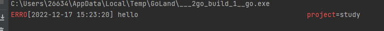

logrus


# 1. logrus常用方法

下载

```go
go get github.com/sirupsen/logrusCopyErrorOK!
```

# [logrus常用方法](https://docs.fengfengzhidao.com/#/docs/logrus文档/1.logrus常用方法?id=logrus常用方法)

```go
logrus.Debugln("Debugln")
logrus.Infoln("Infoln")
logrus.Warnln("Warnln")
logrus.Errorln("Errorln")
logrus.Println("Println")

// 输出如下
time="2022-12-17T14:02:01+08:00" level=info msg=Infoln   
time="2022-12-17T14:02:01+08:00" level=warning msg=Warnln
time="2022-12-17T14:02:01+08:00" level=error msg=Errorln 
time="2022-12-17T14:02:01+08:00" level=info msg=Println
CopyErrorOK!
```

debug的没有输出，是因为logrus默认的日志输出等级是 info

```go
fmt.Println(logrus.GetLevel())  // infoCopyErrorOK!
```

日志等级

```go
PanicLevel  // 会抛一个异常
FatalLevel  // 打印日志之后就会退出
ErrorLevel
WarnLevel
InfoLevel
DebugLevel
TraceLevel  // 低级别CopyErrorOK!
```

## [更改日志级别](https://docs.fengfengzhidao.com/#/docs/logrus文档/1.logrus常用方法?id=更改日志级别)

如果你想显示Debug的日志，那么你可以更改日志显示等级

```go
logrus.SetLevel(logrus.DebugLevel)CopyErrorOK!
```

日志级别一般是和系统环境挂钩，例如开发环境，肯定就要显示debug信息，测试环境也是需要的

线上环境就不需要这些日志，可能只显示warnning的日志

## [设置特定字段](https://docs.fengfengzhidao.com/#/docs/logrus文档/1.logrus常用方法?id=设置特定字段)

```go
log1 := logrus.WithField("project", "study")
log1.Errorln("hello")
// time="2022-12-17T15:02:28+08:00" level=error msg=hello project=study
log2 := logrus.WithFields(logrus.Fields{
  "func": "main",
})
log2.Warningf("你好")
// time="2022-12-17T15:02:28+08:00" level=warning msg="你好" func=main
log3 := log2.WithFields(logrus.Fields{
  "auth": "枫枫",
})
// time="2022-12-17T15:02:28+08:00" level=warning msg="你好" auth="枫枫" func=main
log3.Warnln("你好")CopyErrorOK!
```

通常，在一个应用中、或者应用的一部分中，都有一些固定的Field。

比如在处理用户http请求时，上下文中，所有的日志都会有request_id和user_ip

为了避免每次记录日志都要使用log.WithFields(log.Fields{"request_id": request_id, "user_ip": user_ip})，我们可以创建一个logrus.Entry实例，为这个实例设置默认Fields，在上下文中使用这个logrus.Entry实例记录日志即可。

## [显示样式 Text和Json](https://docs.fengfengzhidao.com/#/docs/logrus文档/1.logrus常用方法?id=显示样式-text和json)

默认的是以text的形式展示，也可以设置为json

```go
logrus.SetFormatter(&logrus.JSONFormatter{})
log1 := logrus.WithField("project", "study")
log1.Errorln("hello")
// {"level":"error","msg":"hello","project":"study","time":"2022-12-17T15:08:24+08:00"}CopyErrorOK!
```

## [自定义颜色](https://docs.fengfengzhidao.com/#/docs/logrus文档/1.logrus常用方法?id=自定义颜色)

如果我们想要在控制中显示颜色，一般的做法都是使用

ANSI 控制码，用于设置文本颜色。\033 是控制码的开始，是八进制数字，[31m 表示将文本设置为红色。

ANSI 控制码是用于在终端和控制台中控制文本格式和颜色的一种标准。它们通常用于在命令行界面 (CLI) 程序中输出彩色文本或者在文本模式下的图形界面 (GUI) 中输出文本。

```go
func main() {
  // 前景色
  fmt.Println("\033[30m 黑色 \033[0m")
  fmt.Println("\033[31m 红色 \033[0m")
  fmt.Println("\033[32m 绿色 \033[0m")
  fmt.Println("\033[33m 黄色 \033[0m")
  fmt.Println("\033[34m 蓝色 \033[0m")
  fmt.Println("\033[35m 紫色 \033[0m")
  fmt.Println("\033[36m 青色 \033[0m")
  fmt.Println("\033[37m 灰色 \033[0m")
  // 背景色
  fmt.Println("\033[40m 黑色 \033[0m")
  fmt.Println("\033[41m 红色 \033[0m")
  fmt.Println("\033[42m 绿色 \033[0m")
  fmt.Println("\033[43m 黄色 \033[0m")
  fmt.Println("\033[44m 蓝色 \033[0m")
  fmt.Println("\033[45m 紫色 \033[0m")
  fmt.Println("\033[46m 青色 \033[0m")
  fmt.Println("\033[47m 灰色 \033[0m")
}CopyErrorOK!
```


也可以这样写

```go
fmt.Printf("\x1b[0;%dm%s\x1b[0m", 31, "你好")
CopyErrorOK!
```

logrus也是支持颜色输出的

我们需要在配置中去进行开启

```go
logrus.SetFormatter(&logrus.TextFormatter{ForceColors: true})CopyErrorOK!
```

不过，只开启这个的话，输出会怪怪的


还有其他的一些配置

```go
ForceColors：是否强制使用颜色输出。
DisableColors：是否禁用颜色输出。
ForceQuote：是否强制引用所有值。
DisableQuote：是否禁用引用所有值。
DisableTimestamp：是否禁用时间戳记录。
FullTimestamp：是否在连接到 TTY 时输出完整的时间戳。
TimestampFormat：用于输出完整时间戳的时间戳格式。CopyErrorOK!
logrus.SetFormatter(&logrus.TextFormatter{ForceColors: true, TimestampFormat: "2006-01-02 15:04:05", FullTimestamp: true})CopyErrorOK!
```



## [输出到日志文件](https://docs.fengfengzhidao.com/#/docs/logrus文档/1.logrus常用方法?id=输出到日志文件)

默认的输出是在控制台上

但是后期想要找某些日志，翻控制台可能就不太好找了

使用这个函数即可`func SetOutput(out io.Writer)`，需要我们有一个`Writer`的对象

```go
file, _ := os.OpenFile("info.log", os.O_CREATE|os.O_WRONLY|os.O_APPEND, 0666)
logrus.SetOutput(file)CopyErrorOK!
```

## [同时输出屏幕和文件](https://docs.fengfengzhidao.com/#/docs/logrus文档/1.logrus常用方法?id=同时输出屏幕和文件)

```go
log.SetFormatter(&log.TextFormatter{})
log.SetOutput(os.Stdout)
//  设置output,默认为stderr,可以为任何io.Writer，比如文件*os.File
file, err := os.OpenFile("checkemstools.log", os.O_CREATE|os.O_WRONLY|os.O_APPEND, 0666)
writers := []io.Writer{
     file,
     os.Stdout}
//  同时写文件和屏幕
fileAndStdoutWriter := io.MultiWriter(writers...)
log.SetOutput(fileAndStdoutWriter)
CopyErrorOK!
```

## [自定义格式](https://docs.fengfengzhidao.com/#/docs/logrus文档/1.logrus常用方法?id=自定义格式)

logrus默认的样式我不太喜欢，没有颜色输出

需要实现`Formatter(entry *logrus.Entry) ([]byte, error)` 接口

```go
package main

import (
  "bytes"
  "fmt"
  "github.com/sirupsen/logrus"
  "os"
  "path"
)

// 颜色
const (
  red    = 31
  yellow = 33
  blue   = 36
  gray   = 37
)

type LogFormatter struct{}

// Format 实现Formatter(entry *logrus.Entry) ([]byte, error)接口
func (t *LogFormatter) Format(entry *logrus.Entry) ([]byte, error) {
  //根据不同的level去展示颜色
  var levelColor int
  switch entry.Level {
  case logrus.DebugLevel, logrus.TraceLevel:
    levelColor = gray
  case logrus.WarnLevel:
    levelColor = yellow
  case logrus.ErrorLevel, logrus.FatalLevel, logrus.PanicLevel:
    levelColor = red
  default:
    levelColor = blue
  }
  var b *bytes.Buffer
  if entry.Buffer != nil {
    b = entry.Buffer
  } else {
    b = &bytes.Buffer{}
  }
  //自定义日期格式
  timestamp := entry.Time.Format("2006-01-02 15:04:05")
  if entry.HasCaller() {
    //自定义文件路径
    funcVal := entry.Caller.Function
    fileVal := fmt.Sprintf("%s:%d", path.Base(entry.Caller.File), entry.Caller.Line)
    //自定义输出格式
    fmt.Fprintf(b, "[%s] \x1b[%dm[%s]\x1b[0m %s %s %s\n", timestamp, levelColor, entry.Level, fileVal, funcVal, entry.Message)
  } else {
    fmt.Fprintf(b, "[%s] \x1b[%dm[%s]\x1b[0m %s\n", timestamp, levelColor, entry.Level, entry.Message)
  }
  return b.Bytes(), nil
}

var log *logrus.Logger

func init() {
  log = NewLog()
}

func NewLog() *logrus.Logger {
  mLog := logrus.New()               //新建一个实例
  mLog.SetOutput(os.Stdout)          //设置输出类型
  mLog.SetReportCaller(true)         //开启返回函数名和行号
  mLog.SetFormatter(&LogFormatter{}) //设置自己定义的Formatter
  mLog.SetLevel(logrus.DebugLevel)   //设置最低的Level
  return mLog
}
func main() {
  log.Errorln("你好")
  log.Infof("你好")
  log.Warnln("你好")
  log.Debugf("你好")
}
CopyErrorOK!
```

## [显示行号](https://docs.fengfengzhidao.com/#/docs/logrus文档/1.logrus常用方法?id=显示行号)

没有行号，无法定位具体的日志位置

```go
logrus.SetReportCaller(true)
```


# 2. hook

# [Hook](https://docs.fengfengzhidao.com/#/docs/logrus文档/2.hook?id=hook)

logrus最令人心动的功能就是其可扩展的HOOK机制了，通过在初始化时为logrus添加hook，logrus可以实现各种扩展功能。

```go
// logrus在记录Levels()返回的日志级别的消息时会触发HOOK，
// 按照Fire方法定义的内容修改logrus.Entry。
type Hook interface {
  Levels() []Level
  Fire(*Entry) error
}
CopyErrorOK!
```

例如实现一个名称写入日志都加一个field

我们需要实现两个方法以实现Hook接口

```go
type MyHook struct {
}

// 设置一个field
func (hook *MyHook) Fire(entry *logrus.Entry) error {
  entry.Data["app"] = "fengfeng"
  return nil
}

// 哪些等级的日志才会生效
func (hook *MyHook) Levels() []logrus.Level {
  return logrus.AllLevels
}

func main() {
  // 日志的打开格式是追加，所以不能用os.Create
  logrus.SetFormatter(&logrus.TextFormatter{ForceColors: true, TimestampFormat: "2006-01-02 15:04:05", FullTimestamp: true})
  logrus.AddHook(&MyHook{})
  logrus.Errorf("hello")
}CopyErrorOK!
```

logrus hook 是一个值得深入学习的设计，你可以轻易适用hook来实现多文件写入。

比如，error级别的日志独立输出到error.log文件里，其他都放在一起。

```go
package main

import (
  "fmt"
  "github.com/sirupsen/logrus"
  "os"
)

type MyHook struct {
  Writer *os.File
}

func (hook *MyHook) Fire(entry *logrus.Entry) error {
  line, err := entry.String()
  if err != nil {
    fmt.Fprintf(os.Stderr, "Unable to read entry, %v", err)
    return err
  }
  hook.Writer.Write([]byte(line))
  return nil
}

func (hook *MyHook) Levels() []logrus.Level {
  return []logrus.Level{logrus.ErrorLevel}
}

func main() {
  logrus.SetFormatter(&logrus.TextFormatter{ForceColors: true, TimestampFormat: "2006-01-02 15:04:05", FullTimestamp: true})
  logrus.SetReportCaller(true)
  file, _ := os.OpenFile("err.log", os.O_CREATE|os.O_WRONLY|os.O_APPEND, 0666)
  hook := &MyHook{Writer: file}
  logrus.AddHook(hook)
  logrus.Errorf("hello")
}
CopyErrorOK!
```

# 3. 日志分割

# [日志分割](https://docs.fengfengzhidao.com/#/docs/logrus文档/3.日志分割?id=日志分割)

## [按时间分割](https://docs.fengfengzhidao.com/#/docs/logrus文档/3.日志分割?id=按时间分割)

### [自定义write方法](https://docs.fengfengzhidao.com/#/docs/logrus文档/3.日志分割?id=自定义write方法)

```go
package gotools

import (
  "errors"
  "fmt"
  "io"
  "os"
  "path/filepath"
  "strings"
  "time"

  log "github.com/sirupsen/logrus"
)

// LogFormatter 日志自定义格式
type LogFormatter struct{}

// Format 格式详情
func (s *LogFormatter) Format(entry *log.Entry) ([]byte, error) {
  timestamp := time.Now().Local().Format("2006-01-02 15:04:05")
  var file string
  var len int
  if entry.Caller != nil {
    file = filepath.Base(entry.Caller.File)
    len = entry.Caller.Line
  }
  //fmt.Println(entry.Data)
  msg := fmt.Sprintf("[%s] %s [%s:%d] %s\n", strings.ToUpper(entry.Level.String()), timestamp, file, len, entry.Message)
  return []byte(msg), nil
}

type logFileWriter struct {
  file     *os.File
  logPath  string
  fileDate string //判断日期切换目录
  appName  string
}

func (p *logFileWriter) Write(data []byte) (n int, err error) {
  if p == nil {
    return 0, errors.New("logFileWriter is nil")
  }
  if p.file == nil {
    return 0, errors.New("file not opened")
  }

  //判断是否需要切换日期
  fileDate := time.Now().Format("2006-01-02")
  if p.fileDate != fileDate {
    p.file.Close()
    err = os.MkdirAll(fmt.Sprintf("%s/%s", p.logPath, fileDate), os.ModePerm)
    if err != nil {
      return 0, err
    }
    filename := fmt.Sprintf("%s/%s/%s-%s.log", p.logPath, fileDate, p.appName, fileDate)

    p.file, err = os.OpenFile(filename, os.O_WRONLY|os.O_APPEND|os.O_CREATE, 0600)
    if err != nil {
      return 0, err
    }
  }

  n, e := p.file.Write(data)
  return n, e

}

// InitLog 初始化日志
func InitLog(logPath string, appName string) {
  fileDate := time.Now().Format("20060102")
  //创建目录
  err := os.MkdirAll(fmt.Sprintf("%s/%s", logPath, fileDate), os.ModePerm)
  if err != nil {
    log.Error(err)
    return
  }

  filename := fmt.Sprintf("%s/%s/%s-%s.log", logPath, fileDate, appName, fileDate)
  file, err := os.OpenFile(filename, os.O_WRONLY|os.O_APPEND|os.O_CREATE, 0600)
  if err != nil {
    log.Error(err)
    return
  }

  fileWriter := logFileWriter{file, logPath, fileDate, appName}
  log.SetOutput(os.Stdout)
  writers := []io.Writer{
    &fileWriter,
    os.Stdout}
  //同时写文件和屏幕
  fileAndStdoutWriter := io.MultiWriter(writers...)
  if err == nil {
    log.SetOutput(fileAndStdoutWriter)
  } else {
    log.Info("failed to log to file.")
  }
  log.SetReportCaller(true)
  log.SetFormatter(new(LogFormatter))

}
CopyErrorOK!
```

### [自定义hook](https://docs.fengfengzhidao.com/#/docs/logrus文档/3.日志分割?id=自定义hook)

```go
package main

import (
  "fmt"
  "github.com/sirupsen/logrus"
  "os"
  "time"
)

type FileDateHook struct {
  file     *os.File
  logPath  string
  fileDate string //判断日期切换目录
  appName  string
}

func (hook FileDateHook) Levels() []logrus.Level {
  return logrus.AllLevels
}
func (hook FileDateHook) Fire(entry *logrus.Entry) error {
  timer := entry.Time.Format("2006-01-02_15-04")
  line, _ := entry.String()
  if hook.fileDate == timer {
    hook.file.Write([]byte(line))
    return nil
  }
  // 时间不等
  hook.file.Close()
  os.MkdirAll(fmt.Sprintf("%s/%s", hook.logPath, timer), os.ModePerm)
  filename := fmt.Sprintf("%s/%s/%s.log", hook.logPath, timer, hook.appName)

  hook.file, _ = os.OpenFile(filename, os.O_WRONLY|os.O_APPEND|os.O_CREATE, 0600)
  hook.fileDate = timer
  hook.file.Write([]byte(line))
  return nil
}

func InitFile(logPath, appName string) {
  fileDate := time.Now().Format("2006-01-02_15-04")
  //创建目录
  err := os.MkdirAll(fmt.Sprintf("%s/%s", logPath, fileDate), os.ModePerm)
  if err != nil {
    logrus.Error(err)
    return
  }

  filename := fmt.Sprintf("%s/%s/%s.log", logPath, fileDate, appName)
  file, err := os.OpenFile(filename, os.O_WRONLY|os.O_APPEND|os.O_CREATE, 0600)
  if err != nil {
    logrus.Error(err)
    return
  }
  fileHook := FileDateHook{file, logPath, fileDate, appName}
  logrus.AddHook(&fileHook)
}

func main() {
  InitFile("logrus_study/log", "feng")

  for {
    logrus.Errorf("error")
    time.Sleep(20 * time.Second)
    logrus.Warnln("warnning")
  }

}
CopyErrorOK!
```

## [按日志等级分割](https://docs.fengfengzhidao.com/#/docs/logrus文档/3.日志分割?id=按日志等级分割)

error，warn，info，all.log

```go
package main

import (
  "fmt"
  "github.com/sirupsen/logrus"
  "os"
)

const (
  allLog  = "all"
  errLog  = "err"
  warnLog = "warn"
  infoLog = "info"
)

type FileLevelHook struct {
  file     *os.File
  errFile  *os.File
  warnFile *os.File
  infoFile *os.File
  logPath  string
}

func (hook FileLevelHook) Levels() []logrus.Level {
  return logrus.AllLevels
}
func (hook FileLevelHook) Fire(entry *logrus.Entry) error {
  line, _ := entry.String()
  switch entry.Level {
  case logrus.ErrorLevel:
    hook.errFile.Write([]byte(line))
  case logrus.WarnLevel:
    hook.warnFile.Write([]byte(line))
  case logrus.InfoLevel:
    hook.infoFile.Write([]byte(line))
  }
  hook.file.Write([]byte(line))
  return nil
}

func InitLevel(logPath string) {
  err := os.MkdirAll(fmt.Sprintf("%s", logPath), os.ModePerm)
  if err != nil {
    logrus.Error(err)
    return
  }
  allFile, err := os.OpenFile(fmt.Sprintf("%s/%s.log", logPath, allLog), os.O_WRONLY|os.O_APPEND|os.O_CREATE, 0600)
  errFile, err := os.OpenFile(fmt.Sprintf("%s/%s.log", logPath, errLog), os.O_WRONLY|os.O_APPEND|os.O_CREATE, 0600)
  warnFile, err := os.OpenFile(fmt.Sprintf("%s/%s.log", logPath, warnLog), os.O_WRONLY|os.O_APPEND|os.O_CREATE, 0600)
  infoFile, err := os.OpenFile(fmt.Sprintf("%s/%s.log", logPath, infoLog), os.O_WRONLY|os.O_APPEND|os.O_CREATE, 0600)
  fileHook := FileLevelHook{allFile, errFile, warnFile, infoFile, logPath}
  logrus.AddHook(&fileHook)
}

func main() {
  InitLevel("logrus_study/log_level")
  logrus.Errorln("你好")
  logrus.Errorln("err")
  logrus.Warnln("warn")
  logrus.Infof("info")
  logrus.Println("print")
}

CopyErrorOK!
```


# 4. gin集成logrus

# [gin集成logrus](https://docs.fengfengzhidao.com/#/docs/logrus文档/4.gin基础logrus?id=gin集成logrus)

main

```go
func main() {

  log.InitFile("logrus_study/gin_logrus/logs", "server")
  router := gin.New()
  router.Use(middleware.LogMiddleware())

  router.GET("/", func(c *gin.Context) {
    logrus.Info("来了")
    c.JSON(200, gin.H{"msg": "你好"})
  })
  router.Run(":8081")

}
CopyErrorOK!
```

middleware

```go
package middleware

import (
  "fmt"
  "github.com/gin-gonic/gin"
  "github.com/sirupsen/logrus"
  "time"
)

const (
  status200 = 42
  status404 = 43
  status500 = 41

  methodGET = 44
)

func LogMiddleware() gin.HandlerFunc {
  return func(c *gin.Context) {
    start := time.Now()
    path := c.Request.URL.Path
    raw := c.Request.URL.RawQuery

    // Process request
    c.Next()

    // Log only when path is not being skipped

    // Stop timer
    end := time.Now()
    timeSub := end.Sub(start)
    clientIP := c.ClientIP()
    method := c.Request.Method
    statusCode := c.Writer.Status()
    //bodySize := c.Writer.Size()
    if raw != "" {
      path = path + "?" + raw
    }

    var statusColor string
    switch statusCode {
    case 200:
      statusColor = fmt.Sprintf("\033[%dm %d \033[0m", status200, statusCode)
    case 404:
      statusColor = fmt.Sprintf("\033[%dm %d \033[0m", status404, statusCode)
    }

    var methodColor string
    switch method {
    case "GET":
      methodColor = fmt.Sprintf("\033[%dm %s \033[0m", methodGET, method)

    }

    logrus.Infof("[GIN] %s |%s| %d | %s | %s | %s",
      start.Format("2006-01-02 15:04:06"),
      statusColor,
      timeSub,
      clientIP,
      methodColor,
      path,
    )

  }

}
CopyErrorOK!
```

log

```go
package log

import (
  "bytes"
  "fmt"
  "github.com/sirupsen/logrus"
  "os"
  "time"
)

type FileDateHook struct {
  file     *os.File
  logPath  string
  fileDate string //判断日期切换目录
  appName  string
}

func (hook FileDateHook) Levels() []logrus.Level {
  return logrus.AllLevels
}
func (hook FileDateHook) Fire(entry *logrus.Entry) error {
  timer := entry.Time.Format("2006-01-02_15-04")
  line, _ := entry.String()
  if hook.fileDate == timer {
    hook.file.Write([]byte(line))
    return nil
  }
  // 时间不等
  hook.file.Close()
  os.MkdirAll(fmt.Sprintf("%s/%s", hook.logPath, timer), os.ModePerm)
  filename := fmt.Sprintf("%s/%s/%s.log", hook.logPath, timer, hook.appName)

  hook.file, _ = os.OpenFile(filename, os.O_WRONLY|os.O_APPEND|os.O_CREATE, 0600)
  hook.fileDate = timer
  hook.file.Write([]byte(line))
  return nil
}

type MyFormatter struct {
}

func (f MyFormatter) Format(entry *logrus.Entry) ([]byte, error) {

  // 设置buffer 缓冲区
  var b *bytes.Buffer
  if entry.Buffer == nil {
    b = &bytes.Buffer{}
  } else {
    b = entry.Buffer
  }
  // 设置格式
  fmt.Fprintf(b, "%s\n", entry.Message)

  return b.Bytes(), nil
}

func InitFile(logPath, appName string) {
  logrus.SetFormatter(&MyFormatter{})

  fileDate := time.Now().Format("2006-01-02_15-04")
  //创建目录
  err := os.MkdirAll(fmt.Sprintf("%s/%s", logPath, fileDate), os.ModePerm)
  if err != nil {
    logrus.Error(err)
    return
  }

  filename := fmt.Sprintf("%s/%s/%s.log", logPath, fileDate, appName)
  file, err := os.OpenFile(filename, os.O_WRONLY|os.O_APPEND|os.O_CREATE, 0600)
  if err != nil {
    logrus.Error(err)
    return
  }
  fileHook := FileDateHook{file, logPath, fileDate, appName}

  logrus.AddHook(&fileHook)
}

CopyErrorOK!
```