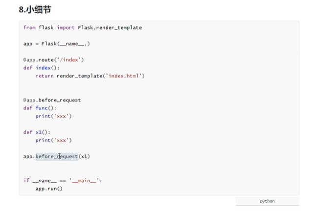
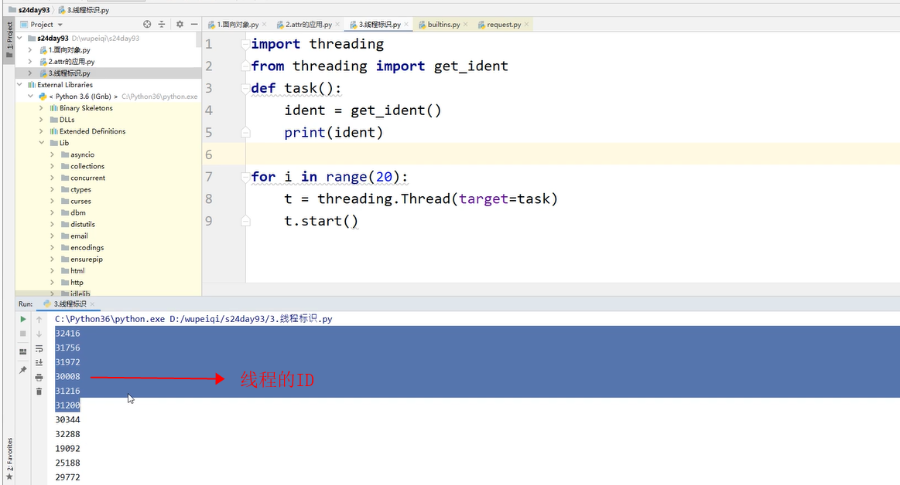

[toc]

https://www.cnblogs.com/wupeiqi/articles/7552008.html

https://www.bilibili.com/video/BV1wS4y177yk?p=12&spm_id_from=pageDriver&vd_source=080d77f9e16bf2c7a51ce0ebb80d4e0e

https://www.osgeo.cn/werkzeug/

## 1.1 依赖wsgi werkzeug

```python
from werkzeug.serving import run_simple

def func(environ, start_response):
    print("请求来了")
    pass

if __name__ == "__main__":
    run_simple("0.0.0.0", 5000, func)
```

```python
from werkzeug.serving import run_simple

class Flask(object):

    def __call__(self, environ, start_response):
        return "xx"

app = Flask()

if __name__ == "__main__":
    run_simple("0.0.0.0", 5000, app)

```

```python
from werkzeug.serving import run_simple

class Flask(object):

    def __call__(self, environ, start_response):
        return "xx"

    def run(self):
        run_simple("0.0.0.0", 5000, self)

app = Flask()

if __name__ == "__main__":
    app.run()

```

## 1.2 快速flask

```python
from flask import Flask

app = Flask(__name__)


@app.route("/index")
def index():
    return "Hello World"


@app.route("/login")
def login():
    return "login"


if __name__ == "__main__":
    app.run()

""""
总结: 
1. flask 框架基于werkzeug的 wsgi实现，flask自己没有wsgi
2. 用户请求一旦到来，就会执行 app.__call__ 方法
"""

```








https://www.bilibili.com/video/BV1wS4y177yk?p=54&spm_id_from=pageDriver&vd_source=080d77f9e16bf2c7a51ce0ebb80d4e0e