[toc]

不管是知乎、Bilibili还是淘宝，第一次登录时都需要完整的输入用户名和密码，但同一个浏览器下，第二次点开网页却能自动登录，也不问你是谁。

是不是突然发现确实有这么个问题？！

**一、Cookie的基本概念**

在网站中，HTTP请求是呈**无序状态**的，也就是说协议对于事务处理没有记忆能力，打开一个服务器上的网页和你之前打开这个服务器上的网页之间没有任何联系，你的当前请求和上一次请求究竟是不是同一个用户发出的，服务器也无从得知。这样就带来一个问题，每次点击网页都需要用户登录？！

不，为了解决这个问题，**Cookie技术**（也记作Cookies）诞生了。

**Cookies是一种能够让网站服务器把少量数据存储到客户端硬盘或内存，或是从客户端的硬盘读取数据的一种技术。**

当用户访问服务器并登录成功后，服务器向客户端返回一些数据（Cookie），客户端将服务器返回的Cookie数据保存在本地，当用户再次访问服务器时，浏览器自动携带Cookie数据给服务器，服务器便知道访问者的身份信息了。

Cookie的基本语法：

**Set_cookie(name,value,expire,path,domain,secure)**

其中：

l name：必需项，规定Cookie的名称

l value：必需项，规定Cookie的值

l expire：可选项，规定Cookie的有效期

l path：可选项，规定Cookie在当前Web下哪些目录有效

l domain：可选项，规定Cookie作用的有效域名

l secure：可选项，规定是否通过安全的HTTPS连接来传输Cookie

前两个参数必须设置。


**二、Cookie的基本使用**

在Flask中自定义Cookie，实际上就是在相应**Response**的Set-Cookie字段中增加自定的键值对。

而获取Cookie，就是在请求**Request**中通过键获取其对应的值。

所以必须引入Request和Response模块。

**设置Cookie**

设置Cookie主要有两种方法，一种是通过Response对象设置，另一种是通过直接设置表单头来实现。

先看第一种，**通过Response对象设置**，代码如下：

```python
from flask import Flask,Response

app = Flask(__name__)
@app.route('/')
def set_cookie():
    resp = Response("设置Cookie！")
    resp.set_cookie("username", "zhangsan")
    return resp

if __name__ == "__main__":
    app.run(debug=True)
```

代码中先创建了一个Response对象resp，然后通过set_cookie进行设置，**username为key（键），zhangsan为键的值**，设置完毕后需要返回resp。

打开网址后结果如下：

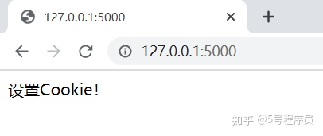

咦？没看到Cookie呀！！！

别急，这里介绍一种最基本的**查看方法**。

以Google浏览器为例，首先在127.0.0.1:5000这个URL前面单击网站信息图标：

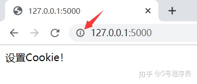

然后单击Cookie图标，弹出下列对话窗口，再依次打开127.0.0.1|Cookie文件夹，就可以找到已经设置好的Cookie值了。

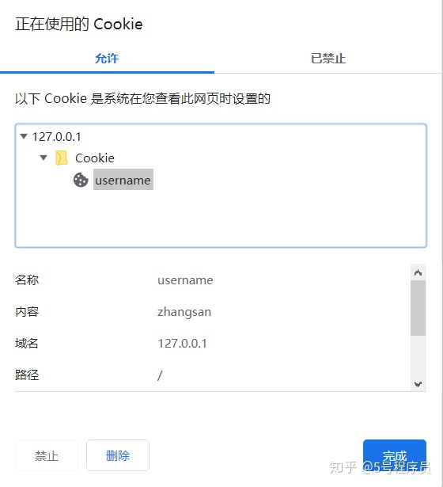

现在看第二种，通过**设置表单头来实现**，代码如下：

```text
from flask import Flask,Response

app = Flask(__name__)
@app.route('/')
def set_cookie():
    resp = Response("设置Cookie！")
    resp.headers["Set-Cookie"] = "username=zhangsan; Expires=Sun,8-Nov-2020 05:10:02 GMT; Max-Age=3600; Path=/"
    return resp

if __name__ == "__main__":
    app.run(debug=True)
```

查看Cookie结果：

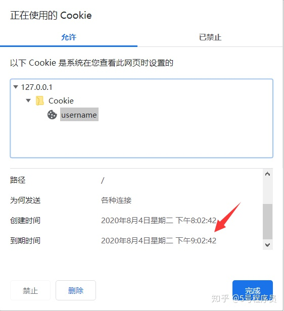

代码中通过**resp.headers["Set-Cookie"]**设定Cookie的值，包括Cookie名、Cookie值、失效日期（Expires）、有效时间（Max-Age）、作用范围（path）。如果想让Cookie存在一段时间就要为expires属性设置未来的一个过期时间。

但在上面代码中**Expires**属性已经被**Max-Age**属性所取代，Max-Age用秒来设置生存期（3600秒为1小时），去掉Max-Age后便能看到日期变为11月8日失效。


**三、设置Cookie的作用域**

Cookie默认只能在**主域名**下使用。

但在实际的浏览网页过程中不可能只看一个域名下的内容，还包含很多**子域名**，这种情况下怎么办呢？

很简单，先用蓝图创建一个子域名，再在子域名下调用主域名的Cookie。

新建blue_admin.py文件，代码如下：

```text
from flask import Blueprint,request

bp = Blueprint("admin_bp", __name__, subdomain="admin")
@bp.route("/")
def get_cookie():  #获取Cookie
    username = request.cookies.get("username")
    return username or "没有获取到name值"
```

上面的代码**用蓝图定义了一个子域名**，再导入到主文件中。

然后修改app.py文件，使得Cookie在子域名有效：

```text
from flask import Flask,Response
from blue_admin import bp

app = Flask(__name__)
app.register_blueprint(bp)
app.config['SERVER_NAME'] = 'baidu.com:5000'
@app.route('/')
def set_cookie():
    resp = Response("设置Cookie！")
    resp.set_cookie("username", "zhangsan", domain=".baidu.com")
    return resp

if __name__ == "__main__":
    app.run(debug=True)
```

使用子域名时，需要在配置文件中**配置SERVER_NAME**才能重新注册服务器域名，对应的在注册蓝图时也需要添加subdomain参数。

但到这里**还没完**，注册服务器域名还需要一个步骤，找到C:\Windows\System32\drivers\etc中的hosts文件，增加两条记录：

```text
127.0.0.1 admin.baidu.com
127.0.0.1 baidu.com
```

Hosts文件建议用**Notepad++**编辑器打开，效果如图：

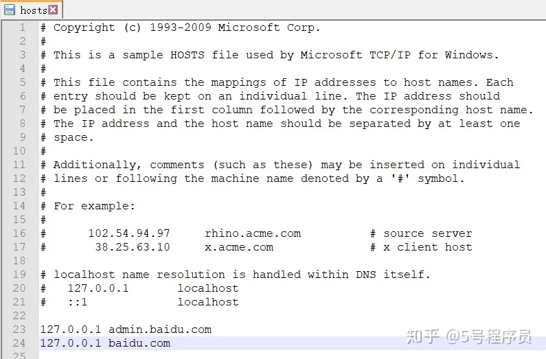

查看运行结果，输入主域名[http://baidu.com:5000](https://link.zhihu.com/?target=http%3A//baidu.com%3A5000)：

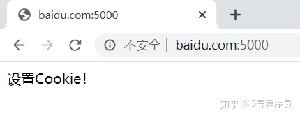

输入子域名admin. [http://baidu.com:5000](https://link.zhihu.com/?target=http%3A//baidu.com%3A5000)：

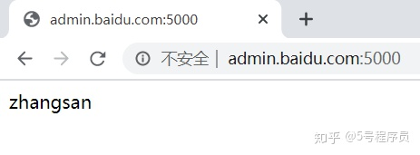

再查看子域名Cookie：

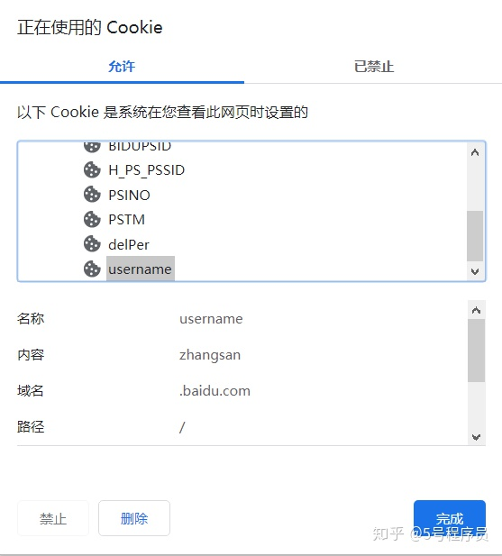

成功！！**作用域限定**在了.[http://baidu.com](https://link.zhihu.com/?target=http%3A//baidu.com)。


## session

上一次我们学习了Cookie，知道Cookie是保存在客户端的。

那么有的小伙伴就问了，难道只有客户端能保存？服务器就不可以保存吗？！

当然可以！

**Session**就是另一种记录用户状态的机制。

Flask的Session是基于Cookie实现的，经过**加密**保存在服务端的键值对（sesson[‘name’]=’value’）中。

当然，在服务器的Cookie中也对应一个相同的随机字符串，用来再次请求时验证。

**一、Session的基本配置**

因为Flask的Session是通过加密后放到Cookie中的，既然有加密就肯定有密钥，所以在使用Session模块时就一定要配置**SECRET_KEY**全局宏。一般我们可以自己设定一个随机字符串，例如：

```text
app.config[‘SECRET_KEY’] = ‘XXXXXXX’
```

有些小伙伴可能会问：我能不能导入os模块自动生成随机字符串呢？

**能！但是不建议。**因为服务器每次启动后SECRET_KEY的值会被改变，会造成Session验证失败，用户还需要重新登录。糟糕的用户体验，可能不用几天网站就倒闭了！

**二、设置Session**

设置Session主要通过**session[‘name’]=’value’**方法来完成，name代表的是变量名称，value代表的是变量的值。但是存在一个问题：服务器我们又接触不到，设置好的值怎么**查看**呢？

哈，办法当然是有的。获取Session的值有两种方法，推荐使用第2种：

l result = session[‘name’]：如果内容不存在，将会报异常

l **result = session.get(‘name’)**：如果内容不存在，将返回None

那万一设置错了怎么**删除**呢？

很简单！！删除单个Session的值，可以使用**Session.pop(‘key’)**方法，如果要清除多个值，可以使用**Session.clear()**方法。

那能不能像Cookie一样设置**过期时间**呢？

没问题！

**Session.permanent = True**可以将有效期延长至一个月，如果不设置，浏览器关闭后就自动结束了。

如果一个月太长怎么办？通过给app.config设置**PERMANENT_SESSION_LIFETIME**来更改过期时间。

**三、Session实例**

多说不如多练，新建app.py文件，代码如下：

```python
from flask import Flask,session
from datetime import timedelta
import os

app = Flask(__name__)
app.config['SECRET_KEY'] = os.urandom(24)  #为了讲解用随机数
app.config['PERMANENT_SESSION_LIFETIME'] = timedelta(days=7)  #生成过期日期
@app.route('/')
def set_session():
    session['username'] = 'zhangsan'
    session.permanent = True
    return "Session设置成功！"

#获取session
@app.route('/get_session')
def get_session():
    username = session.get('username')
    return username or "Session为空！"

#删除session
@app.route('/del_session')
def del_session():
    session.pop('username')
    return "Session被删除！"

if __name__ == "__main__":
    app.run(debug=True)
```

运行后访问网址**http:127.0.0.1:5000/**可以看到：

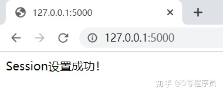

“设置成功！”，切换到网址**http:127.0.0.1:5000/get_session/**可以看到：

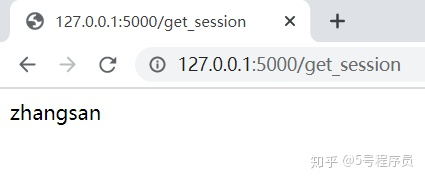

“zhangsan”就是我们设置的值，再切换到网址**http:127.0.0.1:5000/del_session/**可以看到：

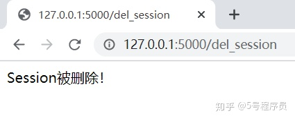

“删除成功！”


