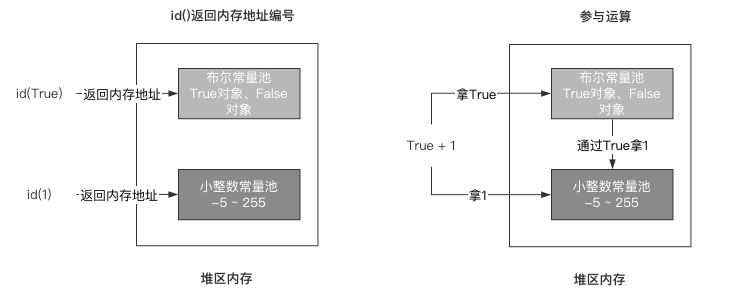

[toc]

# 布尔类型

布尔类型的值被称为布尔值，常用于分支流程中，仅有2种表现形式：

- True：代表条件为真
- False：代表条件为假

布尔属于不可变类型，同时也是基础的[原子类](https://so.csdn.net/so/search?q=原子类&spm=1001.2101.3001.7020)型，即不可分割，不能容纳其他对象。

# 基本声明

以下是使用类实例化的形式进行对象声明：

```python
term = bool(True)
print("value : %r\ntype : %r" % (term, type(term)))

# value : True
# type : <class 'bool'>

```

也可以选择使用更方便的字面量形式进行对象声明：

```python
term = True
print("value : %r\ntype : %r" % (term, type(term)))

# value : True
# type : <class 'bool'>

```

# 类型转换

布尔值仅能转换为数字、字符串，使用对应的工厂函数即可：

```python
termTrue = True
termFalse = False

iTrue = int(termTrue)
iFalse = int(termFalse)

fTrue = float(termTrue)
fFalse = float(termFalse)

sTrue = str(termTrue)
sFalse = str(termFalse)

print("value : %r\ntype : %r" % (iTrue, type(iTrue)))
print("value : %r\ntype : %r" % (iFalse, type(iFalse)))
print("value : %r\ntype : %r" % (fTrue, type(fTrue)))
print("value : %r\ntype : %r" % (fFalse, type(fFalse)))
print("value : %r\ntype : %r" % (sTrue, type(sTrue)))
print("value : %r\ntype : %r" % (sFalse, type(sFalse)))

# value : 1
# type : <class 'int'>
# value : 0
# type : <class 'int'>
# value : 1.0
# type : <class 'float'>
# value : 0.0
# type : <class 'float'>
# value : 'True'
# type : <class 'str'>
# value : 'False'
# type : <class 'str'>

```

除此之外，使用bool()将任意类型对象包裹均能获得其布尔值的表现形式。

以下举例Python内置数据类型在不同状态下的布尔值表示：

| 类型       | True       | False    |
| ---------- | ---------- | -------- |
| int&float  | 不为0      | 为0      |
| str&bytes  | 不为空串   | 为空串   |
| list&tuple | 不为空序列 | 为空序列 |
| dict&set   | 不为空映射 | 为空映射 |

```python
>>> # --- int & float ---
>>> bool(0)
False
>>> bool(1)
True
>>> bool(-1)
True
>>> bool(0.1)
True
>>> bool(-0.1)
True

>>> # --- str & bytes ---
>>> bool("")
False
>>> bool(b"")
False
>>> bool("string")
True
>>> bool(b"bytes")
True

>>> # --- list & tuple ---
>>> bool(list())
False
>>> bool(tuple())
False
>>> bool(list((1, 2, 3)))
True
>>> bool(tuple((1, 2, 3)))
True

>>> # --- dict & set ---
>>> bool(dict())
False
>>> bool(set())
False
>>> bool(dict(k1="v1", k2="v2"))
True
>>> bool(set(("ele1", "ele2")))
True

```

# 布尔常量池

True和False是会被经常使用到的，因此在Python解释器启动时就会进行创建，我将他两归类为布尔常量池中（实际上并不存在）。

与小整数常量池中的数字类似，即使经历不同的实例化过程，但每次得到的True和False都来自同一引用：

```python
>>> id(True)
4495471488
>>> id(False)
4495471456
>>> id(bool(1))
4495471488
>>> id(bool(0))
4495471456

```

# True&False与1&0

布尔值参与四则运算的时候，True等价于1，False等价于0：

```python
>>> True + 1
2
>>> False + 1
1
>>> True - False
1

```

实际上，True和False当采用运算时将会从小整数池中取出1和0，但是若使用id()方法查看True和1的地址号，会发现是不同的：

```python
>>> id(True)
4495471488
>>> id(1)
4495853616

```

为什么会出现这种情况？其实点开bool类型的源代码就可以发现，在Python3中bool类继承至int类：

```python
class bool(int):

```

当传入一个任意类型构建bool类的实例对象时，通过内部一系列判定都会返回True或者False这种形式。

若要将布尔类型直接参与运算（四则运算、hash运算），则会通过内部某种特殊的机制拿到1或者0。

id()方法返回的是对象的地址号，而bool的实例对象和int的实例对象必定在堆区内存中由不同的位置进行存储，故它们的结果不一样。

而运算时，布尔类型会去小整数池中拿到对应的整型值来参与运算，故True和1的hash运算的结果都是相同的。

如下图所示：



# 绝对引用

布尔类型拥有绝对引用的特性，则无论是深拷贝还是浅拷贝，都不会获得其副本，而是直接对源对象进行引用：

```python
>>> import copy
>>> oldBool = True
>>> id(oldBool)
4369122176
>>> b1 = copy.copy(oldBool)
>>> id(b1)
4369122176
>>> b2 = copy.deepcopy(oldBool)
>>> id(b2)
4369122176

```


# None

None是Python中经常出现的一种类型，但其实关于它的描述并不是很多，因此None也经常被人忽略。

None是一种不可变类型，同时也是基础的[原子类](https://so.csdn.net/so/search?q=原子类&spm=1001.2101.3001.7020)型，即不可分割，不能容纳其他对象。

它常用于初始化数据，并且是函数默认的返回值。

# 基本声明

None的声明方式仅有字面量声明：

```python
empty = None
print("value : %r\ntype : %r" % (empty, type(empty)))

# value : None
# type : <class 'NoneType'>

```

# NoneType与单例

尽管可以看到None的实例化类为NoneType，但是你可能无法直接找到NoneType：

```python
print(NoneType)

# NameError: name 'NoneType' is not defined

```

NoneType实现了单例模式，我们虽然无法直接拿到NoneType这个类，但是可以通过 __class__属性拿到。

以下实例化多个None，查看id()是否相同：

```python
NoneType = None.__class__
none1 = NoneType()
none2 = NoneType()

print(id(none1))
print(id(none2))

# 4377856088
# 4377856088

```

# 绝对引用

None类型也是绝对引用，无论是深拷贝还是浅拷贝，都不会获得其副本，而是直接对源对象进行引用：

```python
>>> import copy
>>> oldNone = None
>>> id(oldNone)
4369221720
>>> no1 = copy.copy(oldNone)
>>> id(no1)
4369221720
>>> no2 = copy.deepcopy(oldNone)
>>> id(no2)
4369221720

```

# None的使用

None一般用于对一个变量进行初始化，可能我们还没想好这个变量存什么内容时可以用None先代替进行存入。

这种变量可称之为临时变量，即只在一定的场景下进行使用，而并不会常驻使用：

```python
temp = None
```

