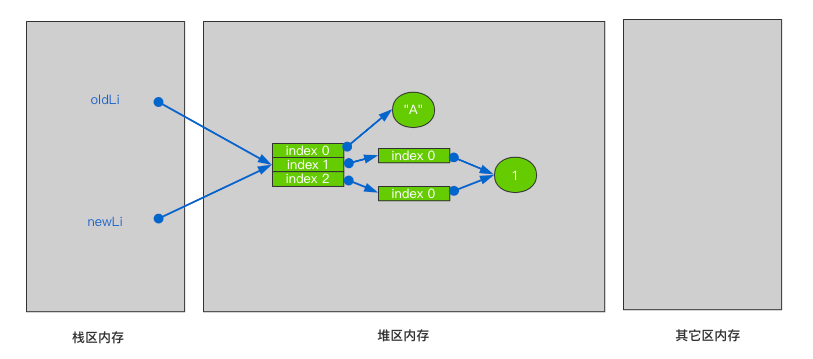
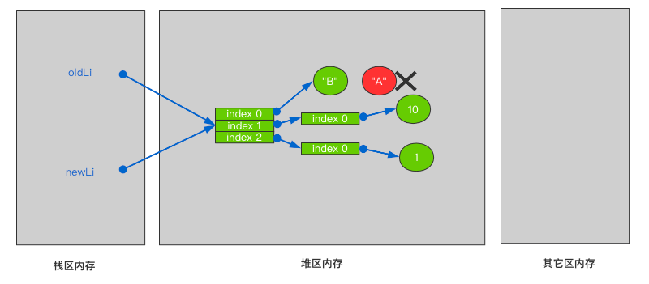
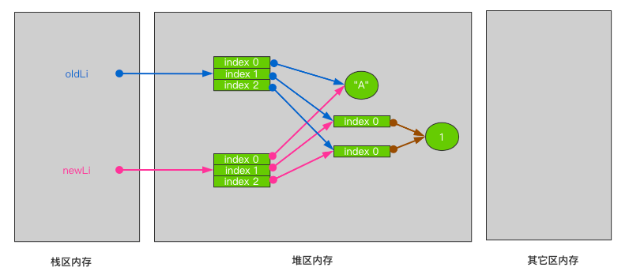
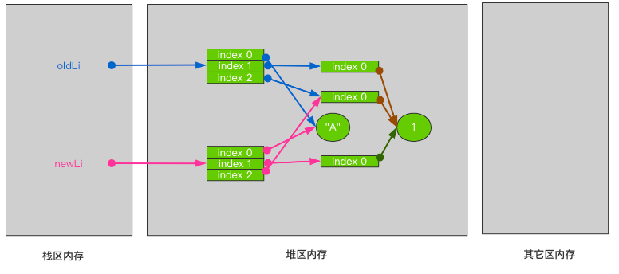

[toc]

# 拷贝

copy即拷贝，意在将相同的数据进行复制，以便将复制出的副本应用于不同的操作上，而本体不会受到任何影响。

绝大多数语言中都有深浅拷贝的概念，故此篇文章也是属于通用性文章。

在Python中，除开手动导入copy模块并使用deepcopy()函数的拷贝是深拷贝，其他的所有的拷贝操作都是浅拷贝。

在开始之前，介绍几个基本概念：

- 不可变类型：int、float、str、bool、None、tuple、frozenset
- 可变类型：list、dict、set（均是容器）
- 绝对引用：所有的不可变类型，都具有绝对引用的特性，即深浅拷贝都不会获得其副本，而是直接对源对象进行引用

# 赋值

赋值就是引用，代码如下：

```python
#!/usr/bin/env python3
# -*- coding:utf-8 -*-

oldLi = ["A", [1, ], (1,)]
newLi = oldLi

if id(oldLi) == id(newLi):
    print("外部大容器：可变类型：list来自同一个引用")
else:
    print("外部大容器：可变类型：list来自不同的引用")

if id(oldLi[0] == id(newLi[0])):
    print("内部第1个元素：不可变类型：str来自同一个引用")
else:
    print("内部第1个元素：不可变类型：str来自不同的引用")

if id(oldLi[1]) == id(newLi[1]):
    print("内部第1个大容器：可变类型：list来自同一个引用")
else:
    print("内部第1个大容器：可变类型：list来自不同的引用")

if id(oldLi[1][0]) == id(newLi[1][0]):
    print("内部第1个大容器的数据项：不可变类型：int ：%r来自同一个引用" % oldLi[1][0])
else:
    print("内部第1个大容器的数据项：不可变类型：int ：%r来自不同的引用" % oldLi[1][0])

if id(oldLi[2]) == id(newLi[2]):
    print("内部第2个大容器：不可变类型：tuple来自同一个引用")
else:
    print("内部第2个大容器：不可变类型：tuple来自不同的引用")

if id(oldLi[2][0]) == id(newLi[2][0]):
    print("内部第2个大容器的数据项：不可变类型：int ：%r来自同一个引用" % oldLi[2][0])
else:
    print("内部第2个大容器的数据项：不可变类型：int ：%r来自不同的引用" % oldLi[2][0])
    
# 外部大容器：可变类型：list来自同一个引用
# 内部第1个元素：不可变类型：str来自同一个引用
# 内部第1个大容器：可变类型：list来自同一个引用
# 内部第1个大容器的数据项：不可变类型：int ：1来自同一个引用
# 内部第2个大容器：不可变类型：tuple来自同一个引用
# 内部第2个大容器的数据项：不可变类型：int ：1来自同一个引用

```



所有引用都相同，这代表着oldLi中任意一个数据项改变后，newLi中的数据项也会跟着发生改变：

```python
oldLi[0] = "B"
print("oldLi -> index0:type=str -> %r" % oldLi[0])
print("newLi -> index0:type=str -> %r" % newLi[0])

oldLi[1][0] = 10
print("oldLi -> index1:type=list --> index0:type=int -> %r" % oldLi[1][0])
print("newLi -> index1:type=list --> index0:type=int -> %r" % newLi[1][0])

# oldLi -> index0:type=str -> 'B'
# newLi -> index0:type=str -> 'B'
# oldLi -> index1:type=list --> index0:type=int -> 10
# newLi -> index1:type=list --> index0:type=int -> 10

```



# 浅拷贝

被浅拷贝的对象如果是可变类型，则创建副本，如果是不可变类型，则是引用，浅拷贝仅拷贝1层。

代码如下：

```python
#!/usr/bin/env python3
# -*- coding:utf-8 -*-

import copy

oldLi = ["A", [1, ], (1,)]
newLi = copy.copy(oldLi)

if id(oldLi) == id(newLi):
    print("外部大容器：可变类型：list来自同一个引用")
else:
    print("外部大容器：可变类型：list来自不同的引用")

if id(oldLi[0] == id(newLi[0])):
    print("内部第1个元素：不可变类型：str来自同一个引用")
else:
    print("内部第1个元素：不可变类型：str来自不同的引用")

if id(oldLi[1]) == id(newLi[1]):
    print("内部第1个大容器：可变类型：list来自同一个引用")
else:
    print("内部第1个大容器：可变类型：list来自不同的引用")

if id(oldLi[1][0]) == id(newLi[1][0]):
    print("内部第1个大容器的数据项：不可变类型：int ：%r来自同一个引用" % oldLi[1][0])
else:
    print("内部第1个大容器的数据项：不可变类型：int ：%r来自不同的引用" % oldLi[1][0])

if id(oldLi[2]) == id(newLi[2]):
    print("内部第2个大容器：不可变类型：tuple来自同一个引用")
else:
    print("内部第2个大容器：不可变类型：tuple来自不同的引用")

if id(oldLi[2][0]) == id(newLi[2][0]):
    print("内部第2个大容器的数据项：不可变类型：int ：%r来自同一个引用" % oldLi[2][0])
else:
    print("内部第2个大容器的数据项：不可变类型：int ：%r来自不同的引用" % oldLi[2][0])
    
# 外部大容器：可变类型：list来自不同的引用
# 内部第1个元素：不可变类型：str来自同一个引用
# 内部第1个大容器：可变类型：list来自同一个引用
# 内部第1个大容器的数据项：不可变类型：int ：1来自同一个引用
# 内部第2个大容器：不可变类型：tuple来自同一个引用
# 内部第2个大容器的数据项：不可变类型：int ：1来自同一个引用

```

如图所示，浅拷贝为什么浅，因为只拷贝了一层：



如果修改oldLi第1层的index指向，newLi并不会受到影响，而如果修改oldLi第2层的index指向，则newLi会受到影响，如下所示：

```python
oldLi[0] = "B"
print("oldLi -> index0:type=str -> %r" % oldLi[0])
print("newLi -> index0:type=str -> %r" % newLi[0])

oldLi[1][0] = 10
print("oldLi -> index1:type=list --> index0:type=int -> %r" % oldLi[1][0])
print("newLi -> index1:type=list --> index0:type=int -> %r" % newLi[1][0])

# oldLi -> index0:type=str -> 'B'
# newLi -> index0:type=str -> 'A'
# oldLi -> index1:type=list --> index0:type=int -> 10
# newLi -> index1:type=list --> index0:type=int -> 10

```


# 深拷贝

深拷贝是递归的拷贝，即在浅拷贝的基础上也会递归的判定其子数据项是否能被拷贝。

如果是可变类型则拷贝，如果是不可变类型则不拷贝，代码如下：

```python
#!/usr/bin/env python3
# -*- coding:utf-8 -*-

import copy

oldLi = ["A", [1, ], (1,)]
newLi = copy.deepcopy(oldLi)

if id(oldLi) == id(newLi):
    print("外部大容器：可变类型：list来自同一个引用")
else:
    print("外部大容器：可变类型：list来自不同的引用")

if id(oldLi[0] == id(newLi[0])):
    print("内部第1个元素：不可变类型：str来自同一个引用")
else:
    print("内部第1个元素：不可变类型：str来自不同的引用")

if id(oldLi[1]) == id(newLi[1]):
    print("内部第1个大容器：可变类型：list来自同一个引用")
else:
    print("内部第1个大容器：可变类型：list来自不同的引用")

if id(oldLi[1][0]) == id(newLi[1][0]):
    print("内部第1个大容器的数据项：不可变类型：int ：%r来自同一个引用" % oldLi[1][0])
else:
    print("内部第1个大容器的数据项：不可变类型：int ：%r来自不同的引用" % oldLi[1][0])

if id(oldLi[2]) == id(newLi[2]):
    print("内部第2个大容器：不可变类型：tuple来自同一个引用")
else:
    print("内部第2个大容器：不可变类型：tuple来自不同的引用")

if id(oldLi[2][0]) == id(newLi[2][0]):
    print("内部第2个大容器的数据项：不可变类型：int ：%r来自同一个引用" % oldLi[2][0])
else:
    print("内部第2个大容器的数据项：不可变类型：int ：%r来自不同的引用" % oldLi[2][0])
    
# 外部大容器：可变类型：list来自不同的引用
# 内部第1个元素：不可变类型：str来自同一个引用
# 内部第1个大容器：可变类型：list来自不同的引用
# 内部第1个大容器的数据项：不可变类型：int ：1来自同一个引用
# 内部第2个大容器：不可变类型：tuple来自同一个引用
# 内部第2个大容器的数据项：不可变类型：int ：1来自同一个引用

```



无论怎么修改oldLi，newLi都不会受到影响：

```python
oldLi[0] = "B"
print("oldLi -> index0:type=str -> %r" % oldLi[0])
print("newLi -> index0:type=str -> %r" % newLi[0])

oldLi[1][0] = 10
print("oldLi -> index1:type=list --> index0:type=int -> %r" % oldLi[1][0])
print("newLi -> index1:type=list --> index0:type=int -> %r" % newLi[1][0])

# oldLi -> index0:type=str -> 'B'
# newLi -> index0:type=str -> 'A'
# oldLi -> index1:type=list --> index0:type=int -> 10
# newLi -> index1:type=list --> index0:type=int -> 1

```

