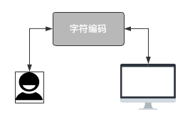
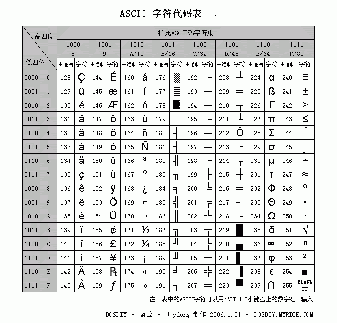
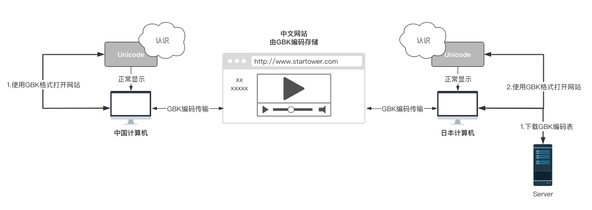
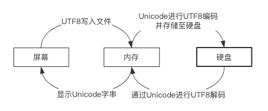

[toc]

# 字符编码

计算机使用计算机语言（2进制）表示数据，人类使用自然语言表示数据。

人类若想和计算机进行无障碍沟通，必须要通过一本记载着计算机语言与自然语言关系的词典。

而通过这本词典与计算机进行沟通交互的过程即可被称为字符的编码、解码的过程：



- 编码是指将自然语言转换为计算机语言的过程。
- 解码是指将计算机语言转换为自然语言的过程。

# ASCII

计算机由西方世界发明，所以第一个字符编码表仅记录了一些英文与符号，该表也被称为ASCII码表。

它仅支持一些英文字符与特殊符号，不支持其他国家的语言字符。

实际上ASCII码表在设计之初，就预留了一些位置，最初的ASCII码表中每一个字符仅占用7bit的位置，也就最多表示128个字符。


最初的ASCII码表仅有128个字符，后来经过扩展，又新增了128个字符，此时的ASCII码表中，一个字符占用1Bytes（8bit）的位置。：



# GBK

随着计算机在世界范围内高速发展，ASCII码表已经不满足广大用户的需求了。

此时，各个国家开始推出自己的字符编码表，如：

- 日本的Shift-JIS表等
- 韩国的Euc-Kr表等
- 中国的gb2312、GBK表等
- ...

这些表都有一个特点，即除了包含原本的ASCII码表之外还包含了本国的通用语言。

在GBK编码表中，一个英文字符占用1Bytes(8bit)，而一个中文字符则占用2Bytes(16bit)。

此时，出现了1个严重的问题，即跨国的通信问题，如下图所示：


# Unicode

为了解决这个问题，在1990年的时候推出了Unicode表，并且在1994年正式使用。

它详细的记录了所有自然语言与计算机语言的对应关系，在（usc2标准）中每一个字符不管是英文还是中文都占用2个Bytes（16bit），而在（usc4标准）中则统一占用4个Bytes（32bit），这样就解决了跨国通信的问题。


对比ASCII码表英文字符仅占用1个Bytes而言，如果直接使用Unicode编码进行文件存储则存储空间会直接翻倍，因此Unicode表仅存在于内存之中，而在网络传输以及文件存储上则采用了另外的编码格式。

换句话说，Unicode仅作为翻译词典存在于计算机内部，Unicode因为包含了所有自然语言与计算机语言的关系，因此作为翻译词典是最合适不过的。


# UTF8

如下图，中文网站由GBK编码存储，国内的计算机中应该都有GBK编码，所以访问该网站非常轻松，而在日本计算机上若想访问该网站则必须要先下载GBK后方能以GBK的解码形式打开该网站，否则会产生乱码问题。



那么有没有一种编码，能够统一整个互联网，让所有计算机都用这种编码进行文件存储、网络传输呢？

此时，出现了UTF8编码，全称为Unicode Transformation Format，即Unicode的转换格式，它是一种可变长的编码格式。

在UTF8编码格式中，英文字符统一占用1Bytes(8bit)的位置，而中文字符则占用3Bytes(24bit)或者4Bytes(32Bytes)的位置。

UTF8编码是未来的发展趋势，它与Unicode对比的唯一区别在于它不包含其他字符编码表。

在依然存在以GBK编码格式、Shift-JIS编码格式进行文件存储的环境下，使用UTF8作为翻译词典并不合适。

但是如果有一天所有人都统一使用UTF8进行文件存储网络传输的话，那么就不再需要包含其他字符编码表了，此时UTF8将会真正代替Unicode入驻内存中成为翻译词典，当然这是后话，目前还没有达到这样的理想情况。


# UTF8的编解码

UTF8与Unicode的关系如下：



## 编码过程

如我们要将“云”字根据UTF8格式存储到磁盘中：

1.通过Python3中的hex()和ord()函数先得出该字符Unicode的16进制表现形式：

```python
>>> hex(ord("云"))
'0x4e91'

```

2.再将这个16进制的Unicode字符转换为2进制，那么这个2进制就是“云”字在内存中存储的样子：

```python
>>> bin(int("4e91",base=16))
'0b100111010010001'

```

3.现在，计算机要把“云”字写入磁盘中，由于是使用的UTF8编码格式，所以先确定它的占用空间是3Bytes还是4Bytes，规则如下，套用表即可：

```python
  码位范围（Unicode十六进制）    utf-8
   0000 ~ 007F           用1个Bytes表示
   0080 ~ 07FF           用2个Bytes表示
   0800 ~ FFFF           用3个Bytes表示       4e91 在这里，第3分区
  10000 ~ 10FFFF         用4个Bytes表示

```

4.确定了“云”字占用3Bytes，我们可以通过一个模板，将Unicode的2进制转换为UTF8的2进制：

```
  码位范围（十六进制）           转换模板                                
   0000 ~ 007F           0XXXXXXX                                    
   0080 ~ 07FF           110XXXXX 10XXXXXX                           
   0800 ~ FFFF           1110XXXX 10XXXXXX 10XXXXXX                  
  10000 ~ 10FFFF         11110XXX 10XXXXXX 10XXXXXX 10XXXXXX         

```

5.根据分区信息，选用3Bytes的模板，进行转换，从右至左依次填充，不够的使用0进行填充：

```python
1110XXXX 10XXXXXX 10XXXXXX
     100   111010   010001
1110XXXX 10XXXXXX 10XXXXXX
    0100   111010   010001  # 填充0
11100100 10111010 10010001  # 结果

```

所以最后得出的结果，“云”用UTF8格式保存至磁盘的话，2进制格式为11100100 10111010 10010001。

## 解码过程

如果要将“云”字UTF8的2进制格式转换为字符，则还是需要通过Unicode进行解码过程。

当计算机读取到这个文件是以UTF8格式进行存储后，内部已经做好了通过UTF8进行解码的准备。

开始读取后，计算机会将硬盘中存储的UTF8的2进制格式文字信息加载至内存中：

```python
11100100 10111010 10010001

```

现在，Unicode会参照模板，通过UTF8分区信息提取出该文字Unicode的2进制格式：

```python
  码位范围（十六进制）           转换模板                                
   0000 ~ 007F           0XXXXXXX                                    
   0080 ~ 07FF           110XXXXX 10XXXXXX                           
   0800 ~ FFFF           1110XXXX 10XXXXXX 10XXXXXX                  
  10000 ~ 10FFFF         11110XXX 10XXXXXX 10XXXXXX 10XXXXXX         
  
                         11100100 10111010 10010001

```

“云”字的二进制信息格式刚好对应第3分区，那么我们按照第3分区的模板格式对UTF8的2进制表现形式进行掐头工作，将它转变为Unicode的2进制表现格式。

```python
1110XXXX 10XXXXXX 10XXXXXX
11100100 10111010 10010001
    0100   111010   010001  # 掐头  
    
100111010010001  # 结果

```

得到了结果为100111010010001，现在可以通过一系列Python3函数将它转换为Unicode字符，转换过程如下所示：

```python
>>> int("100111010010001",base=2)20113>>> hex(20113)'0x4e91'>>> "\u4e91"'云'

```


# 25 Python中的字符编码

# 存储编码

一般来说，我们用什么方式进行文件存储，就用什么编码方式对其进行打开，一般使用UTF8进行存储和打开文件即可。

# 执行编码

Python3中在执行代码时，解释器都会按照UTF8编码格式将脚本文件中的代码加载至内存中，所以一般不会出现问题。

但是在Python2里解释器则是使用ASCII的编码格式进行脚本文件内容的解码。

所以你可能会遇上下面的情况：

```python
SyntaxError:Non-ASCII character .... in file ...

```

解决这个办法，可以利用头文件代码，让Python解释器在解码脚本文件内容时，以UTF8格式进行解码：

```
# --*-- coding:UTF8 --*--

# 开始书写你的代码

```

可以使用sys的getdefaultencoding()方法来查看Python解释器默认采用的执行编码格式：

```python
>>> # Python2
>>> import sys
>>> sys.getdefaultencoding()
'ascii'

 >>> # Python3
>>> import sys
>>> sys.getdefaultencoding()
'utf-8'

```

# Unicode字符串

Python2中的str类型，本质是Python3中的bytes，所以仅支持ASCII码表中的字符。

如果想将其转换为Unicode字符串，则必须在前面加上u：

```python
print u"这是Unicode字符串"

```

