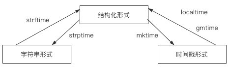

[toc]

# time简介

time模块是Python自带的模块，提供了时间的访问和转换功能。

time模块中，对时间的表示包含3个概念：

- 时间戳形式：从1970.1.1 08:00:00（Unix纪元）开始到现在所经历的毫秒数，它int类型
- 结构化形式：以元组包裹的形式进行时间的展示，它tuple类型
- 字符串形式：以字符串的形式进行时间的展示，它是str类型

3种表示时间的方式之间可以互相转换，如下图所示：



# 时间获取

获取时间的方法：

| 方法             | 描述                                                         | 表现形式 |
| ---------------- | ------------------------------------------------------------ | -------- |
| time.time()      | 获取时间戳形式的时间 1676425783.268757, 类型： float         | 时间戳   |
| time.localtime() | 获取结构化的本地时间 time.struct_time(tm_year=2023, tm_mon=2, tm_mday=15, tm_hour=9, tm_min=50, tm_sec=41, tm_wday=2, tm_yday=46, tm_isdst=0),  类型： <class 'time.struct_time'> | 结构化   |
| time.gmtime()    | 获取结构化的世界时间 time.struct_time(tm_year=2023, tm_mon=2, tm_mday=15, tm_hour=1, tm_min=51, tm_sec=44, tm_wday=2, tm_yday=46, tm_isdst=0) ， 类型：<class 'time.struct_time'> | 结构化   |
| time.asctime()   | 获取字符串形式的本地时间 Wed Feb 15 09:52:26 2023 类型：<class 'str'> | 字符串   |
| time.ctime()     | 获取字符串形式的世界时间 Wed Feb 15 09:53:11 2023 类型：<class 'str'> | 字符串   |
| time.strftime()  | 获取自定义格式的本地时间                                     | 字符串   |

Ps：本地时间在中国以东八区，上海时间时间为准，和世界时间（UTC）差了8小时

```python
>>> import time
>>> time.time()
1621693706.0193129
>>> time.localtime()
time.struct_time(tm_year=2021, tm_mon=5, tm_mday=22, tm_hour=22, tm_min=28, tm_sec=43, tm_wday=5, tm_yday=142, tm_isdst=0)
>>> time.gmtime()
time.struct_time(tm_year=2021, tm_mon=5, tm_mday=22, tm_hour=14, tm_min=29, tm_sec=0, tm_wday=5, tm_yday=142, tm_isdst=0)
>>> time.asctime()
'Sat May 22 22:29:05 2021'
>>> time.ctime()
'Sat May 22 22:29:09 2021'
>>> time.strftime("%Y-%m-%d %H:%M:%S")
'2021-05-22 22:29:45'

```

## 结构化时间说明

在time.localtime()和time.gmtime()中，可以看到元组中有很多看不懂的数据项属性组成，它们的释义如下：

| 属性     | 描述                             |
| -------- | -------------------------------- |
| tm_year  | 年                               |
| tm_mon   | 月                               |
| tm_mday  | 日                               |
| tm_ hour | 时                               |
| tm_min   | 分                               |
| tm_sec   | 秒                               |
| tm_wday  | 星期几，从0开始计算，一周就是0-6 |
| tm_yday  | 该年份的第几天                   |
| tm_isdst | 夏令营时间                       |

这些属性都可以单独的提取出来，如获取这一年的年、月、日：

```python
>>> time.localtime().tm_year
2021
>>> time.localtime().tm_mon
5
>>> time.localtime().tm_mday
22

```

## time.strftime()

放入一段字符串，将时间格式化出来，如下所示：

```python
>>> time.strftime("%Y-%m-%d %H:%M:%S")
'2021-05-22 22:29:45'

```

%Y-%m%d这些都代表格式化时间的占位符，分别代表年月日等信息。

如下表所示：

| 符号 | 描述              |
| ---- | ----------------- |
| %Y   | 格式化年份        |
| %m   | 格式化月份        |
| %d   | 格式化天数        |
| %H   | 格式化小时        |
| %M   | 格式化分钟        |
| %S   | 格式化秒数        |
| %X   | 等同于 “%H:%M:%S” |

如想了解更多，参照官网示例截图：


# 时间转换

## 转换方法

以下是时间表现形式互相转换的方法：

| 方法             | 描述                                   |
| ---------------- | -------------------------------------- |
| time.mktime()    | 放入结构化时间，转换为时间戳时间       |
| time.strftime()  | 放入结构化时间，转换为字符串时间       |
| time.strptime()  | 放入字符串时间，转换为结构化时间       |
| time.localtime() | 放入时间戳时间，转换为结构化的本地时间 |
| time.gmtime()    | 放入时间戳时间，转换为结构化的世界时间 |

示例演示：

```python
>>> time.mktime(time.localtime())
1621694964.0
>>> time.strftime("%Y-%m-%d %X", time.gmtime())
'2021-05-22 14:50:01'
>>> time.strptime(time.ctime())
time.struct_time(tm_year=2021, tm_mon=5, tm_mday=22, tm_hour=22, tm_min=50, tm_sec=15, tm_wday=5, tm_yday=142, tm_isdst=-1)
>>> time.localtime(time.time())
time.struct_time(tm_year=2021, tm_mon=5, tm_mday=22, tm_hour=22, tm_min=50, tm_sec=33, tm_wday=5, tm_yday=142, tm_isdst=0)
>>> time.gmtime(time.time())
time.struct_time(tm_year=2021, tm_mon=5, tm_mday=22, tm_hour=14, tm_min=51, tm_sec=4, tm_wday=5, tm_yday=142, tm_isdst=0)

```

## 常用操作

将时间戳转换为固定的UTC时间字符串格式：

```python
>>> time.ctime(00)
'Thu Jan  1 08:00:00 1970'

```

将时间戳转换为本地时间的字符串表现形式：

```python
>>> t = 1293495903                                   # 有一个时间戳
>>> stuct = time.localtime(t)                        # 先将其转为本地的结构化时间
>>> stringTime = time.strftime("%Y-%m-%d %X", stuct) # 再将其转换为字符串时间
>>> stringTime
'2010-12-28 08:25:03'

```

将时间戳转换为世界时间的字符串表现形式：

```python
>>> t = 1293495903                                   # 有一个时间戳
>>> stuct = time.gmtime(t)                           # 先将其转为世界的结构化时间
>>> stringTime = time.strftime("%Y-%m-%d %X", stuct) # 再将其转换为字符串时间
>>> stringTime
'2010-12-28 00:25:03'

```

将一个字符串时间转换为时间戳：

```python
>>> stringTime = "1998-01-26 00:00:10"               # 有一个字符串时间
>>> stuct = time.strptime(stringTime, "%Y-%m-%d %X") # 先将其转换为结构化时间
>>> stamp = time.mktime(stuct)                       # 再将其转换为时间戳
>>> stamp
885744010.0

```

# 线程睡眠

通过time.sleep()方法，可指定主线程睡眠多少秒，如下所示，第2个print()将在2秒后运行：

```python
import time
print("start")
time.sleep(2)
print("end")

```

# 其他操作

## 日期判断

根据时间戳，获取7天后的时间：

```python
>>> currentTime = time.time()
>>> sum7dayTime = currentTime + 7 * 86400
>>> time.strftime("%Y-%m-%d", time.localtime(sum7dayTime))
'2021-05-29'

```

根据时间戳，获取3天前的时间：

```python
>>> currentTime = time.time()
>>> sub3dayTime = currentTime - 3 * 86400
>>> time.strftime("%Y-%m-%d", time.localtime(sub3dayTime))
'2021-05-19'

```

如果是时间戳操作，谨记1天是86400秒即可。

## 定时任务

脚本启动后，每隔一分钟，向屏幕打印一次hello world：

```python
import time

currentSec = time.localtime().tm_sec
while 1:
    if time.localtime().tm_sec == currentSec:
        print("hello world")
        time.sleep(1)

```

## 延时任务

脚本启动后的一分钟时，打印一次hello world：

```python
import time

currentTime = time.time()
runTime = currentTime + 60

while 1:
    if time.time() == runTime:
        print("hello world")
        break
print("任务执行完毕")

```


# datetime简介

datetime模块是Python内置模块，相比于time模块能够更加方便的操纵时间。

以下举例部分常用方法：

| 方法                                 | 描述                                                         |
| ------------------------------------ | ------------------------------------------------------------ |
| datetime.datetime()                  | 实例化返回一个datetime的对象                                 |
| datetime.datetime.now()              | 获取本地时间，返回一个datetime的对象                         |
| datetime.datetime.utcnow()           | 获取世界时间，返回一个datetime的对象                         |
| datetime.datetime.fromtimestamp()    | 放入时间戳时间，直接转换为本地的datetime对象时间             |
| datetime.datetime.utcfromtimestamp() | 放入时间戳时间，直接转换为世界的的datetime对象时间           |
| datetime.timedelta()                 | 在一个datetime对象时间的基础上进行加减，返回一个新的datetime的对象 |
| datetime.datetime.weekday()          | 放入一个datetime对象，获取该对象是那一周的第几天，从0开始计算，一周就是0-6 |

# 对象获取

datetime.datetime.now()和datetime.datetime.utcnow()都可以获取一个表示当前时间的datetime对象。

```python
>>> import datetime
>>> datetime.datetime.now()
datetime.datetime(2021, 5, 22, 23, 31, 43, 468077)
>>> datetime.datetime.utcnow()
datetime.datetime(2021, 5, 22, 15, 31, 52, 841214)

```

为datetime.datetime.fromtimestamp()放入一个时间戳可直接获取到表示本地时间的datetime的对象：

```python
>>> datetime.datetime.fromtimestamp(11111)
datetime.date(1970, 1, 1)
>>> datetime.datetime.utcfromtimestamp(11111)
datetime.datetime(1970, 1, 1, 3, 5, 11)

```

datetime对象是str类型的更高一级封装，你可以将datetime对象转换为str类型：

```python
>>> str(datetime.datetime.now())
'2021-05-23 00:06:03.271989'

```

# 对象属性

一个datetime对象拥有很多时间属性，如下表所示：

| 属性        | 描述          |
| ----------- | ------------- |
| year        | 年份（int）   |
| month       | 月份（int）   |
| day         | 天数（int）   |
| hour        | 时数（int）   |
| minute      | 分数（int）   |
| second      | 秒数（int）   |
| microsecond | 毫秒数（int） |

你可以快速的获取它们：

```python
>>> currentTime = datetime.datetime.now()
>>> currentTime.year
2021
>>> currentTime.month
5
>>> currentTime.day
22
>>> currentTime.hour
23
>>> currentTime.minute
48
>>> currentTime.second
52
>>> currentTime.microsecond
527012

```

# 对象方法

一个datetime对象拥有很多方法，如下表所示：

| 方法                          | 描述                                                         |
| ----------------------------- | ------------------------------------------------------------ |
| datetimeObject.timestamp()    | 返回一个时间戳，不同于time模块的时间戳，该方法返回的是一个float类型 |
| datetimeObject.timetuple()    | 返回与time.localtime()兼容的本地时间元组                     |
| datetimeObject.utctimetuple() | 返回与time.gmtime()兼容的UTC时间元组                         |
| datetimeObject.ctime()        | 返回ctime()样式字符串                                        |
| datetimeObject.isoformat()    | 根据ISO格式返回时间字符串                                    |
| datetimeObject.strptime()     | 类似于time.strptime()                                        |
| datetimeObject.tzname()       | 返回时区名字                                                 |
| datetimeObject.replace()      | 替换一个字符串格式的时间中某部分，返回一个新的datetime的对象 |

由于这些方法使用的时候并不多，所以只举例一个时间替换。

将当前时间的年份替换为1998年：

```python
>>> currentTime = datetime.datetime.now()
>>> currentTime.replace(year=1998)
datetime.datetime(1998, 5, 23, 0, 22, 24, 698922)

curr_obj.strptime("1999-10-12 10:10:10", "%Y-%m-%d %X")
```

# 时间加减

datetime对象允许通过和datetime.timedelta()进行加减，以便进行时间的计算。

- 时间加减中不支持年份的计算，可以用365天代替

当前时间加3天：

```python
>>> sum3dayTime = datetime.timedelta(+3) + currentTime
>>> sum3dayTime
datetime.datetime(2021, 5, 26, 0, 15, 15, 405378)

```

当前时间-3天：

```python
>>> sub3dayTime = datetime.timedelta(-3) + currentTime
>>> sub3dayTime
datetime.datetime(2021, 5, 20, 0, 15, 15, 405378)

```

当前时间加3小时：

```python
>>> sum3hours = datetime.timedelta(hours=+3) + currentTime
>>> sum3hours
datetime.datetime(2021, 5, 23, 3, 15, 15, 405378)

```

当前时间减3小时：

```python
>>> sub3hours = datetime.timedelta(hours=-3) + currentTime
>>> sub3hours
datetime.datetime(2021, 5, 22, 21, 15, 15, 405378)

```

# random简介

random模块是Python自带的模块，该模块实现了各种分布的伪 随机数 生成器。

以下举例部分常用方法：

| 方法                   | 描述                                                         |
| ---------------------- | ------------------------------------------------------------ |
| random.randint(1, 3)   | 从1-3之间随机生成一个整数                                    |
| random.randrange(1, 3) | 从1-2之间随机生成一个整数                                    |
| random.random()        | 生成大于0且小于1的浮点数                                     |
| random.uniform(1, 3)   | 生成大于1且小于3的浮点数                                     |
| random.choice(seq)     | 从序列中随机取出1个数据项                                    |
| random.sample(seq, 2)  | 从序列中随机取出指定个数据项，这里是2表示随机取2个为一组列表，以列表形式返回 |
| random.shuffle(seq)    | 将传入的拥有索引的序列进行打乱，原地打乱，不返回新序列       |

# 整数生成

random.randint()是顾头顾尾的生成随机整数：

```python
>>> import random
>>> random.randint(1, 3)
1
>>> random.randint(1, 3)
2
>>> random.randint(1, 3)
3

```

random.randrange()是顾头不顾尾的生成随机整数：

```python
>>> random.randrange(1, 3)
1
>>> random.randrange(1, 3)
2

```

# 浮点数生成

random.random()生成浮点数的范围总是介于0和1之间：

```python
>>> random.random()
0.818462343335113

```

random.uniform()可指定生成浮点数的范围：

```python
>>> random.uniform(1, 3)
2.810443694822667

```

# 数据项抽取

random.choice()可以从一个序列中随机抽取出一个数据项：

```python
>>> random.choice(range(10))
1

```

random.sample()可以从一个序列中随机抽取出多个数据项：

```python
>>> random.sample(range(10), 2)
[1, 0]

```

它们貌似均不支持字典的随机抽取。

# 生成乱序列

random.shuffle()可以传入一个线性结构的序列，并将其中的数据项进行随机的打乱：

```python
>>> li1 = [i for i in range(10)]
>>> random.shuffle(li1)
>>> li1
[1, 5, 6, 3, 7, 2, 9, 8, 4, 0]
>>> random.shuffle(li1)
>>> li1
[1, 5, 4, 3, 7, 0, 9, 6, 8, 2

```

# 生成验证码

验证码总是随机的，因此可以通过random模块进行实现生成：

```python
import random


def getVerificationCode(bitNumber):
    code = ""
    for i in range(bitNumber):
        code += random.choice(
            [
                str(random.randint(1, 9)),
                chr(random.randint(65, 91))  # ❶
            ]
        )
    return code


code = getVerificationCode(6)
print(code)

```

❶：65-90是大写的A-Z的ASCII码表示范围