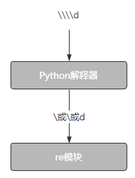
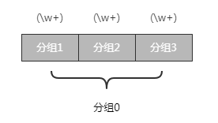
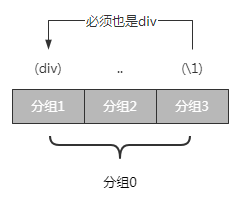

[toc]

# re简介

正则表达式其本身就是一种小型的，高度专业化的编程语言。

在Python中，它被内嵌在了re模块里面，正则表达式模式被编译成一系列的字节码，然后由用C编写的匹配引擎执行。

[官方文档](https://docs.python.org/zh-cn/3.6/library/re.html)

本文仅针对可能用到的方法进行描述，对不常用的方法等进行了筛选。

# 方法一览

## 符号大全

以下是正则表达式的符号大全：

| 符号     | 中文名称         | 释义                                                         |
| -------- | ---------------- | ------------------------------------------------------------ |
| .        | 通配符           | 匹配除\n之外的任意1个字符，如果想匹配\n可更换匹配模式为re.S或re.DOTALL |
| ^        | 开始符           | 匹配以特定字符开始的字符串，在检测时只会检测开头第一个字符并立即返回结果 |
| $        | 结束符           | 匹配以特定字符结尾的字符串，在检测时只会检测结尾最后一个字符并立即返回结果 |
| *        | 可有重复符       | 代表可以取0-∞（无穷）位*号前面的字符（默认贪婪取值，可通过?取消贪婪模式） |
| +        | 必有重复符       | 代表可以取1-∞（无穷）位+号前面的字符（默认贪婪取值，可通过?取消贪婪模式） |
| ?        | 单一重复符       | 代表可以取 0~1 位 ? 号前面的字符                             |
| {n,m}    | 范围重复符       | 代表可以取到n-m位{n,m}前面的字符（默认贪婪取值，可通过?取消贪婪模式） |
| {n}      | 精确重复符       | 代表可以精确取到n位{n}前面的字符                             |
| []       | 字符集           | 在[]中多个字符仅能匹配到1个，并且字符集中所有符号失去特殊意义，仅有- ^ \ 这3个符号在字符集中具有特殊意义 |
| [-]      | 区间符           | 字符集中的-号代表可以取从多少到多少区间的值，按照ASCII码排序，比如[a-z0-9A-Z]代表这1位取全部的英文字母和数字 |
| [^]      | 排除符           | 字符集中的号代表非的作用，比如`[^0-9]`代表这1位并非是数字    |
| `[\]`    | 转义符           | 转义符如果在字符集中使用，可以为特定的字符赋予特殊的意义     |
| \        | 转义符           | 转义符如果在字符集外使用，可以为特定的字符赋予特殊的意义，并且还可以让特定的字符失去特殊的意义，但是如果未用r原始字符串进行正则匹配，则可能会导致令人意外的情况发生 |
| \d       | …                | 匹配任何十进制数，它相当于在字符集中使用[0-9]                |
| \D       | …                | 匹配任何非十进制数，它相当于在字符集中使用`[^0-9]`           |
| \s       | …                | 匹配任何空白字符，它相当于在字符集中使用[\t\n\r\f\v]         |
| \S       | …                | 匹配任何非空白字符，它相当于在字符集中使用`[^\t\n\r\f\v]`    |
| \w       | …                | 匹配任何字母数字下划线字符,它相当于在字符集中使用[a-z A-Z 0-9] |
| \W       | …                | 匹配任何非字母数字下划线字符,它相当于在字符集中使用`[^a-z A-Z 0-9]` |
| \b       | …                | 匹配一个特殊字符边界，比如空格,&.#等(不常用)                 |
| \|       | 管道符           | 相当于或，注意与字符集里的区别，管道符将前后分为2段，左右看做1个整体，而字符集中的或仅仅代表从众多选项中拿出1个 |
| ()       | 分组符           | 将多个元素字符看做一个整体，也就是将它们当做一个元素字符进行匹配，若整个匹配规则中无子分组，则默认的匹配结果为一组 |
| (?=exp)  | 零宽先行断言     | 匹配后面为exp的内容                                          |
| (?<=exp) | 零宽后行断言     | 匹配前面为exp的内容                                          |
| (?!exp)  | 零宽负向先行断言 | 匹配后面不能是exp的内容                                      |
| (?<!exp) | 零宽负向后行断言 | 匹配前面不能是exp的内容                                      |

## 匹配方法

以下是re模块提供的正则匹配方法：

| 方法        | 描述                                                         |
| ----------- | ------------------------------------------------------------ |
| findall()   | 将所有的匹配结果返回至1个列表中                              |
| finditer()  | 将所有的匹配结果返回至1个迭代器中                            |
| search()    | 将首次匹配的结果返回至search对象中，可通过group()进行取值    |
| match()     | 在search()基础上添加了^，使之只能在开头匹配                  |
| group()     | 通过该方法对search对象进行取值操作，返回一个或者多个匹配的子组 |
| groups()    | 通过该方法对search对象进行取值操作，返回一个元组，包含所有匹配的子组 |
| groupdict() | 通过该方法对search对象进行取值操作，返回一个字典，包含了所有的具名子组 |
| split()     | 对字符串进行分割，其算法可能导致令人意外的情况发生           |
| sub()       | 对字符串进行替换，最少需要3个参数，返回一个新的字符串        |
| subn()      | 对字符串进行替换，最少需要3个参数，返回一个元祖，其中包含了替换成功了几次 |
| complie()   | 可以将一个标示符赋予指定的规则，达到简化重复操作的目的       |

## 匹配模式

以下是re模块提供的正则匹配模式：

| 模式简写 | 模式全写      | 描述                                                |
| -------- | ------------- | --------------------------------------------------- |
| re.I     | re.IGNORECASE | 不分大小写字母的匹配模式                            |
| re.M     | re.MULTILINE  | 视为多行的匹配模式，以\n作为行分割符                |
| re.S     | re.DOTALL     | 视为单行的匹配模式，即通配符可以匹配\n              |
| re.U     | re.UNICODE    | 宽字符匹配模式，即支持匹配占4个字符的UTF-16匹配模式 |

# 创建正则

## re.findall()

在测试阶段，我们大部分示例都会使用re.findall()方法进行测试。

它的函数签名如下：

```python
def findall(pattern, string, flags=0):

```

参数释义：

- pattern：匹配规则
- string：被匹配字符串
- flags：匹配模式

一次简单的使用，匹配以hello开头且以exp结尾的子串，采用多行匹配模式：

```python
import re
string = "hello world\nhello regexp\nhello python\n"
resultList = re.findall(
    pattern=r"^hello.*exp$",
    string=string,
    flags=re.M
)

print(resultList)

# ['hello regexp']

```

# 基础符号

## . 通配符

.通配符会匹配除\n之外的任意字符，如果想匹配\n可更换匹配模式为re.S或re.DOTALL。

如下示例，匹配11个除开\n之外的任意字符组成的子串：

```python
import re
rule = "." * 11
string = "hello world\n123456abcdeABCDE"
resultList = re.findall(pattern=rule, string=string)

print(resultList)

# ['hello world', '123456abcde']

```

## ^ 开始符

^开始符会匹配以特定字符开始的字符串，在检测时只会检测开头第一个字符并立即返回结果。

如下示例，匹配以P开头且后面必须是ython加上7个除开\n的任意字符的子串：

```python
import re
rule = "^Python......."
string = "Python regexp module"
resultList = re.findall(pattern=rule, string=string)

print(resultList)

# ['Python regexp']

```

## $ 结束符

$结束符会匹配以特定字符结尾的字符串，在检测时只会检测结尾最后一个字符并立即返回结果。

如下所示，匹配以p结束，且前面2个字符必须是E与x的子串，区分大小写：

```python
import re
rule = "Exp$"
string = "Python regexp regExp RegExp"
resultList = re.findall(pattern=rule, string=string)

print(resultList)

# ['Exp']

```

# 重复符

## * 可有重复

`*`代表可以取0-∞位*号前面的字符（默认贪婪取值，可通过?取消贪婪模式）

如下示例，匹配必须是以h开头，后面可以有0个也可以有多个除了\n外的任意字符，紧接着\n后继续匹配0个或者n个除了\n外的任意字符，最后必须以p进行结尾的子串：

```python
import re
rule = "^h.*\n.*p$"
string = "hello Python\nregexp"
resultList = re.findall(pattern=rule, string=string)

print(resultList)

# ['hello Python\nregexp']

```

上面这个示例，有3个条件是必须的。

- h开头
- 中间必须有\n
- p结束

所以下面这个字符串也会被匹配到：

```python
string = "h\np"

```

## + 必有重复

+代表可以取1-∞位+号前面的字符（默认贪婪取值，可通过?取消贪婪模式）

如下示例，匹配必须是以h开头，后面可以有1个也可以有多个除了\n外的任意字符，紧接着\n后继续匹配1个或者n个除了\n外的任意字符，最后必须以p进行结尾的子串：

```python
import re
rule = "^h.+\n.+p$"
string = "hello Python\nregexp"
resultList = re.findall(pattern=rule, string=string)

print(resultList)

# ['hello Python\nregexp']

```

上面这个示例，有5个条件是必须的：

- h开头
- h后面必须至少有1个任意字符
- 中间必须有\n
- \n后面必须至少有1个任意字符
- p结束

所以下面这个字符串不会被匹配到：

```python
string = "h\np"

```

## ? 单一重复

?代表?前面的字符最多只可以出现一次（0次或1次）

如下示例，匹配可以是1开头，也可以不是1开头且后面是2345678且以9结尾的字符串：

```python
import re
rule = "^1?23456789$"
string = "123456789"
resultList = re.findall(pattern=rule, string=string)

print(resultList)

# ['123456789']

```

上面这个示例，有2个条件是必须的：

- 字符串的开头如果不是1，则必须是2
- 后面必须跟上345678，且以9结尾

所以下面这个字符串也会被匹配到：

```python
string = "23456789"

```

## {n,m} 范围重复

{n,m}代表可以取到n-m位{n,m}前面的字符，（默认贪婪取值，可通过?取消贪婪模式）

如下示例，匹配包含4个或者3个连续是1的子串：

```python
import re
rule = "1{3,4}"
string = "1111111"
resultList = re.findall(pattern=rule, string=string)

print(resultList)

# ['1111', '111']

```

## {n} 精确重复

{n}代表可以精确取到n位{n}前面的字符。

如下示例，匹配包含3个连续的1的子串：

```python
import re
rule = "1{3}"
string = "1111111"
resultList = re.findall(pattern=rule, string=string)

print(resultList)

# ['111', '111']

```

## 取消贪婪匹配

默认的*，+，?，{n,m}都是贪婪取值。

即有多个就取多个，没有多个才少取。

在它们后面加上?即可取消贪婪匹配，如下示例

```python
import re

ruleList = [
    # 取0个或者多个a，取消贪婪后取0个
    "a*?",
    # 取1个或者多个a，取消贪婪后取1个
    "a+?",
    # 取0个或者1个a，取消贪婪后取0个
    "a??",
    # 取3个或者4个a，取消贪婪后取3个
    "a{3,4}"
]

string = "a" * 7

for rule in ruleList:
    resultList = re.findall(pattern=rule, string=string)
    print(resultList)

# ['', '', '', '', '', '', '', '']
# ['a', 'a', 'a', 'a', 'a', 'a', 'a']
# ['', '', '', '', '', '', '', '']
# ['aaaa', 'aaa']

```

# 字符集

## [] 字符集

在[]中多个字符仅能匹配到1个，并且字符集中所有符号失去特殊意义，仅有- ^ \ 这3个符号在字符集中具有特殊意义。

如下示例，匹配包含1a或者2a或者3a的子串：

```python
import re
rule = "[123]a"
string = "1a2a3a1b2b3b"
resultList = re.findall(pattern=rule, string=string)

print(resultList)

# ['1a', '2a', '3a']

```

## [-]区间符

字符集中的-号代表可以取从多少到多少区间的值，按照ASCII码排序，比如[a-z0-9A-Z]代表这1位取全部的英文字母和数字。

如下示例，匹配所有由连续的字母或者数字组成的子串：

```python
import re
rule = "[0-9A-Za-z]+"
string = "1b23c4d\n2342bbc"
resultList = re.findall(pattern=rule, string=string)

print(resultList)

# ['1b23c4d', '2342bbc']

```

## [^] 排除符

字符集中的号代表非的作用，比如`[^0-9]`代表这1位并非是数字。

如下所示，匹配结尾不为数字的子串，匹配模式为多行匹配：

```python
import re
rule = ".+[^0-9]$"
string = "abc\n12x\n345"
resultList = re.findall(pattern=rule, string=string, flags=re.M)

print(resultList)

# ['abc', '12x']

```

## `[\]`转义符

转义符如果在字符集中使用，可以为特定的字符赋予特殊的意义。

如下所示，\w是具有特殊意义的字符，作用是匹配字母数字下划线字符。

它可以在字符集中使用：

```python
import re
rule = "[\w]+"
string = "abc\n12x\n345"
resultList = re.findall(pattern=rule, string=string, flags=re.M)

print(resultList)

# ['abc', '12x', '345']

```

# 转义字符

## \ 转义符

转义符如果在字符集外使用，可以为特定的字符赋予特殊的意义，并且还可以让特定的字符失去特殊的意义，但是如果未用r原始字符串进行正则匹配，则可能会导致令人意外的情况发生。

如，失去特殊意义：

.本来是通配符，如果是\.就是普通的.，再也没有任何意义了。

如下示例，匹配一个url：

```python
import re
rule = "w{3}\.\w+\.com"
string = "www.google.com www.biying.com"
resultList = re.findall(pattern=rule, string=string)

print(resultList)

# ['www.google.com', 'www.biying.com']

```

以下是常用加上\后就拥有特殊意义的字符：

| 符号 | 中文名称 | 释义                                                         |
| ---- | -------- | ------------------------------------------------------------ |
| \d   | …        | 匹配任何十进制数，它相当于在字符集中使用[0-9]                |
| \D   | …        | 匹配任何非十进制数，它相当于在字符集中使用`[^0-9]`           |
| \s   | …        | 匹配任何空白字符，它相当于在字符集中使用[\t\n\r\f\v]         |
| \S   | …        | 匹配任何非空白字符，它相当于在字符集中使用`[^\t\n\r\f\v]`    |
| \w   | …        | 匹配任何字母数字下划线字符,它相当于在字符集中使用[a-z A-Z 0-9] |
| \W   | …        | 匹配任何非字母数字下划线字符,它相当于在字符集中使用`[^a-z A-Z 0-9]` |
| \b   | …        | 匹配一个特殊字符边界，比如空格,&.#等(不常用)                 |

## \d和\D

\d可以匹配任何十进制数，它相当于在字符集中使用[0-9]：

```python
import re
rule = "\d+"
string = "123 abc 1a2b3c"
resultList = re.findall(pattern=rule, string=string)

print(resultList)

# ['123', '1', '2', '3']

```

\D可以匹配任何非十进制数，它相当于在字符集中使用`[^0-9]`：

```python
import re
rule = "\D+"
string = "123 abc 1a2b3c"
resultList = re.findall(pattern=rule, string=string)

print(resultList)

# [' abc ', 'a', 'b', 'c']

```

## \s和\S

\s可以匹配任何空白字符，它相当于在字符集中使用[\t\n\r\f\v]：

```python
import re
rule = "\s"
string = "123 abc 1a2b3c"
resultList = re.findall(pattern=rule, string=string)

print(resultList)

# [' ', ' ']

```

\S匹配任何非空白字符，它相当于在字符集中使用`[^\t\n\r\f\v]`：

```
import re
rule = "\S"
string = "123 abc 1a2b3c"
resultList = re.findall(pattern=rule, string=string)

print(resultList)

# ['1', '2', '3', 'a', 'b', 'c', '1', 'a', '2', 'b', '3', 'c']

```

## \w和\W

\w可以匹配任何字母、数字、下划线字符,它相当于在字符集中使用[a-z A-Z 0-9]：

```python
import re
rule = "\w+"
string = "user_name123 \t\n\f"
resultList = re.findall(pattern=rule, string=string)

print(resultList)

# ['user_name123']

```

\W可以匹配任何非字母数字下划线字符,它相当于在字符集中使用`[^a-z A-Z 0-9]`：

```python
import re
rule = "\W+"
string = "user_name123 \t\n\f"
resultList = re.findall(pattern=rule, string=string)

print(resultList)

# [' \t\n\x0c']

```

## 原始字符串

下面这种情况，可能导致re匹配的结果和预料的结果不符。

我想匹配1个\或者\d：

```python
import re
rule = "[\\d]"
string = "123\\456\\"
resultList = re.findall(pattern=rule, string=string)

print(resultList)

# ['1', '2', '3', '4', '5', '6']

```

是什么原因导致了这样的情况？由于re模块建立在Python解释器之上，所以\\d会被分解成\d，故会出现这样的情况。如下图所示：


如何解决这个问题呢？你可能想使用这个匹配规则：

```python
rule = "[\\\\d]"

```

但是这样的匹配结果是：

```python
['\\', '\\']

```

d被当成了单独的普通匹配字符了。



其实最有效的办法是对rule采用原始字符串处理：

```python
import re
rule = r"[\\\d]"
string = "123\\456\\"
resultList = re.findall(pattern=rule, string=string)

print(resultList)

# ['1', '2', '3', '\\', '4', '5', '6', '\\']

```


所以无论今后在什么场合下，对于rule都使用原始字符串定义就ok了。

# 管道

## | 管道符

|管道符相当于或，注意与字符集里的区别，管道符将前后分为2段，左右看做1个整体，而字符集中的或仅仅代表从众多选项中拿出1个。

如下所示，匹配abc123或者456xyz的子串：

```python
import re
rule = r"abc123|456xyz"
string = "abcdefgabc123xyzqud456xyz"
resultList = re.findall(pattern=rule, string=string)

print(resultList)

# ['abc123', '456xyz']

```

# 分组

推荐在分组时，使用re.search()或者re.match()进行操作。

## () 分组符

()分组符将多个元素字符看做一个整体，也就是将它们当做一个元素字符进行匹配。若整个匹配规则中无子分组，则默认的匹配结果为一组：

如下，没有定义子分组，则默认的匹配结果为1组。

因此可通过group(0)方法获取整组内容：

```python
import re
rule = r"<\w+>.*</\w+>"
string = "<div>hello world</div>"
searchObject = re.search(pattern=rule, string=string)

print(searchObject.group(0))

# <div>hello world</div>

```

## 匿名分组

匿名分组即没有名字的分组，单纯的用括号包裹即可。

如果定义了子分组，则可以通过groups()方法来查看所有的子分组。

如下所示，定义了3个匿名分组，分别是拿到标签名字，标签内容，标签结束

```python
import re
rule = r"<(\w+)>(.*)</(\1)>" 
string = "<div>hello world</div>"
searchObject = re.search(pattern=rule, string=string)

print(searchObject.groups())

# ('div', 'hello world', 'div')

```

## 具名分组

具名分组的意思是为每一个子分组取一个别名。

语法是`(?P<subGroupName>regexp)`，对于具名分组来说，可以使用方法`groupdict()`来查看分组的名字和分组匹配到的内容。

如下所示，定义了3个具名分组，分别是拿到标签名字，标签内容，标签结束：

```python
import re
rule = r"<(?P<tagName>\w+)>(?P<tagContext>.*)</(?P<tagEnd>\1)>" 
string = "<div>hello world</div>"
searchObject = re.search(pattern=rule, string=string)

print(searchObject.groupdict())

# {'tagName': 'div', 'tagContext': 'hello world', 'tagEnd': 'div'}

```

## 分组引用

没有定义子分组时，整个匹配结果就是1个分组，编号为0.

而定义了子分组后，子分组的编号从1开始，向后排列，如下图所示：



我们可以利用这个索引编号在后面引用前面分组匹配的内容作为后面的匹配规则，语法格式如下：

```python
\编号

```

示例如下所示：

```python
import re
rule = r"<(\w+)>(.*)</(\1)>"
string = "<div>hello world</div>"
searchObject = re.search(pattern=rule, string=string)

print(searchObject.groups())

# ('div', 'hello world', 'div')

```

分组1匹配到什么，后面的\1的匹配规则就是什么。



如果字符串变成了这个样子就会抛出异常，匹配不到。

因为分组1匹配到的内容是div，所以\1也只能匹配div：

```python
string = "<div>hello world</dav>"

```

如果前面分组是1个具名分组，后面也可以通过名字进行引用，语法格式如下：

```python
(?P=分组名)

```

示例如下所示：

```python
import re
rule = r"<(?P<tagName>\w+)>(?P<tagContext>.*)</(?P<tagEnd>(?P=tagName))>"
string = "<div>hello world</div>"
searchObject = re.search(pattern=rule, string=string)

print(searchObject.groupdict())

# {'tagName': 'div', 'tagContext': 'hello world', 'tagEnd': 'div'}

```

## 取消记录

每一个子分组都具有编号，如果想取消某个子分组的编号，则可以使用(?:)来进行分组，若这样做则该子分组不可被后面引用，也不可被获取到，如下示例：

```python
import re
rule = r"<(?:\w+)>(.*)</(?:\w+)>" 
string = "<div>hello world</div>"
searchObject = re.search(pattern=rule, string=string)

print(searchObject.groups())

# ('hello world',)

```

可以看见，只有1个子分组。

# 断言匹配

断言匹配虽然都有1个括号，但它们并不是子分组。

故括号中的内容也不会当做结果进行保持，可以将它们理解为匹配时的条件。

## (?=exp)

零宽先行断言匹配后面为exp的内容。

如下示例，匹配后面是world的内容：

```python
import re
rule = r".+(?=world)" 
string = "hello world"
searchObject = re.search(pattern=rule, string=string)

print(searchObject.group(0))

# hello

```

## (?<=exp)

零宽后行断言，匹配前面为exp的内容。

如下示例，匹配前面是hello的内容：

```python
import re
rule = r"(?<=hello).+" 
string = "hello world"
searchObject = re.search(pattern=rule, string=string)

print(searchObject.group(0))

# world

```

## (?!exp)

零宽负向先行断言，匹配后面不能是exp的内容。

如下示例，匹配hello后面不能是Java的内容：

```python
import re
rule = r"hello (?!Java).*" 
string = "hello Java hello Golang hello Python"
searchObject = re.search(pattern=rule, string=string)

print(searchObject.group(0))

# hello Golang hello Python

```

## (?<!exp)

(?<!exp) 零宽负向后行断言匹配前面不能是exp的内容。

如下示例，匹配hello前面不能是Golang的内容：

```python
import re
rule = r"(?<!Golang) hello .*" 
string = "hello Java hello Golang hello Python"
searchObject = re.search(pattern=rule, string=string)

print(searchObject.group(0))

# hello Golang hello Python

```

# re方法

## findall()

将所有的匹配结果返回至1个列表中。

其实说实话这种方法在日常开发中也很少用到，由于直接返回的是1个列表，所以比较占用内存。

```python
import re
rule = r"\d+" 
string = "123A567"
resultList = re.findall(pattern=rule, string=string)

print(resultList)

# ['123', '567']

```

## finditer()

将所有的匹配结果返回至1个迭代器中。

finditer()比findall()更节省内存，因此推荐使用。

```python
import re
rule = r"\d+" 
string = "123A567"
resultIter = re.finditer(pattern=rule, string=string)

print(resultIter)

# <callable_iterator object at 0x01BE1E50>

```

## search()

将首次匹配的结果返回至search对象中，可通过group()进行取值。

这个方法是最常用的方法，推荐使用，但是只能返回首次的匹配结果：

```python
import re
rule = r"\d+" 
string = "123A567"
searchObject = re.search(pattern=rule, string=string)

print(searchObject)

# <_sre.SRE_Match object; span=(0, 3), match='123'>

print(searchObject.group())  # 123  

```

## match()

在search()基础上添加了^，使之只能在开头匹配。

这个方法用到的场景也不多吧，简单介绍一下：

```python
import re
rule = r"\d+" 
string = "123A567"
searchObject = re.match(pattern=rule, string=string)

print(searchObject)

# <_sre.SRE_Match object; span=(0, 3), match='123'>

```

## group()

通过该方法对search对象进行取值操作，返回一个或者多个匹配的子组。

可以取值的情况：

- 当没有分组时默认取大组，直接使用group()方法或指定编号0
- 能对匿名的子组进行取值，输入子组编号即可，子组编号从1开始
- 能对具名的子组进行取值，输入子组别名即可

我们上面介绍过，默认最大的组就是所有匹配结果，编号为0.

子组编号从1开始向后排列，通过该方法可以取出任意一个分组。

如，没有子组，可以使用group(0)或者直接使用group()取出最大的默认组：

```python
import re
rule = r".+" 
string = "123A567"
searchObject = re.search(pattern=rule, string=string)

print(searchObject.group())

# 123A567

```

如果有多分组，则可以指定1个或者多个子组的编号，将它们取出来：

```python
import re
rule = r"(\d+)([A-Z])(\d+)" 
string = "123A567"
searchObject = re.search(pattern=rule, string=string)

print(searchObject.group(0, 1, 2, 3))

# ('123A567', '123', 'A', '567')

```

如果有具名分组，则可以指定分组名将它们取出来：

```python
import re
rule = r"(?P<first>\d+)(?P<second>[A-Z])(?P<last>\d+)"
string = "123A567"
searchObject = re.search(pattern=rule, string=string)

print(searchObject.group(0, "first", "second", "last"))

# ('123A567', '123', 'A', '567')

```

## groups()

通过该方法对search对象进行取值操作，返回一个元组，包含所有匹配的子组。

注意事项：

- 它不能返回最大组，仅能以元组的方式返回所有的子组
- 能返回匿名子组、具名子组

示例如下，groups()不能像group()那样指定组的编号进行取值，它直接返回的就是1个元组：

```python
import re
rule = r"(?P<first>\d+)(?P<second>[A-Z])(?P<last>\d+)"
string = "123A567"
searchObject = re.search(pattern=rule, string=string)

print(searchObject.groups())

# ('123A567', '123', 'A', '567')

```

## groupdict()

通过该方法对search对象进行取值操作，返回一个字典，包含了所有的具名子组

注意事项：

- 它不能返回最大组，仅能以字典的方式返回所有的具名子组
- 不能返回匿名子组

示例如下：

```python
import re
rule = r"(?P<first>\d+)(?P<second>[A-Z])(?P<last>\d+)"
string = "123A567"
searchObject = re.search(pattern=rule, string=string)

print(searchObject.groupdict())

# {'first': '123', 'second': 'A', 'last': '567'}

```

## split()

对字符串进行分割，其算法可能导致令人意外的情况发生。

函数签名如下：

```python
def split(pattern, string, maxsplit=0, flags=0):

```

参数释义：

- pattern：匹配规则
- string：被切分的字符串
- maxsplit：最大切分的次数
- flags：匹配模式

普通的3个小示例：

```python
import re

 # 按空格切分
print(re.split(r" ", "hello abc def")) 
# ['hello', 'abc', 'def']

# 按空格或 | 分
print(re.split(r" |\|","hello abc|def")) 
# ['hello', 'abc', 'def']

# 按空格或 | 分
print(re.split(r"[ |]","hello abc|def"))
# ['hello', 'abc', 'def']

```

意外的情况示例：

```python
import re

# 先按照a切分，后按照b切分
print(re.split(r"[ab]","asdabcd"))

# 第一次按a来分：['', 'sd', 'bcd']
# 第二次按b来分: ['', 'sd', '', 'cd']
# 按b的分法由于是空。故前进一位

# 结果
# ['', 'sd', '', 'cd']

```

## sub()

对字符串进行替换，最少需要3个参数，返回一个新的字符串。

函数签名如下：

```python
def sub(pattern, repl, string, count=0, flags=0):

```

参数释义：

- pattern：匹配规则
- repl：新的字符
- string：被替换的字符串
- count：替换次数
- flags：匹配模式

示例如下：

```python
import re

print(re.sub(r"a|b", "N", "123a456b"))
# 123N456N

```

## subn()

对字符串进行替换，最少需要3个参数，返回一个元祖，其中包含了替换成功了几次。

函数签名如下：

```python
 def subn(pattern, repl, string, count=0, flags=0):

```

参数释义：

- pattern：匹配规则
- repl：新的字符
- string：被替换的字符串
- count：替换次数
- flags：匹配模式

示例如下：

```python
import re

print(re.subn(r"a|b", "N", "123a456b"))
# ('123N456N', 2)

```

## complie()

complie()可以将一个标示符赋予指定的规则，达到简化重复操作的目的。

函数签名如下：

```python
def compile(pattern, flags=0):

```

参数释义：

- pattern：匹配规则
- flags：匹配模式

示例演示，我有一个HTML文档。现在，我要匹配每个a标签的链接、a标签的内容：

```python
import re

#　step01：指定匹配规则
rule = re.compile(r"<a.*href=\"(\w+\.\w+.\w+)\".*>(.*)</a>", flags=re.I)

# step02: 书写HTML文档
htmlDocument = """
<ul>
    <li><a href="www.baidu.com" target="_self">百度搜索</a></li>
    <li><a href="www.google.com">谷歌搜索</a></li>
    <li><a class="md-plain" href="www.biying.com">必应搜索</a></li>
</ul>
"""

# step03:开始匹配
resultList = rule.findall(htmlDocument)
print(resultList)

# [('www.baidu.com', '百度搜索'), ('www.google.com', '谷歌搜索'), ('www.biying.com', '必应搜索')]

```

# re模式

## re.I

I模式下不区分大小写，此模式下[a-z]等同于[a-zA-Z]：

```python
import re
rule = "[a-z]+"
string = "ABC1abc"
resultList = re.findall(pattern=rule, string=string, flags=re.I)

print(resultList)

# ['ABC', 'abc']

```

## re.M

M模式下会将每一行单独匹配，主要是对^和$的修饰。

如下示例，匹配必须以j开头且为p结尾的子串：

```python
import re
rule = "^J.+t$"
string = "Python\nJavaScript\nGolang"
resultList = re.findall(pattern=rule, string=string, flags=re.M)

print(resultList)

# ['JavaScript']

```

## re.S

S模式下会将多行视为单行，这意味着.通配符可以匹配\n了。

```python
import re
rule = ".+"
string = "\n\n\n\n\n"
resultList = re.findall(pattern=rule, string=string, flags=re.S)

print(resultList)

# ['\n\n\n\n\n']

```

## re.U

U模式使用的不多，主要针对占4个Bytes的字符进行匹配支持，尽在Python2中适用，因为Python3里的字符都是Unicode字符了。

```python
import re
rule = "𝒳𝒴"
string = "𝒳𝒴𝒳𝒴𝒳𝒴"
resultList = re.findall(pattern=rule, string=string, flags=re.U)

print(resultList)

# ['𝒳𝒴', '𝒳𝒴', '𝒳𝒴']

```

# 通用正则表达式大全

原文地址：[点我跳转](https://mp.weixin.qq.com/s/8sSDcxUsLCNhfHLkI9XKOQ)

## 数字校验

```python
数字：^[0-9]*$
n位的数字：^\d{n}$
至少n位的数字：^\d{n,}$
m-n位的数字：^\d{m,n}$
零和非零开头的数字：^(0|[1-9][0-9]*)$
非零开头的最多带两位小数的数字：^([1-9][0-9]*)+(.[0-9]{1,2})?$
带1-2位小数的正数或负数：^(\-)?\d+(\.\d{1,2})?$
正数、负数、和小数：^(\-|\+)?\d+(\.\d+)?$
有两位小数的正实数：^[0-9]+(.[0-9]{2})?$
有1~3位小数的正实数：^[0-9]+(.[0-9]{1,3})?$
非零的正整数：^[1-9]\d*$ 或 ^([1-9][0-9]*){1,3}$ 或 ^\+?[1-9][0-9]*$
非零的负整数：^\-[1-9][]0-9"*$ 或 ^-[1-9]\d*$
非负整数：^\d+$ 或 ^[1-9]\d*|0$
非正整数：^-[1-9]\d*|0$ 或 ^((-\d+)|(0+))$
非负浮点数：^\d+(\.\d+)?$ 或 ^[1-9]\d*\.\d*|0\.\d*[1-9]\d*|0?\.0+|0$
非正浮点数：^((-\d+(\.\d+)?)|(0+(\.0+)?))$ 或 ^(-([1-9]\d*\.\d*|0\.\d*[1-9]\d*))|0?\.0+|0$
正浮点数：^[1-9]\d*\.\d*|0\.\d*[1-9]\d*$ 或 ^(([0-9]+\.[0-9]*[1-9][0-9]*)|([0-9]*[1-9][0-9]*\.[0-9]+)|([0-9]*[1-9][0-9]*))$
负浮点数：^-([1-9]\d*\.\d*|0\.\d*[1-9]\d*)$ 或 ^(-(([0-9]+\.[0-9]*[1-9][0-9]*)|([0-9]*[1-9][0-9]*\.[0-9]+)|([0-9]*[1-9][0-9]*)))$
浮点数：^(-?\d+)(\.\d+)?$ 或 ^-?([1-9]\d*\.\d*|0\.\d*[1-9]\d*|0?\.0+|0)$
```


## 字符校验

```python
汉字：^[\u4e00-\u9fa5]{0,}$
英文和数字：^[A-Za-z0-9]+$ 或 ^[A-Za-z0-9]{4,40}$
长度为3-20的所有字符：^.{3,20}$
由26个英文字母组成的字符串：^[A-Za-z]+$
由26个大写英文字母组成的字符串：^[A-Z]+$
由26个小写英文字母组成的字符串：^[a-z]+$
由数字和26个英文字母组成的字符串：^[A-Za-z0-9]+$
由数字、26个英文字母或者下划线组成的字符串：^\w+$ 或 ^\w{3,20}
中文、英文、数字包括下划线：^[\u4E00-\u9FA5A-Za-z0-9_]+$
中文、英文、数字但不包括下划线等符号：^[\u4E00-\u9FA5A-Za-z0-9]+$ 或 ^[\u4E00-\u9FA5A-Za-z0-9]{2,20}$
可以输入含有^%&',;=?$\"等字符：[^%&',;=?$\x22]+
禁止输入含有~的字符[^~\x22]+

```

## 其他校验

`.*`匹配除 `\n` 以外的任何字符。

`/[\u4E00-\u9FA5]/` 汉字

`/[\uFF00-\uFFFF]/` 全角符号

`/[\u0000-\u00FF]/` 半角符号

## 钱币校验

```python
.有四种钱的表示形式我们可以接受:“10000.00” 和 “10,000.00”, 和没有 “分” 的 “10000” 和 “10,000”：^[1-9][0-9]*$

2.这表示任意一个不以0开头的数字,但是,这也意味着一个字符"0"不通过,所以我们采用下面的形式：^(0|[1-9][0-9]*)$

3.一个0或者一个不以0开头的数字.我们还可以允许开头有一个负号：^(0|-?[1-9][0-9]*)$

4.这表示一个0或者一个可能为负的开头不为0的数字.让用户以0开头好了.把负号的也去掉,因为钱总不能是负的吧.下面我们要加的是说明可能的小数部分：^[0-9]+(.[0-9]+)?$

5.必须说明的是,小数点后面至少应该有1位数,所以"10."是不通过的,但是 “10” 和 “10.2” 是通过的：^[0-9]+(.[0-9]{2})?$

6.这样我们规定小数点后面必须有两位,如果你认为太苛刻了,可以这样：^[0-9]+(.[0-9]{1,2})?$

7.这样就允许用户只写一位小数.下面我们该考虑数字中的逗号了,我们可以这样：^[0-9]{1,3}(,[0-9]{3})*(.[0-9]{1,2})?$

8.1到3个数字,后面跟着任意个 逗号+3个数字,逗号成为可选,而不是必须：^([0-9]+|[0-9]{1,3}(,[0-9]{3})*)(.[0-9]{1,2})?$

```

## 生活需求

 ```python
Email地址：^\w+([-+.]\w+)*@\w+([-.]\w+)*\.\w+([-.]\w+)*$
域名：[a-zA-Z0-9][-a-zA-Z0-9]{0,62}(/.[a-zA-Z0-9][-a-zA-Z0-9]{0,62})+/.?
InternetURL：[a-zA-z]+://[^\s]* 或 ^http://([\w-]+\.)+[\w-]+(/[\w-./?%&=]*)?$
手机号码：^(13[0-9]|14[5|7]|15[0|1|2|3|5|6|7|8|9]|18[0|1|2|3|5|6|7|8|9])\d{8}$
电话号码(“XXX-XXXXXXX”、“XXXX-XXXXXXXX”、“XXX-XXXXXXX”、“XXX-XXXXXXXX”、"XXXXXXX"和"XXXXXXXX)：^(\(\d{3,4}-)|\d{3.4}-)?\d{7,8}$
国内电话号码(0511-4405222、021-87888822)：\d{3}-\d{8}|\d{4}-\d{7}
身份证号(15位、18位数字)：^\d{15}|\d{18}$
短身份证号码(数字、字母x结尾)：^([0-9]){7,18}(x|X)?$ 或 ^\d{8,18}|[0-9x]{8,18}|[0-9X]{8,18}?$
帐号是否合法(字母开头，允许5-16字节，允许字母数字下划线)：^[a-zA-Z][a-zA-Z0-9_]{4,15}$
密码(以字母开头，长度在6~18之间，只能包含字母、数字和下划线)：^[a-zA-Z]\w{5,17}$
强密码(必须包含大小写字母和数字的组合，不能使用特殊字符，长度在8-10之间)：^(?=.*\d)(?=.*[a-z])(?=.*[A-Z]).{8,10}$
日期格式：^\d{4}-\d{1,2}-\d{1,2}
一年的12个月(01～09和1～12)：^(0?[1-9]|1[0-2])$
一个月的31天(01～09和1～31)：^((0?[1-9])|((1|2)[0-9])|30|31)$
xml文件：^([a-zA-Z]+-?)+[a-zA-Z0-9]+\\.[x|X][m|M][l|L]$
中文字符的正则表达式：[\u4e00-\u9fa5]
双字节字符：[^\x00-\xff] (包括汉字在内，可以用来计算字符串的长度(一个双字节字符长度计2，ASCII字符计1))
空白行的正则表达式：\n\s*\r (可以用来删除空白行)
HTML标记的正则表达式：<(\S*?)[^>]*>.*?</\1>|<.*? /> (网上流传的版本太糟糕，上面这个也仅仅能部分，对于复杂的嵌套标记依旧无能为力)
首尾空白字符的正则表达式：^\s*|\s*$或(^\s*)|(\s*$) (可以用来删除行首行尾的空白字符(包括空格、制表符、换页符等等)，非常有用的表达式)
腾讯QQ号：[1-9][0-9]{4,} (腾讯QQ号从10000开始)
中国邮政编码：[1-9]\d{5}(?!\d) (中国邮政编码为6位数字)
IP地址：\d+\.\d+\.\d+\.\d+ (提取IP地址时有用)
IP地址：((?:(?:25[0-5]|2[0-4]\\d|[01]?\\d?\\d)\\.){3}(?:25[0-5]|2[0-4]\\d|[01]?\\d?\\d))
IP-v4地址：\\b(?:(?:25[0-5]|2[0-4][0-9]|[01]?[0-9][0-9]?)\\.){3}(?:25[0-5]|2[0-4][0-9]|[01]?[0-9][0-9]?)\\b (提取IP地址时有用)
校验IP-v6地址:(([0-9a-fA-F]{1,4}:){7,7}[0-9a-fA-F]{1,4}|([0-9a-fA-F]{1,4}:){1,7}:|([0-9a-fA-F]{1,4}:){1,6}:[0-9a-fA-F]{1,4}|([0-9a-fA-F]{1,4}:){1,5}(:[0-9a-fA-F]{1,4}){1,2}|([0-9a-fA-F]{1,4}:){1,4}(:[0-9a-fA-F]{1,4}){1,3}|([0-9a-fA-F]{1,4}:){1,3}(:[0-9a-fA-F]{1,4}){1,4}|([0-9a-fA-F]{1,4}:){1,2}(:[0-9a-fA-F]{1,4}){1,5}|[0-9a-fA-F]{1,4}:((:[0-9a-fA-F]{1,4}){1,6})|:((:[0-9a-fA-F]{1,4}){1,7}|:)|fe80:(:[0-9a-fA-F]{0,4}){0,4}%[0-9a-zA-Z]{1,}|::(ffff(:0{1,4}){0,1}:){0,1}((25[0-5]|(2[0-4]|1{0,1}[0-9]){0,1}[0-9])\\.){3,3}(25[0-5]|(2[0-4]|1{0,1}[0-9]){0,1}[0-9])|([0-9a-fA-F]{1,4}:){1,4}:((25[0-5]|(2[0-4]|1{0,1}[0-9]){0,1}[0-9])\\.){3,3}(25[0-5]|(2[0-4]|1{0,1}[0-9]){0,1}[0-9]))
子网掩码：((?:(?:25[0-5]|2[0-4]\\d|[01]?\\d?\\d)\\.){3}(?:25[0-5]|2[0-4]\\d|[01]?\\d?\\d))
校验日期:^(?:(?!0000)[0-9]{4}-(?:(?:0[1-9]|1[0-2])-(?:0[1-9]|1[0-9]|2[0-8])|(?:0[13-9]|1[0-2])-(?:29|30)|(?:0[13578]|1[02])-31)|(?:[0-9]{2}(?:0[48]|[2468][048]|[13579][26])|(?:0[48]|[2468][048]|[13579][26])00)-02-29)$(“yyyy-mm-dd“ 格式的日期校验，已考虑平闰年。)
抽取注释：<!--(.*?)-->
查找CSS属性:^\\s*[a-zA-Z\\-]+\\s*[:]{1}\\s[a-zA-Z0-9\\s.#]+[;]{1}
提取页面超链接:(<a\\s*(?!.*\\brel=)[^>]*)(href="https?:\\/\\/)((?!(?:(?:www\\.)?'.implode('|(?:www\\.)?', $follow_list).'))[^" rel="external nofollow" ]+)"((?!.*\\brel=)[^>]*)(?:[^>]*)>
提取网页图片:\\< *[img][^\\\\>]*[src] *= *[\\"\\']{0,1}([^\\"\\'\\ >]*)
提取网页颜色代码:^#([A-Fa-f0-9]{6}|[A-Fa-f0-9]{3})$
文件扩展名效验:^([a-zA-Z]\\:|\\\\)\\\\([^\\\\]+\\\\)*[^\\/:*?"<>|]+\\.txt(l)?$
判断IE版本：^.*MSIE [5-8](?:\\.[0-9]+)?(?!.*Trident\\/[5-9]\\.0).*$
 ```

