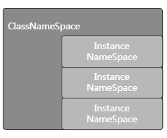
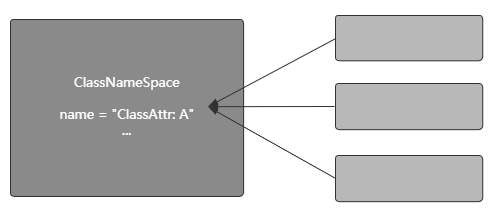
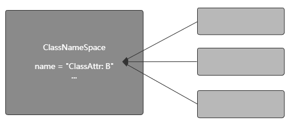
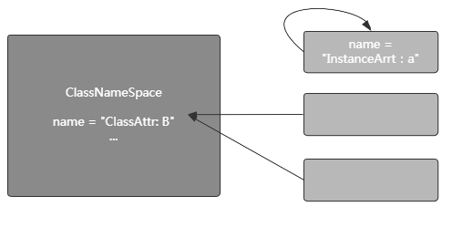

[toc]

# 类和对象

类是一个抽象的概念，而对象是一个实体的存在。

对象由类创造而出，每个对象之间互相独立互不影响，一个对象只能由一个类创建，但是一个类可以创建出多个对象，而实例化就是指通过某个类创建出对象的过程。

类与对象的关系类似于模具与产品，必须先有模具，然后才能根据这个模具制作出各式各样的产品。

# 基础介绍

## 定义类

Python中定义类，使用class关键字，具体语法如下:

```python
class 类标示符(继承类):  # ❶
    """
    类的描述文档         # ❷
    """

    标示符 = 对象        # ❸
    
 
    def __init__(self): # ❹
        self.标示符 = 对象
    
    def 实例方法(self):  # ❺
        pass

```

❶：类标识符以大驼峰命名

❷：类的描述文档，用于介绍该类的作用

❸：类属性，用于存放所有实例对象都可能用到的变量

❹：初始化方法，用于初始化实例对象独有属性变量

❺：实例化方法，用于提供给实例对象调用的函数

当一个类被定义时，将会发生以下的事情：

1. 申请内存空间，保存类体代码
2. 将内存空间的地址绑定给类的标示符
3. 创建类的局部命名空间（注意与函数命名空间区分，函数是加括号调用执行后才创建）
4. 执行类体代码（注意与函数的执行时机区分，函数是加括号调用后才会执行函数体代码）

下面将定义一个人类：

```python
class Person:
    """
    Person：人类
    class attr：眼耳口鼻  每个人都具有共同特性，可定义为类属性
    instance attr: 姓名性别年龄 每个人不同的特征，可定义为实例属性
    instance method: 吃饭 每个人都具有共同行为，可定义为实例方法
    """
    eye = 2
    ear = 2
    mouth = 2
    nose = 1

    def __init__(self, name, age, gender) -> None:
        self.name = name
        self.age = age
        self.gender = gender

    def eat(self, food):
        return "%s eating %s"%(self.name, food)

    def getInfo(self):
        return "name : %s\nage : %s\ngender : %s\n"%(self.name, self.age, self.gender)

```

## 实例化

如何通过类创建出一个具体的对象？只需要在类标示符后加上括号即可，如下所示：

```python
if __name__ == "__main__":
    jack = Person(name="Jack", age=18, gender="male")
    print(jack.eat("fish"))
    print(jack.getInfo())

# Jack eating fish
# name : Jack
# age : 18
# gender : male

```

类实例化的过程中会做很多事情，大概可分为下面3个步骤：

1. 调用类下的`__new__()`方法构建一个空的实例对象
2. 调用类下的`__init__()`方法对空实例对象进行初始化
3. 于此同时，创建实例的专属命名空间

如何验证这一过程呢？我们可通过自定义`__new__()`方法进行证明：

```python
class A:
    def __new__(cls, *args, **kwargs) -> object:
        print("Run ... new")
        instanceObject = super(A, cls).__new__(cls)
        return instanceObject

    def __init__(self, attr):
        print("Run ... init")
        self.instanceAttr = attr

if __name__ == "__main__":
    instanceA = A("a")

# Run ... new
# Run ... init

```

## self、`__new()__、__init__()`

`__new__()`方法是类实例化过程中运行的方法，作用是构建空的实例化对象，因此该方法也被称之为构造方法。

`__init__()`方法也是类实例化过程中运行的方法，作用是为空的实例化对象增添实例属性，因此该方法也被称之为对象的初始化方法，注意该方法必须返回None。

self其实就是指实例化对象本身，在实例化操作开始后实例化对象会由`__new__()`方法经过`__init__()`方法进行创建并返回。

所以你会看见下面3个标示符都是指向同1个对象：

```python
class A:
    def __new__(cls, *args, **kwargs) -> object:
        print("Run ... new")
        instanceObject = super(A, cls).__new__(cls)
        print(id(instanceObject))
        return instanceObject

    def __init__(self) -> None:
        print("Run ... init")
        print(id(self))

    def getInstanceId(self):
        print("Run ... instance method")
        print(id(self))

if __name__ == "__main__":
    print("instance start")
    instanceA = A()
    print("instance end")
    print(id(instanceA))
    instanceA.getInstanceId()

# instance start
# Run ... new
# 29435600
# Run ... init
# 29435600
# instance end
# 29435600
# Run ... instance method
# 29435600

```

## `__dict__`

类和实例对象都有一个`__dict__`，它是一个字典，包含类和对象的一些特征属性。

对于类的`__dict__`来说，它包含类属性、类方法、实例方法等一系列东西。

而对实例的`__dict__`来说，它仅包含实例属性。

如下所示：

```python
class A:
    name = "class"

    def __init__(self) -> None:
        self.name = "instance"

    def instanceMethod(self):
        pass

if __name__ == "__main__":
    instanceA = A()
    print(A.__dict__)
    print(instanceA.__dict__)

```

结果展示，类的`__dict__`，包含的东西非常多：

```python
{'__module__': '__main__', 'name': 'class', '__init__': <function A.__init__ at 0x017344B0>, 'instanceMethod': <function A.instanceMethod at 0x01734468>, '__dict__': <attribute '__dict__' of 'A' objects>, '__weakref__': <attribute '__weakref__' of 'A' objects>, '__doc__': None}

```

而实例对象的`__dict__`只包含自身的实例属性，甚至连实例方法都在类的`__dict__`中：

```python
{'name': 'instance'}

```

# 属性与方法

## 类属性

如果要在类的外部获取类属性，可通过下面两种方式：

```python
类.属性
类.__dict__["属性"]

```

更加推荐第一种方式，它更加的直白，让人一眼就能看到这是在获取属性，而不是操纵字典：

```python
class A:
    name = "class"

    def __init__(self) -> None:
        self.name = "instance"

    def instanceMethod(self):
        pass

if __name__ == "__main__":
    print(A.name)
    print(A.__dict__["name"])
    print(A.__dict__.get("name"))

# class
# class
# class

```

其他的类属性增删改查，也都是通过这两种方式进行操作，这里不再举例。

## 实例属性

外部获取实例属性与类属性一样，都是通过下面2种方式：

```python
实例.属性
实例.__dict__["属性"]

```

如下所示：

```python
class A:
    name = "class"

    def __init__(self) -> None:
        self.name = "instance"

    def instanceMethod(self):
        pass


if __name__ == "__main__":
    instanceA = A()
    print(instanceA.name)
    print(instanceA.__dict__["name"])
    print(instanceA.__dict__.get("name"))

# instance
# instance
# instance

```

其他的操作诸如增删改等，都比较少用到，故不再进行举例。

## 实例方法

实例方法其实就是函数，我们可以看一下下面这个方法：

```python
class A:
    name = "class"

    def __init__(self) -> None:
        self.name = "instance"

    def instanceMethod(self, params):
        print(params)

```

如何调用它呢？

方式1，通过实例对象调用它，会自动的将对象本身传递给self：

```python
if __name__ == "__main__":
    instanceA = A()
    instanceA.instanceMethod("hello world")
    
# hello world

```

方式2，通过类来调用它，但是需要你手动的为self传递参数：

```python
class A:
    name = "class"

    def __init__(self) -> None:
        self.name = "instance"

    def instanceMethod(self, params):
        print(params)


if __name__ == "__main__":
    instanceA = A()
    A.instanceMethod(instanceA, "hello world")

```

方式2可能比较少见，但我们之前已经用过了，比如str.format()。

```python
def format(self, *args: object, **kwargs: object) -> str

```

相同的结果，不同的调用方式，如下所示，self就是字符串"hello {}"：

```python
classRunFormatMethod = str.format("hello {}", "world")
instanceRunFormatMethod = "hello {}".format("world")

print(classRunFormatMethod)
print(instanceRunFormatMethod)

# hello world
# hello world

```

## 内部获取

类属性可以在实例方法中进行获取，获取方式有2种：

```python
类.属性
self.属性 # 前提是self.__dict__中没有同名属性

```

推荐使用第一种，指名道姓的说我要获取类属性：

```python
class A:
    name = "class"

    def __init__(self) -> None:
        self.name = "instance"

    def instanceMethod(self):
        print(A.name)
        print(self.name)


if __name__ == "__main__":
    instanceA = A()
    A.instanceMethod(instanceA)

# class
# instance

```

实例属性在实例方法中获取直接通过下面的方式即可：

```python
self.属性

```

如下所示：

```python
class A:
    name = "class"

    def __init__(self) -> None:
        self.name = "instance"

    def instanceMethod(self):
        print(self.name)


if __name__ == "__main__":
    instanceA = A()
    A.instanceMethod(instanceA)
    
# instance

```

实例方法中可以嵌套调用另一个方法，也可以调用外部的函数，如下所示：

```python
class A:
    name = "class"

    def __init__(self) -> None:
        self.name = "instance"

    def func1(self):
        print("func1")
        self.func2()
        globalFunc()

    def func2(self):
        print("func2")


def globalFunc():
    print("globalFunc")


if __name__ == "__main__":
    instanceA = A()
    instanceA.func1()

# func1
# func2
# globalFunc

```

# 命名空间

## 类和实例的命名空间

类和实例的命名空间说白了就是`__dict__`字典。

一个类拥有多个实例，一个实例仅来自于一个类。

因此我们可以画出下面这幅图：



首先，类的命名空间是无法访问实例的命名空间的。

但是实例命名空间可以访问类的命名空间，类似于函数嵌套LEGB的关系。

## 标示符查找顺序

如果一个实例要查找某一个属性，自身存在就获取自身的，若自身不存在则取拿类的。

- 查看实例自身的`__dict__`，若没有
- 则查看类的`__dict__`，若没有
- 则抛出异常

我们来看一下下面这个例子：

```python
class A:
    name = "ClassAttr:A"

if __name__ == "__main__":
    instanceOne = A()
    instanceTwo = A()
    instanceThree = A()

    print(instanceOne.name)
    print(instanceTwo.name)
    print(instanceThree.name)

    A.name = "ClassAttr:B"

    print(instanceOne.name)
    print(instanceTwo.name)
    print(instanceThree.name)

    instanceOne.name = "InstanceAttr:a"

    print(instanceOne.name)
    print(instanceTwo.name)
    print(instanceThree.name)

# ClassAttr:A
# ClassAttr:A
# ClassAttr:A
# ClassAttr:B
# ClassAttr:B
# ClassAttr:B
# InstanceAttr:a
# ClassAttr:B
# ClassAttr:B

```

采用图解的方式来进行代码注释。

第一种情况，三个实例的`__dict__`中都没有name，所以会去类的`__dict__`中查找：



第二种情况，类`__dict__`中的name被修改，三个实例再次访问name，自身的`__dict__`没有故到类的`__dict__`中找，会获取到修改后的name：



第三种情况，第一个实例对象One的`__dict__`中具有实例属性name，故它会拿到自己的，其他2个实例对象都没有，依然会去拿类的：

