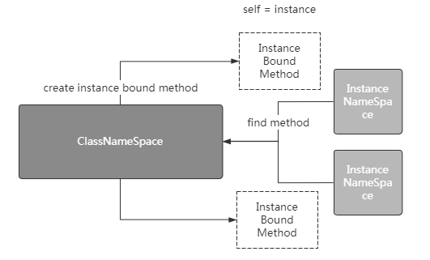

[toc]

# 实例方法

实例方法是存储在类的`__dict__`字典中，实例方法都有一个固定的参数名为self，位于第一个位置。

实例方法通常会通过实例对象调用，当实例对象调用实例方法时，会自动的将自身传递给self。

如下所示：

```python
class Student:
    def __init__(self, name):
        self.name = name

    def show(self):
        return "my name is %s"%self.name

if __name__ == "__main__":
    instanceOne = Student("Jack")
    instanceTwo = Student("Tom")
    print(instanceOne.show())  # self = instanceOne
    print(instanceTwo.show())  # self = instanceTwo

# my name is Jack
# my name is Tom

```

它的底层是怎么做的呢？

其实还是要从属性查找顺序开始剖析，如下所示：

- 第一步：查找实例自身的`__dict__`试图获取实例方法，但实例方法都存于与类的`__dict__`中，故找不到
- 第二步：查找类的`__dict__`成功获取实例方法
- 第三步：根据类的`__dict__`中所定义的实例方法，自动的为self参数传递进调用者，生成一个新的方法



所以你会看见下面这样的场景，3个方法，3个存储空间：

```python
class Student:
    def __init__(self, name):
        self.name = name

    def show(self):
        return "my name is %s"%self.name

if __name__ == "__main__":
    instanceOne = Student("Jack")
    instanceTwo = Student("Tom")
    print(instanceOne.show)
    print(instanceTwo.show)
    print(Student.show)

# <bound method Student.show of <__main__.Student object at 0x01711150>>
# <bound method Student.show of <__main__.Student object at 0x01711250>>
# <function Student.show at 0x01713468>

```

# 类的方法

类方法是指头部带有@classmethod装饰器的方法，类方法都有一个固定的参数名为cls，位于第一个位置。

类方法通常由类进行调用，同时会自动的将类传递进方法cls参数中，如下所示：

```python
class Student:
    def __init__(self, name):
        self.name = name

    def show(self):
        return "my name is %s"%self.name

    @classmethod
    def learn(cls):
        print(cls.__name__)
        return "students must learn"

if __name__ == "__main__":
    print(Student.learn())  # cls = Student

# Student
# students must learn

```

当然也可以通过实例对象调用类方法，cls接收的对象不是实例本身而是类，但是不建议这么做：

```python
class Student:
    def __init__(self, name):
        self.name = name

    def show(self):
        return "my name is %s"%self.name

    @classmethod
    def learn(cls):
        print(cls.__name__)
        return "students must learn"

if __name__ == "__main__":
    instanceObject = Student("Jack")
    print(instanceObject.learn())   # cls = Student

# Student
# students must learn

```

# 静态方法

静态方法是指头部带有@staticmethod装饰器的方法。

常作为类的工具箱出现，类和实例都可以随意的对其调用，没有自动传入的参数self或者cls，就是一个类中的普通函数：

```python
class MathTools:
    @staticmethod
    def getMax(x, y):
        return x if x > y else y

if __name__ == "__main__":
    print(MathTools.getMax(1, 2))
    instanceObject = MathTools()
    print(instanceObject.getMax(1, 2))

# 2
# 2

```


# 实例方法、类方法、静态方法区别

Python 类方法和实例方法相似，它最少也要包含一个参数，只不过类方法中通常将其命名为 cls，Python 会自动将类本身绑定给 cls 参数（注意，绑定的不是类对象）。也就是说，我们在调用类方法时，无需显式为 cls 参数传参。

和 self 一样，cls 参数的命名也不是规定的（可以随意命名），只是 Python 程序员约定俗称的习惯而已。

和实例方法最大的不同在于，类方法需要使用`＠classmethod`修饰符进行修饰，例如：

```python
class CLanguage:
    #类构造方法，也属于实例方法
    def __init__(self):
        self.name = "C语言中文网"
        self.add = "http://c.biancheng.net"
    #下面定义了一个类方法
    @classmethod
    def info(cls):
        print("正在调用类方法",cls)
```

> 注意，如果没有 ＠classmethod，则 Python 解释器会将 fly() 方法认定为实例方法，而不是类方法。

类方法推荐使用类名直接调用，当然也可以使用实例对象来调用（不推荐）。例如，在上面 CLanguage 类的基础上，在该类外部添加如下代码：

```python
#使用类名直接调用类方法
CLanguage.info()
#使用类对象调用类方法
clang = CLanguage()
clang.info()
```

## Python类静态方法

静态方法，其实就是我们学过的函数，和函数唯一的区别是，静态方法定义在类这个空间（类命名空间）中，而函数则定义在程序所在的空间（全局命名空间）中。

静态方法没有类似 self、cls 这样的特殊参数，因此 Python 解释器不会对它包含的参数做任何类或对象的绑定。也正因为如此，类的静态方法中无法调用任何类属性和类方法。

静态方法需要使用`＠staticmethod`修饰，例如：

```python
class CLanguage:
    @staticmethod
    def info(name,add):
        print(name,add)
```

静态方法的调用，既可以使用类名，也可以使用类对象，例如：

```python
#使用类名直接调用静态方法
CLanguage.info("C语言中文网","http://c.biancheng.net")
#使用类对象调用静态方法
clang = CLanguage()
clang.info("Python教程","http://c.biancheng.net/python")
```

在实际编程中，几乎不会用到类方法和静态方法，因为我们完全可以使用函数代替它们实现想要的功能，但在一些特殊的场景中（例如工厂模式中），使用类方法和静态方法也是很不错的选择。