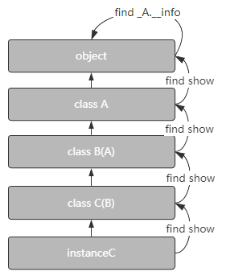
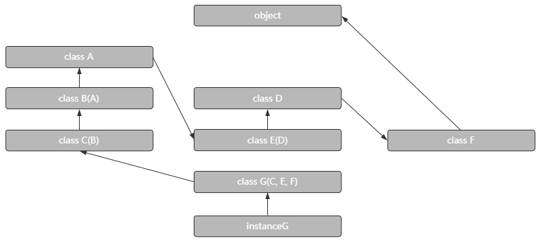
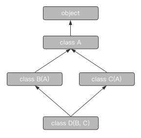
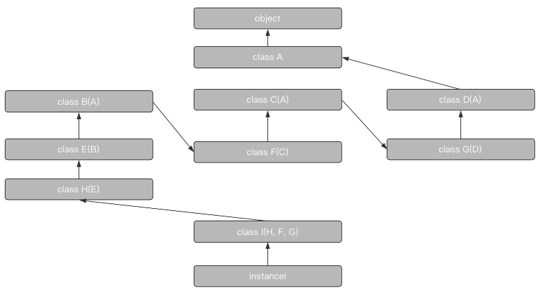
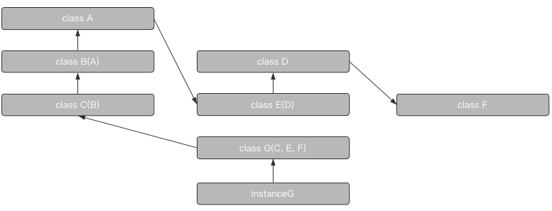
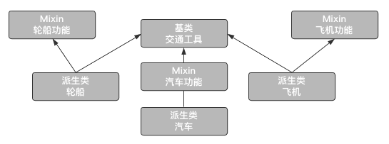

[toc]

# oop继承

## 继承介绍

继承作为oop三大特性之一，可以说是最难的一章知识点，但是用的非常多。

继承是指创建类的一种方式，极大程度上规避了类与类之间代码的重复问题。

在Python中，是支持多继承的，即一个类可以继承多个类，这是其他大多数语言中所不支持的。

- 被继承的类可以称为父类，超类或者基类
- 继承的类可以称为子类或者派生类

派生类可以使用父类所有的属性及方法，但是父类是不能使用派生类的属性或方法的。

以下是语法格式：

```python
class 类标示符(父类1, 父类2):
    ...

```

举一个简单的例子，下面定义了一个狼（Wolf）类和狗（Dog）类，它们都具有相同的方法咬人（bite）、跑步（run）等，由于继承的存在故不用将该方法书写两次，直接使用狗类继承狼类即可：

```python
class Wolf:
    def __init__(self, name) -> None:
        self.name = name

    def bite(self, personName):
        return "%s biting %s" % (self.name, personName)

    def run(self):
        return "%s runing..." % self.name


class Dog(Wolf):
    pass


if __name__ == "__main__":
    wolfInstance = Wolf("King Kong")
    print(wolfInstance.bite("Tom"))
    print(wolfInstance.run())
    print("=" * 10)
    dogInstance = Dog("Small Black")
    print(dogInstance.bite("Jack"))
    print(dogInstance.run())

# King Kong biting Tom
# King Kong runing...
# ==========
# Small Black biting Jack
# Small Black runing...

```

## 方法覆写

如果派生类中拥有和父类同名的方法或者属性，则派生类或者其实例对象在查找这些属性或方法时只会拿自己的。

如下所示，在Dog类中重写了bite，让它不再咬人：

```python
class Wolf:
    def __init__(self, name) -> None:
        self.name = name

    def bite(self, personName):
        return "%s biting %s" % (self.name, personName)

    def run(self):
        return "%s runing..." % self.name


class Dog(Wolf):
    def bite(self, personName):
        return "%s not biting, %s escaped " % (self.name, personName)


if __name__ == "__main__":
    wolfInstance = Wolf("King Kong")
    print(wolfInstance.bite("Tom"))
    print(wolfInstance.run())
    print("=" * 10)
    dogInstance = Dog("Small Black")
    print(dogInstance.bite("Jack"))
    print(dogInstance.run())

# King Kong biting Tom
# King Kong runing...
# ==========
# Small Black not biting, Jack escaped
# Small Black runing...

```

# Python3

## 新式类

Python3中默认的所有类都继承了object类，这样的类被称为新式类：

```python
class A:  # eq class A(object)
    pass

if __name__ == "__main__":
    print(A.__bases__)
    
    
# (<class 'object'>,)

```

## 单继承

新式类单继承查找公有属性、方法时，每轮按照一条线的向上查找次序，如下图所示：


代码示例：

```python
class A:
    def show(self):
        print("--- A.show run ---")
        self.info()

    def info(self):
        print("--- A.info run ---")

    def __getattribute__(self, name: str):
        print("find A.%s" % name)
        return super().__getattribute__(name)


class B(A):
    def info(self):
        print("--- B.info run ---")

    def __getattribute__(self, name: str):
        print("find B.%s" % name)
        return super().__getattribute__(name)


class C(B):
    def info(self):
        print("--- C.info run---")

    def __getattribute__(self, name: str):
        print("find C.%s" % name)
        return super().__getattribute__(name)


if __name__ == "__main__":
    instanceC = C()
    instanceC.show()

# find C.show
# find B.show
# find A.show
# --- A.show run ---
# find C.info
# find B.info
# find A.info
# --- C.info run---

```

而新式类如果是单继承查找私有属性、方法则结果又不一样，如下图所示：



代码示例：

```python
class A:
    def show(self):
        print("--- A.show run ---")
        self.__info()

    def __info(self):
        print("--- A.__info run ---")

    def __getattribute__(self, name: str):
        print("find A.%s" % name)
        return super().__getattribute__(name)


class B(A):
    def __info(self):
        print("--- B.__info run ---")

    def __getattribute__(self, name: str):
        print("find B.%s" % name)
        return super().__getattribute__(name)


class C(B):
    def __info(self):
        print("--- C.__info run---")

    def __getattribute__(self, name: str):
        print("find C.%s" % name)
        return super().__getattribute__(name)


if __name__ == "__main__":
    instanceC = C()
    instanceC.show()

# find C.show
# find B.show
# find A.show
# --- A.show run ---
# find C._A__info
# find B._A__info
# find A._A__info
# --- A.__info run ---

```

## 普通多继承

Python3中的新式类普通多继承，会按照深度优先的查找策略查找整个继承树。

- 深度优先：从左至右查找，每条分支查到最顶部，最后查找object类

如下图所示：



代码示例：

```python
class A:

    def __getattribute__(self, name: str):
        print("find A.%s" % name)
        return super().__getattribute__(name)


class B(A):

    def __getattribute__(self, name: str):
        print("find B.%s" % name)
        return super().__getattribute__(name)


class C(B):

    def show(self):
        print("--- C.show run ---")

    def __getattribute__(self, name: str):
        print("find C.%s" % name)
        return super().__getattribute__(name)


class D:

    def __getattribute__(self, name: str):
        print("find D.%s" % name)
        return super().__getattribute__(name)


class E(D):

    def __getattribute__(self, name: str):
        print("find E.%s" % name)
        return super().__getattribute__(name)


class F:

    def __getattribute__(self, name: str):
        print("find F.%s" % name)
        return super().__getattribute__(name)


class G(C, E, F):

    def __getattribute__(self, name: str):
        print("find G.%s" % name)
        return super().__getattribute__(name)


if __name__ == "__main__":
    instanceG = G()
    instanceG.show()

# find G.show
# find C.show
# find B.show
# find A.show
# find E.show
# find D.show
# find F.show
# --- C.show run ---

```

## 钻石多继承

钻石多继承也被称为死亡菱形继承，继承关系如下所示：



Python3中的新式类钻石多继承，会按照广度优先的查找策略查找整个继承树。

- 广度优先：从左至右查找，每条分支查到顶部第二个类超类，也就是不查钻石基类，如果都没有才查找钻石基类，最后查找object类



代码示例：

```python
class A:

    def show(self):
        print("--- A.show run ---")

    def __getattribute__(self, name: str):
        print("find A.%s" % name)
        return super().__getattribute__(name)


class B(A):

    def __getattribute__(self, name: str):
        print("find B.%s" % name)
        return super().__getattribute__(name)


class C(A):

    def __getattribute__(self, name: str):
        print("find C.%s" % name)
        return super().__getattribute__(name)


class D(A):

    def __getattribute__(self, name: str):
        print("find D.%s" % name)
        return super().__getattribute__(name)


class E(B):

    def __getattribute__(self, name: str):
        print("find E.%s" % name)
        return super().__getattribute__(name)


class F(C):

    def __getattribute__(self, name: str):
        print("find F.%s" % name)
        return super().__getattribute__(name)


class G(D):

    def __getattribute__(self, name: str):
        print("find G.%s" % name)
        return super().__getattribute__(name)


class H(E):

    def __getattribute__(self, name: str):
        print("find H.%s" % name)
        return super().__getattribute__(name)


class I(H, F, G):

    def __getattribute__(self, name: str):
        print("find I.%s" % name)
        return super().__getattribute__(name)


if __name__ == "__main__":
    instanceI = I()
    instanceI.show()

# find I.show
# find H.show
# find E.show
# find B.show
# find F.show
# find C.show
# find G.show
# find D.show
# find A.show
# --- A.show run ---

```

# Python2

## 经典类

Python2中如果一个类没有继承object类，这种类被称为经典类。

反之，如果继承了object类，则被称为新式类。

如下所示：

```python
# Python2中的经典类，也就是Python3中的新式类
class A:
    pass

# Python2中的新式类
class A(object):
    pass

```

换而言之，Python2的类有新式类和经典类2种，Python3中仅有新式类，取消了经典类的设定。

不论是Python2的新式类还是Python3的新式类，它们的查找过程都是相同的，故下面只会例举经典类的查找顺序。

## 单继承

经典类在单继承的情况下，和新式类的查找顺序一致。

## 普通多继承

不管是新式类还是经典类，在普通多继承的查找下都是深度优先策略：

- 深度优先：从左至右查找，每条分支查到最顶部



由于不能使用`__getattribute__()`方法来查看整个查找过程，故这里就不再进行代码示例了。

感兴趣的朋友可以自行测试一下


## 钻石多继承

钻石多继承中，经典类采用的是深度优先策略，而新式类则采用的广度优先策略。

- 深度优先：从左至右查找，每条分支查到最顶部，也就是说钻石基类在第一轮就会被查到


由于不能使用`__getattribute__()`方法来查看整个查找过程，故这里就不再进行代码示例了。

感兴趣的朋友可以自行测试一下。

# 双下属性

## `__class__`

`instanceObject.__class__`属性可以查看实例对象所属的类：

```python
class A:
    pass

if __name__ == "__main__":
    instanceObject = A()
    print(instanceObject.__class__)

# __main__.A

```

## `__base__`

`className.__base`__属性可查看到类的父类，仅Python3有效，返回类对象：

```python
class A:
    pass


class B(A):
    pass


class C(B):
    pass


if __name__ == "__main__":
    print(C.__base__)

# <class '__main__.B'>

```

## `__bases__`

`className.__bases__`属性可查看到类的父类，仅Python3有效，返回元组，索引0处是其父类：

```python
class A:
    pass


class B(A):
    pass


class C(B):
    pass


if __name__ == "__main__":
    print(C.__bases__)

# (<class '__main__.B'>,)

```

## `__mro__`

类的属性查找顺序在类定义时底层会根据C3算法生成，使用`className.__mro`__可调用出该查找顺序。

返回一个列表，列表中嵌套各种父类、超类，也就是说这是一个属性查找顺序列表。

注意，仅在Python3中生效。

下面是新式类普通多继承属性查找顺序，和上面测试的结果一致：

```python
class A:
    pass


class B(A):
    pass


class C(B):
    pass


class D:
    pass


class E(D):
    pass


class F:
    pass


class G(C, E, F):
    pass


if __name__ == "__main__":
    print(G.__mro__)

# (<class '__main__.G'>, <class '__main__.C'>, <class '__main__.B'>, <class '__main__.A'>, <class '__main__.E'>, <class '__main__.D'>, <class '__main__.F'>, <class 'object'>)

```

下面是新式类钻石多继承属性查找顺序，和上面测试的结果一致：

```python
class A:
    pass


class B(A):
    pass


class C(A):
    pass


class D(A):
    pass


class E(B):
    pass


class F(C):
    pass


class G(D):
    pass


class H(E):
    pass


class I(H, F, G):
    pass


if __name__ == "__main__":
    print(I.__mro__)

# (<class '__main__.I'>, <class '__main__.H'>, <class '__main__.E'>, <class '__main__.B'>, <class '__main__.F'>, <class '__main__.C'>, <class '__main__.G'>, <class '__main__.D'>, <class '__main__.A'>, <class 'object'>)

```

# 方法借用

## class.attr

如果一个类和另一个类没有任何关系，但是要借用运行其下方法时，可以选择指名道姓的通过类来调用其下方法。

必须手动传入所有参数，如下所示：

```python
class A:
    def func(self):
        print("run A instance method")

class B:
    def func(self):
        print("run B instance method")
        A.func(self=self)

if __name__ == "__main__":
    B().func()

# run B instance method
# run A instance method

```

## super()

如果一个类和另一个类有继承关系，则可以通过super()方法自动向后查找其父类中需要借用的方法并执行。

它本质上会做两件事：

1. 调用`__mro__`，拿到属性查找顺序列表
2. 确定当前类在列表中的位置，并且拿到其父类，再自动使用class.attr的方式指名道姓的运行父类方法

所以，使用super()方法进行方法借用时，也需要手动传入所有参数，但是传入的参数与class.attr的方式有所不同。

具体的函数签名如下：

```python
super(__class__, <first argument>)

```

使用案例：

```python
class A:
    def func(self):
        print("run A instance method")

class B(A):
    def func(self):
        print("run B instance method")
        super(__class__, self).func()  # ❶ ❷

if __name__ == "__main__":
    B().func()

# run B instance method
# run A instance method

```

❶：传入`__class__`，用于确认该类在`__mro__`所返回的属性查找顺序列表中的位置，以便确定后面的父类查找

❷：传入self，它将自动把self传递给A.func()的第一个参数

注意事项：

- Python3的super()方法中参数可以不传递，它会自动进行补充
- Python2的经典类如果想使用super()方法，则必须在文件顶部添加一句代码 ： `__metaclass__ = type`，否则无法使用

- Python2的super()方法中参数必须传递，不可进行省略

# Mixins机制

Python由于支持多继承的关系，故在某些情况下可能导致代码逻辑不通顺的问题出现，如下所示：


为了能让基类的作用更加强大，符合一切交通工具的特性，你可能会在交通工具基类里面定义下面的方法：

- 飞行方法
- 抛锚方法
- 刹车方法

那么这个时候就已经产生了逻辑问题：

- 轮船不会飞，也不会刹车，但作为交通工具基类的派生类，它也能调用这些方法
- 汽车不会飞，也不会抛锚，但作为交通工具基类的派生类，它也能调用这些方法
- 飞机不会刹车，也不会抛锚，但作为交通工具基类的派生类，它也能调用这些方法

代码示例：

```python
class Transportation:
    def __init__(self, name) -> None:
        self.name = name

    def fly(self):
        """
        飞
        """
        print("%s flying" % self.name)

    def brake(self):
        """
        刹车
        """
        print("%s braking" % self.name)

    def anchor(self):
        """
        抛锚
        """
        print("%s anchor" % self.name)

class Aircraft(Transportation):
    pass

class Car(Transportation):
    pass

class Ship(Transportation):
    pass

if __name__ == "__main__":
    aircraft = Aircraft("Boeing 747")
    car = Car("BMW")
    ship = Ship("Titanic")

    # Serious Problem
    aircraft.brake()
    aircraft.anchor()

    car.fly()
    car.anchor()

    ship.fly()
    ship.brake()

# Boeing 747 braking
# Boeing 747 anchor
# BMW flying
# BMW anchor
# Titanic flying
# Titanic braking

```

如何解决这个问题呢？我们可以使用Mixins机制，将刹车、抛锚、飞行这3个不同的功能单独的封装到下面3个类中：

- 汽车功能类：刹车
- 飞机功能类：飞行
- 轮船功能类：抛锚

子类只需要继承交通工具基类和对应的功能类即可，如下图所示：



代码示例如下：

```python
class Transportation:
    def __init__(self, name) -> None:
        self.name = name

class AircraftMixin:
    def fly(self):
        """
        飞
        """
        print("%s flying" % self.name)

class CarMixin:
    def brake(self):
        """
        刹车
        """
        print("%s braking" % self.name)

class ShipMixin:
    def anchor(self):
        """
        抛锚
        """
        print("%s anchor" % self.name)

class Aircraft(Transportation, AircraftMixin):
    pass

class Car(Transportation, CarMixin):
    pass

class Ship(Transportation, ShipMixin):
    pass

if __name__ == "__main__":
    aircraft = Aircraft("Boeing 747")
    car = Car("BMW")
    ship = Ship("Titanic")

    aircraft.fly()
    car.brake()
    ship.anchor()

# Boeing 747 flying
# BMW braking
# Titanic anchor

```