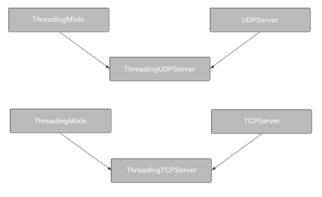

[toc]

# 基础源码

## 包含信息

socketserver源代码中基本上所有的类都会分成两部分。

- server类：处理链接相关
- request类：处理通信相关

我们可以看一下socketserver中使用到了哪些比较基础的模块（socketserver.py line 126 - 136）：

```python
import socket     # socket基础模块
import selectors  # I/O多路复用模块
import os         # 操作系统接口模块
import errno      # 定义符号错误码的模块
import sys        # 系统相关模块
try:
    import threading  # 多线程模块，如果平台支持
except ImportError:
    import dummy_threading as threading  # 多线程模块的另一个版本，当平台不支持时导入该模块
from io import BufferedIOBase  # 读取相关模块
from time import monotonic as time  # 单调时钟模块，避免时间波动的发生

```

下面是定义了允许导入该模块的内容，这里就基本上是socketserver模块最常用的一些类（socketserver.py line 138 - 141）：

```python
__all__ = ["BaseServer", "TCPServer", "UDPServer",
           "ThreadingUDPServer", "ThreadingTCPServer",
           "BaseRequestHandler", "StreamRequestHandler",
           "DatagramRequestHandler", "ThreadingMixIn"]

```

## 平台扩展

接下来socketserver模块的执行，会根据不同的平台做出一些不同的区分了。

如（socketserver.py line 142 - 147）：

```python
if hasattr(os, "fork"):
    __all__.extend(["ForkingUDPServer","ForkingTCPServer", "ForkingMixIn"])
if hasattr(socket, "AF_UNIX"):
    __all__.extend(["UnixStreamServer","UnixDatagramServer",
                    "ThreadingUnixStreamServer",
                    "ThreadingUnixDatagramServer"])

```

这里主要的意思是动态的为`__all__`属性增加一些可用于导入的类，但是这些类可以说很少用到，因此不必太在意。

上面为`__all__`属性增加的类还未进行实现，在何时进行实现呢？你可以在（socketserver.py line 681 - 698）找到这些类的实现，代码如下：

```
if hasattr(os, "fork"):
    class ForkingUDPServer(ForkingMixIn, UDPServer): pass
    class ForkingTCPServer(ForkingMixIn, TCPServer): pass

class ThreadingUDPServer(ThreadingMixIn, UDPServer): pass
class ThreadingTCPServer(ThreadingMixIn, TCPServer): pass

if hasattr(socket, 'AF_UNIX'):

    class UnixStreamServer(TCPServer):
        address_family = socket.AF_UNIX

    class UnixDatagramServer(UDPServer):
        address_family = socket.AF_UNIX

    class ThreadingUnixStreamServer(ThreadingMixIn, UnixStreamServer): pass

    class ThreadingUnixDatagramServer(ThreadingMixIn, UnixDatagramServer): pass

```

下面这两行比较重要（socketserver.py line 151 - 154），它会根据平台选择不同的I/O多路复用机制，如果是Unix平台，会采用epoll，而Windows平台则只能采用性能较低的select机制

```python
if hasattr(selectors, 'PollSelector'):
    _ServerSelector = selectors.PollSelector   # unix 平台
else:
    _ServerSelector = selectors.SelectSelector

```

其实针对不同平台实例化或添加不同的应用类在各大框架中都比较常见，socketserver模块也不仅仅只有上面一些地方会根据平台进行区分，这里只是例举几个比较重要的。

## 类的介绍

当socketserver源码执行至此，基本上所有常用的类都被初始化了。

那么这些类的作用到底是什么？前面已经说过，socketserver模块中主要分为两大类，我们就依照这个来进行划分。

1）处理链接相关的类：

| 类名               | 描述             | 父类       |
| ------------------ | ---------------- | ---------- |
| BaseServer         | 基础链接类       | object     |
| TCPServer          | TCP协议类        | BaseServer |
| UDPServer          | UDP协议类        | TCPServer  |
| UnixStreamServer   | 文件形式字节流类 | TCPServer  |
| UnixDatagramServer | 文件形式数据报类 | UDPServer  |

2）处理通信相关的类：

| 类名                   | 描述             | 父类               |
| ---------------------- | ---------------- | ------------------ |
| BaseRequestHandler     | 基础请求处理类   | object             |
| StreamRequestHandler   | 字节流请求处理类 | BaseRequestHandler |
| DatagramRequestHandler | 数据报请求处理类 | BaseRequestHandler |

除此之外，还有一些多线程以及多进程相关的类，如下所示。

1）多线程相关的类：

| 类名               | 描述                | 父类                      |
| ------------------ | ------------------- | ------------------------- |
| ThreadingMixIn     | 线程工具包类        | object                    |
| ThreadingUDPServer | 多线程UDP协议服务类 | ThreadingMixIn, UDPServer |
| ThreadingTCPServer | 多线程TCP协议服务类 | ThreadingMixIn, TCPServer |

2）多进程相关的类：

| 类名             | 描述                | 父类                    |
| ---------------- | ------------------- | ----------------------- |
| ForkingMixIn     | 进程工具包类        | object                  |
| ForkingUDPServer | 多进程UDP协议服务类 | ForkingMixIn, UDPServer |
| ForkingTCPServer | 多进程TCP协议服务类 | ForkingMixIn, TCPServer |

## 继承图示

上面所举例的类的继承关系如下所示。

1）处理链接相关的类：


2）处理通信相关的类：


3）多线程相关的类：



4）多进程相关的类：


5）总继承关系一览图：


# TCP/socketserver分析

## 实例化过程分析

有了继承关系后，我们可以看TCP服务的实例化过程，首先它的启动如下：

```python
ins = socketserver.ThreadingTCPServer(("ip", port), RequestHandler)

# RequestHandler即我们自己写的类，需要覆写handle()方法

```

所以我们首先是需要找到ThreadingTCPServer类的`__init__()`方法，在其父类TCPServer类中能找该方法（socketserver.py line 394 - 460 ）：

```
class TCPServer(BaseServer):

    address_family = socket.AF_INET   # 网络家族的socket，IPV4
 
    socket_type = socket.SOCK_STREAM  # TCP协议 

    request_queue_size = 5  # 消息队列最大数，即backlog半链接池

    allow_reuse_address = False  # 重用端口，默认关闭

    def __init__(self, server_address, RequestHandlerClass, bind_and_activate=True):

        BaseServer.__init__(self, server_address, RequestHandlerClass)
        self.socket = socket.socket(self.address_family,
                                    self.socket_type)
        if bind_and_activate:
            try:
                self.server_bind()
                self.server_activate()
            except:
                self.server_close()
                raise

```

在这里，它又调用了`BaseServer.__init__()`方法，所以我们先看一下（socketserver.py line 157 - 209）：

```
class BaseServer:

    timeout = None

    def __init__(self, server_address, RequestHandlerClass):

        self.server_address = server_address  # 即传入的(ip+port)
        self.RequestHandlerClass = RequestHandlerClass  # 即我们自己传入的类
        self.__is_shut_down = threading.Event()  # 线程加事件锁
        self.__shutdown_request = False  

```

这里的（socketserver.py line 208）会去实例化出一把线程锁，目的是为了今后控制多个请求的处理顺序，所以暂时不用管。接着回到（socketserver.py line 394 - 460 ）的TCPServer类中`__init__()`方法：

- 首先它会实例化出一个对象
- 然后会判断默认参数bind_and_activate是否为True
- 执行self.server_bind()
- self.server_activate()

```python
class TCPServer(BaseServer):

    address_family = socket.AF_INET   # 网络家族的socket，IPV4
 
    socket_type = socket.SOCK_STREAM  # TCP协议 

    request_queue_size = 5  # 消息队列最大数，即backlog半链接池

    allow_reuse_address = False  # 重用端口，默认关闭

    def __init__(self, server_address, RequestHandlerClass, bind_and_activate=True):
  
        BaseServer.__init__(self, server_address, RequestHandlerClass)
        self.socket = socket.socket(self.address_family,
                                    self.socket_type)
        if bind_and_activate:  # bind_and_activate是默认参数，也就是True
            try:
                self.server_bind()
                self.server_activate()
            except:
                self.server_close()
                raise

```

现在又需要去找self.server_bind()方法，我们要时刻铭记self是谁，**self目前是ThreadingTCPServer类的实例对象**，所以还需要回到ThreadingTCPServer类中寻找该方法。

最终可以在其第二父类，TCPServer中找到该方法（socketserver.py line 462 - 471 ）：

```python
    def server_bind(self):
        # 判断是否重用端口，该属性是TCPServer类属性，默认为False，即不重用端口
        if self.allow_reuse_address:
            self.socket.setsockopt(socket.SOL_SOCKET, socket.SO_REUSEADDR, 1)
            
        # 绑定地址
        self.socket.bind(self.server_address)
        # 获取socket名字，实际上就是 server端 ("ip", port)
        self.server_address = self.socket.getsockname()

```

该方法执行完毕后又要去找self.server_activate()方法，老样子，先去ThreadingTCPServer类中找，找不到去第一父类ThreadingMixIn中找，依旧找不到，所以再找TCPServer类，最终在（socketserver.py line 473 - 498 ）中找到。

其实该方法就是开启监听，backlog参数为TCPServer类属性request_queue_size，为5：

```python
    def server_activate(self):
        """Called by constructor to activate the server.

        May be overridden.

        """
        self.socket.listen(self.request_queue_size)

```

现在整个实例化流程已经跑完了，因为没有任何异常的发生，就不会触发self.server_close()方法。

该方法定义在TCPServer中（socketserver.py line 481 - 487 ），一旦实例化出错将关闭套接字对象，即停止服务器运行：

```python
    def server_close(self):
        """Called to clean-up the server.

        May be overridden.

        """
        self.socket.close()

```

## server_forever()启动服务分析

接下来是启动服务，启动服务的代码是：

```python
ins.server_forever()

```

所以我们需要到ThreadingTCPServer类中去寻找该方法，最终可以在其第二父类TCPServer的父类BaseServer中找到（socketserver.py line 219 - 246 ），其实说白了该类就是使用I/O多路复用机制进行不断的死循环监听，一旦有请求过来就立即进行三次握手，创建双向链接通道：

```python
    def serve_forever(self, poll_interval=0.5):
    
        # self.__is_shut_down是一把事件锁，用于控制子线程的启动顺序。
        # 这里的clear()代表清除，这个不是重点，往下看。
        self.__is_shut_down.clear()
        try:
        
     
            # （socketserver.py line 151 - 154）中定义了I/O多路复用的机制
            # 所以这里会自动选择
            with _ServerSelector() as selector:
                
                # 事件注册，可读事件，self即当前ThreadingTCPServer的实例
                selector.register(self, selectors.EVENT_READ)

                # 该条件是BaseServer.__init__()的实例属性，默认为False
                # 所以下面开始死循环进行监听
                while not self.__shutdown_request:
                
                    # 每隔0.5秒，循环监听一次
                    ready = selector.select(poll_interval)
                    
                    
                    # 由于该属性为False，所以不会跳出
                    if self.__shutdown_request:
                        break
                        
                    # 一旦有客户端请求链接，便立即运行下面的方法
                    if ready:
                        self._handle_request_noblock()

                    self.service_actions()
        finally:
            self.__shutdown_request = False
            self.__is_shut_down.set()


```

如果有链接请求，则会执行self._handle_request_noblock()方法，它在哪里呢？

其实就在BaseServer中，位于（socketserver.py line 307- 328 ）：

```python
    def _handle_request_noblock(self):
        try:
        
            # self.get_request()方法在TCPServer中定义
            # 返回值为 self.socket.accept()，也就是说它这里会返回conn和clientAddr
            request, client_address = self.get_request()
        except OSError:
            return
            
        # self.verify_request()方法的返回结果永远都是True，其实就是验证
        # 双向链接通道和客户端地址是否合法，不用太在意
        if self.verify_request(request, client_address):
        
            try:
                self.process_request(request, client_address)
            except Exception:
                self.handle_error(request, client_address)
                self.shutdown_request(request)
            except:
                self.shutdown_request(request)
                raise
        else:
            self.shutdown_request(request)

```

这里又要去找self.process_request()方法了，self是ThreadingTCPServer的实例对象，所以先去ThreadingTCPServer类中找，最终该方法可以在其第一父类ThreadingMixIn中找到（socketserver.py line 660- 669 ）。该方法主要是针对请求验证成功后，需要进行通信的客户端，会创建一个线程来对其进行服务：

```python
def process_request(self, request, client_address):
       
        # 创建子线程任务，子线程运行self.process_request_thread()方法
        # 并且传入了参数双向链接通道request以及客户端地址
        t = threading.Thread(target = self.process_request_thread,
                             args = (request, client_address))
        
        # ThreadingMixIn的类属性，为False
        t.daemon = self.daemon_threads
        
        # 第一个值为False，第二个值为True。他们都是ThreadingMixIn的类属性
        # 故下面会执行
        if not t.daemon and self._block_on_close:
            if self._threads is None:
                self._threads = []  # 创建空列表
            self._threads.append(t) # 将子线程任务添加至空列表中
            
        t.start()  # 执行子线程任务

```

process_request_thread()方法是子线程处理通信的方法，该方法位于ThreadingMixIn类中，在（socketserver.py line 647- 658 ）处：

```python
def process_request_thread(self, request, client_address):
        """Same as in BaseServer but as a thread.

        In addition, exception handling is done here.

        """
        try:
            self.finish_request(request, client_address)
        except Exception:
            self.handle_error(request, client_address)
        finally:
            self.shutdown_request(request)  # 它不会关闭这个线程，而是将其设置为wait()状态

```

再来接着看self.finish_request()方法，该方法位于BaseServer类中（socketserver.py line 362- 364）：

```python
    def finish_request(self, request, client_address):
        """Finish one request by instantiating RequestHandlerClass."""
        self.RequestHandlerClass(request, client_address, self)

```

self.RequestHandlerClass即我们自己传入的类，现在会对其进行实例化，我们自定义的类没有`__init__()`方法，所以他会去寻找该自定义类的父类BaseRequestHandler（socketserver.py line 700- 735）：

```python
class BaseRequestHandler:

    def __init__(self, request, client_address, server):
        self.request = request  # 双向链接通道
        self.client_address = client_address  # 客户端信息
        self.server = server  # 实例本身，self
        self.setup()       # 一个钩子函数
        try:
            self.handle()  # 我们覆写的handle()
        finally:
            self.finish()  # 一个钩子函数
            
    def setup(self):
        pass

    def handle(self):
        pass

    def finish(self):
        pass

```

所以现在，你应该明白为什么我们自己写的类一定要覆写handle()方法了。

## 内部调用顺序图示

以下是实例化过程图示：


以下是启动服务过程图示：


# UDP/socketserver分析

关于UDP的分析这里暂时就不做了，感兴趣的朋友可以按照继承关系图和上述的分析思路自己分析实现一次。