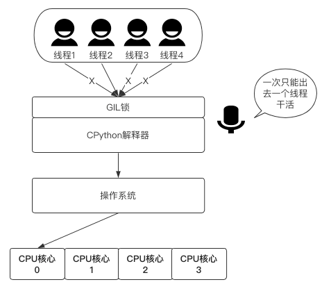
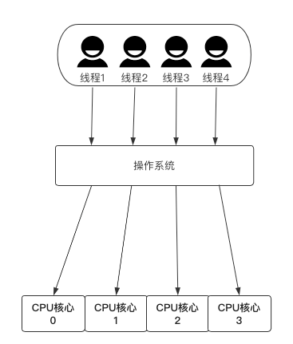

[toc]

# GIL锁是什么

GIL锁是CPython所独有的，全称为Global Interpreter Lock，译为全局解释器锁。

它是CPython经常被人诟病的一个槽点，直接让CPython的多线程变成了残废。

# GIL锁产生的原因

CPython中的一个线程对应于C语言中的一个线程，而CPython在执行函数时会将函数转变为可执行的字节码，如果多个线程同时运行一段字节码是很有可能出错的，为了避免这个错误所以Python使用了GIL锁限制了多线程技术。

GIL锁使得同一个时刻的同一进程下的多个线程只能有一个在CPU上执行字节码，无法将这些线程映射到不同的CPU核心上去执行。

因此CPython的GIL锁注定了其在多线程任务处理方面并没有太大优势，只能做到伪并行的效果，如下图所示：



而对比Java语言，Java语言能够将多个线程映射到不同的CPU核心上，所以他的多线程任务处理是真正的并行化的：



# GIL锁抢占策略

由于CPython中同一时刻一个CPU只能执行一个线程，那么其他的线程该怎么办呢？

这个时候其他线程就要对GIL锁进行抢占了，当GIL锁死一个线程之后，并不是非要等这个线程运行完后才会释放，而是会在适当的时候就进行释放 :

1. 该线程遇到了I/O操作
2. 该线程的时间片轮询到了

我们可以通过sys模块查看GIL锁的释放时机：

```python
import sys

print(sys.getcheckinterval())  

# 100

```

这代表CPU接收100个指令后会切换另一条线程进行执行。

如下图所示：


# I/O密集型操作

CPython中，多线程技术常于I/O密集型业务中使用，如网络爬虫。

因为GIL锁的释放时机是当一个线程遇到I/O操作后就切换至另一条线程，所以对于需要频繁进行网络I/O的爬虫业务来说，CPython多线程还是很有必要的，它比多进程切换代价更小。

# 计算密集型操作

CPython中，多进程技术常于计算密集型业务中使用。

因为GIL锁的存在，CPython中一个进程中的多个线程无法映射到不同的CPU核心上进行执行，但是多个进程中的线程则可以映射到不同的CPU核心上，所以当实现一些计算密集型业务时，应当考虑多进程操作。


# 为什么不干掉GIL锁

参考文章：[Python 有可能删除 GIL 吗？](https://cloud.tencent.com/developer/article/1799500)