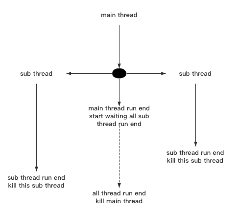
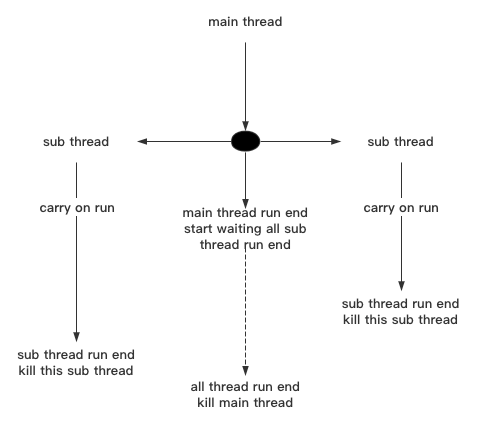
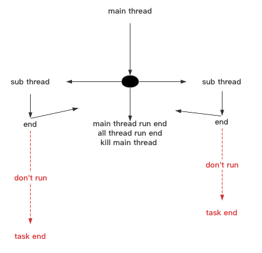

[toc]

# threading模块

Python中提供了threading模块来实现线程并发编程，官方文档如下：

[官方文档](https://docs.python.org/zh-cn/3.6/library/threading.html)

# 添加子线程

## 实例化Thread类

使用该方式新增子线程任务是比较常见的，也是推荐使用的。

简单的代码示例如下，创建3个子线程并向其添加任务，然后运行并打印它们的线程ID和线程名字：

```python
import threading
import time


def task(params):
    print("sub thread run")
    currentThread = threading.current_thread()
    time.sleep(3)
    print("current subthread id : %s\ncurrent subthread name : %s\ncurrent subthread params : %s" % (
        currentThread.ident, currentThread.name, params))


if __name__ == "__main__":
    print("main thread run")
    for item in range(3):
        subThreadIns = threading.Thread(target=task, args=(item, ))
        subThreadIns.start()
    print("main thread run end")

# main thread run
# sub thread run
# sub thread run
# sub thread run
# main thread run end
# current subthread id : 123145534398464
# current subthread name : Thread-1
# current subthread params : 0
# current subthread id : 123145544908800
# current subthread name : Thread-3
# current subthread params : 2
# current subthread id : 123145539653632
# current subthread name : Thread-2
# current subthread params : 1

```

❶：返回一个线程对象，注意args的参数必须是一个tuple，否则抛出异常，也就是说单实参必须添加逗号

❷：start()方法是指该线程对象能够被系统调度了，但不是立即运行该线程，而是等待系统调度后才运行。所以你会看见上面子线程的运行顺序是0、2、1，另外一个线程对象只能运行一次该方法，若多次运行则抛出RunTimeError的异常。

❸：获取当前的线程对象

❹：获取当前线程对象的编号和名字，以及传入的参数。当线程启动时，系统都会分配给它一个随机的编号和名字


首先上述代码会先运行主线程，然后会创建3个子线程并运行。

当子线程运行的时候碰到了sleep(3)这种I/O操作时会释放掉GIL锁，并将线程执行权交还给了主线程。

然后主线程就运行完毕了，此时主线程并不会被kill掉，而是等待子线程运行结束后才会被kill掉，而子线程则是运行完毕后会被立刻kill掉。

我们可以看见，上面3个任务如果按照串行执行共会花费9.+秒时间，而通过多线程来运行，则仅需花费3.+秒的时间，极大的提升了任务处理效率。

## 自定义类覆写run()方法

上面的子线程任务对象是一个全局函数，我们也可以将它作为方法来进行调用。

书写一个类并继承Threading类，覆写run()方法即可：

```python
import threading
import time


class TaskClass(threading.Thread):  # ❶
    def __init__(self, params):
        self.params = params  # ❷
        super(__class__, self).__init__()

    def run(self):
        print("sub thread run")
        currentThread = threading.currentThread()
        time.sleep(3)
        print("current subthread id : %s\ncurrent subthread name : %s\ncurrent subthread params : %s" % (
            currentThread.ident, currentThread.name, self.params))


if __name__ == "__main__":
    print("main thread run")
    for item in range(3):
        subThreadIns = TaskClass(item)
        subThreadIns.start()
    print("main thread run end")

# main thread run
# sub thread run
# sub thread run
# sub thread run
# main thread run end
# current subthread id : 123145495068672
# current subthread name : Thread-1
# current subthread params : 0
# current subthread id : 123145500323840
# current subthread name : Thread-2
# current subthread params : 1
# current subthread id : 123145505579008
# current subthread name : Thread-3
# current subthread params : 2

```

❶：必须继承Threading类并调用父类的`__init__()`方法

❷：传入的参数

## 源码浅析

为什么添加子线程有2种截然不同的方式呢？它们之间有什么区别？这些都可以从源码中找到答案。

我们从Thread类的实例看起，首先是`__init__()`方法（threading.py line 738 - 800），它主要做了一些初始化的准备工作：

```python
class Thread:

    _initialized = False

    _exc_info = _sys.exc_info


    def __init__(self, group=None, target=None, name=None,
                 args=(), kwargs=None, *, daemon=None):
    
        # 如果group不是None，就会抛出断言异常
        assert group is None, "group argument must be None for now"
        
        # 如果kwargs是None，则构造一个空字典
        if kwargs is None:
            kwargs = {}
            
        # 传入的执行任务的函数或者None
        self._target = target
        
        # 线程名字
        self._name = str(name or _newname())
        
        # 任务函数传入的元组参数
        self._args = args
        # 任务函数传入的关键字参数
        self._kwargs = kwargs
        # 是否是守护线程启动，如果不是None则以守护线程模式启动
        if daemon is not None:
            self._daemonic = daemon
        # 如果是None，则继承当前线程的守护模式
        else:
            self._daemonic = current_thread().daemon
        # 线程编号
        self._ident = None
        # 锁定状态，None
        self._tstate_lock = None
        # 一把Event事件锁
        self._started = Event()
        # 是否停止运行的标志位
        self._is_stopped = False
        # 初始化状态改为True
        self._initialized = True
 
        self._stderr = _sys.stderr

        _dangling.add(self)

```

参数释义：

- group：应该为None，为了日后扩展ThreadGroup类而保留的
- target：传入一个可调用对象，即线程任务task，默认为None，即可以不进行传入
- name：线程启动时将不再由系统分配线程名称，而是自定义，默认情况下，系统分配的线程名称会由 “Thread-*N*” 的格式构成一个唯一的名称，其中 *N* 是小的十进制数
- args：用于调用目标函数的参数元组，默认是()空元组，你必须传入一个元组
- kwargs：用于调用目标函数的关键字参数字典，默认是None，你必须传入一个字典

- daemon：命名关键字参数，应当传入一个布尔值，默认为None，它会指定该线程是否是以守护线程模式启动，如果为None，该线程将继承当前线程的守护模式属性

接下来看start()方法，它是告知系统当前线程完成调度，可随时启用的方法（threading.py line 828 - 851）：

```python
    def start(self):

        # 如果初始状态不为True，则抛出异常
        if not self._initialized:
            raise RuntimeError("thread.__init__() not called")

        # 判断当前线程是否被锁住，如果被锁住则抛出异常
        if self._started.is_set():
            raise RuntimeError("threads can only be started once")
        with _active_limbo_lock:
            _limbo[self] = self
        try:
            # 执行引导
            _start_new_thread(self._bootstrap, ())
        except Exception:
            with _active_limbo_lock:
                del _limbo[self]
            raise
    
        self._started.wait()

```

这里关键是看self._bootstrap()方法，该该方法位于（threading.py line 870 - 888），看看它会做什么事情：

```python
    def _bootstrap(self):
        try:
            self._bootstrap_inner()
        except:
            if self._daemonic and _sys is None:
                return
            raise

```

继续找self._bootstrap_inner()方法，该该方法位于（threading.py line 901 - 964）。

在该方法的916行时，它会执行run()方法：

```python
    def _bootstrap_inner(self):
            ...
            try:
                # 执行run
                self.run()
            except SystemExit:
                pass
            except:
              ...

```

如果此时你按照第二种添加子线程的方式，则直接会运行被子类TaskClass覆写的run()方法。

如果是第一种添加子线程的方式，则还需要往里面看（threading.py line 835 - 868）：

```python
 def run(self):

        try:
            # self._target = 我们自己传递的可调用对象task
            if self._target:
                self._target(*self._args, **self._kwargs)
        finally:
            del self._target, self._args, self._kwargs

```

至此可以发现，不管是使用哪一种方式添加子线程，都会运行5个方法。

所以说它们内部实现其实都是一样的，没什么特别的，也不要觉得它特别神奇。

# threading模块方法大全

以下是threading模块提供的类或方法：

| 类或方法                                          | 描述                                             | 返回值            |
| ------------------------------------------------- | ------------------------------------------------ | ----------------- |
| threading.Thread(target, args, kwargs)            | 创建并返回一个线程对象                           | threadObject      |
| threading.Timer(interval, function, args, kwargs) | 创建并返回一个延迟启动的线程对象                 | threadObject      |
| threading.active_count()                          | 获取当前进程下存活的线程数量                     | int               |
| threading.enumerate()                             | 查看当前进程存活了的所有线程对象，以列表形式返回 | [threadObject, …] |
| threading.main_thread()                           | 获取主线程对象                                   | threadObject      |
| threading.current_thread()                        | 获取当前正在执行的线程对象                       | threadObject      |
| threading.currentThread()                         | 获取当前正在执行的线程对象                       | threadObject      |
| threading.get_ident()                             | 获取当前正在执行的线程对象的编号                 | int               |

下面我将使用该代码对上述功能进行演示：

```python
import threading
import time

class TaskClass(threading.Thread):

    def run(self):
        time.sleep(3)
        pass

if __name__ == "__main__":
    for i in range(3):
        subThreadIns = TaskClass()
        subThreadIns.start()

```

1）获取当前进程下存活的线程数量：

```python
print(threading.active_count())

# 4

```

2）查看当前进程存活了的所有线程对象，以列表形式返回：

```python
print(threading.enumerate())

# [<_MainThread(MainThread, started 4425459136)>, <TaskClass(Thread-1, started 123145449238528)>, <TaskClass(Thread-2, started 123145454493696)>, <TaskClass(Thread-3, started 123145459748864)>]

```

3）获取主线程对象：

```python
print(threading.main_thread())

# <_MainThread(MainThread, started 4565407168)>

```

4）获取当前正在执行的线程对象：

```python
print(threading.currentThread())

# <_MainThread(MainThread, started 4383299008)>

```

5）获取当前正在执行的线程对象的编号：

```python
print(threading.get_ident())

# 4380034496

```

# threadObject方法大全

以下是针对线程对象提供的属性或者方法：

| 方法/属性                       | 描述                                                         | 返回值      |
| ------------------------------- | ------------------------------------------------------------ | ----------- |
| threadObject.start()            | 通知系统该线程调度完毕，可以随时进行启动，一个线程对象只能运行一次该方法，若多次运行则抛出RunTimeError异常 | …           |
| threadObject.join(timeout=None) | 主线程默认会等待子线程运行结束后再继续执行，timeou为等待的秒数，如不设置该参数则一直等待。 | …           |
| threadObject.getName()          | 获取线程对象的名字                                           | str         |
| threadObject.setName(name)      | 设置线程对象的名字                                           | None        |
| threadObject.is_alive()         | 查看线程对象是否存活                                         | bool        |
| threadObject.isAlive()          | 查看线程对象是否存活，不推荐使用                             | bool        |
| threadObject.isDaemon()         | 查看线程对象是否是守护线程                                   | bool        |
| threadObject.setDaemon()        | 设置线程对象为守护线程，主线程运行完毕之后设置为守护线程的子线程便立即结束执行 | None        |
| threadObject.ident              | 获取线程对象的编号                                           | int         |
| threadObject.name               | 获取或者设置线程对象的名字                                   | str or None |
| threadObject.daemon             | 查看线程对象是否是守护线程                                   | bool        |

## 主线程阻塞

默认情况下，当子线程启动后，主线程会依旧往下运行而不是等待所有的子线程运行完毕后再继续往下运行。

如图所示，主线程在运行结束后并不会被立即kill掉，而是所有的子线程运行完毕后主线程才会被kill掉：



我们可以利用threadObject.join(timeout=None)来让主线程等待子线程运行完毕后再继续向下运行，timeout为等待的秒数，如不设置该参数则一直等待。

如图所示，这是没有设置timeout的示意图，主线程必须等待所有子线程运行完毕后再接着运行：


```python
import threading
import time


class TaskClass(threading.Thread):

    def run(self):
        thName = threading.current_thread().name
        print("%s start run" % thName)
        time.sleep(3)
        print("%s run end" % thName)


if __name__ == "__main__":
    print("main thread start run")
    threadLst = []
    
    for i in range(3):
        threadLst.append(TaskClass())
    for ins in threadLst:
        ins.start()  # 开始运行所有子线程
    for ins in threadLst:
        ins.join()   # 让主线程等待所有子线程运行完毕后再接着运行，注意，设置主线程等待的子线程必须处于活跃状态
        
    print("main thread carry on run")
    print("main thread run end")
    
# main thread start run
# Thread-1 start run
# Thread-2 start run
# Thread-3 start run
# Thread-1 run end
# Thread-2 run end
# Thread-3 run end
# main thread carry on run
# main thread run end

```

## 守护线程

守护线程是指当主线程运行完毕后，子线程是否还要继续运行。

默认threadObject.setDaemon()为None，也就是False，即当前主线程运行完毕后，子线程依旧可以接着运行。



如果threadObject.setDaemon()为True，则当前主线程运行完毕后，子线程即使没有运行完毕也会结束运行。



```python
import threading
import time


class TaskClass(threading.Thread):

    def run(self):
        thName = threading.current_thread().name
        print("%s start run" % thName)
        time.sleep(3)
        print("%s run end" % thName)


if __name__ == "__main__":
    print("main thread start run")
    threadLst = []
    for i in range(3):
        threadLst.append(TaskClass())
    for ins in threadLst:
    
        # 注意，守护线程的设置必须在线程未启动时设置
        ins.setDaemon(True)
        ins.start()

    print("main thread carry on run")
    print("main thread run end")

# main thread start run
# Thread-1 start run
# Thread-2 start run
# Thread-3 start run
# main thread carry on run
# main thread run end

```

## join()与setDaemon(True)共存

如果同时设置setDaemon(True)与join()方法会怎么样呢？有两种情况：

1. join()方法没有设置timeout（没有设置即表示死等）或者timeout的时间比子线程作业时间要长，这代表子线程会死在主线程之前，setDaemon(True)也就没有了意义，即失效了
2. join()设置了timeout并且timeout的时间比子线程作业时间要短，这代表主线程会死在子线程之前，setDaemon(True)生效，子线程会跟着主线程一起死亡。

情况一：

```python
import threading
import time


class TaskClass(threading.Thread):

    def run(self):
        thName = threading.current_thread().name
        print("%s start run" % thName)
        time.sleep(3)
        print("%s run end" % thName)


if __name__ == "__main__":
    subThread = TaskClass()
    subThread.setDaemon(True) # 主线程运行完后会立即终止子线程的运行。但是由于有join()，故不生效。
    subThread.start()
    subThread.join() # 主线程必须等待子线程运行结束后再接着运行
    print("main thread run end")

# Thread-1 start run
# Thread-1 run end
# main thread run end

```

情况2：

```python
import threading
import time


class TaskClass(threading.Thread):

    def run(self):
        thName = threading.current_thread().name
        print("%s start run" % thName)
        time.sleep(3)
        print("%s run end" % thName)


if __name__ == "__main__":
    subThread = TaskClass()
    subThread.setDaemon(True) # 主线程运行完后会立即终止子线程的运行。但是由于有join()，故不生效。
    subThread.start()
    subThread.join(1) # 主线程必须等待子线程运行结束后再接着运行，只等待1s
    print("main thread run end")

# Thread-1 start run
# main thread run end

```

# 线程延迟启动

使用threading模块中提供的Timer类，可让子线程延迟启动，如下所示：

```python
import threading
import time


def task():
    print("sub thread start run")
    time.sleep(3)
    print("sub thread run end")


if __name__ == "__main__":
    print("main thread run")
    t1 = threading.Timer(interval=3, function=task)
    t1.start()  # 3秒后才启动子线程
    t1.join()
    print("main thread run end")

# main thread run
# sub thread start run
# sub thread run end
# main thread run end

```

如果要用类的形式，则可以继承threading.Timer()类，并修改self.function属性，个人极度不推荐这样做。

如下所示，在不知道某一个方法怎么使用时扒扒源码看一看，翻翻官方文档就大概能了解：

```python
import threading
import time


class TaskClass(threading.Timer):
    def __init__(self, *args, **kwargs):
        # 必须要修改function为你想执行的方法
        super(__class__, self).__init__(*args, **kwargs)
        self.function = self.task

    def task(self, x, y):
        print("sub thread start run")
        time.sleep(3)
        print("parmas %s %s" % (x, y))
        print("sub thread run end")


if __name__ == "__main__":
    # 必须传入一个None
    t1 = TaskClass(interval=3, function=None, args=(1, 2))
    t1.start()
    t1.join()
    print("main thread run end")

# sub thread start run
# parmas 1 2
# sub thread run end
# main thread run end

```

# 多线程编程应用场景

由于GIL锁的存在，Python中对于I/O操作来说可以使用多线程编程，如果是计算密集型的操作则不应该使用多线程进行处理，因为没有I/O操作就不能通过I/O切换来执行其他线程，故对于计算密集型的操作来说多线程没有什么优势，甚至还可能比普通串行还慢（因为涉及到线程切换，虽然是毫秒级别，但是计算的数值越大这个切换也就越密集，GIL锁是100个CPU指令切换一次的）

注意：我们是在Python2版本下进行此次测试，Python3版本确实相差不大，但是，从本质上来说依然是这样的。

计算密集型程序的普通串行运行时间：

```python
import threading
import time

num = 0
def add():
    global num
    for i in range(10000000): # 一千万次
        num += 1

def sub():
    global num
    for i in range(10000000):  # 一千万次
        num -= 1

if __name__ == '__main__':
    start_time = time.time()

    add()
    sub()

    end_time = time.time()
    print("执行时间:",end_time - start_time)
    
    
# ==== 执行结果 ==== 三次采集

"""
大约在 1.3 - 1.4 秒
"""

```

计算密集型程序的多线程并发运行时间：

```python
# coding:utf-8

import threading
import time

num = 0
def add():
    global num
    for i in range(10000000):  # 一千万次
        num += 1

def sub():
    global num
    for i in range(10000000):  # 一千万次
        num -= 1

if __name__ == '__main__':
    start_time = time.time()

    t1 = threading.Thread(target=add,)
    t2 = threading.Thread(target=sub,)
    t1.start()
    t2.start()
    t1.join()
    t2.join()

    end_time = time.time()
    print(u"执行时间:",end_time - start_time)

# ==== 执行结果 ==== 三次采集

"""
大约 4 - 5 秒
"""

```