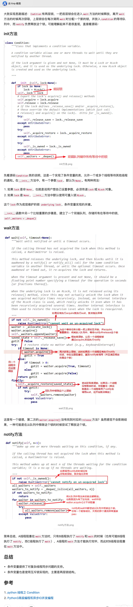

[toc]

# 前言

本章节将继续围绕threading模块讲解，基本上是纯理论偏多。

对于日常开发者来讲很少会使用到本章节的内容，但是对框架作者等是必备知识，同时也是高频的面试常见问题。

[官方文档](https://docs.python.org/zh-cn/3.6/library/threading.html)

# 线程安全

线程安全是多线程或多进程编程中的一个概念，在拥有共享数据的多条线程并行执行的程序中，线程安全的代码会通过同步机制保证各个线程都可以正常且正确的执行，不会出现数据污染等意外情况。

线程安全的问题最主要还是由线程切换导致的，比如一个房间（进程）中有10颗糖（资源），除此之外还有3个小人（1个主线程、2个子线程），当小人A吃了3颗糖后被系统强制进行休息时他认为还剩下7颗糖，而当小人B工作后又吃掉了3颗糖，那么当小人A重新上岗时会认为糖还剩下7颗，但是实际上只有4颗了。

上述例子中线程A和线程B的数据不同步，这就是线程安全问题，它可能导致非常严重的意外情况发生，我们按下面这个示例来进行说明。

下面有一个数值num初始值为0，我们开启2条线程：

- 线程1对num进行一千万次+1的操作
- 线程2对num进行一千万次-1的操作

结果可能会令人咋舌，num最后并不是我们所想象的结果0：

```python
import threading

num = 0


def add():
    global num
    for i in range(10_000_000):
        num += 1


def sub():
    global num
    for i in range(10_000_000):
        num -= 1


if __name__ == "__main__":
    subThread01 = threading.Thread(target=add)
    subThread02 = threading.Thread(target=sub)

    subThread01.start()
    subThread02.start()

    subThread01.join()
    subThread02.join()

    print("num result : %s" % num)

# 结果三次采集
# num result : 669214
# num result : -1849179
# num result : -525674

```

上面这就是一个非常好的案例，想要解决这个问题就必须通过锁来保障线程切换的时机。

需要我们值得留意的是，在Python基本数据类型中list、tuple、dict本身就是属于线程安全的，所以如果有多个线程对这3种容器做操作时，我们不必考虑线程安全问题。

# 锁的作用

锁是Python提供给我们能够自行操控线程切换的一种手段，使用锁可以让线程的切换变的有序。

一旦线程的切换变的有序后，各个线程之间对数据的访问、修改就变的可控，所以若要保证线程安全，就必须使用锁。

threading模块中提供了5种最常见的锁，下面是按照功能进行划分：

- 同步锁：lock（一次只能放行一个）
- 递归锁：rlock（一次只能放行一个）
- 条件锁：condition（一次可以放行任意个）
- 事件锁：event（一次全部放行）
- 信号量锁：semaphore（一次可以放行特定个）

# Lock() 同步锁

## 基本介绍

Lock锁的称呼有很多，如：

- 同步锁
- 互斥锁

它们是什么意思呢？如下所示：

1. 互斥指的是某一资源同一时刻仅能有一个访问者对其进行访问，具有唯一性和排他性，但是互斥无法限制访问者对资源的访问顺序，即访问是无序的
2. 同步是指在互斥的基础上（大多数情况），通过其他机制实现访问者对资源的有序访问
3. 同步其实已经实现了互斥，是互斥的一种更为复杂的实现，因为它在互斥的基础上实现了有序访问的特点

下面是threading模块与同步锁提供的相关方法：

| 方法                                         | 描述                                                         |
| -------------------------------------------- | ------------------------------------------------------------ |
| threading.Lock()                             | 返回一个同步锁对象                                           |
| lockObject.acquire(blocking=True, timeout=1) | 上锁，当一个线程在执行被上锁代码块时，将不允许切换到其他线程运行，默认锁失效时间为1秒 |
| lockObject.release()                         | 解锁，当一个线程在执行未被上锁代码块时，将允许系统根据策略自行切换到其他线程中运行 |
| lockObject.locaked()                         | 判断该锁对象是否处于上锁状态，返回一个布尔值                 |

## 使用方式

同步锁一次只能放行一个线程，一个被加锁的线程在运行时不会将执行权交出去，只有当该线程被解锁时才会将执行权通过系统调度交由其他线程。

如下所示，使用同步锁解决最上面的问题：

```python
import threading

num = 0


def add():
    lock.acquire()
    global num
    for i in range(10_000_000):
        num += 1
    lock.release()


def sub():
    lock.acquire()
    global num
    for i in range(10_000_000):
        num -= 1
    lock.release()

if __name__ == "__main__":
    lock = threading.Lock()

    subThread01 = threading.Thread(target=add)
    subThread02 = threading.Thread(target=sub)

    subThread01.start()
    subThread02.start()

    subThread01.join()
    subThread02.join()

    print("num result : %s" % num)

# 结果三次采集
# num result : 0
# num result : 0
# num result : 0

```

这样这个代码就完全变成了串行的状态，对于这种计算密集型I/O业务来说，还不如直接使用串行化单线程执行来得快，所以这个例子仅作为一个示例，不能概述锁真正的用途。

## 死锁现象

对于同步锁来说，一次acquire()必须对应一次release()，不能出现连续重复使用多次acquire()后再重复使用多次release()的操作，这样会引起死锁造成程序的阻塞，完全不动了，如下所示：

```python
import threading

num = 0


def add():
    lock.acquire()  # 上锁
    lock.acquire()  # 死锁
    # 不执行
    global num
    for i in range(10_000_000):
        num += 1
    lock.release()
    lock.release()


def sub():
    lock.acquire()  # 上锁
    lock.acquire()  # 死锁
    # 不执行
    global num
    for i in range(10_000_000):
        num -= 1
    lock.release()
    lock.release()


if __name__ == "__main__":
    lock = threading.Lock()

    subThread01 = threading.Thread(target=add)
    subThread02 = threading.Thread(target=sub)

    subThread01.start()
    subThread02.start()

    subThread01.join()
    subThread02.join()

    print("num result : %s" % num)

```

## with语句

由于threading.Lock()对象中实现了`__enter__()与__exit__()`方法，故我们可以使用with语句进行上下文管理形式的加锁解锁操作：

```python
import threading

num = 0


def add():
    with lock:
        # 自动加锁
        global num
        for i in range(10_000_000):
            num += 1
        # 自动解锁


def sub():
    with lock:
        # 自动加锁
        global num
        for i in range(10_000_000):
            num -= 1
        # 自动解锁


if __name__ == "__main__":
    lock = threading.Lock()

    subThread01 = threading.Thread(target=add)
    subThread02 = threading.Thread(target=sub)

    subThread01.start()
    subThread02.start()

    subThread01.join()
    subThread02.join()

    print("num result : %s" % num)
    
# 结果三次采集
# num result : 0
# num result : 0
# num result : 0

```


## 源码相关

```python
# 互斥锁
_allocate_lock = _thread.allocate_lock
Lock = _allocate_lock
```


# RLock() 递归锁

## 基本介绍

递归锁是同步锁的一个升级版本，在同步锁的基础上可以做到连续重复使用多次acquire()后再重复使用多次release()的操作，但是一定要注意加锁次数和解锁次数必须一致，否则也将引发死锁现象。

下面是threading模块与递归锁提供的相关方法：

| 方法                                         | 描述                                                         |
| -------------------------------------------- | ------------------------------------------------------------ |
| threading.RLock()                            | 返回一个递归锁对象                                           |
| lockObject.acquire(blocking=True, timeout=1) | 上锁，当一个线程在执行被上锁代码块时，将不允许切换到其他线程运行，默认锁失效时间为1秒 |
| lockObject.release()                         | 解锁，当一个线程在执行未被上锁代码块时，将允许系统根据策略自行切换到其他线程中运行 |
| lockObject.locaked()                         | 判断该锁对象是否处于上锁状态，返回一个布尔值                 |

## 使用方式

以下是递归锁的简单使用，下面这段操作如果使用同步锁则会发生死锁现象，但是递归锁不会：

```python
import threading

num = 0


def add():
    lock.acquire()
    lock.acquire()
    global num
    for i in range(10_000_000):
        num += 1
    lock.release()
    lock.release()


def sub():
    lock.acquire()
    lock.acquire()
    global num
    for i in range(10_000_000):
        num -= 1
    lock.release()
    lock.release()


if __name__ == "__main__":
    lock = threading.RLock()

    subThread01 = threading.Thread(target=add)
    subThread02 = threading.Thread(target=sub)

    subThread01.start()
    subThread02.start()

    subThread01.join()
    subThread02.join()

    print("num result : %s" % num)

# 结果三次采集
# num result : 0
# num result : 0
# num result : 0

```

## with语句

由于threading.RLock()对象中实现了`__enter__()与__exit__()`方法，故我们可以使用with语句进行上下文管理形式的加锁解锁操作：

```python
import threading

num = 0


def add():
    with lock:
        # 自动加锁
        global num
        for i in range(10_000_000):
            num += 1
        # 自动解锁


def sub():
    with lock:
        # 自动加锁
        global num
        for i in range(10_000_000):
            num -= 1
        # 自动解锁


if __name__ == "__main__":
    lock = threading.RLock()

    subThread01 = threading.Thread(target=add)
    subThread02 = threading.Thread(target=sub)

    subThread01.start()
    subThread02.start()

    subThread01.join()
    subThread02.join()

    print("num result : %s" % num)

# 结果三次采集
# num result : 0
# num result : 0
# num result : 0

```

## 源码分析

**RLock其实底层维护了一个互斥锁和一个计数器，那互斥锁和计数器到底是如何工作的？我们从RLock的实现源码一探究竟。**

1. RLock 内部维护了一个 互斥锁和一个计数器`self._count`, 第一次 acquire 则 互斥锁开始acquire，并且获取到当前线程的 id赋值 给 `self._owner`，`self._count  = 1`, return True
2. RLock 第二次 acquire ，计数器 `self._count` + 1, return 1
3. RLock 第一次 release，`self._count -1`, 一直 release，直到 计数器 `self._count` == 0, 底层互斥锁开始 release

在threading内部，RLock实现方式有两种，一种是调用_thread模块下的RLock，它是用C语言写的，另外一种是用Python语言写的，不管哪种方式，其实现原理是一致的。

```python
def RLock(*args, **kwargs):
    if _CRLock is None:
        return _PyRLock(*args, **kwargs) #  python语言实现的RLock
    return _CRLock(*args, **kwargs) # _thread模块中RLock，C语言实现的
```

Python语言实现的RLock源码如下：

```python
class _RLock:
    """This class implements reentrant lock objects.

    A reentrant lock must be released by the thread that acquired it. Once a
    thread has acquired a reentrant lock, the same thread may acquire it
    again without blocking; the thread must release it once for each time it
    has acquired it.

    """

    def __init__(self):
        self._block = _allocate_lock()	# 分配一把互斥锁
        self._owner = None
        self._count = 0

    def __repr__(self):
        owner = self._owner
        try:
            owner = _active[owner].name
        except KeyError:
            pass
        return "<%s %s.%s object owner=%r count=%d at %s>" % (
            "locked" if self._block.locked() else "unlocked",
            self.__class__.__module__,
            self.__class__.__qualname__,
            owner,
            self._count,
            hex(id(self))
        )

    def acquire(self, blocking=True, timeout=-1):
        """Acquire a lock, blocking or non-blocking.

        When invoked without arguments: if this thread already owns the lock,
        increment the recursion level by one, and return immediately. Otherwise,
        if another thread owns the lock, block until the lock is unlocked. Once
        the lock is unlocked (not owned by any thread), then grab ownership, set
        the recursion level to one, and return. If more than one thread is
        blocked waiting until the lock is unlocked, only one at a time will be
        able to grab ownership of the lock. There is no return value in this
        case.

        When invoked with the blocking argument set to true, do the same thing
        as when called without arguments, and return true.

        When invoked with the blocking argument set to false, do not block. If a
        call without an argument would block, return false immediately;
        otherwise, do the same thing as when called without arguments, and
        return true.

        When invoked with the floating-point timeout argument set to a positive
        value, block for at most the number of seconds specified by timeout
        and as long as the lock cannot be acquired.  Return true if the lock has
        been acquired, false if the timeout has elapsed.

        """
        me = get_ident()  		# 获取当前正在执行的线程对象的编号, 线程 id
        if self._owner == me:	# 判断是否是同一个线程，第二次执行 acquire 直接计数器 self._count + 1
            self._count += 1
            return 1
        # 第一次执行 acquire 走下面的代码，互斥锁开始 acquire
        rc = self._block.acquire(blocking, timeout) # timeout=-1 表示无限期锁，返回 True
        if rc:
            self._owner = me
            self._count = 1
        return rc

    __enter__ = acquire

    def release(self):
        """Release a lock, decrementing the recursion level.

        If after the decrement it is zero, reset the lock to unlocked (not owned
        by any thread), and if any other threads are blocked waiting for the
        lock to become unlocked, allow exactly one of them to proceed. If after
        the decrement the recursion level is still nonzero, the lock remains
        locked and owned by the calling thread.

        Only call this method when the calling thread owns the lock. A
        RuntimeError is raised if this method is called when the lock is
        unlocked.

        There is no return value.

        """
        if self._owner != get_ident():
            raise RuntimeError("cannot release un-acquired lock")
        self._count = count = self._count - 1	# 计数器 - 1
        if not count:	# 这表示 acquire 被 release 完了 
            self._owner = None
            self._block.release() # 真正的互斥锁开始 release

    def __exit__(self, t, v, tb):
        self.release()

    # Internal methods used by condition variables

    def _acquire_restore(self, state): 这个到 Condition() 再看
        self._block.acquire()
        self._count, self._owner = state

    def _release_save(self):  	# 这个到 Condition() 再看
        if self._count == 0:	# 判断是否release 了
            raise RuntimeError("cannot release un-acquired lock")
        count = self._count		# 内部计数器赋值给 count
        self._count = 0			# 内部计数器 赋值为 0
        owner = self._owner		# 线程id 赋值给 owner
        self._owner = None		# 线程id 赋值为 0
        self._block.release()	# 释放 互斥锁
        return (count, owner)	# 返回 (计数器, 线程id)

    def _is_owned(self):
        return self._owner == get_ident()

_PyRLock = _RLock
```

一次只能进入一个线程，当第一个线程没 release 之前，第二个线程进不来。

1. 第一个线程 RLock.acquire 的时候会创建一把互斥锁  `rc = self._block.acquire(blocking, timeout)`, 然后进行 `self._owner = 线程id，self._count = 1（计数器）`
2. 接着如果还是第一个线程acquire（通过 `if self._owner == me:`判断是否是同一个线程），计数器+1
3. 如果是第二个线程 acquire，这个时候第一个线程没有 release，则会执行 `rc = self._block.acquire(blocking, timeout)` 会阻塞到这里。

总结：同一个线程可以多次执行  acquire, 多个线程不可以同时执行 acquire会阻塞，必须等到其他线程释放锁 release。

# Condition() 条件锁

## 基本介绍

条件锁是在递归锁的基础上增加了能够暂停线程运行的功能。并且我们可以使用wait()与notify()来控制线程执行的个数。

注意：条件锁可以自由设定一次放行几个线程。

下面是threading模块与条件锁提供的相关方法：

| 方法                                         | 描述                                                         |
| -------------------------------------------- | ------------------------------------------------------------ |
| threading.Condition()                        | 返回一个条件锁对象                                           |
| lockObject.acquire(blocking=True, timeout=1) | 上锁，当一个线程在执行被上锁代码块时，将不允许切换到其他线程运行，默认锁失效时间为1秒 |
| lockObject.release()                         | 解锁，当一个线程在执行未被上锁代码块时，将允许系统根据策略自行切换到其他线程中运行 |
| lockObject.wait(timeout=None)                | 将当前线程设置为“等待”状态，只有该线程接到“通知”或者超时时间到期之后才会继续运行，在“等待”状态下的线程将允许系统根据策略自行切换到其他线程中运行 |
| lockObject.wait_for(predicate, timeout=None) | 将当前线程设置为“等待”状态，只有该线程的predicate返回一个True或者超时时间到期之后才会继续运行，在“等待”状态下的线程将允许系统根据策略自行切换到其他线程中运行。注意：predicate参数应当传入一个可调用对象，且返回结果为bool类型 |
| lockObject.notify(n=1)                       | 通知一个当前状态为“等待”的线程继续运行，也可以通过参数n通知多个 |
| lockObject.notify_all()                      | 通知所有当前状态为“等待”的线程继续运行                       |

## 使用方式

下面这个案例会启动10个子线程，并且会立即将10个子线程设置为等待状态。

然后我们可以发送一个或者多个通知，来恢复被等待的子线程继续运行：

```python
import threading

currentRunThreadNumber = 0
maxSubThreadNumber = 10


def task():
    global currentRunThreadNumber
    thName = threading.currentThread().name

    condLock.acquire()  # 上锁
    print("start and wait run thread : %s" % thName)

    condLock.wait()  # 暂停线程运行、等待唤醒
    currentRunThreadNumber += 1
    print("carry on run thread : %s" % thName)

    condLock.release()  # 解锁


if __name__ == "__main__":
    condLock = threading.Condition()

    for i in range(maxSubThreadNumber):
        subThreadIns = threading.Thread(target=task)
        subThreadIns.start()

    while currentRunThreadNumber < maxSubThreadNumber:
        notifyNumber = int(
            input("Please enter the number of threads that need to be notified to run："))

        condLock.acquire()
        condLock.notify(notifyNumber)  # 放行
        condLock.release()

    print("main thread run end")
    
# 先启动10个子线程，然后这些子线程会全部变为等待状态
# start and wait run thread : Thread-1
# start and wait run thread : Thread-2
# start and wait run thread : Thread-3
# start and wait run thread : Thread-4
# start and wait run thread : Thread-5
# start and wait run thread : Thread-6
# start and wait run thread : Thread-7
# start and wait run thread : Thread-8
# start and wait run thread : Thread-9
# start and wait run thread : Thread-10

# 批量发送通知，放行特定数量的子线程继续运行
# Please enter the number of threads that need to be notified to run：5  # 放行5个
# carry on run thread : Thread-4
# carry on run thread : Thread-3
# carry on run thread : Thread-1
# carry on run thread : Thread-2
# carry on run thread : Thread-5

# Please enter the number of threads that need to be notified to run：5  # 放行5个
# carry on run thread : Thread-8
# carry on run thread : Thread-10
# carry on run thread : Thread-6
# carry on run thread : Thread-9
# carry on run thread : Thread-7

# Please enter the number of threads that need to be notified to run：1
# main thread run end

```

## with语句

由于threading.Condition()对象中实现了`__enter__()与__exit__()`方法，故我们可以使用with语句进行上下文管理形式的加锁解锁操作：

```python
import threading

currentRunThreadNumber = 0
maxSubThreadNumber = 10


def task():
    global currentRunThreadNumber
    thName = threading.currentThread().name

    with condLock:
        print("start and wait run thread : %s" % thName)
        condLock.wait()  # 暂停线程运行、等待唤醒
        currentRunThreadNumber += 1
        print("carry on run thread : %s" % thName)


if __name__ == "__main__":
    condLock = threading.Condition()

    for i in range(maxSubThreadNumber):
        subThreadIns = threading.Thread(target=task)
        subThreadIns.start()

    while currentRunThreadNumber < maxSubThreadNumber:
        notifyNumber = int(
            input("Please enter the number of threads that need to be notified to run："))

        with condLock:
            condLock.notify(notifyNumber)  # 放行

    print("main thread run end")

```

## 源码分析

```python
import threading


currentRunThreadNumber = 0
maxSubThreadNumber = 3


def task():
    global currentRunThreadNumber
    thName = threading.currentThread().name
    import pdb
    pdb.set_trace()
    condLock.acquire()  # 上锁
    print("start and wait run thread : %s" % thName)


    condLock.wait()  # 暂停线程运行、等待唤醒
    currentRunThreadNumber += 1
    print("carry on run thread : %s" % thName)

    condLock.release()  # 解锁


if __name__ == "__main__":

    condLock = threading.Condition()

    for i in range(maxSubThreadNumber):
        subThreadIns = threading.Thread(target=task)
        subThreadIns.start()


    condLock.acquire()
    condLock.notify(1)  # 放行
    condLock.release()

    print("main thread run end")


```

## Condition源码分析

实例Condition时可以指定一个lock，如果没有指定，默认创建RLock的实例。同时Condition拥有与RLock一样的上锁方法`acquire()`和解锁方法`release()`。事实上，这两个方法直接来源于RLock类。相关源码如下：

```python
class Condition:
    """Class that implements a condition variable.

    A condition variable allows one or more threads to wait until they are
    notified by another thread.

    If the lock argument is given and not None, it must be a Lock or RLock
    object, and it is used as the underlying lock. Otherwise, a new RLock object
    is created and used as the underlying lock.

    """

    def __init__(self, lock=None):
        if lock is None:
            lock = RLock()		# 默认为 RLock对象
        self._lock = lock
        # Export the lock's acquire() and release() methods
        self.acquire = lock.acquire
        self.release = lock.release
        # If the lock defines _release_save() and/or _acquire_restore(),
        # these override the default implementations (which just call
        # release() and acquire() on the lock).  Ditto for _is_owned().
        try:
            self._release_save = lock._release_save
        except AttributeError:
            pass
        try:
            self._acquire_restore = lock._acquire_restore
        except AttributeError:
            pass
        try:
            self._is_owned = lock._is_owned
        except AttributeError:
            pass
        self._waiters = _deque()

    def __enter__(self):
        return self._lock.__enter__()

    def __exit__(self, *args):
        return self._lock.__exit__(*args)

    def __repr__(self):
        return "<Condition(%s, %d)>" % (self._lock, len(self._waiters))

    def _release_save(self):
        self._lock.release()           # No state to save

    def _acquire_restore(self, x):
        self._lock.acquire()           # Ignore saved state

    def _is_owned(self):
        # Return True if lock is owned by current_thread.
        # This method is called only if _lock doesn't have _is_owned().
        if self._lock.acquire(0):
            self._lock.release()
            return False
        else:
            return True

    def wait(self, timeout=None):
        """Wait until notified or until a timeout occurs.

        If the calling thread has not acquired the lock when this method is
        called, a RuntimeError is raised.

        This method releases the underlying lock, and then blocks until it is
        awakened by a notify() or notify_all() call for the same condition
        variable in another thread, or until the optional timeout occurs. Once
        awakened or timed out, it re-acquires the lock and returns.

        When the timeout argument is present and not None, it should be a
        floating point number specifying a timeout for the operation in seconds
        (or fractions thereof).

        When the underlying lock is an RLock, it is not released using its
        release() method, since this may not actually unlock the lock when it
        was acquired multiple times recursively. Instead, an internal interface
        of the RLock class is used, which really unlocks it even when it has
        been recursively acquired several times. Another internal interface is
        then used to restore the recursion level when the lock is reacquired.

        """
        # 因为已经 acquire 了，所以 这里的 self._is_owned()表示True，这里防止没有acquire时就wait
        if not self._is_owned():   
            raise RuntimeError("cannot wait on un-acquired lock")
        waiter = _allocate_lock()  		# 这里的 初始化一个 互斥锁 对象 waiter
        waiter.acquire() 			 	# 给互斥锁对象 加锁
        self._waiters.append(waiter) 	# 把互斥锁对象加入 双向队列中
        saved_state = self._release_save()  # 这里不是释放 waiter 对象的锁，而是释放 Condition 对象中的 acquire，也就是自己写的代码中的 acquire，这里释放后，第二个线程也可以进来了，这是导致条件变量锁可以多个线程同时执行的关键。
        gotit = False
        try:    # restore state no matter what (e.g., KeyboardInterrupt)
            if timeout is None:
                waiter.acquire()		# 程序走到这里会卡住，因为两次获取 互斥锁，需要等待 notify那边释放
                gotit = True
            else:
                if timeout > 0:
                    gotit = waiter.acquire(True, timeout)
                else:
                    gotit = waiter.acquire(False)
            return gotit
        finally:
            self._acquire_restore(saved_state)
            if not gotit:
                try:
                    self._waiters.remove(waiter)
                except ValueError:
                    pass

    def wait_for(self, predicate, timeout=None):
        """Wait until a condition evaluates to True.

        predicate should be a callable which result will be interpreted as a
        boolean value.  A timeout may be provided giving the maximum time to
        wait.

        """
        endtime = None
        waittime = timeout
        result = predicate()
        while not result:
            if waittime is not None:
                if endtime is None:
                    endtime = _time() + waittime
                else:
                    waittime = endtime - _time()
                    if waittime <= 0:
                        break
            self.wait(waittime)
            result = predicate()
        return result

    def notify(self, n=1):
        """Wake up one or more threads waiting on this condition, if any.

        If the calling thread has not acquired the lock when this method is
        called, a RuntimeError is raised.

        This method wakes up at most n of the threads waiting for the condition
        variable; it is a no-op if no threads are waiting.

        """
        if not self._is_owned():
            raise RuntimeError("cannot notify on un-acquired lock")
        all_waiters = self._waiters   # 双向队列，里面存取了 waiter互斥锁对象
        waiters_to_notify = _deque(_islice(all_waiters, n))
        if not waiters_to_notify:
            return
        for waiter in waiters_to_notify:
            waiter.release()		  # 这里表示 释放waiter对象的锁
            try:
                all_waiters.remove(waiter) # 把waiter对象移除 双向队列
            except ValueError:
                pass

    def notify_all(self):
        """Wake up all threads waiting on this condition.

        If the calling thread has not acquired the lock when this method
        is called, a RuntimeError is raised.

        """
        self.notify(len(self._waiters))

    notifyAll = notify_all
```

从上面代码分析可知，wait 方法卡住是因为wait方法中 两次使用 waiter 互斥锁对象 acquire，卡在了第二次acquire；nitify通知是获取 waiter这个对象进行 release。



总结：

1.  Condition 一共2层锁，Condition 的RLock对象锁，_waiters双向队列中的的互斥锁waiter
2. `condLock.acquire()` 加锁，wait方法中先给waiter对象一把互斥锁，然后解锁 `condLock.release`, 接着 `waiter.acquire` 产生死锁进行阻塞，直到 notify中的方法进行 waiter.release(); 最后 执行 `condLock.acquire()` 加锁动作；可以发现多个线程可以同时穿过 `condLock.acquire()`是因为wait方法的存在释放了锁。


# Event() 事件锁

## 基本介绍

事件锁是基于条件锁来做的，它与条件锁的区别在于一次只能放行全部，不能放行任意个数量的子线程继续运行。

我们可以将事件锁看为红绿灯，当红灯时所有子线程都暂停运行，并进入“等待”状态，当绿灯时所有子线程都恢复“运行”。

下面是threading模块与事件锁提供的相关方法：

| 方法                          | 描述                                                         |
| ----------------------------- | ------------------------------------------------------------ |
| threading.Event()             | 返回一个事件锁对象                                           |
| lockObject.clear()            | 将事件锁设为红灯状态，即所有线程暂停运行                     |
| lockObject.is_set()           | 用来判断当前事件锁状态，红灯为False，绿灯为True              |
| lockObject.set()              | 将事件锁设为绿灯状态，即所有线程恢复运行                     |
| lockObject.wait(timeout=None) | 将当前线程设置为“等待”状态，只有该线程接到“绿灯通知”或者超时时间到期之后才会继续运行，在“等待”状态下的线程将允许系统根据策略自行切换到其他线程中运行 |

## 使用方式

事件锁不能利用with语句来进行使用，只能按照常规方式。

如下所示，我们来模拟线程和红绿灯的操作，红灯停，绿灯行：

```python
import threading

maxSubThreadNumber = 3


def task():
    thName = threading.currentThread().name
    print("start and wait run thread : %s" % thName)
    eventLock.wait()  # 暂停运行，等待绿灯
    print("green light, %s carry on run" % thName)
    print("red light, %s stop run" % thName)
    eventLock.wait()  # 暂停运行，等待绿灯
    print("green light, %s carry on run" % thName)
    print("sub thread %s run end" % thName)


if __name__ == "__main__":

    eventLock = threading.Event()

    for i in range(maxSubThreadNumber):
        subThreadIns = threading.Thread(target=task)
        subThreadIns.start()

    eventLock.set()  # 设置为绿灯
    eventLock.clear()  # 设置为红灯
    eventLock.set()  # 设置为绿灯

# start and wait run thread : Thread-1
# start and wait run thread : Thread-2
# start and wait run thread : Thread-3

# green light, Thread-1 carry on run
# red light, Thread-1 stop run
# green light, Thread-1 carry on run
# sub thread Thread-1 run end

# green light, Thread-3 carry on run
# red light, Thread-3 stop run
# green light, Thread-3 carry on run
# sub thread Thread-3 run end

# green light, Thread-2 carry on run
# red light, Thread-2 stop run
# green light, Thread-2 carry on run
# sub thread Thread-2 run end

```

## 源码分析

```python
class Event:
    """Class implementing event objects.

    Events manage a flag that can be set to true with the set() method and reset
    to false with the clear() method. The wait() method blocks until the flag is
    true.  The flag is initially false.

    """

    # After Tim Peters' event class (without is_posted())

    def __init__(self):
        self._cond = Condition(Lock())  # 这里是互斥锁参数Lock
        self._flag = False

    def _reset_internal_locks(self):
        # private!  called by Thread._reset_internal_locks by _after_fork()
        self._cond.__init__(Lock())

    def is_set(self):
        """Return true if and only if the internal flag is true."""
        return self._flag

    isSet = is_set

    def set(self):
        """Set the internal flag to true.

        All threads waiting for it to become true are awakened. Threads
        that call wait() once the flag is true will not block at all.

        """
        with self._cond:
            self._flag = True
            self._cond.notify_all()

    def clear(self):
        """Reset the internal flag to false.

        Subsequently, threads calling wait() will block until set() is called to
        set the internal flag to true again.

        """
        with self._cond:
            self._flag = False  # set 完成后需要置为 False，不然 wait会不生效

    def wait(self, timeout=None):
        """Block until the internal flag is true.

        If the internal flag is true on entry, return immediately. Otherwise,
        block until another thread calls set() to set the flag to true, or until
        the optional timeout occurs.

        When the timeout argument is present and not None, it should be a
        floating point number specifying a timeout for the operation in seconds
        (or fractions thereof).

        This method returns the internal flag on exit, so it will always return
        True except if a timeout is given and the operation times out.

        """
        with self._cond:
            signaled = self._flag
            if not signaled:
                signaled = self._cond.wait(timeout)
            return signaled
```

# Semaphore() 信号量锁

## 基本介绍

信号量锁也是根据条件锁来做的，它与条件锁和事件锁的区别如下：

- 条件锁：一次可以放行任意个处于“等待”状态的线程; notify(n) n表示放行线程个数
- 事件锁：一次可以放行全部的处于“等待”状态的线程；nitify_al()
- 信号量锁：通过规定，成批的放行特定个处于“上锁”状态的线程;  threading.Semaphore(2) 每次放行2个

下面是threading模块与信号量锁提供的相关方法：

| 方法                                         | 描述                                                         |
| -------------------------------------------- | ------------------------------------------------------------ |
| threading.Semaphore()                        | 返回一个信号量锁对象                                         |
| lockObject.acquire(blocking=True, timeout=1) | 上锁，当一个线程在执行被上锁代码块时，将不允许切换到其他线程运行，默认锁失效时间为1秒 |
| lockObject.release()                         | 解锁，当一个线程在执行未被上锁代码块时，将允许系统根据策略自行切换到其他线程中运行 |

## 使用方式

以下是使用示例，你可以将它当做一段限宽的路段，每次只能放行相同数量的线程：

```python
import threading
import time

maxSubThreadNumber = 6


def task():
    thName = threading.currentThread().name
    semaLock.acquire()
    print("run sub thread %s" % thName)
    time.sleep(3)
    semaLock.release()


if __name__ == "__main__":
    # 每次只能放行2个
    semaLock = threading.Semaphore(2)

    for i in range(maxSubThreadNumber):
        subThreadIns = threading.Thread(target=task)
        subThreadIns.start()


# run sub thread Thread-1
# run sub thread Thread-2

# run sub thread Thread-3
# run sub thread Thread-4

# run sub thread Thread-6
# run sub thread Thread-5

```

## with语句

由于threading.Semaphore()对象中实现了`__enter__()与__exit__()`方法，故我们可以使用with语句进行上下文管理形式的加锁解锁操作：

```python
import threading
import time

maxSubThreadNumber = 6


def task():
    thName = threading.currentThread().name
    with semaLock:
        print("run sub thread %s" % thName)
        time.sleep(3)


if __name__ == "__main__":

    semaLock = threading.Semaphore(2)

    for i in range(maxSubThreadNumber):
        subThreadIns = threading.Thread(target=task)
        subThreadIns.start()

```


## 源码分析

```python
class Semaphore:
    """This class implements semaphore objects.

    Semaphores manage a counter representing the number of release() calls minus
    the number of acquire() calls, plus an initial value. The acquire() method
    blocks if necessary until it can return without making the counter
    negative. If not given, value defaults to 1.

    """

    # After Tim Peters' semaphore class, but not quite the same (no maximum)

    def __init__(self, value=1):
        if value < 0:
            raise ValueError("semaphore initial value must be >= 0")
        self._cond = Condition(Lock())
        self._value = value

    def acquire(self, blocking=True, timeout=None):
        """Acquire a semaphore, decrementing the internal counter by one.

        When invoked without arguments: if the internal counter is larger than
        zero on entry, decrement it by one and return immediately. If it is zero
        on entry, block, waiting until some other thread has called release() to
        make it larger than zero. This is done with proper interlocking so that
        if multiple acquire() calls are blocked, release() will wake exactly one
        of them up. The implementation may pick one at random, so the order in
        which blocked threads are awakened should not be relied on. There is no
        return value in this case.

        When invoked with blocking set to true, do the same thing as when called
        without arguments, and return true.

        When invoked with blocking set to false, do not block. If a call without
        an argument would block, return false immediately; otherwise, do the
        same thing as when called without arguments, and return true.

        When invoked with a timeout other than None, it will block for at
        most timeout seconds.  If acquire does not complete successfully in
        that interval, return false.  Return true otherwise.

        """
        if not blocking and timeout is not None:
            raise ValueError("can't specify timeout for non-blocking acquire")
        rc = False
        endtime = None
        with self._cond:
            while self._value == 0: # 直到 self._value 为 0才会加锁，否则 self._value - 1
                if not blocking:
                    break
                if timeout is not None:
                    if endtime is None:
                        endtime = _time() + timeout
                    else:
                        timeout = endtime - _time()
                        if timeout <= 0:
                            break
                self._cond.wait(timeout)
            else:
                self._value -= 1
                rc = True
        return rc

    __enter__ = acquire

    def release(self):
        """Release a semaphore, incrementing the internal counter by one.

        When the counter is zero on entry and another thread is waiting for it
        to become larger than zero again, wake up that thread.

        """
        with self._cond:
            self._value += 1	 # self._value + 1
            self._cond.notify()  # 放行1个线程

    def __exit__(self, t, v, tb):
        self.release()
```


# 锁关系浅析

上面5种锁可以说都是基于同步锁来做的，这些你都可以从源码中找到答案。

首先来看RLock递归锁，递归锁的实现非常简单，它的内部会维护着一个计数器，当计数器不为0的时候该线程不能被I/O操作和时间轮询机制切换。但是当计数器为0的时候便不会如此了：

```python
def __init__(self):
    self._block = _allocate_lock()
    self._owner = None
    self._count = 0  # 计数器

```

而Condition条件锁的内部其实是有两把锁的，一把底层锁（同步锁）一把高级锁(递归锁)。

低层锁的解锁方式有两种，使用wait()方法会暂时解开高级锁同时加上一把底层锁，只有当接收到别的线程里的notfiy()后才会解开底层锁和重新上锁高级锁，也就是说条件锁底层是根据同步锁和递归锁的不断切换来进行实现的：

```python
 def wait(self, timeout=None):
        
        if not self._is_owned():
            raise RuntimeError("cannot wait on un-acquired lock")
        waiter = _allocate_lock()
        waiter.acquire()
        self._waiters.append(waiter)
        saved_state = self._release_save()
        gotit = False
        try:    # restore state no matter what (e.g., KeyboardInterrupt)
            if timeout is None:
                waiter.acquire()
                gotit = True
            else:
                if timeout > 0:
                    gotit = waiter.acquire(True, timeout)
                else:
                    gotit = waiter.acquire(False)
            return gotit
        finally:
            self._acquire_restore(saved_state)
            if not gotit:
                try:
                    self._waiters.remove(waiter)
                except ValueError:
                    pass
```

Event事件锁内部是基于条件锁来做的：

```python
class Event:

    def __init__(self):
        self._cond = Condition(Lock())  # 实例化出了一个条件锁。
        self._flag = False

    def _reset_internal_locks(self):
        # private!  called by Thread._reset_internal_locks by _after_fork()
        self._cond.__init__(Lock())

    def is_set(self):
        """Return true if and only if the internal flag is true."""
        return self._flag

    isSet = is_set

```

Semaphore信号量锁内部也是基于条件锁来做的：

```python
class Semaphore:

    def __init__(self, value=1):
        if value < 0:
            raise ValueError("semaphore initial value must be >= 0")
        self._cond = Condition(Lock()) # 可以看到，这里是实例化出了一个条件锁
        self._value = value

```

# 基本练习题

## 条件锁的应用

需求：一个空列表，两个线程轮番往里面加值（一个加偶数，一个加奇数），最终让该列表中的值为 1 - 100 ，且是有序排列的。

```python
import threading


def even():
    """加偶数"""
    with condLock:
        # 必须先启动加奇数
        condLock.wait()
        for i in range(2, 101, 2):
            lst.append(i)
            condLock.notify()
            condLock.wait()


def odd():
    """加奇数"""
    with condLock:
        for i in range(1, 101, 2):
            lst.append(i)
            condLock.notify()
            condLock.wait()
            condLock.notify()


if __name__ == "__main__":
    lst = []

    condLock = threading.Condition()

    addEvenTask = threading.Thread(target=even)
    addOddTask = threading.Thread(target=odd)

    addEvenTask.start()
    addOddTask.start()

    addEvenTask.join()
    addOddTask.join()

    print(lst)

```

## 事件锁的应用

有2个任务线程来扮演李白和杜甫，如何让他们一人一句进行对答？文本如下：

> 杜甫：老李啊，来喝酒！
>
> 李白：老杜啊，不喝了我喝不下了！
>
> 杜甫：老李啊，再来一壶？
>
> 杜甫：…老李？
>
> 李白：呼呼呼…睡着了…

```python
import threading


def libai():
    event.wait()  
    print("李白：老杜啊，不喝了我喝不下了！")
    event.set()
    event.clear()
    event.wait()
    print("李白：呼呼呼...睡着了..")

def dufu():
    print("杜甫：老李啊，来喝酒！")
    event.set()  
    event.clear()
    event.wait()
    print("杜甫：老李啊，再来一壶？")
    print("杜甫：...老李？")
    event.set()


if __name__ == '__main__':

    event = threading.Event()

    t1 = threading.Thread(target=libai)
    t2 = threading.Thread(target=dufu)

    t1.start()
    t2.start()
    t1.join()
    t2.join()

```

