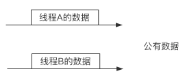

[toc]

# threading.local()

threading.local()方法可以让每个线程都拥有一些自己独立的数据，这些数据是其他线程访问不到的。

如图所示：



或者用另外一种更形象的比喻更加的贴切，将一个进程比喻成一个公司，该进程下的线程比喻成公司的员工，而将threading.local()比喻为公司的储物柜，每个员工都有一个单独的柜格，且每个员工也只能访问自己的柜格。


那么这个东西到底有什么作用？举个例子，当你使用迅雷进行多线程下载时，每个线程的下载进度是不一样的，那么这个下载进度如何进行存储就显得尤为重要。

数据的存储一定是方便数据的取出，存储结构做的好，查找取出数据的速度才会更快。

threading.local()的设计思想其实在flask框架的上下文管理机制中也会体现到，两者基本如出一辙，所以现在了解threading.local()的原理后对flask框架的源码阅读也会变得轻松。

# 基本使用

下面是基本使用，使用步骤如下：

- 储物柜 = threading.local()
- 在线程下使用 储物柜.物品名称 = 物品 即可，以后对于该物品只有该线程可以获取
- 获取或者使用时，直接使用 储物柜.物品名称 即可，若要获取的物品不是该线程存放的，则会抛出异常

```python
import threading


def jack(article):
    locker.rose = article
    print(locker.rose)  # 正常取出
    print(locker.food)  # 抛出异常


def ken(article):
    locker.food = article
    print(locker.food)  # 正常取出
    print(locker.rose)  # 抛出异常


if __name__ == "__main__":
    locker = threading.local()
    jackTask = threading.Thread(target=jack, args=("rose",))
    kenTask = threading.Thread(target=ken, args=("food",))
    jackTask.start()
    kenTask.start()

# rose
# AttributeError: '_thread._local' object has no attribute 'food'

# food
# AttributeError: '_thread._local' object has no attribute 'rose'

```

# 原理分析

我们可以自己做一个全局字典，来实现类似的功能，字典格式如下：

```python
locker = {
    "线程ID" : {"物品名称" : "物品本身"},
    "线程ID" : {"物品名称" : "物品本身"},
    "线程ID" : {"物品名称" : "物品本身"},
}

```

```python
import threading


def task(article):
    thId = threading.get_ident()
    
    # 开始存放东西
    locker[thId] = {
        "rose": article
    }
    
    # 取出东西
    print(locker[thId]["rose"])


if __name__ == "__main__":
    locker = {}
    subThreadIns = threading.Thread(target=task, args=("rose",))
    subThreadIns.start()

# rose

```

# 代码优化

上面这样存取东西是不是显得特别麻烦？所以我们可以定义一个类，让这个储物柜的操作变的更加简单。

如下所示：

```python
import threading


class Locker:
    locker = {}

    def __getattr__(self, name):
        """当试图使用.访问对象属性且找不到该属性时触发该方法"""
        ident = threading.get_ident()
        return __class__.locker[ident][name]

    def __setattr__(self, name, value):
        """当试图使用.修改或添加对象属性时触发该方法"""
        ident = threading.get_ident()

        if ident not in __class__.locker:
            __class__.locker[ident] = {}

        __class__.locker[ident].update({name: value})


def task(article):
    # 开始存放东西
    locker.rose = article
    print(locker.rose)


if __name__ == "__main__":
    locker = Locker()
    subThreadIns = threading.Thread(target=task, args=("rose",))
    subThreadIns.start()

# rose

```

