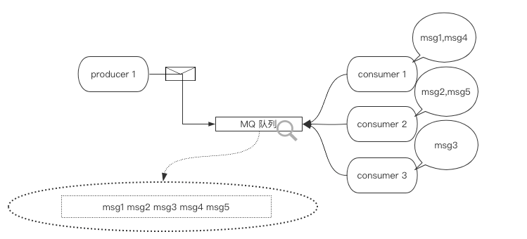

[toc]

# 生产者消费者模型

生产者消费者模型是一种设计思想，生产者生产出产品，消费者对产品进行消费。

但是他们之间不直接进行接触，而是通过中间件进行产品交易，这样做的好处是降低生产者与消费者之间的耦合度，使他们没有强制的关联。

如下图所示，当生产者生产出产品后会将产品放入中间件中，消费者监听中间件当中间件状态一旦发生变化后就立即获取出产品并消费：



# 多线程实现

下面将采用多线程实现生产者与消费者模型，需要借助queue.Queue()作为中间件：

```python
import threading
import queue
import time


def producer():
    thName = threading.current_thread().name
    product = 0
    while 1:
        time.sleep(3)
        q.put(product)
        print("%s create %s" % (thName, product))
        product += 1


def consumer():
    thName = threading.current_thread().name
    while 1:
        product = q.get()
        print("%s get %s" % (thName, product))


if __name__ == "__main__":
    q = queue.Queue(maxsize=5)

    producerSubThread = threading.Thread(target=producer, name="producer")
    producerSubThread.start()

    for i in range(3):
        consumerSubThread = threading.Thread(
            target=consumer, name="consumer - %s" % i)
        consumerSubThread.start()

```

首先生产者会每隔3s生产出一个产品，然后将产品放入q队列中，消费者们会不断的从q队列中取出产品。