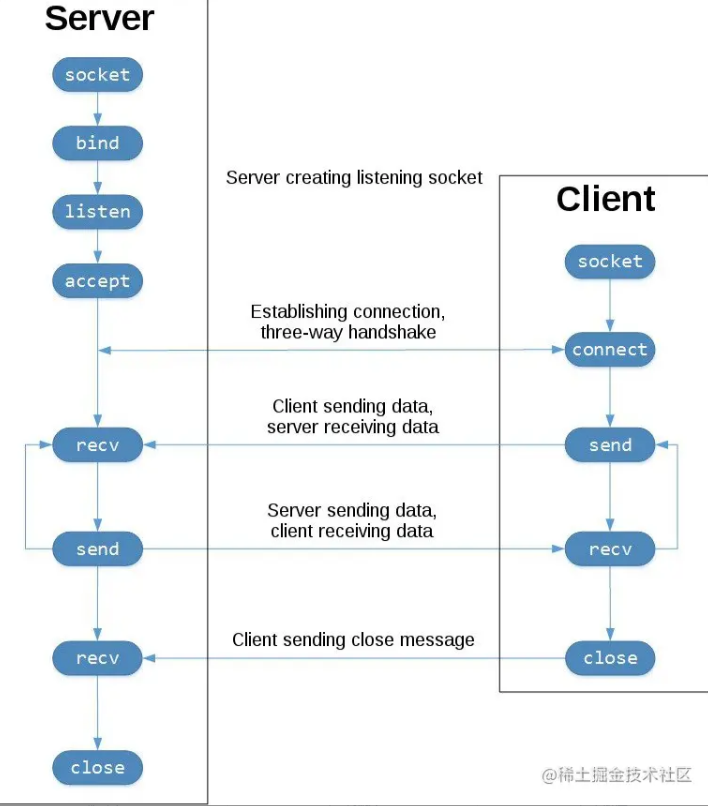
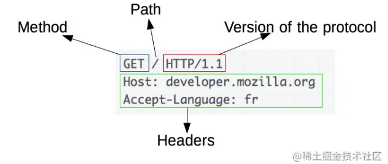

[toc]

 python web开发中http请求的处理流程通常是: web-browser , web-server , wsgi 和 web-application四个环节

此为 web-server


## 1. http-server 相关代码结构


本次代码阅读使用的python **3.6.5** 以上版本，有python环境即可（winddows和mac等系统在select部分会有差异），涉及的代码有:


| 文件            | 描述                                                |
| --------------- | --------------------------------------------------- |
| socket.py       | socket的API                                         |
| select.py       | select.py是stub文件，提供多路复用的异步IO的底层实现 |
| selectors.py    | 对select的高层实现，推荐使用                        |
| socketserver.py | tcpserver/udpserver等默认实现                       |
| http/server.py  | 一个简单的http服务实现                              |
| http/client.py  | 简单的http客户端                                    |

## 2. socket


socket对象的创建:

```python
class socket(_socket.socket):
    """A subclass of _socket.socket adding the makefile() method."""
    __slots__ = ["__weakref__", "_io_refs", "_closed"]
    def __init__(self, family=AF_INET, type=SOCK_STREAM, proto=0, fileno=None):
        _socket.socket.__init__(self, family, type, proto, fileno)
        self._io_refs = 0
        self._closed = False
    def __enter__(self):
        return self
    def __exit__(self, *args):
        if not self._closed:
            self.close()
```


从socket类可以看到:

- `__slots__ `可以优化对象
- `__enter__ 和 __exit__ `可以让socket对象当上下文使用
- family和type是两个非常重要的参数，决定了socket的资源类型。family常见有：AF_INET IPV4的协议，AF_INET6 IPV6协议；type常见有TCP协议的SOCK_STREAM和UPD协议的SOCK_DGRAM可用。


socket的api比较多，可以从socket.py或者_socket.py看到，我们重点关注下图中TCP Socket Flow涉及到的api。



其它的api都由底层实现，除了accept。acecept函数是运行在服务端，接受一个新的进来新生成一个socket对象，用来代表这个新的连接。

```python
def accept(self):
    fd, addr = self._accept  # 获取到本地的文件描述符和远程连接的地址
    type = self.type & ~globals().get("SOCK_NONBLOCK", 0)
    sock = socket(self.family, type, self.proto, fileno=fd)  # 封装新的socket并返回
    if getdefaulttimeout() is None and self.gettimeout():
        sock.setblocking(True)
    return sock, addr
```

socket代码中还提供了SocketIO类，示例如何包装socket进行读写操作:

```python
class SocketIO(io.RawIOBase):
    def __init__(self, sock, mode):
        if mode not in ("r", "w", "rw", "rb", "wb", "rwb"):  # socket也是文件，有读写等模式
            raise ValueError("invalid mode: %r" % mode)
        io.RawIOBase.__init__(self)
        self._sock = sock
        if "b" not in mode:
            mode += "b"  # socket是基于二进制
        self._mode = mode
        self._reading = "r" in mode  # 读判定 
        self._writing = "w" in mode  # 写判定
        
    def readinto(self, b):  # 从socket读取数据到指定的buffer
        return self._sock.recv_into(b)
            
    def write(self, b): # 写入数据到socket
        return self._sock.send(b)
```

### 2.1 socket示例

这是2组示例，分别演示了使用socket实现tcp和udp协议收发数据。

```python
# tcp-server
import socket
HOST = '127.0.0.1'
PORT = 65432
with socket.socket(family=socket.AF_INET, type=socket.SOCK_STREAM) as s:
    s.bind((HOST, PORT))
    s.listen()
    conn, addr = s.accept()
    with conn:
        print('Connected by', addr)
        while True:
            data = conn.recv(1024)
            if not data:
                break
            print("recv data", data, len(data))
            conn.sendall(data)
```

tcp-server的socket有bind，listen和accept三个过程，使用recv接收数据，使用sendall发送数据。tcp-client需要connect到服务端。

```python
# tcp-client
import socket
HOST = '127.0.0.1'  # The server's hostname or IP address
PORT = 65432  # The port used by the server
with socket.socket(family=socket.AF_INET, type=socket.SOCK_STREAM) as sock:
    sock.connect((HOST, PORT))
    sock.sendall(b'Hello, world')
    data = sock.recv(1024)
    print('Received', repr(data))
```

tcp示例的输出日志：

```python
# tcp-server
Connected by ('127.0.0.1', 64203)
recv data b'Hello, world' 12
# tcp-client
Received b'Hello, world'
```

udp协议下server和client都简单一些，没有listen和accept的过程:

```python
# udp-sever
import socket
HOST = 'localhost'
PORT = 65432
with socket.socket(family=socket.AF_INET, type=socket.SOCK_DGRAM) as sock:  # type不一样
    # Bind the socket to the port
    sock.bind((HOST, PORT))
    while True:
        data, address = sock.recvfrom(4096)  # 直接接收数据
        print("recv data", data, address)
        if data:
            sock.sendto(data, address)  #  sendto 发送到制定地址
# udp-client
import socket
HOST = '127.0.0.1'  # Standard loopback interface address (localhost)
PORT = 65432  # Port to listen on (non-privileged ports are > 1023)
# Create a UDP socket
with socket.socket(family=socket.AF_INET, type=socket.SOCK_DGRAM) as sock:
    # Send data
    sock.sendto(b'Hello, world', (HOST, PORT))
    # Receive response
    data, server = sock.recvfrom(4096)
    print("recv data", data, server)
```

udp示例的日志:

```python
# udp-server
recv data b'Hello, world' ('127.0.0.1', 55429)
# udp-client
recv data b'Hello, world' ('127.0.0.1', 65432)
```

## 3. selector

前面示例中，服务端只能够处理一个连接的读写，不满足同时服务多个连接的需求。同时多个客户端连接，要在客户端连接之间切换，这就需要select。下面内容来自官方的中文文档:

```python
select.select(rlist, wlist, xlist[, timeout])
这是一个明白直观的 Unix select() 系统调用接口。 前三个参数是由‘可等待对象’组成的序列：可以是代表文件描述符的整数，或是带有名为 fileno() 的返回这样的整数的无形参方法的对象:
rlist：等待，直到可以开始读取
wlist：等待，直到可以开始写入
xlist：等待“异常情况”（请参阅当前系统的手册，以获取哪些情况称为异常情况）
允许空的可迭代对象，但是否接受三个空的可迭代对象则取决于具体平台。 （已知在 Unix 上可行但在 Windows 上不可行。） 可选的 timeout 参数以一个浮点数表示超时秒数。 当省略 timeout 参数时该函数将阻塞直到至少有一个文件描述符准备就绪。 超时值为零表示执行轮询且永不阻塞。
返回值是三个列表，包含已就绪对象，返回的三个列表是前三个参数的子集。当超时时间已到且没有文件描述符就绪时，返回三个空列表。
可迭代对象中可接受的对象类型有 Python 文件对象 (例如 sys.stdin 以及 open() 或 os.popen() 所返回的对象)，由 socket.socket() 返回的套接字对象等。 你也可以自定义一个 wrapper 类，只要它具有适当的 fileno() 方法（该方法要确实返回一个文件描述符，而不能只是一个随机整数）。
```

我们可以简单理解为select是个事件中心，管理多个连接，接受系统网络调用，派发不同的读写事件通知应用程序。select具体的应用还是看selector中的高层次API。

### 3.1 selector的实现

selector定义的读和写事件:

```python
EVENT_READ = (1 << 0)
EVENT_WRITE = (1 << 1)
```

使用可命名元祖定义SelectorKey：

```python
def _fileobj_to_fd(fileobj):
    if isinstance(fileobj, int):
        fd = fileobj
    else:
        try:
            fd = int(fileobj.fileno())  # 获取文件描述符
        except (AttributeError, TypeError, ValueError):
            raise ValueError("Invalid file object: "
                             "{!r}".format(fileobj)) from None
    if fd < 0:
        raise ValueError("Invalid file descriptor: {}".format(fd))
    return fd
SelectorKey = namedtuple('SelectorKey', ['fileobj', 'fd', 'events', 'data'])
```

`BaseSelector`是元类，要求所有子类必须实现register,unregister和select方法:

```python
class BaseSelector(metaclass=ABCMeta):
    @abstractmethod
    def register(self, fileobj, events, data=None):
        raise NotImplementedError
    
    @abstractmethod
    def unregister(self, fileobj):
        raise NotImplementedError
    
    @abstractmethod
    def select(self, timeout=None):
        raise NotImplementedError
    ...
```

register和unregister的实现看起来也比较简单，就是使用字典管理对应的SelectorKey对象。

```python
class _BaseSelectorImpl(BaseSelector):
    
    def __init__(self):
        # this maps file descriptors to keys
        self._fd_to_key = {}
        # read-only mapping returned by get_map()
        self._map = _SelectorMapping(self)
        
    def register(self, fileobj, events, data=None):
        key = SelectorKey(fileobj, self._fileobj_lookup(fileobj), events, data)
        self._fd_to_key[key.fd] = key
        return key
    
    def unregister(self, fileobj):
        key = self._fd_to_key.pop(self._fileobj_lookup(fileobj))
        return key
```

不同的操作系统有不同的select实现 ：

```python
class SelectSelector(_BaseSelectorImpl):
    """Select-based selector."""
    
if hasattr(select, 'poll'):
    class PollSelector(_BaseSelectorImpl):
        """Poll-based selector."""
        
if hasattr(select, 'epoll'):
    class EpollSelector(_BaseSelectorImpl):
        """Epoll-based selector."""
        
if hasattr(select, 'devpoll'):
    class DevpollSelector(_BaseSelectorImpl):
        """Solaris /dev/poll selector."""
        
if hasattr(select, 'kqueue'):
    class KqueueSelector(_BaseSelectorImpl):
        """Kqueue-based selector."""
# Choose the best implementation, roughly:
#    epoll|kqueue|devpoll > poll > select.
if 'KqueueSelector' in globals():
    DefaultSelector = KqueueSelector
elif 'EpollSelector' in globals():
    DefaultSelector = EpollSelector
elif 'DevpollSelector' in globals():
    DefaultSelector = DevpollSelector
elif 'PollSelector' in globals():
    DefaultSelector = PollSelector
else:
    DefaultSelector = SelectSelector
```

注释中给出了效率高低排序 epoll|kqueue|devpoll > poll > select 。我们学习一下最简单的SelectSelector，额外使用了2个集合管理所持有的fileobj：

```python
class SelectSelector(_BaseSelectorImpl):
    """Select-based selector."""
    def __init__(self):
        super().__init__()
        self._readers = set()
        self._writers = set()
    def register(self, fileobj, events, data=None):
        key = super().register(fileobj, events, data)
        if events & EVENT_READ:
            self._readers.add(key.fd)
        if events & EVENT_WRITE:
            self._writers.add(key.fd)
        return key
    def unregister(self, fileobj):
        key = super().unregister(fileobj)
        self._readers.discard(key.fd)
        self._writers.discard(key.fd)
        return key
```

重点是select函数对_select的封装:

```python
_select = select.select
    
    def select(self, timeout=None):
        timeout = None if timeout is None else max(timeout, 0)
        ready = []
        try:
            r, w, _ = self._select(self._readers, self._writers, [], timeout)
        except InterruptedError:
            return ready
        r = set(r)
        w = set(w)
        for fd in r | w:
            events = 0
            if fd in r:
                events |= EVENT_READ
            if fd in w:
                events |= EVENT_WRITE
            key = self._fd_to_key[fd]
            if key:
                ready.append((key, events & key.events))
        return ready  # 就绪的对象
```

至于更高效的epoll，pool的实现，只是内部实现有区别，可以以后再理解，一般情况下应用使用DefaultSelector的API，由系统自动选择最高效的方式。

### 3.2 selecotr示例

使用selector实现的可以支持多个客户端链接的server:

```python
# multi-server
import socket
import selectors
HOST = '127.0.0.1'
PORT = 65432
sel = selectors.DefaultSelector()
def accept(sock, mask):  # 接受新连接
    conn, addr = sock.accept()  # Should be ready
    print('accepted', conn, 'from', addr)
    conn.setblocking(False)
    sel.register(conn, selectors.EVENT_READ, read)  # 继续加入selector
def read(conn, mask):  # 读取数据
    data = conn.recv(1000)  # Should be ready
    if data:
        print('echoing', repr(data), 'to', conn)
        conn.send(data)  # Hope it won't block
    else:
        print('closing', conn)
        sel.unregister(conn)
        conn.close()
serverd = socket.socket(socket.AF_INET, socket.SOCK_STREAM)
serverd.bind((HOST, PORT))
serverd.listen(100)
serverd.setblocking(False)  # 非阻塞
sel.register(serverd, selectors.EVENT_READ, accept)  # 只注册read事件
while True:  # 无限循环持续监听
    events = sel.select()
    for key, mask in events:
        callback = key.data
        callback(key.fileobj, mask)
```

客户端和之前的tcp-client类似，只是为了方便手动操作多开，增加了休眠时间:

```python
# multi-client
import socket
import time
HOST = '127.0.0.1'  # The server's hostname or IP address
PORT = 65432  # The port used by the server
with socket.socket(family=socket.AF_INET, type=socket.SOCK_STREAM) as sock:
    sock.connect((HOST, PORT))
    for x in range(10):
        sock.sendall(b'Hello, world')
        data = sock.recv(1024)
        print('Received', repr(data))
        time.sleep(1)
```

开启服务端后，可以开多个客户端，观察服务端的日志:

```python
accepted <socket.socket fd=5, family=AddressFamily.AF_INET, type=SocketKind.SOCK_STREAM, proto=0, laddr=('127.0.0.1', 65432), raddr=('127.0.0.1', 63288)> from ('127.0.0.1', 63288)
echoing b'Hello, world' to <socket.socket fd=5, family=AddressFamily.AF_INET, type=SocketKind.SOCK_STREAM, proto=0, laddr=('127.0.0.1', 65432), raddr=('127.0.0.1', 63288)>
echoing b'Hello, world' to <socket.socket fd=5, family=AddressFamily.AF_INET, type=SocketKind.SOCK_STREAM, proto=0, laddr=('127.0.0.1', 65432), raddr=('127.0.0.1', 63288)>
accepted <socket.socket fd=6, family=AddressFamily.AF_INET, type=SocketKind.SOCK_STREAM, proto=0, laddr=('127.0.0.1', 65432), raddr=('127.0.0.1', 63295)> from ('127.0.0.1', 63295)
echoing b'Hello, world' to <socket.socket fd=6, family=AddressFamily.AF_INET, type=SocketKind.SOCK_STREAM, proto=0, laddr=('127.0.0.1', 65432), raddr=('127.0.0.1', 63295)>
echoing b'Hello, world' to <socket.socket fd=5, family=AddressFamily.AF_INET, type=SocketKind.SOCK_STREAM, proto=0, laddr=('127.0.0.1', 65432), raddr=('127.0.0.1', 63288)>
...
echoing b'Hello, world' to <socket.socket fd=6, family=AddressFamily.AF_INET, type=SocketKind.SOCK_STREAM, proto=0, laddr=('127.0.0.1', 65432), raddr=('127.0.0.1', 63295)>
closing <socket.socket fd=5, family=AddressFamily.AF_INET, type=SocketKind.SOCK_STREAM, proto=0, laddr=('127.0.0.1', 65432), raddr=('127.0.0.1', 63288)>
echoing b'Hello, world' to <socket.socket fd=6, family=AddressFamily.AF_INET, type=SocketKind.SOCK_STREAM, proto=0, laddr=('127.0.0.1', 65432), raddr=('127.0.0.1', 63295)>
closing <socket.socket fd=6, family=AddressFamily.AF_INET, type=SocketKind.SOCK_STREAM, proto=0, laddr=('127.0.0.1', 65432), raddr=('127.0.0.1', 63295)>
```

## 4. socketserver

socketserver注释非常的详尽，是理解socketserver代码的最好帮助。比如下面这段，直观的介绍了socketserver的结构，我们重点关注TCPServer的实现。

```python
+------------+
        | BaseServer |
        +------------+
              |
              v
        +-----------+        +------------------+
        | TCPServer |------->| UnixStreamServer |
        +-----------+        +------------------+
              |
              v
        +-----------+        +--------------------+
        | UDPServer |------->| UnixDatagramServer |
        +-----------+        +--------------------+
```

### 4.1 TCPServer

BaseServer定义了一个基础的socket服务模型, 接收服务参数和客户端类后初始化对象，使用serve_forever持续的监听连接，约定对请求的处理流程:

```python
class BaseServer:
    def __init__(self, server_address, RequestHandlerClass):
        self.server_address = server_address
        self.RequestHandlerClass = RequestHandlerClass
        ...
    
    def serve_forever(self, poll_interval=0.5):
        with selectors.SelectSelector() as selector:
            selector.register(self, selectors.EVENT_READ)
            while not self.__shutdown_request:
                ready = selector.select(poll_interval)
                if ready:
                    self._handle_request_noblock()
    def _handle_request_noblock(self):
        try:
            request, client_address = self.get_request()  # 子类实现
        except OSError:
            return
        
        self.RequestHandlerClass(request, client_address, self)  # 分层由客户端请求类实现具体需求
        self.close_request(request)  # 子类实现
```

TCPServer就是按TCP协议实现bind，listen和accept

```python
class TCPServer(BaseServer):
    
    address_family = socket.AF_INET
    socket_type = socket.SOCK_STREAM
    
    request_queue_size = 5
    def __init__(self, server_address, RequestHandlerClass, bind_and_activate=True):
        """Constructor.  May be extended, do not override."""
        BaseServer.__init__(self, server_address, RequestHandlerClass)
        self.socket = socket.socket(self.address_family,
                                    self.socket_type)
        if bind_and_activate:
            try:
                self.server_bind()
                self.server_activate()
            except:
                self.server_close()
                raise
                
    def server_bind(self):
        self.socket.bind(self.server_address)
        self.server_address = self.socket.getsockname()
    def server_activate(self):
        self.socket.listen(self.request_queue_size)
    
    def get_request(self):
        return self.socket.accept()
```

### 4.2 ThreadingMixIn

ThreadingMixIn也很重要，展示了使用多线程方式提供服务:

```python
class ThreadingMixIn:
    """Mix-in class to handle each request in a new thread."""
    def process_request_thread(self, request, client_address):
        try:
            self.finish_request(request, client_address) # 回到父类的标准实现
        except Exception:
            self.handle_error(request, client_address)
        finally:
            self.shutdown_request(request)
    def process_request(self, request, client_address):
        """Start a new thread to process the request."""
        t = threading.Thread(target = self.process_request_thread,
                             args = (request, client_address))  # 使用新线程处理请求
        t.daemon = self.daemon_threads
        t.start()
```

### 4.3 RequestHandler

请求逻辑由RequestHandler处理，基础类是BaseRequestHandler，定义了请求处理的主要流程 setup -> handler -> finish :

```python
class BaseRequestHandler:
    def __init__(self, request, client_address, server):
        self.request = request
        self.client_address = client_address
        self.server = server
        self.setup()  # 子类实现
        try:
            self.handle()  # 子类实现
        finally:
            self.finish()  # 子类实现
```

tcp方式的处理StreamRequestHandler， 主要就是对connection(socket)进行了包装:

```python
class StreamRequestHandler(BaseRequestHandler):
    rbufsize = -1
    wbufsize = 0 
    
    def setup(self):
        self.connection = self.request
        self.rfile = self.connection.makefile('rb', self.rbufsize)  # 包装读
        if self.wbufsize == 0:
            self.wfile = _SocketWriter(self.connection)  # 包装写
        ...
    def finish(self):
        if not self.wfile.closed:
            self.wfile.flush()
        self.wfile.close()
        self.rfile.close()
class _SocketWriter(BufferedIOBase):
    def __init__(self, sock):
        self._sock = sock
    def write(self, b):  # 写入数据
        self._sock.sendall(b)
        with memoryview(b) as view:
            return view.nbytes
```

最重要的handler却留白了，等待应用程序的实现。

## 5. http-server

经过socket， selector和tcpserver三关，总算进入了我们的主题 `http-server`, 可以使用下面方式启动一个简单的http服务:

```python
python3 -m http.server
Serving HTTP on :: port 8000 (http://[::]:8000/) ...
```

我把启动过程梳理成下面代码:

```python
HandlerClass = SimpleHTTPRequestHandler  # 定义RequestHandler类
HandlerClass.protocol_version = "HTTP/1.0"  # http协议版本
with ThreadingHTTPServer(addr, HandlerClass) as httpd:  # 创建http服务
    host, port = httpd.socket.getsockname()[:2]
    url_host = f'[{host}]' if ':' in host else host
    print(
        f"Serving HTTP on {host} port {port} "
        f"(http://{url_host}:{port}/) ..."
    )
    httpd.serve_forever()  # 启动服务
```

得益于之前良好的封装ThreadingHTTPServer的实现非常简单，不用再介绍:

```python
class HTTPServer(socketserver.TCPServer):
    def server_bind(self):
        """Override server_bind to store the server name."""
        socketserver.TCPServer.server_bind(self)
        host, port = self.server_address[:2]
        self.server_name = socket.getfqdn(host)
        self.server_port = port
class ThreadingHTTPServer(socketserver.ThreadingMixIn, HTTPServer):
    daemon_threads = True  # 守护进程方式
    
```

### 5.1 HTTPRequestHandler

从HTTPServer可以知道http服务的实现主要在SimpleHTTPRequestHandler中。首先看其父类BaseHTTPRequestHandler：

```python
class BaseHTTPRequestHandler(socketserver.StreamRequestHandler):  # 继承自StreamRequestHandler，这不奇怪http服务是tcp服务的子集，对应的请求实现也应该是基于stream的。
    
    def handle(self):
        """Handle multiple requests if necessary."""
        self.close_connection = True
        self.handle_one_request()  # 处理一个请求
        while not self.close_connection:  # 用于keep-alive等场景
            self.handle_one_request()
```

BaseHTTPRequestHandler重点在实现StreamRequestHandler留白的handler方法(从名称上看就体现了http服务的特点，每个请求都是一次性的)。

```python
def handle_one_request(self):
    self.raw_requestline = self.rfile.readline(65537)  # 处理http协议头
    self.parse_request()  # 处理http头
    mname = 'do_' + self.command
    method = getattr(self, mname)
    method()  # 处理http协议方法
    self.wfile.flush()  # 响应请求 
```

在继续阅读代码之前，可以先简单了解一下http协议，使用curl访问一下我们的http服务：

```shell
curl -v http://127.0.0.1:8000
*   Trying 127.0.0.1...
* TCP_NODELAY set
* Connected to 127.0.0.1 (127.0.0.1) port 8000 (#0)
> GET / HTTP/1.1
> Host: 127.0.0.1:8000
> User-Agent: curl/7.64.1
> Accept: */*
>
* HTTP 1.0, assume close after body
< HTTP/1.0 200 OK
< Server: SimpleHTTP/0.6 Python/3.8.5
< Date: Wed, 27 Jan 2021 11:03:08 GMT
< Content-type: text/html; charset=utf-8
< Content-Length: 1570
<
<!DOCTYPE HTML PUBLIC "-//W3C//DTD HTML 4.01//EN" "http://www.w3.org/TR/html4/strict.dtd">
<html>
<head>
<meta http-equiv="Content-Type" content="text/html; charset=utf-8">
<title>Directory listing for /</title>
</head>
<body>
<h1>Directory listing for /</h1>
<hr>
<ul>
...
</ul>
<hr>
</body>
</html>
* Closing connection 0
```

日志中`>`开头的部分是请求，`<`开头的部分是响应，关于http协议的详解建议查看参考连接2。http请求的图示：



结合上图，我们可以知道我们的请求首行是 `GET / HTTP/1.1`, 下面还有一些header信息。回到代码parse_request的实现

```python
def parse_request(self):
    self.raw_requestline = self.rfile.readline(65537)
    
    # 协议校验
    requestline = str(self.raw_requestline, 'iso-8859-1')
    requestline = requestline.rstrip('\r\n')  
    self.requestline = requestline
    words = requestline.split()  # 分割
    if len(words) == 0 or len(words) >= 3: # 长度校验
        return False
    if len(words) >= 3:  # Enough to determine protocol version
        version = words[-1]
        if not version.startswith('HTTP/'):
            raise ValueError
                    
        base_version_number = version.split('/', 1)[1]
        version_number = base_version_number.split(".")
        if len(version_number) != 2:
            raise ValueError
            ...
    
    # 分离方法和路径
    command, path = words[:2]
    self.command, self.path = command, path
    
    # 解析http头
    self.headers = http.client.parse_headers(self.rfile, _class=self.MessageClass)
```

根据代码可以反推http协议的首行要求：使用空格分割的三元组，分别对应http方法，路径和http协议版本，其中http协议版本又需要使用HTTP关键字前缀和协议版本组成。继续解析剩下的http请求头:

```python
# http/client.py
def parse_headers(fp, _class=HTTPMessage):
    headers = []
    while True:
        line = fp.readline(_MAXLINE + 1) # 持续读取行数据
        if len(line) > _MAXLINE:
            raise LineTooLong("header line")
        headers.append(line)
        if len(headers) > _MAXHEADERS:
            raise HTTPException("got more than %d headers" % _MAXHEADERS)
        if line in (b'\r\n', b'\n', b''):  # 遇到空行完成读取
            break
    hstring = b''.join(headers).decode('iso-8859-1')
    return email.parser.Parser(_class=_class).parsestr(hstring)  # 解析封装头
```

http方法的实现逻辑在子类SimpleHTTPRequestHandler中：

```python
def do_GET(self):
        """Serve a GET request."""
        f = self.send_head()
        if f:
            try:
                self.copyfile(f, self.wfile)  # copy结果到socket的输出
            finally:
                f.close()
    
    def send_head(self):
        ...
        path = self.translate_path(self.path)
        f = None
        if os.path.isdir(path):
            ...
            return self.list_directory(path)
        ...
```

展示目录的输出:

```python
def list_directory(self, path):
        list = os.listdir(path)
        displaypath = urllib.parse.unquote(self.path,
                                               errors='surrogatepass')
        enc = sys.getfilesystemencoding()
        title = 'Directory listing for %s' % displaypath
        r.append('<!DOCTYPE HTML PUBLIC "-//W3C//DTD HTML 4.01//EN" '
                 '"http://www.w3.org/TR/html4/strict.dtd">')
        r.append('<html>\n<head>')
        r.append('<meta http-equiv="Content-Type" '
                 'content="text/html; charset=%s">' % enc)
        r.append('<title>%s</title>\n</head>' % title)
        r.append('<body>\n<h1>%s</h1>' % title)
        r.append('<hr>\n<ul>')
        for name in list:
            fullname = os.path.join(path, name)
            displayname = linkname = name
            # Append / for directories or @ for symbolic links
            if os.path.isdir(fullname):
                displayname = name + "/"
                linkname = name + "/"
            if os.path.islink(fullname):
                displayname = name + "@"
                # Note: a link to a directory displays with @ and links with /
            r.append('<li><a href="%s">%s</a></li>'
                    % (urllib.parse.quote(linkname,
                                          errors='surrogatepass'),
                       html.escape(displayname, quote=False)))
        r.append('</ul>\n<hr>\n</body>\n</html>\n')
        encoded = '\n'.join(r).encode(enc, 'surrogateescape')
        
        f = io.BytesIO()
        f.write(encoded)
        f.seek(0)
        self.send_response(HTTPStatus.OK)
        self.send_header("Content-type", "text/html; charset=%s" % enc)
        self.send_header("Content-Length", str(len(encoded)))
        self.end_headers()
        return f
```

可以看到list_directory进行了文件目录的操作，转换成html的文本后输出。同时设置http头及响应的处理:

```python
def send_response(self, code, message=None):
    self.send_response_only(code, message)
    self.send_header('Server', self.version_string())
    self.send_header('Date', self.date_time_string())
def send_response_only(self, code, message=None):
    """Send the response header only."""
    message = self.responses[code][0]
    self._headers_buffer.append(("%s %d %s\r\n" %
                (self.protocol_version, code, message)).encode(
                    'latin-1', 'strict'))  # 三段式回应 HTTP/1.0 200 OK
                        
def send_header(self, keyword, value):
    """Send a MIME header to the headers buffer."""
    if self.request_version != 'HTTP/0.9':
        if not hasattr(self, '_headers_buffer'):
            self._headers_buffer = []
        self._headers_buffer.append(
            ("%s: %s\r\n" % (keyword, value)).encode('latin-1', 'strict'))
def end_headers(self):
    """Send the blank line ending the MIME headers."""
    if self.request_version != 'HTTP/0.9':
        self._headers_buffer.append(b"\r\n")  # 隔开header和html
        self.flush_headers()
def flush_headers(self):
    if hasattr(self, '_headers_buffer'):
        self.wfile.write(b"".join(self._headers_buffer))  # 写入head信息
        self._headers_buffer = []
```

http状态的生成如下:

```python
responses = {
        v: (v.phrase, v.description)
        for v in HTTPStatus.__members__.values()
    }  # 列表推导式
class HTTPStatus(IntEnum):
    
    def __new__(cls, value, phrase, description=''):
        obj = int.__new__(cls, value)
        obj._value_ = value
        obj.phrase = phrase
        obj.description = description
        return obj
    
    OK = 200, 'OK', 'Request fulfilled, document follows'
```

http-server的主要流程已经梳理完成，还有很多实现的细节可以留到具体问题时候再进行研究。

## 小技巧

使用Mixin模式，可以很好的组织实现类，下面22组合形成了6个实现类:

```python
if hasattr(os, "fork"):
    class ForkingUDPServer(ForkingMixIn, UDPServer): pass
    class ForkingTCPServer(ForkingMixIn, TCPServer): pass
class ThreadingUDPServer(ThreadingMixIn, UDPServer): pass
class ThreadingTCPServer(ThreadingMixIn, TCPServer): pass
if hasattr(socket, 'AF_UNIX'):
    class UnixStreamServer(TCPServer):
        address_family = socket.AF_UNIX
    class UnixDatagramServer(UDPServer):
        address_family = socket.AF_UNIX
    class ThreadingUnixStreamServer(ThreadingMixIn, UnixStreamServer): pass
    class ThreadingUnixDatagramServer(ThreadingMixIn, UnixDatagramServer): pass
```

使用元类来强制子类的创建过程:

```python
class BaseSelector(metaclass=ABCMeta): # 元类
    @abstractmethod
    def register(self, fileobj, events, data=None):
        raise NotImplementedError
    
    @abstractmethod
    def unregister(self, fileobj):
        raise NotImplementedError
    
    @abstractmethod
    def select(self, timeout=None):
        raise NotImplementedError
```

