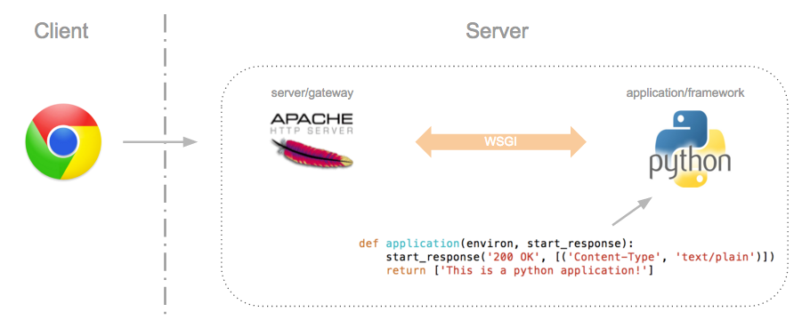
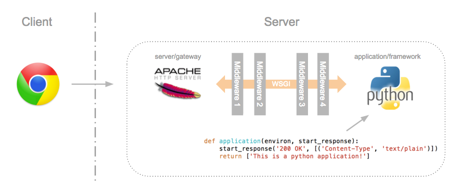

[toc]


https://zhuanlan.zhihu.com/p/64816513

https://www.cnblogs.com/-wenli/p/10884168.html

# 使用socket写一个简单的 web 服务器

使用socket搭建一个非常简单的服务器，你可以使用浏览器进行访问。

**v1版本：**

```python
import socket

# 创建socket
server = socket.socket(socket.AF_INET, socket.SOCK_STREAM)
server.setsockopt(socket.SOL_SOCKET, socket.SO_REUSEADDR, 1)
# 绑定ip 和端口
server.bind(('0.0.0.0', 8080))
# 开始监听
server.listen(1)

html = """
<html>
<head>
<title>simple server</title>
</head>
<body>
<p>hello world</p>
</body>
</html>
"""
length = len(html.encode())

# 这里也可以不设置Content-Length， 因为Connection 是close
# 具体缘由可以参考文章《来一波原生的http请求》
head = "HTTP/1.1 200 OK\r\nServer: simple server\r\n" \
       "Content-Type: text/html; charset=utf-8\r\n" \
       "Content-Length: {length}\r\nConnection: close\r\n\r\n"

head = head.format(length=length)

while True:
    # 等待客户端连接
    clientsocket, address = server.accept()
    # 接收客户端的数据
    data = clientsocket.recv(1024).decode()
    msg = head + html
    # 向客户端发送数据
    clientsocket.send(msg.encode())
    # 关闭连接
    clientsocket.close()

server.close()
```

**浏览器访问**

启动程序后，就可以在浏览器里输入url [http://localhost:8080/](https://link.zhihu.com/?target=http%3A//localhost%3A8080/) 得到的页面内容很简单，只有一个hello world

此时，只要url前面是[http://localhost:8080/](https://link.zhihu.com/?target=http%3A//localhost%3A8080/)，后面不管跟什么path，得到的结果都是相同的，这是因为我们的server太简单了，没有根据path返回对应的内容，为了让你更进一步的了解http请求时都发生了什么，接下来，我要修改这个server。

**v2版本：**

```python
import socket

# 创建socket
server = socket.socket(socket.AF_INET, socket.SOCK_STREAM)
server.setsockopt(socket.SOL_SOCKET, socket.SO_REUSEADDR, 1)
# 绑定ip 和端口
server.bind(('0.0.0.0', 8080))
# 开始监听
server.listen(1)


def get_path(data):
    index = data.find("\r\n")
    if index == -1:
        return ""
    first_line = data[:index]
    arrs = first_line.split()
    if len(arrs) != 3:
        return ""
    path = arrs[1]
    return path


def get_html_by_path(path):
    if path == '/':
        return get_index()
    elif path == "/name":
        return get_name()
    else:
        return get_404()

html_string = """
    <html>
    <head>
    <title>simple server</title>
    </head>
    <body>
    <p>{content}</p>
    </body>
    </html>
"""

head_string = "HTTP/1.1 {status}\r\nServer: simple server\r\n" \
           "Content-Type: text/html; charset=utf-8\r\n" \
           "Content-Length: {length}\r\nConnection: close\r\n\r\n"

def get_html(status, content):
    html = html_string.format(content=content)
    length = len(html.encode())
    head = head_string.format(status=status, length=length)
    return head + html

def get_404():
    return get_html('404 NOT FOUND', "你访问的资源不存在")

def get_name():
    return get_html("200 OK", "my name is sheng")

def get_index():
    return get_html("200 OK", "hello world")

while True:
    # 等待客户端连接
    clientsocket, address = server.accept()
    # 接收客户端的数据
    data = clientsocket.recv(1024).decode()
    path = get_path(data)

    msg = get_html_by_path(path)
    # 向客户端发送数据
    clientsocket.send(msg.encode())
    # 关闭连接
    clientsocket.close()

server.close()
```

# WSGI

**几个关于WSGI相关的概念**

```
WSGI：全称是Web Server Gateway Interface，WSGI不是服务器，python模块，框架，API或者任何软件，只是一种规范，描述web server如何与web application通信的规范。server和application的规范在PEP 3333中有具体描述。要实现WSGI协议，必须同时实现web server和web application，当前运行在WSGI协议之上的web框架有Torando,Flask,Django

uwsgi：与WSGI一样是一种通信协议，是uWSGI服务器的独占协议，用于定义传输信息的类型(type of information)，每一个uwsgi packet前4byte为传输信息类型的描述，与WSGI协议是两种东西，据说该协议是fcgi协议的10倍快。

uWSGI：是一个web服务器，实现了WSGI协议、uwsgi协议、http协议等。
```

[PEP 0333 – Python Web Server Gateway Interface](https://www.python.org/dev/peps/pep-0333) 是一种 [web server or gateway](https://en.wikipedia.org/wiki/Web_server) 和 python [web application or framework](https://en.wikipedia.org/wiki/Application_server) 之间简单通用的接口，符合这种接口的 application 可运行在所有符合该接口的 server 上。通俗的讲，WSGI 规范了一种简单的接口，解耦了 server 和 application，使得双边的开发者更加专注自身特性的开发。

 

**WSGI**协议主要包括**server**和**application**两部分：

- Web server/gateway: 即 HTTP Server，处理 HTTP 协议，接受用户 HTTP 请求和提供并发，调用 web application 处理业务逻辑。通常采用 C/C++ 编写，代表：apache, nginx 和 IIS。WSGI server负责从客户端接收请求，将request转发给application，将application返回的response返回给客户端；

- Python Web application/framework: WSGI application接收由server转发的request，处理请求，并将处理结果返回给server。application中可以包括多个栈式的中间件(middlewares)，这些中间件需要同时实现server与application，因此可以在WSGI服务器与WSGI应用之间起调节作用：对服务器来说，中间件扮演应用程序，对应用程序来说，中间件扮演服务器。

- ```
  WSGI协议其实是定义了一种server与application解耦的规范，即可以有多个实现WSGI server的服务器，也可以有多个实现WSGI application
  ```



## Application/Framework

Application/framework 端必须定义一个 callable object，callable object 可以是以下三者之一：

- function, method
- class
- instance with a `__call__ `method

Callable object 必须满足以下两个条件：

- 接受两个参数：字典(environ)，回调函数(start_response，返回 HTTP status，headers 给 web server)
- 返回一个可迭代的值

基于 callable function 的 application/framework 样例如下：

```python
def application(environ, start_response):
    start_response('200 OK', [('Content-Type', 'text/plain')])
    return ['This is a python application!']
```

基于 callable class 的 application/framework 样例如下：

```python
class ApplicationClass(object):
    def __init__(self, environ, start_response):
        self.environ = environ
        self.start_response = start_response
 
    def __iter__(self):
        self.start_response('200 OK', [('Content-type', 'text/plain')])
        yield "Hello world!n"
```

## Server/Gateway 

Server/gateway 端主要专注 HTTP 层面的业务，重点是接收 HTTP 请求和提供并发。每当收到 HTTP 请求，server/gateway 必须调用 callable object：

- 接收 HTTP 请求，但是不关心 HTTP url, HTTP method 等
- 为 [environ](https://www.python.org/dev/peps/pep-0333/#environ-variables) 提供必要的参数，实现一个回调函数 [start_response](https://www.python.org/dev/peps/pep-0333/#id21)，并传给 callable object
- 调用 callable object

我们直接使用支持 WSGI 框架的 [wsgiref](https://docs.python.org/2/library/wsgiref.html) 库，编写一个样例：

```
# application/framework side
def application(environ, start_response):
    start_response('200 OK', [('Content-Type', 'text/plain')])
    return ['This is a python application!']
 
# server/gateway side
if __name__ == '__main__':
    from wsgiref.simple_server import make_server
    server = make_server('0.0.0.0', 8080, application)
    server.serve_forever()
```

## Middleware: Components that Play Both Sides

 



Middleware 处于 server/gateway 和 application/framework 之间，对 server/gateway 来说，它相当于 application/framework；对 application/framework 来说，它相当于 server/gateway。每个 middleware 实现不同的功能，我们通常根据需求选择相应的 middleware 并组合起来，实现所需的功能。比如，可在 middleware 中实现以下功能：

- 根据 url 把用户请求调度到不同的 application 中。
- 负载均衡，转发用户请求
- 预处理 XSL 等相关数据
- 限制请求速率，设置白名单


WSGI 的 middleware 体现了 unix 的哲学之一：do one thing and do it well。事实上，在定义 WSGI 框架的时候，设计者就要求 server/gateway 和 application/framework 双方尽可能的简单，同时也要求 middleware 设计的简单而专一，PEP 333 提到：

> If middleware can be both simple and robust, and WSGI is widely available in servers and frameworks, it allows for the possibility of an entirely new kind of Python web application framework: one consisting of loosely-coupled WSGI middleware components.

本例实现了一个 IPBlacklist 的 middleware：

```python
class IPBlacklistMiddleware(object):
    def __init__(self, app):
        self.app = app
 
    def __call__(self, environ, start_response):
        ip_addr = environ.get('HTTP_HOST').split(':')[0]
        if ip_addr not in ('127.0.0.1'):
            return forbidden(start_response)
 
        return self.app(environ, start_response)
 
def forbidden(start_response):
    start_response('403 Forbidden', [('Content-Type', 'text/plain')])
    return [b'Forbidden']
 
def application(environ, start_response):
    start_response('200 OK', [('Content-Type', 'text/plain')])
    return [b'This is a python application!']
 
if __name__ == '__main__':
    from wsgiref.simple_server import make_server
    application = IPBlacklistMiddleware(application)
    server = make_server('0.0.0.0', 8080, application) #首先执行 application 的 __call__方法
    server.serve_forever()
```

测试如下：

```python
# 从本机测试
$ curl 127.0.0.1:8080/test
This is a python application!
 
# 从其它主机测测试
$ curl 10.10.10.2:8080/test                                        
Forbidden
```

## Path Dispatching

至此样例的一个不足之处是对于任意的 url 和 method，程序的返回值均为 ‘This is a python application!’，所以我们需要增加 path dispatch 功能。由于 WSGI 框架下的 server/gateway 不处理 url 和 method，所以 url mapping 需由 application/framework 端完成。注意到参数 [environ](https://www.python.org/dev/peps/pep-0333/#environ-variables)，它包含以下变量：

- REQUEST_METHOD: 即 HTTP method
- PATH_INFO: 即 HTTP url

所以 application/framework 可以根据 environ 的 REQUEST_METHOD 和 PATH_INFO 实现 path dispatch，样例如下：

```python
class IPBlacklistMiddleware(object):
    def __init__(self, app):
        self.app = app

    def __call__(self, environ, start_response):
        ip_addr = environ.get('HTTP_HOST').split(':')[0]
        if ip_addr not in ('127.0.0.1'):
            return forbidden(start_response)

        return self.app(environ, start_response)


def dog(start_response):
    start_response('200 OK', [('Content-Type', 'text/plain')])
    return [b'This is dog!']


def cat(start_response):
    start_response('200 OK', [('Content-Type', 'text/plain')])
    return [b'This is cat!']


def not_found(start_response):
    start_response('404 NOT FOUND', [('Content-Type', 'text/plain')])
    return [b'Not Found']


def forbidden(start_response):
    start_response('403 Forbidden', [('Content-Type', 'text/plain')])
    return [b'Forbidden']


def application(environ, start_response):
    path = environ.get('PATH_INFO', '').lstrip('/')
    mapping = {'dog': dog, 'cat': cat}

    call_back = mapping[path] if path in mapping else not_found
    return call_back(start_response)


if __name__ == '__main__':
    from wsgiref.simple_server import make_server

    application = IPBlacklistMiddleware(application)
    server = make_server('0.0.0.0', 8080, application)
    server.serve_forever()
```

测试如下：

```python
$ curl 127.0.0.1:8080/dog
This is dog!   

$ curl 127.0.0.1:8080/cat
This is cat!     

$ curl 127.0.0.1:8080/monkey
Not Found
```

