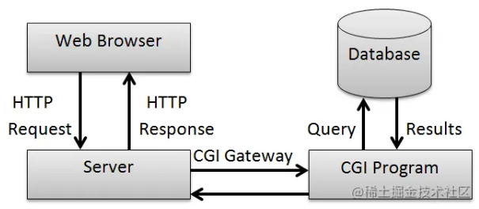
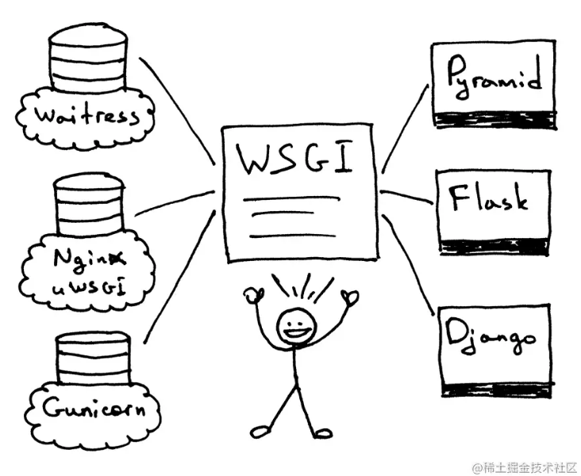
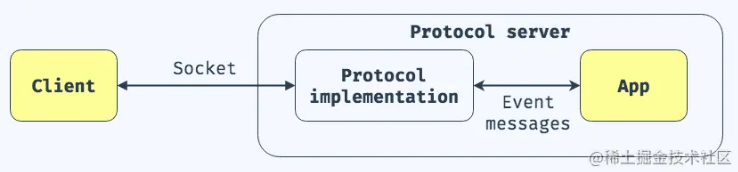
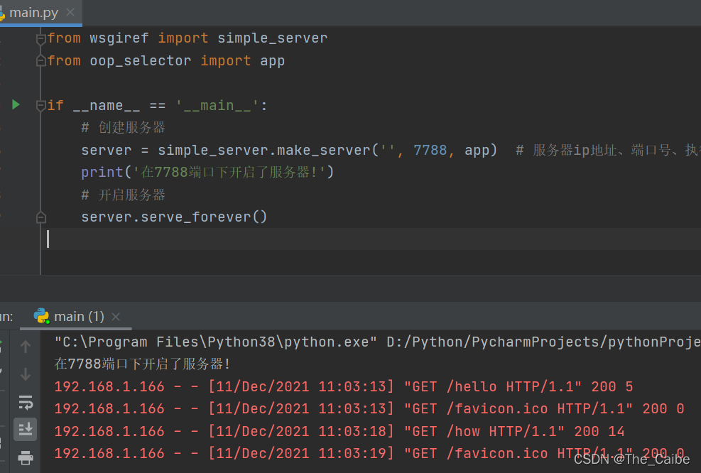

[toc]

 python web开发中http请求的处理流程通常是: web-browser , web-server , wsgi 和 web-application四个环节

此为 wsgi

## wsgi 相关概念

### CGI

CGI（**Common Gateway Interface**）通用网关接口。1993年由美国NCSA（National Center for Supercomputing Applications）发明。它具有简单易用、语言无关的特点。虽然今天已经少有人直接使用CGI进行编程，但它仍被主流的Web服务器，如Apache、IIS、Nginx等广泛支持。



CGI提供了一种接口规范，可以让应用程序, 一般是各种脚本语言，比如perl， php， python等来扩展web服务，让服务动态起来。

### WSGI

WSGI（**Web Server Gateway Interface**）web服务网关接口。是web服务和web应用程序之间的接口规范，在PEP3333中提出。



wsgi让应用程序和web服务之间解耦，应用程序只需要遵守规范，就可以在各种不同的web服务部署运行。比如上图中，基于flask/django实现的应用程序可以使用gunicorn部署，也可以使用nginx+uwsgi部署。

### ASGI

ASGI（**Asynchronous Server Gateway Interface**） 异步服务器网关接口。ASGI继承自wsgi，旨在在具有异步功能的Python Web服务器，框架和应用程序之间提供标准接口。ASGI具有WSGI向后兼容性实现以及多个服务器和应用程序框架。



wsgi中使用请求响应模型，每个请求可以同步获得一个响应。在ASGI中，请求的响应变成异步实现，一般用于websocket协议。(asgi的内容，涉及异步实现，本文就不多介绍)

## cgi 示例

单纯的概念理解比较难。下面我们配合示例一起来学习，先从CGI开始。

`http` 模块提供了一个简单的文件目录服务:

```shell
python3 -m http.server
Serving HTTP on :: port 8000 (http://[::]:8000/) ...
```

这个服务只有静态的展示功能，我们可以利用cgi扩展一个动态功能。

### cgi脚本

创建`cgi-bin`目录，这是CGI中约定的目录名称。然后编写 `hello.py`， 代码如下:

```python
#!/usr/bin/env python

import time
import sqlite3
import os

DB_FILE = "guests.db"

def init_db():
	conn = sqlite3.connect(DB_FILE)
	cursor = conn.cursor()
	# Create table
	cursor.execute('''CREATE TABLE "guests" (
	"id"	INTEGER,
	"ts"	INTEGER,
	PRIMARY KEY("id")
);''')
	# Save (commit) the changes
	conn.commit()
	# We can also close the connection if we are done with it.
	# Just be sure any changes have been committed or they will be lost.
	conn.close()

def update_total(ts):
	conn = sqlite3.connect(DB_FILE)
	cursor = conn.cursor()
	cursor.execute("select count(*) from guests")
	total = cursor.fetchone()[0]
	# Insert a row of data
	cursor.execute(f"INSERT INTO guests(ts) VALUES ({ts})")
	# Save (commit) the changes
	conn.commit()
	# We can also close the connection if we are done with it.
	# Just be sure any changes have been committed or they will be lost.
	conn.close()
	return total + 1

print('<html>')
print('<head>')
print('<meta charset="utf-8">')
print('<title>Hello Word！</title>')
print('</head>')
print('<body>')
print('<h2>Hello Python!</h2>')
if not os.path.exists(DB_FILE):
	init_db()
total = update_total(time.time())
print(f'total guest: {total}!')	
print('</body>')
print('</html>')
```

可以先测试脚本:


```
./hello.py
<html>
<head>
<meta charset="utf-8">
<title>Hello Word！</title>
</head>
<body>
<h2>Hello Python!</h2>
total guest: 4!
</body>
</html>
```

启动http.server中的cgi服务:

```
python -m http.server --cgi
```

注意后面的 `--cgi` 参数，让服务使用cgi-handler。启动后使用 **curl** 访问：

```
curl -v http://127.0.0.1:8000/cgi-bin/hello.py
*   Trying 127.0.0.1...
* TCP_NODELAY set
* Connected to 127.0.0.1 (127.0.0.1) port 8000 (#0)
> GET /cgi-bin/hello.py HTTP/1.1
> Host: 127.0.0.1:8000
> User-Agent: curl/7.64.1
> Accept: */*
>
* HTTP 1.0, assume close after body
< HTTP/1.0 200 Script output follows
< Server: SimpleHTTP/0.6 Python/3.8.5
< Date: Sun, 31 Jan 2021 13:09:29 GMT
< <html>
< <head>
< <meta charset="utf-8">
< <title>Hello Word！</title>
< </head>
< <body>
< <h2>Hello Python!</h2>
< total guest: 5!  # 访客数
< </body>
< </html>
* Closing connection 0
```

可以看到 **hello.py** 正确执行，访客数+1。因为数据存储在db中，重启服务仍然有效。

### cgi服务实现

cgi的实现，主要就是下面的代码:

```python
# http.server
class CGIHTTPRequestHandler(SimpleHTTPRequestHandler):
    def run_cgi(self):
        import subprocess
        cmdline = [scriptfile]
        if self.is_python(scriptfile):
            interp = sys.executable
            cmdline = [interp, '-u'] + cmdline
        if '=' not in query:
            cmdline.append(query)
        try:
            nbytes = int(length)
        except (TypeError, ValueError):
            nbytes = 0
        p = subprocess.Popen(cmdline,
                             stdin=subprocess.PIPE,
                             stdout=subprocess.PIPE,
                             stderr=subprocess.PIPE,
                             env = env
                             )
        if self.command.lower() == "post" and nbytes > 0:
            data = self.rfile.read(nbytes)
        # throw away additional data [see bug #427345]
        while select.select([self.rfile._sock], [], [], 0)[0]:
            if not self.rfile._sock.recv(1):
                break
        stdout, stderr = p.communicate(data)
        self.wfile.write(stdout)
        p.stderr.close()
        p.stdout.close()
        status = p.returncode
```

可见cgi的实现就是:

- 使用subprocess.Popen新开了一个进程去执行脚本

- 重定向脚本的输出到当前socket的wfile，也就是http请求的返回上

> 代码也验证了为什么需要授予 **hello.py** 的可执行权限。

从例子可以了解到http.server专注于提供http服务，app.py专注于业务功能，两者通过cgi进行衔接。

## wsgiref 代码测试

### 基本使用

```python
from wsgiref import simple_server


def app1(environment, start_response):
    # 3.执行函数app1,向服务器返回数据,服务器发送给对应客户端
    print(environment)
    # 状态行 响应头
    start_response('200 OK', [('Content-type', 'text/html')])

    content = 'Hello'
    return [content.encode('utf-8')]  # 返回内容(return可迭代对象，二进制内容)


# 1.创建服务器
server = simple_server.make_server('', 7788, app1)  # 服务器ip地址(''即默认本机地址)、端口号、执行函数(服务器默认向函数内传入两个参数)
print('在7788端口下开启了服务器!')
# 2.开启服务器
server.serve_forever()


```

### 引入webob处理数据

```python
from wsgiref import simple_server
from webob import Request, Response


# 3.执行函数
def app1(environment, start_response):
    # print(environment)
    # 引入webob中的Request处理请求头信息
    req = Request(environment)
    print(req)

    # 根据wsgi协议,返回数据为迭代器
    response = Response(body='how are you?')  # Response处理服务器发送给客户端的响应体数据
    # 返回Response处理好的响应体，附带客户端信息environment, start_response（Response自动添加返回数据的响应头）
    return response(environment, start_response)


# 1.创建服务器
server = simple_server.make_server('', 7788, app1)  # 服务器ip地址、端口号、执行函数(服务器默认向函数内传入两个参数)
print('在7788端口下开启了服务器!')
# 2.开启服务器
server.serve_forever()


```

### 客户端向服务器请求不同数据——Selector库（路由分发）

```python
from wsgiref import simple_server
from webob import Request, Response
from selector import Selector

# 4.执行函数
# 客户端请求/hello返回数据
def app1(environment, start_response):
    # print(environment)
    # 引入webob中的Request处理请求头信息
    req = Request(environment)
    print(req)

    # 根据wsgi协议,返回数据为迭代器
    response = Response(body='Hello')  # Response处理服务器发送给客户端的响应体数据
    # 返回Response处理好的响应体，附带客户端信息environment, start_response（Response自动添加返回数据的响应头）
    return response(environment, start_response)

# 客户端请求/how返回数据
def app2(environment, start_response):
    req = Request(environment)
    # print(req)
    response = Response(body='how are you?')  # Response处理服务器发送给客户端的响应体数据
    return response(environment, start_response)

# 浏览器自动请求的/favicon.ico,不返回数据
def app3(environment, start_response):
    req = Request(environment)
    # print(req)
    response = Response(body='')  # Response处理服务器发送给客户端的响应体数据
    return response(environment, start_response)

# 404页面返回数据
def app404(environment, start_response):
    req = Request(environment)
    # print(req)
    response = Response(body='404 Not Found!')  # Response处理服务器发送给客户端的响应体数据
    return response(environment, start_response)


# 3.路由分发-selector
app = Selector()
# 根据不同的请求,调用不同函数
app.add('/hello', GET=app1)  # 请求192.168.1.1/hello调用app1
app.add('/how', GET=app2)  # 请求.../how调用app2
app.add('/favicon.ico', GET=app3)  # 请求.../favicon.ico调用app3(这个请求是浏览器自带的请求)
app.status404 = app404  # 设置Selector().status404参数对应的函数,即返回404页面

# 1.创建服务器
server = simple_server.make_server('', 7788, app)  # 服务器ip地址、端口号、执行函数app(此时为Selector()对象)
print('在7788端口下开启了服务器!')
# 2.开启服务器
server.serve_forever()


```


### 重复代码处理——装饰器

```python
from wsgiref import simple_server
from webob import Request, Response
from selector import Selector

# 装饰器
def func_decorator(func):
    def inner_func(environment, start_response):
        # Request处理environment
        request = Request(environment)
        # 1.调用处理好的request传入func (即app1、app2、app3、...)
        # 2.接收func返回的body体
        response = func(request)
        # 3.返回服务器要发送出去的数据
        return response(environment, start_response)

    inner_func.__name__ = func.__name__
    inner_func.__doc__ = func.__doc__
	#  装饰器返回内部函数结果
    return inner_func
    
# 装饰器func_decorator包裹app1（路由分发调用app1实际是调用的包裹app1的装饰器，装饰器返回最终结果）
@func_decorator
def app1(request):
    return Response(body='Hello')
    
# 装饰器func_decorator包裹app2
@func_decorator
def app2(request):
    return Response(body='how are you?')
    
# 装饰器func_decorator包裹app3
@func_decorator
def app3(request):
    return Response(body='')
    
# 装饰器func_decorator包裹app404
@func_decorator
def app404(request):
    return Response(body='404 Not Found!')


# 3.路由分发-selector
app = Selector()
# 根据不同的请求,响应不同的页面
app.add('/hello', GET=app1)
app.add('/how', GET=app2)
app.add('/favicon.ico', GET=app3)
app.status404 = app404

# 1.创建服务器
server = simple_server.make_server('', 7788, app)  # 服务器ip地址、端口号、执行函数
print('在7788端口下开启了服务器!')
# 2.开启服务器
server.serve_forever()


```

### 封装&GET请求&POST请求




## wsgiref

wsgiref是python自带的wsgi的实现参考(reference), 主要代码结构:

| 文件                  | 描述               |
| --------------------- | ------------------ |
| handlers.py           | wsgi实现           |
| headers.py            | 管理http-header    |
| simple_server.py      | 支持wsgi的http服务 |
| util.py&&validator.py | 工具和验证器       |

`WSGIServer`的代码:

```python
class WSGIServer(HTTPServer):
    """BaseHTTPServer that implements the Python WSGI protocol"""
    application = None
    def server_bind(self):
        """Override server_bind to store the server name."""
        HTTPServer.server_bind(self)
        self.setup_environ()
    def setup_environ(self):  # 初始化环境变量
        # Set up base environment
        env = self.base_environ = {}
        env['SERVER_NAME'] = self.server_name
        env['GATEWAY_INTERFACE'] = 'CGI/1.1'
        env['SERVER_PORT'] = str(self.server_port)
        env['REMOTE_HOST']=''
        env['CONTENT_LENGTH']=''
        env['SCRIPT_NAME'] = ''
    def get_app(self):
        return self.application
    def set_app(self,application):  # 注入application的class，注意是class
        self.application = application
```

WSGIServer并不复杂，继承自http-server，接受application注入，就把web-server和we-application衔接起来。衔接后的动作，则是老规矩，交给HTTPRequestHandler去实现。同时wsgi服务多了一个准备env的动作，约定了一些wsgi的环境变量。

```python
class WSGIRequestHandler(BaseHTTPRequestHandler):
    server_version = "WSGIServer/" + __version__
    def get_environ(self):
        pass
    def handle(self):
        """Handle a single HTTP request"""
        self.raw_requestline = self.rfile.readline(65537)
        if len(self.raw_requestline) > 65536:
            ...
            self.send_error(414)
            return
        if not self.parse_request(): # An error code has been sent, just exit
            return
        handler = ServerHandler(
            self.rfile, self.wfile, self.get_stderr(), self.get_environ(),
            multithread=False,
        )  # 创建新的业务handler
        handler.request_handler = self      
        handler.run(self.server.get_app())  # 创建application对象
```

WSGIRequestHandler覆盖了handler，处理完成http协议(parse_request)后, 又做了四个动作:


- 创建environ
- 创建ServerHandler对象
- 创建app对象
- 运行app


environ处理主要是把http请求的header信息附带在wsgi-server的环境变量上:


```python
def get_environ(self):
    env = self.server.base_environ.copy()  # wsgi-server的环境变量
    env['SERVER_PROTOCOL'] = self.request_version
    env['SERVER_SOFTWARE'] = self.server_version
    env['REQUEST_METHOD'] = self.command
    
    ...
    
    host = self.address_string()
    if host != self.client_address[0]:
        env['REMOTE_HOST'] = host
    env['REMOTE_ADDR'] = self.client_address[0]
    if self.headers.get('content-type') is None:
        env['CONTENT_TYPE'] = self.headers.get_content_type()
    else:
        env['CONTENT_TYPE'] = self.headers['content-type']
    length = self.headers.get('content-length')
    if length:
        env['CONTENT_LENGTH'] = length
    for k, v in self.headers.items():
        k=k.replace('-','_').upper(); v=v.strip()
        if k in env:
            continue                    # skip content length, type,etc.
        if 'HTTP_'+k in env:
            env['HTTP_'+k] += ','+v     # comma-separate multiple headers
        else:
            env['HTTP_'+k] = v
    return env
```


ServerHandler对象的创建，接受输入/输出/错误，以及环境变量信息：


```python
class ServerHandler(BaseHandler):
    def __init__(self,stdin,stdout,stderr,environ,
        multithread=True, multiprocess=False
    ):
        self.stdin = stdin
        self.stdout = stdout
        self.stderr = stderr
        self.base_env = environ
        self.wsgi_multithread = multithread
        self.wsgi_multiprocess = multiprocess
    ...
```


重点在ServerHandler的run函数:


```python
class BaseHandler:
    def run(self, application):
    """Invoke the application"""
    # Note to self: don't move the close()!  Asynchronous servers shouldn't
    # call close() from finish_response(), so if you close() anywhere but
    # the double-error branch here, you'll break asynchronous servers by
    # prematurely closing.  Async servers must return from 'run()' without
    # closing if there might still be output to iterate over.
        ...
        self.setup_environ()
        self.result = application(self.environ, self.start_response)
        self.finish_response()
        ...
```


关键的3个步骤:


1. setup_environ 继续构建环境变量
2. 接受application处理http请求的返回
3. 完成http响应


setup_environ对env进行了进一步的包装，附带了请求的in/error，这样让使用env就可以对http请求进行读写。


```python
def setup_environ(self):
    """Set up the environment for one request"""
    env = self.environ = self.os_environ.copy()
    self.add_cgi_vars()  # 子类实现 self.environ.update(self.base_env)
    env['wsgi.input']        = self.get_stdin()  # 注意没有stdout
    env['wsgi.errors']       = self.get_stderr()
    env['wsgi.version']      = self.wsgi_version
    env['wsgi.run_once']     = self.wsgi_run_once
    env['wsgi.url_scheme']   = self.get_scheme()
    env['wsgi.multithread']  = self.wsgi_multithread
    env['wsgi.multiprocess'] = self.wsgi_multiprocess
    if self.wsgi_file_wrapper is not None:
        env['wsgi.file_wrapper'] = self.wsgi_file_wrapper
    if self.origin_server and self.server_software:
        env.setdefault('SERVER_SOFTWARE',self.server_software)
```


env的处理过程，可以理解成3步：1）附加server的运行信息 2）附加请求的http头(协议信息) 3）附加请求的流信息。env，可以换个说法就是http请求的所有上下文环境。


application还接收一个回调函数start_response，主要是按照http协议的规范，生成响应状态和response_header:


```python
def start_response(self, status, headers,exc_info=None):
    """'start_response()' callable as specified by PEP 3333"""
    self.status = status
    self.headers = self.headers_class(headers)
    status = self._convert_string_type(status, "Status")
    assert len(status)>=4,"Status must be at least 4 characters"
    assert status[:3].isdigit(), "Status message must begin w/3-digit code"
    assert status[3]==" ", "Status message must have a space after code"
    return self.write
```


application对请求的处理:


```python
def demo_app(environ,start_response):
    from io import StringIO
    stdout = StringIO()
    print("Hello world!", file=stdout)
    print(file=stdout)
    # http请求及环境
    h = sorted(environ.items())
    for k,v in h:
        print(k,'=',repr(v), file=stdout)
    # 回调写入http_status, response_headers
    start_response("200 OK", [('Content-Type','text/plain; charset=utf-8')])
    # 返回处理结果response_body
    return [stdout.getvalue().encode("utf-8")]
```


响应仍然由ServerHandler写入:


```python
def finish_response(self):
    if not self.result_is_file() or not self.sendfile():
        for data in self.result:
            self.write(data)
        self.finish_content()
```


可以使用下面命令测试这个流程:


```python
python -m wsgiref.simple_server
Serving HTTP on 0.0.0.0 port 8000 ...
127.0.0.1 - - [31/Jan/2021 21:43:05] "GET /xyz?abc HTTP/1.1" 200 3338
```


### wsgi 小结


简单小结wsgi的实现。在http请求的处理流程web-browser <-> web-server <-> wsgi <-> web-application中，体现了分层的思想，每层做不同的事情:


- web-server处理http/tcp协议，线程/进程的调度等底层实现
- wsgi承上启下，接受http请求，调用applicaiton处理请求，完成响应
- application处理上层业务逻辑


## 小技巧


在wsgiref代码中一样有各种小的技巧, 学习后可以让我们的代码更pythonic。


环境变量都这样设置:


```python
def setup_environ(self):
    # Set up base environment
    env = self.base_environ = {}
    env['SERVER_NAME'] = self.server_name
    env['GATEWAY_INTERFACE'] = 'CGI/1.1'
    ...
```


我之前大概都是这样写:


```python
def setup_environ(self):
    self.base_environ = {}
    self.base_environ['SERVER_NAME'] = self.server_name
    self.base_environ['GATEWAY_INTERFACE'] = 'CGI/1.1'
```


对比后，可以发现前面的写法更简洁一些。


比如流的持续写入:


```python
def _write(self,data):
    result = self.stdout.write(data)
    if result is None or result == len(data):
        return
    from warnings import warn
    warn("SimpleHandler.stdout.write() should not do partial writes",
        DeprecationWarning)
    while True:
        data = data[result:]  # 持续的写入，直到完成
        if not data:
            break
        result = self.stdout.write(data)
```


比如header的处理，实际上是把数组当作字典使用:


```python
class Headers:
    """Manage a collection of HTTP response headers"""
    def __init__(self, headers=None):
        headers = headers if headers is not None else []
        self._headers = headers  # 内部存储使用数组
    
    def __setitem__(self, name, val):
        """Set the value of a header."""
        del self[name]
        self._headers.append(
            (self._convert_string_type(name), self._convert_string_type(val)))
    ....
    def __getitem__(self,name):
        """Get the first header value for 'name'
        Return None if the header is missing instead of raising an exception.
        Note that if the header appeared multiple times, the first exactly which
        occurrence gets returned is undefined.  Use getall() to get all
        the values matching a header field name.
        """
        return self.get(name)
    def get(self,name,default=None):
        """Get the first header value for 'name', or return 'default'"""
        name = self._convert_string_type(name.lower())
        for k,v in self._headers:
            if k.lower()==name:
                return v
        return default
```


这样对 `Content-Type: application/javascript; charset=utf-8` 这样的值，可以使用下面方式使用:


```python
if self.headers.get('content-type') is None:
    env['CONTENT_TYPE'] = self.headers.get_content_type()
else:
    env['CONTENT_TYPE'] = self.headers['content-type']
```


为什么用数组，而不是用字典呢？我猜测是因为header的特性是数据多为读操作。