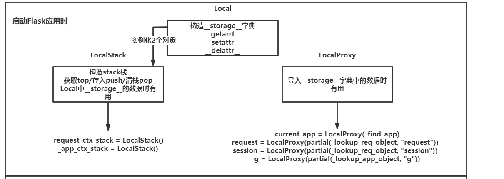
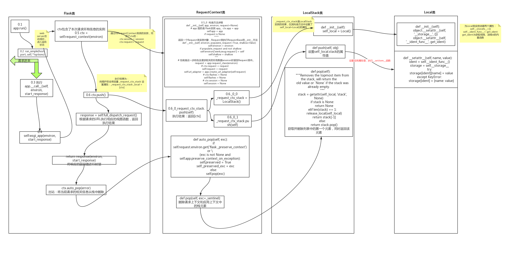
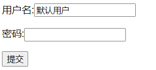

[toc]

https://www.cnblogs.com/Yunya-Cnblogs/p/14152745.html#_caption_1

# Flask简介

`Flask`是主流`PythonWeb`三大框架之一，其特点是短小精悍以及功能强大从而获得众多`Pythoner`的追捧，相比于`Django`它更加简单更易上手，`Flask`拥有非常强大的三方库，提供各式各样的模块对其本身进行扩充：

[Flask扩展模块](https://flask.palletsprojects.com/en/1.1.x/extensions/)

下面是`Flask`与`Django`本身的一些区别：

|                    | Flask      | Django         |
| ------------------ | ---------- | -------------- |
| 网关接口(WSGI)     | werkzeug   | wsgiref        |
| 模板语言(Template) | Jinja2     | DjangoTemplate |
| ORM                | SQLAlchemy | DjangoORM      |

下载`Flask`：

```shell
pip install flask
```

# werkzeug模块

`Flask`本质就是对`werkzeug`模块进行一些更高层次的封装，就如同`Django`是对`wsgiref`模块做了一些更高层次封装一样。所以先来看一下`werkzeug`模块如何使用：

```python
from werkzeug.wrappers import Request, Response
from werkzeug.serving import run_simple 


@Request.application
def index(request):
    return Response("Hello werkzeug")


if __name__ == '__main__':
    run_simple("localhost", 5000, index)
```

# 简单入门


## 基本使用

使用`Flask`的小案例：

```python
from flask import Flask
# 1.创建Flask对象实例，填入构造参数
app = Flask(__name__)

# 2.视图函数中书写route以及view
@app.route("/")
def index():
    return "Hello Flask!"

# 3.启动监听，等待链接请求  默认端口号：5000，可在run()时添加形参
if __name__ == '__main__':
    app.run()
    # app.run(Thread=True)  # 开启多线程  
```


## 构造参数

对于创建`Flask`实例对象，传入的构造参数有以下选项：

| 形参                     | 描述                                                         | 默认值    |
| ------------------------ | ------------------------------------------------------------ | --------- |
| import_name              | 为Flask对象取名，一般为`__name__`即可                        | 无        |
| static_url_path          | 模板中访问的静态文件存放目录，默认情况下与static_folder同名  | None      |
| static_folder            | 静态文件存放的目录名称，默认当前项目中的static目录           | static    |
| static_host              | 远程静态文件所用的Host地址                                   | None      |
| host_matching            | 如果不是特别需要的话,慎用,否则所有的route都需要host=""的参数 | False     |
| subdomain_matching       | SERVER_NAME子域名，暂时未GET到其作用                         | False     |
| template_folder          | template模板目录, 默认当前项目中的templates目录              | templates |
| instance_path            | 指向另一个Flask实例的路径                                    | None      |
| instance_relative_config | 是否加载另一个实例的配置                                     | False     |
| root_path                | 主模块所在的目录的绝对路径，默认项目目录                     | None      |

# Flask配置项

如同`Django`中的`settings.py`一样，在`Flask`中也拥有它自己的一些配置项。通过以下方式可对配置项进行修改。


## debug模式

一般来说对于`Flask`的开发模式都是用`app.debug=True`来完成的：

```ini
app = Flask(__name__)
app.debug = True
```

当然你也可以依照下面的方式进行修改。


## config修改

对`Flask`实例直接进行`config`的字典操作修改配置项：

```lua
app = Flask(__name__)
app.config["DEBUG"] = True
```


## from_pyfile

以`py`文件形式进行配置：

```makefile
app = Flask(__name__)
app.config.from_pyfile("flask_settings.py")

# flask_settings.py
DEBUG = True
```


## from_object

以`class`与类属性的方式书写配置项：

```python
app = Flask(__name__)
app.config.from_object("flask_settings.DevelopmentConfig")

# flask_settings.py
class BaseConfig(object):
    """
    抽象类，只用于继承
    """
    DEBUG = False
    TESTING = False
    # 其他配置项

class ProductionConfig(BaseConfig):
    """
    上线时的配置项
    """
    DATABASE_URI = 'mysql://user@localhost/foo'


class DevelopmentConfig(BaseConfig):
    """
    开发时的配置项
    """
    DEBUG = True
```


## 其他配置

通过环境变量配置：

```bash
app.config.from_envvar("环境变量名称")
# 环境变量的值为python文件名称名称，内部调用from_pyfile方法
```

通过`JSON`格式文件配置：

```bash
app.config.from_json("json文件名称")
# JSON文件名称，必须是json格式，因为内部会执行json.loads
```

通过字典格式配置：

```lua
app.config.from_mapping({'DEBUG':True})
```


## 配置项大全

以下是`Flask`的配置项大全：

```python
	'DEBUG': False,  # 是否开启Debug模式
    'TESTING': False,  # 是否开启测试模式
    'PROPAGATE_EXCEPTIONS': None,  # 异常传播(是否在控制台打印LOG) 当Debug或者testing开启后,自动为True
    'PRESERVE_CONTEXT_ON_EXCEPTION': None,  # 一两句话说不清楚,一般不用它
    'SECRET_KEY': None,  # 之前遇到过,在启用Session的时候,一定要有它
    'PERMANENT_SESSION_LIFETIME': 31,  # days , Session的生命周期(天)默认31天
    'USE_X_SENDFILE': False,  # 是否弃用 x_sendfile
    'LOGGER_NAME': None,  # 日志记录器的名称
    'LOGGER_HANDLER_POLICY': 'always',
    'SERVER_NAME': None,  # 服务访问域名
    'APPLICATION_ROOT': None,  # 项目的完整路径
    'SESSION_COOKIE_NAME': 'session',  # 在cookies中存放session加密字符串的名字
    'SESSION_COOKIE_DOMAIN': None,  # 在哪个域名下会产生session记录在cookies中
    'SESSION_COOKIE_PATH': None,  # cookies的路径
    'SESSION_COOKIE_HTTPONLY': True,  # 控制 cookie 是否应被设置 httponly 的标志，
    'SESSION_COOKIE_SECURE': False,  # 控制 cookie 是否应被设置安全标志
    'SESSION_REFRESH_EACH_REQUEST': True,  # 这个标志控制永久会话如何刷新
    'MAX_CONTENT_LENGTH': None,  # 如果设置为字节数， Flask 会拒绝内容长度大于此值的请求进入，并返回一个 413 状态码
    'SEND_FILE_MAX_AGE_DEFAULT': 12,  # hours 默认缓存控制的最大期限
    'TRAP_BAD_REQUEST_ERRORS': False,
    # 如果这个值被设置为 True ，Flask不会执行 HTTP 异常的错误处理，而是像对待其它异常一样，
    # 通过异常栈让它冒泡地抛出。这对于需要找出 HTTP 异常源头的可怕调试情形是有用的。
    'TRAP_HTTP_EXCEPTIONS': False,
    # Werkzeug 处理请求中的特定数据的内部数据结构会抛出同样也是“错误的请求”异常的特殊的 key errors 。
    # 同样地，为了保持一致，许多操作可以显式地抛出 BadRequest 异常。
    # 因为在调试中，你希望准确地找出异常的原因，这个设置用于在这些情形下调试。
    # 如果这个值被设置为 True ，你只会得到常规的回溯。
    'EXPLAIN_TEMPLATE_LOADING': False,
    'PREFERRED_URL_SCHEME': 'http',  # 生成URL的时候如果没有可用的 URL 模式话将使用这个值
    'JSON_AS_ASCII': True,
    # 默认情况下 Flask 使用 ascii 编码来序列化对象。如果这个值被设置为 False ，
    # Flask不会将其编码为 ASCII，并且按原样输出，返回它的 unicode 字符串。
    # 比如 jsonfiy 会自动地采用 utf-8 来编码它然后才进行传输。
    'JSON_SORT_KEYS': True,
    #默认情况下 Flask 按照 JSON 对象的键的顺序来序来序列化它。
    # 这样做是为了确保键的顺序不会受到字典的哈希种子的影响，从而返回的值每次都是一致的，不会造成无用的额外 HTTP 缓存。
    # 你可以通过修改这个配置的值来覆盖默认的操作。但这是不被推荐的做法因为这个默认的行为可能会给你在性能的代价上带来改善。
    'JSONIFY_PRETTYPRINT_REGULAR': True,
    'JSONIFY_MIMETYPE': 'application/json',
    'TEMPLATES_AUTO_RELOAD': None,
```

# 路由


## 路由参数

所有路由中的参数如下：

```python
@app.route("/index", methods=["POST", "GET"], endpoint="别名", defaults={"默认参数": 1}, strict_slashes=True,
           redirect_to="/", subdomain=None)
```

详细描述：

| 参数           | 描述                                                         |
| -------------- | ------------------------------------------------------------ |
| methods        | 访问方式，默认只支持GET                                      |
| endpoint       | 别名、默认为函数名，不可重复。默认为函数名                   |
| defaults       | 当视图函数拥有一个形参时，可将它作为默认参数传递进去         |
| strict_slashes | 是否严格要求路径访问，如定义的时候是/index，访问是/index/，默认是严格访问 |
| redirect_to    | 301永久重定向，如函数help的redirect_to是/doc，则访问help将跳转到doc函数 |
| subdomain      | 通过指定的域名进行访问，在浏览器中输入域名即可，本地需配置hosts文件 |


## 转换器

`Flask`中拥有`Django3`中的转换器来捕捉用户请求的地址栏参数：

| 转换器  | 含义                                       |
| ------- | ------------------------------------------ |
| default | 接收字符串，默认的转换器                   |
| string  | 接收字符串，和默认的一样                   |
| any     | 可以指定多个路径                           |
| int     | 接收整数                                   |
| float   | 接收浮点数和整数                           |
| uuid    | 唯一标识码                                 |
| path    | 和字符串一样,但是它可以配置/，字符串不可以 |

如下所示：

```python
http://localhost:5000/article/2020-01-29

@app.route("/article/<int:year>-<int:month>-<int:day>", methods=["POST", "GET"])
def article(year, month, day):  
	# 相当于有命分组，必须使用同样的变量名接收
    # 并且还会自动转换类型，int捕捉到的就都是int类型
    return f"{year}-{month}-{day}"
```


## 正则匹配

由于参数捕捉只支持转换器，所以我们可以自定义一个转换器让其能够支持正则匹配：

```python
from flask import Flask, url_for
from werkzeug.routing import BaseConverter

app = Flask(import_name=__name__)


class RegexConverter(BaseConverter):
    """
    自定义URL匹配正则表达式
    """

    def __init__(self, map, regex):
        super(RegexConverter, self).__init__(map)
        self.regex = regex

    def to_python(self, value):
        """
        路由匹配时，匹配成功后传递给视图函数中参数的值
        :param value: 
        :return: 
        """
        return int(value)

    def to_url(self, value):
        """
        使用url_for反向生成URL时，传递的参数经过该方法处理，返回的值用于生成URL中的参数
        :param value: 
        :return: 
        """
        val = super(RegexConverter, self).to_url(value)
        return val


# 添加到flask中
app.url_map.converters['regex'] = RegexConverter


@app.route('/index/<regex("\d+"):nid>')
def index(nid):
    print(url_for('index', nid='888'))
    return 'Index'


if __name__ == '__main__':
    app.run()

PYTHON 折叠 复制 全屏
```


## 反向解析

使用`url_for()`可在视图中反向解析出`url`：

```lisp
# url_for(endpoint, **values)

print(url_for("article", **{"year": 2010, "month": 11, "day": 11}))
print(url_for("article", year=2010, month=11, day=11))
```

如果在模板中，也可以使用`url_for()`进行反向解析：

```xml
<a href='{{ url_for("article", year=2010, month=11, day=11)) }}'>点我</a>
```


## app.add_url_rule

可以发现，`Flask`的路由与`Django`的有非常大的区别，但是通过`app.add_url_rule`也可以做到和`Django`相似。

但是这样的做法很少，函数签名如下：

```python
    def add_url_rule(
        self,
        rule,  # 规则
        endpoint=None,  # 别名
        view_func=None,  # 视图函数
        provide_automatic_options=None,  # 控制是否自动添加options
        **options
    ):
```

实际应用如下：

```python
from flask import Flask

app = Flask(__name__)


def index():
    return "index"


def home(name):
    return "Welcome Home, %s" % name


routers = [
    ("/index", None, index),
    ("/home/<string:name>", None, home),
]

for rule in routers:
    app.add_url_rule(*rule)


if __name__ == '__main__':
    app.run()
```

# 视图


## 请求相关

`Flask`的`request`对象不是通过参数传递，而是通过导入：

```javascript
from flask import request
```

下面是一些常用的属性与方法：

| 属性/方法                | 描述                                                   |
| ------------------------ | ------------------------------------------------------ |
| request.headers          | 查看所有的请求头                                       |
| request.method           | 存放请求方式                                           |
| request.form             | 存放form表单中的序列化数据，一般来说就是POST请求的数据 |
| request.args             | 存放url里面的序列化数据，一般来说就是GET请求的数据     |
| request.data             | 查看传过来所有解析不了的内容                           |
| request.json             | 查看前端传过来的json格式数据，内部会自动反序列化       |
| request.values.to_dict() | 存放url和from中的所有数据                              |
| request.cookies          | 前端传过来的cookies                                    |
| request.path             | 路由地址，如：/index                                   |
| request.full_path        | 带参数的请求路由地址，如：/index?name=yunya            |
| request.url              | 全部地址，如：http://127.0.0.1:5000/index?name=yunya   |
| request.host             | 主机位，如：127.0.0.1:5000                             |
| request.host_url         | 将主机位转换成url，如：http://127.0.0.1:5000/          |
| request.url_root         | 域名                                                   |
| file = request.files     | 前端传过来的文件                                       |
| file.filename            | 返回文件名称                                           |
| file.save()              | 保存文件                                               |

操作演示：

```python
from flask import Flask
from flask import request

app = Flask(__name__)


@app.route('/index',methods=["POST","GET"])
def index():
    print(request.method)
    if request.method == "GET":
        return "GET"
    elif request.method == "POST":
        return "POST"
    else:
        return "ERROR"

if __name__ == '__main__':
    app.run()
```


## 返回响应

返回响应一般有五种：

| 返回响应                 | 描述                                                  |
| ------------------------ | ----------------------------------------------------- |
| return 'string'          | 返回字符串                                            |
| return render_template() | 返回模板文件                                          |
| return redirect()        | 302，重定向，可填入别名或者路由匹配地址               |
| return jsonify()         | 返回Json格式数据                                      |
| return Response对象      | 直接返回一个对象，常用于取消XSS攻击预防、设置返回头等 |

> 注意，在Flask中，都会返回csrftoken，它存放在浏览器的cookie中。当Flask模板渲染的页面发送请求时会自动携带csrftoken，这与Django并不相同
>
> 此外，如果返回的对象不是字符串、不是元组也不是Response对象，它会将值传递给Flask.force_type类方法，将它转换成为一个响应对象

如下所示：

```python
from flask import Flask

app = Flask(__name__)


@app.route('/templateTest')
def templateTest():
    # 返回模板
    from flask import render_template
    return render_template("result.html")


@app.route('/redirectTest')
def redirectTest():
    # 302重定向
    from flask import redirect
    return redirect("templateTest")


@app.route('/jsonTest')
def jsonTest():
    # 返回json数据
    from flask import jsonify
    message = {"book": "flask", "price": 199, "publish": "BeiJing"}
    return jsonify(message)


@app.route('/makeResponseTest')
def makeResponseTest():
    # 返回Response对象
    from flask import make_response
    # 取消XSS攻击预防
    from flask import Markup
    element = Markup("<a href='https://www.google.com'>点我一下</a>")
    response = make_response(element)

    # 操作cookie
    response.set_cookie("key", "oldValue")
    response.delete_cookie("key")
    response.set_cookie("key", "newValue")

    # 操作返回头
    response.headers["jwt"] = "ajfkdasi#@#kjdfsas9f(**jfd"
    return response


if __name__ == '__main__':
    app.run()
```


## session

在`Flask`中，`session`也是通过导入来操纵的，而不是通过`request`对象。

需要注意的是在`Flask`中``session`的保存时长为31天，并且默认是保存在内存中，并未做任何持久化处理。

如果想做持久化处理，则可以通过其他的一些第三方模块。

| 操作                    | 描述        |
| ----------------------- | ----------- |
| session.get("key",None) | 获取session |
| session["key"]=value    | 设置session |
| session.pop("key",None) | 删除session |

如下案例所示：

```python
from flask import Flask
from flask import request
from flask import session
from flask import Markup
from flask import render_template
from flask import redirect
# 第一步，导入session

app = Flask(__name__)
# 第二步，加盐，也可以在配置文件中加盐
app.secret_key = "salt"

@app.route('/home')
def home():
    username = session.get("username")
    print(username)
    if username:
        return "欢迎回家%s"%username
    return redirect("login")


@app.route('/login',methods=["GET","POST"])
def login():
    if request.method == "GET":
        return render_template("login.html")
    if request.method == "POST":
        username = request.form.get("username")
        if username:
            session["username"] = username
            return "您已登录" + Markup("<a href='/home'>返回home</a>")
        return redirect("login")

if __name__ == '__main__':
    app.run()
    
    
<form method="POST">
    <p><input type="text" name="username" placeholder="username"></p>
    <p><input type="text" name="password" placeholder="password"></p>
    <button type="submit">登录</button>
</form>
```


## flash

消息闪现`flash`是基于`session`来做的，它只会允许值被取出一次，内部通过`pop()`实现。

使用方式如下：

```python
flash("data", category="sort")  
# 存入数据以及分类
get_flashed_messages(with_categories=False, category_filter=()) 
# 取出flash中的数据
# with_categories为True时返回一个tuple
# category_filter指定数据类别，如不指定则代表取出所有
```

如下所示：

```python
from flask import Flask
from flask import flash
from flask import get_flashed_messages


app = Flask(__name__)
app.secret_key = "salt"

@app.route('/set_flash')
def set_flash():
    flash(message="dataA",category="sortA")
    flash(message="dataB",category="sortB")
    return "OK!!"

@app.route('/get_flash/<string:choice>')
def get_flash(choice):
    if choice == "all":
        all_data = get_flashed_messages()  # 取所有闪现消息
        return str(all_data)  # ['dataA', 'dataB']
    elif choice == "sortA":
        sortA_data = get_flashed_messages(category_filter=("sortA",)) # 取类别A的所有闪现消息
        return str(sortA_data)  # ['dataA']
    elif choice == "sortB":
        sortB_data = get_flashed_messages(category_filter=("sortB",))  # 取类别B的所有闪现消息
        return str(sortB_data)  # ['dataB']
    else:
        return "ERROR"

if __name__ == '__main__':
    app.run()
```


## FBV

如果不是做前后端分离，那么`Flask`应用最多的还是`FBV`：

```java
from flask import Flask

app = Flask(__name__)


@app.route('/index')
def index():
    return "index"


if __name__ == '__main__':
    app.run()
```


## CBV

使用`CBV`必须导入`views.MethodView`且继承它，初此之外必须使用`app.add_url_rule`添加路由与视图的关系映射：

```python
from flask import Flask
from flask.views import MethodView

app = Flask(__name__)


class Home(MethodView):
    methods = ["GET", "POST"]  # 该类中允许的请求方式
    decorators = []  # 装饰器添加在这里

    def dispatch_request(self, *args, **kwargs):
        print("首先执行该方法")
        return super(Home, self).dispatch_request(*args, **kwargs)

    def get(self):
        return "Home,Get"

    def post(self):
        return "Home,Post"


app.add_url_rule("/home",view_func=Home.as_view(name="home"))

if __name__ == '__main__':
    app.run()
```


## RESTAPI

如果项目是前后端分离的，则需要借助第三方模块`flask-restful`，详情查阅官网：

[点我跳转](https://flask-restful.readthedocs.io/en/latest/)


## 文件上传案例

保存上传文件的案例：

```python
from flask import Flask, request
 
app = Flask(__name__)
 
'''因为是文件，所以只能是POST方式'''
@app.route("/upload", methods=["POST"])
def upload():
    """接受前端传送来的文件"""
    file_obj = request.files.get("pic")
    if file_obj is None:
        # 表示没有发送文件
        return "未上传文件"
 
    '''
        将文件保存到本地（即当前目录）
        直接使用上传的文件对象保存
    '''
    file_obj.save('pic.jpg')  # 和前端上传的文件类型要相同
    return "上传成功"
 
    # 将文件保存到本地（即当前目录） 普通的保存方法
    # with open("./pic.jpg",'wb') as f:
    #     data = file_obj.read()
    #     f.write(data)
    #     return "上传成功"
 
if __name__ == '__main__':
    app.run(debug=True)
```

其他的一些补充知识：

```python
file_obj.stream  # 文件流，即文件的二进制对象
from werkzeug.datastructures import FileStorage  # 查看详情，文件对象的具体方法
```

# 模板


## jinja2简介

`jinja2`是`Flask`中默认的模板语言，相比于`DjangoTemplate`它更加的符合`Python`语法。

如在模板传参中，如果视图中传入是一个`dict`，那么在`DjangoTemplate`中只能通过`.`的方式进行深度获取，而在`jinja2`中则可以通过`[]`的方式进行获取。

此外，在`DjangoTemplate`中如果视图传入一个`function`则会自动加括号进行调用，而在`jinja2`中就不会进行自动调用而是要自己手动加括号进行调用。

总而言之，`jinja2`相比于`DjangoTemplate`来说更加的人性化。


## 模板传参

模板传参可以通过`k=v`的方式传递，也可以通过`**dict`的方式进行解包传递：

```kotlin
@app.route('/index')
def index():
    context = {
        "name": "云崖",
        "age": 18,
        "hobby": ["篮球", "足球"]
    }
    return render_template("index.html", **context)
    # return render_template("index.html", name="云崖", age=18)
```

渲染，通过`{{}}`进行：

```css
<body>
    <p>{{name}}</p>
    <p>{{age}}</p>
    <p>{{hobby.0}}-{{hobby[1]}}</p>
</body>
```


## 内置过滤器

常用的内置过滤器如下：

| 过滤器      | 描述                                                         |
| ----------- | ------------------------------------------------------------ |
| escape      | 转义字符                                                     |
| safe        | 关闭XSS预防，关闭转义                                        |
| striptags   | 删除字符串中所有的html标签，如果有多个空格连续，将替换为一个空格 |
| first       | 返回容器中的第一个元素                                       |
| last        | 返回容器中的最后一个元素                                     |
| length      | 返回容器总长度                                               |
| abs         | 绝对值                                                       |
| int         | 转换为int类型                                                |
| float       | 转换为float类型                                              |
| join        | 字符串拼接                                                   |
| lower       | 转换为小写                                                   |
| upper       | 转换为大写                                                   |
| capitialize | 把值的首字母转换成大写，其他子母转换为小写                   |
| title       | 把值中每个单词的首字母都转换成大写                           |
| trim        | 把值的首尾空格去掉                                           |
| round       | 默认对数字进行四舍五入，也可以用参数进行控制                 |
| replace     | 替换                                                         |
| format      | 格式化字符串                                                 |
| truncate    | 截取length长度的字符串                                       |
| default     | 相当于or，如果渲染变量没有值就用default中的值                |

使用内置过滤器：

```bash
<p>{{gender | default("性别不详")}}</p>
```


## 分支循环

`if`和`for`都用``进行包裹，与`DjangoTemplate`中使用相似。

在`for`中拥有以下变量，用来获取当前的遍历状态：

| for循环的遍历  | 描述                      |
| -------------- | ------------------------- |
| loop.index     | 当前遍历次数，从1开始计算 |
| loop.index0    | 当前遍历次数，从0开始计算 |
| loop.first     | 第一次遍历                |
| loop.last      | 最后一次遍历              |
| loop.length    | 遍历对象的长度            |
| loop.revindex  | 到循环结束的次数，从1开始 |
| loop.revindex0 | 到循环结束的次数，从0开始 |

下面是一则示例：

```css
<body>
    
        
            <p>第一次遍历开始--->{{loop.index}}</p>
        
            <p>最后一次遍历开始-->{{loop.index}}</p>
            <p>遍历了一共{{loop.length}}次</p>
        
            <p>{{loop.index}}</p>
        
    
</body>
```

结果如下：

```lua
第一次遍历开始--->1
2
3
4
5
6
7
8
9
最后一次遍历开始-->10
遍历了一共10次
```


## 宏的使用

在模板中的宏类似于`Python`中的函数，可对其进行传值：

```xml
<body>
    <!--定义宏，后面是默认的参数-->
    
        <input name="{{ name }}" value="{{ value }}" type="{{ type }}">
    
    
    <!--使用宏-->
    <form action="">
        <p>username:{{ input("username") }}</p>
        <p>password:{{ input("pwd", type="password")}}</p>
        <p>{{ input(value="login", type="submit") }}</p>
    </form>
</body>
```

可以在一个模板中专门定义宏，其他模板中再进行导入：

```bash
# 导入方式一
# with context可以把后端传到当前模板的变量传到定义的宏里面
  

    <form>
        <p>用户名：{{ macro.input('username') }}</p>
        <p>密码：{{ macro.input('password',type="password" )}}</p>
        <p> {{ macro.input(value="提交",type="submit" )}}</p>
    </form>

# 导入方式二


     <form>
        <p>用户名：{{ input_field('username') }}</p>
        <p>密码：{{ input_field('password',type="password" )}}</p>
        <p> {{ input_field(value="提交",type="submit" )}}</p>
    </form>
```


## 定义变量

在模板中可通过``和``定义变量。

> 是全局变量，可在当前模板任意位置使用
>
> 是局部变量，只能在语句块中使用

```xml
<body>

    
    <p>名字是:{{name}}</p>

    
        <p>年龄是:{{age}}</p>
    

</body>
```


## 模板继承

使用``引入一个定义好的模板。

使用``和``定义块

使用`{{ super() }}`引入原本的模板块内容

定义模板如下：

```xml
<!doctype html>
<html lang="en">
<head>
    <meta charset="UTF-8">
    <meta name="viewport"
          content="width=device-width, user-scalable=no, initial-scale=1.0, maximum-scale=1.0, minimum-scale=1.0">
    <meta http-equiv="X-UA-Compatible" content="ie=edge">
    <title>jinja2学习</title>
    
    
</head>
<body>
<header>
    
    <p>头部信息</p>
    
</header>
<main>
    
    <p>主体信息</p>
    
</main>
<footer>
    <p>页面尾部</p>
</footer>



</body>
</html>
```

导入模板并使用：

```xml



<style>
    h1{
        color:red;
    }
</style>



<!--调用父模板内容-->
    {{ super() }}



<h1>HELLO,欢迎来到Jinja2学习</h1>



<script>
    "use strict;"
    console.log("HELLO,WORLD")
</script>

```


# 中间件

在`Flask`中的中间件使用非常少。由于`Flask`是基于`werkzeug`模块来完成的，所以按理说我们只需要在`werkzeug`的启动流程中添加代码即可。

下面是中间件的使用方式，如果想了解它的原理在后面的源码分析中会有涉及。

在`Flask`请求来临时会执行`wsgi_app`这样的一个方法，所以就在这个方法上入手：

```python
from flask import Flask
from flask import render_template

app = Flask(__name__)


# 中间件
class Middleware(object):
    def __init__(self, old_wsgi_app):
        self.old_wsgi_app = old_wsgi_app  # 原本要执行的wsgi_app方法

    def __call__(self, environ, start_response):
        print("书写代码...中间件。请求来时")
        result = self.old_wsgi_app(environ, start_response)
        print("书写代码...中间件。请求走时")
        return result

@app.route('/index')
def index():
    return "Hello,world"

if __name__ == '__main__':
    app.wsgi_app = Middleware(app.wsgi_app)  # 传入要原本执行的wsgi_app
    app.run()
```


# 装饰器


## 如何添加装饰器

由于`Flask`的每个视图函数头顶上都有一个装饰器，且具有`endpoint`不可重复的限制。

所以我们为单独的某一个视图函数添加装饰器时一定要将其添加在下方（执行顺序自下而上），此外还要使用`functools.wraps`修改装饰器`inner()`让每个装饰器的`inner.__name__`都不相同，来突破`endpoint`不可重复的限制。

如下所示，为单独的某一个接口书写频率限制的装饰器：

```python
from flask import Flask
from functools import wraps

app = Flask(__name__)

def flow(func):
    @wraps(func)  # 如果不加这个，路由的别名一致都是inner就会抛出异常。func.__name__
    def inner(*args,**kwargs):
        # 书写逻辑，用random代替。如果是0就代表不让通过
        import random
        access = random.randint(0,1)
        if access:
            result = func(*args,**kwargs)
            return result
        else:
            return "频率太快了"
    return inner


@app.route('/backend')
@flow
def backend():
    return "backend"

@app.route('/index')
@flow
def index():
    return "index"

if __name__ == '__main__':
    app.run()
```


## befor_request

每次请求来的时候都会走它，由于`Flask`的中间件比较弱鸡，所以这种方式更常用。

类似于`Django`中间件中的`process_request`，如果有多个顺序是从上往下，可以用它做`session`认证。

> 如果返回的不是None，就拦截请求

```kotlin
@app.before_request
def before(*args,**kwargs):
    if request.path=='/login':
        return None  
    else:
        name=session.get('user')
        if not name:
            return redirect('/login')
        else:
            return None
```


## after_request

请求走了就会触发,类似于`Django`的`process_response`，如果有多个，顺序是从下往上执行：

> 必须传入一个参数，就是视图的return值

```python
@app.after_request
def after(response):
    print('我走了')
    return response
```


## before_first_request

自启动起来第一次会走，以后都不会走了，也可以配多个（项目启动初始化的一些操作）

> 如果返回的不是None，就拦截请求

```python
@app.before_first_request
def first():
    print('我的第一次')
```


## teardown_request

每次视图函数执行完了都会走它。

可以用来记录出错日志：

```python
@app.teardown_request
def ter(e):
    print(e)
    print('我是teardown_request ')
```


## errorhandler

绑定错误的状态码，只要码匹配就走它。

常用于重写`404`页面等：

```python
@app.errorhandler(404)
def error_404(arg):
    return render_template('error.html',message='404错误')
```


## template_global

定义全局的标签，如下所示：

```python
@app.template_global()
def add(a1, a2):
    return a1 + a2
    
# 在模板中：{{ add(3,4) }}
```


## template_filter

定义全局过滤器，如下所示：

```mipsasm
@app.template_filter()
def db(a1, a2, a3):  # 第一个值永远都是|左边的值
    return a1 + a2 + a3
    
# 在模板中{{ 1|db(2,3)}}
```


## 多request顺序

如果存在多个`berfor_request`与多个`after_request`那么执行顺序是怎样的？

```python
from flask import Flask
from functools import wraps

app = Flask(__name__)

@app.before_request
def before_fist():
    print("第一个before_request")

@app.before_request
def before_last():
    print("第二个before_request")


@app.after_request
def before_fist(response):
    print("第一个after_request")
    return response


@app.after_request
def before_last(response):
    print("第二个after_request")
    return response


@app.route('/index')
def index():
    return "index"

if __name__ == '__main__':
    app.run()
    
"""
第一个before_request
第二个before_request
第二个after_request
第一个after_request
"""
```

如果第一个`before_request`就返回了非`None`进行拦截，执行顺序则和`Django`的不一样，`Django`会返回同级的`process_response`，而`Flask`还必须要走所有的`after_request`的：

```python
@app.before_request
def before_fist():
    print("第一个before_request")
    return "拦截了"


第一个before_request
第二个after_request
第一个after_request
```


# 蓝图

蓝图`Blueprint`的作用就是为了将功能和主服务分开。

说的直白点就是构建项目目录，划分内置的装饰器作用域等，类似于`Django`中`app`的概念。

## 小型项目

下面有一个基本的项目目录，如下所示：

```markdown
- mysite
	- mysite  # 包，项目根目录
		- views  # 文件夹，视图相关
			- index.py
			- backend.py
		- templates
			- index  # 文件夹，index相关的模板
			- backend # 文件夹，backend相关的资源
		- static
			- index
			- backend
		- __init__.py
	- manage.py  # 启动文件
	- settings.py # 配置文件
```

这样的目录结构看起来就比较清晰，那么如何对它进行管理呢？就可以使用蓝图：

```python
# backend.py
from flask import Blueprint
from flask import render_template

bck = Blueprint("bck", __name__)  # 创建蓝图对象 bck

@bck.route("/login")  # 路由使用蓝图对象bck为前缀，而不是app
def login():
    return render_template("backend/backend_login.html")


# index.py
from flask import Blueprint
from flask import render_template

idx = Blueprint("idx", __name__)

@idx.route("/login")
def login():
    return render_template("index/index_login.html")


# __init__.py
from flask import Flask
from .views.backend import bck
from .views.index import idx

def create_app():
    app = Flask(import_name=__name__)  
    app.register_blueprint(bck)  # 注册蓝图对象 bck
    app.register_blueprint(idx)  # 注册蓝图对象 idx
    return app


# manage.py
from mysite import create_app

if __name__ == '__main__':
    app = create_app()
    app.run()
```


## url前缀

启动服务后发现两个功能区的`login`都是相同的`url`，导致后注册的蓝图对象永远无法访问登录页面。

在`__init__.py`中注册蓝图对象的代码中添加前缀：

```python
from flask import Flask

from .views.backend import bck
from .views.index import idx


def create_app():
    app = Flask(import_name=__name__)
    app.register_blueprint(bck, url_prefix="/backend/")
    app.register_blueprint(idx, url_prefix="/index/")
    return app
```

访问时：

```perl
http://127.0.0.1:5000/backend/login
http://127.0.0.1:5000/index/login
```


## 蓝图资源

每个蓝图应用的资源都不相同，如下：

```bash
templates/index  # 这是index访问的模板路径
templates/backend  # 这是backend访问的模板路径

static/index
static/backend
```

如何指定他们的资源呢？其实在创建蓝图对象的时候就可以指定：

```python
from flask import Blueprint
from flask import render_template

# 使用相对路径
bck = Blueprint("bck",__name__, template_folder="../templates/backend", static_folder="../static/backend",)

@bck.route("/login")
def login():
    return render_template("backend_login.html")  # 注意不同蓝图对象之间的模板应该尽量不重名，重名可能导致一些错误
```

如果是静态资源的访问：

```xml

```


## 蓝图装饰器

蓝图装饰器分为全局装饰器和局部装饰器两种：

全局装饰器全局有效：

```ruby
def create_app():
    app = Flask(import_name=__name__)
    app.register_blueprint(bck, url_prefix="/backend/",)
    app.register_blueprint(idx, url_prefix="/index/")
    
    @app.before_request
    def func():
        print("全局有效")
        
    return app
```

局部装饰器只在当前蓝图对象`bck`有效：

```go
bck = Blueprint("bck",__name__, template_folder="../templates/backend",static_folder="../static/backend",)

@bck.before_request
def func():
    print("局部有效")
```


## 大型项目

构建大型项目，就完全可以将它做的和`Django`相似，让每个蓝图对象都拥有自己的`templates`与`static`。

```markdown
- mysite
	- mysite
		- index # 包，单独的一个蓝图对象
            - static  # 文件夹
            - templates # 文件夹
            - views.py
            - __init__.py # 创建蓝图对象，指定template与static	
        - backend
            - static
            - templates
            - views.py
            - __init__.py
	- manage.py  # 启动文件
	- settings.py # 配置文件
```


# 多app应用

一个`Flask`程序允许多个实例，如下所示：

```python
from werkzeug.wsgi import DispatcherMiddleware
from werkzeug.serving import run_simple
from flask import Flask

app01 = Flask('app01')
app02 = Flask('app02')

@app01.route('/index')
def index():
    return "app01"


@app02.route('/index')
def index2():
    return "app02"


app = DispatcherMiddleware(app01, {
    '/app01': app01,
    '/app02': app02,
})
#默认使用app01的路由，也就是访问 http://127.0.0.1:5000/index 返回app01
#当以app01开头时候使用app01的路由，也就是http://127.0.0.1:5000/app01/index 返回app01
#当以app02开头时候使用app02的路由，也就是http://127.0.0.1:5000/app02/index 返回app02

if __name__ == "__main__":
    run_simple('127.0.0.1', 5000, app)
```


# 解决跨域

解决跨域请求，可以用第三方插件，也可以自定义响应头：

```python
@app.after_request  # 解决CORS跨域请求
def cors(response):
    response.headers['Access-Control-Allow-Origin'] = "*"
    if request.method == "OPTIONS":
        response.headers["Access-Control-Allow-Headers"] = "Origin,Content-Type,Cookie,Accept,Token,authorization"
    return response
```

# 上下文机制


## 全局变量

在`Flask`项目启动时，会自动初始化一些全局变量。其中有几个变量尤为重要，可通过以下命令查看：

```python
from flask import globals
```

就是下面的6个变量，将贯穿整个`HTTP`请求流程。

```ini
_request_ctx_stack = LocalStack() 
_app_ctx_stack = LocalStack()
current_app = LocalProxy(_find_app)
request = LocalProxy(partial(_lookup_req_object, "request"))  # from flask import request 拿的就是它
session = LocalProxy(partial(_lookup_req_object, "session"))  # from flask import session 拿的就是它
g = LocalProxy(partial(_lookup_app_object, "g"))
```


## 偏函数

上面的6个变量中有两个变量执行了类的实例化，并且有传入了一个偏函数。

偏函数的作用在于不用传递一个参数，设置好后自动传递：

```csharp
from functools import partial

def add(x, y):
    return x + y

add = partial(add,1)  # 自动传递第一个参数为1，返回一个新的函数

result = add(2)
print(result)  # 3
```


**偏函数源码分析**

```python
from reprlib import recursive_repr

class partial:
    """New function with partial application of the given arguments
    and keywords.
    """

    __slots__ = "func", "args", "keywords", "__dict__", "__weakref__"

    def __new__(*args, **keywords):
        if not args:
            raise TypeError("descriptor '__new__' of partial needs an argument")
        if len(args) < 2:
            raise TypeError("type 'partial' takes at least one argument")
        cls, func, *args = args
        if not callable(func):
            raise TypeError("the first argument must be callable")
        args = tuple(args)

        if hasattr(func, "func"):
            args = func.args + args
            tmpkw = func.keywords.copy()
            tmpkw.update(keywords)
            keywords = tmpkw
            del tmpkw
            func = func.func

        self = super(partial, cls).__new__(cls)

        self.func = func
        self.args = args
        self.keywords = keywords
        return self

    def __call__(*args, **keywords):
        if not args:
            raise TypeError("descriptor '__call__' of partial needs an argument")
        self, *args = args
        newkeywords = self.keywords.copy()
        newkeywords.update(keywords)
        return self.func(*self.args, *args, **newkeywords)

    @recursive_repr()
    def __repr__(self):
        qualname = type(self).__qualname__
        args = [repr(self.func)]
        args.extend(repr(x) for x in self.args)
        args.extend(f"{k}={v!r}" for (k, v) in self.keywords.items())
        if type(self).__module__ == "functools":
            return f"functools.{qualname}({', '.join(args)})"
        return f"{qualname}({', '.join(args)})"

    def __reduce__(self):
        return type(self), (self.func,), (self.func, self.args,
               self.keywords or None, self.__dict__ or None)

    def __setstate__(self, state):
        if not isinstance(state, tuple):
            raise TypeError("argument to __setstate__ must be a tuple")
        if len(state) != 4:
            raise TypeError(f"expected 4 items in state, got {len(state)}")
        func, args, kwds, namespace = state
        if (not callable(func) or not isinstance(args, tuple) or
           (kwds is not None and not isinstance(kwds, dict)) or
           (namespace is not None and not isinstance(namespace, dict))):
            raise TypeError("invalid partial state")

        args = tuple(args) # just in case it's a subclass
        if kwds is None:
            kwds = {}
        elif type(kwds) is not dict: # XXX does it need to be *exactly* dict?
            kwds = dict(kwds)
        if namespace is None:
            namespace = {}

        self.__dict__ = namespace
        self.func = func
        self.args = args
        self.keywords = kwds

def add(x, y):
    return x + y

add = partial(add,1)  # 自动传递第一个参数为1，返回一个新的函数

result = add(2)
print(result)  # 3
```


## flask源码基础知识点

### threading.local

```python
import time
import threading

val1 = threading.local()

# 当每个线程在执行 val1.num =i, 在内部会为此线程开辟一个空间，用来存储 num=i
# val1.num 找到此线程自己的内存地址去取自己存储的 i
def task(i):
    val1.num = i
    time.sleep(1)
    print(val1.num)

for i in range(4):
    t = threading.Thread(target=task, args=(i,))
    t.start()

"""
0
1
2
3
"""
```


### `__getattr__  __setattr__`

```python

class Local(object):
    def __init__(self):
        # self.storage = {}   # RecursionError: maximum recursion depth exceeded

        object.__setattr__(self, "storage", {})

    def __setattr__(self, key, value):
        self.storage[key] = value

    def __getattr__(self, item):
        return self.storage.get(item)

local = Local()
local.x1 = 123
print(local.x1)
"""
123
"""
```


### 获取线程ID

```python
import threading
from threading import get_ident


def task():
    ident = get_ident()
    print(ident)


for i in range(2):
    t = threading.Thread(target=task)
    t.start()


"""
139837987448576
139837976860416
"""
```


### 自己实现threading.local

**v1版本:**

```python
import threading

"""
storage = {
    1111: {"x1": 0},
    1112: {"x1": 1},
    1113: {"x1": 2},
    1114: {"x1": 3},
    1115: {"x1": 4},
}
"""


class Local(object):
    def __init__(self):
        object.__setattr__(self, "storage", {})

    def __setattr__(self, key, value):
        ident = threading.get_ident()
        if ident in self.storage:
            # 更新
            self.storage[ident][key] = value
        else:
            # 新增
            self.storage[ident] = {key: value}

    def __getattr__(self, item):
        ident = threading.get_ident()
        if ident not in self.storage:
            return
        return self.storage[ident].get(item)


local = Local()


def task(arg):
    local.x1 = arg
    print(local.x1)


for i in range(3):
    t = threading.Thread(target=task, args=(i,))
    t.start()

"""
0
1
2
"""
```


**V2版本:**

```python
import threading

"""
storage = {
    1111: {"x1": []},
    1112: {"x1": []},
    1113: {"x1": []},
    1114: {"x1": []},
    1115: {"x1": []},
}
"""


class Local(object):
    def __init__(self):
        object.__setattr__(self, "storage", {})

    def __setattr__(self, key, value):
        ident = threading.get_ident()
        if ident in self.storage:
            # 更新
            self.storage[ident][key].append(value)
        else:
            # 新增
            self.storage[ident] = {key: [value,]}

    def __getattr__(self, item):
        ident = threading.get_ident()
        if ident not in self.storage:
            return
        return self.storage[ident][item][-1]


local = Local()


def task(arg):
    local.x1 = arg
    print(local.x1)


for i in range(3):
    t = threading.Thread(target=task, args=(i,))
    t.start()

"""
0
1
2
"""
```


## 列表实现栈

栈是一种后进先出的数据结构，使用列表可以实现一个栈：

```python
class Stack(object):
    def __init__(self):
        self.__stack = []

    def push(self, value):
        self.__stack.append(value)

    @property
    def top(self):
        try:
            return self.__stack[-1]
        except IndexError as e:
            return None


stack = Stack()
stack.push(1)
print(stack.top)
```

在`Flask`源码中多次有构建这个栈的地方（目前来看至少两处）。


## LockStack Lock源码分析

```python
from werkzeug.local import LocalProxy
from werkzeug.local import LocalStack

"""
storage = {
    1111: {"stack": []},
    1112: {"stack": []},
    1113: {"stack": []},
    1114: {"stack": []},
    1115: {"stack": []},
}
"""

obj1 = LocalStack()	# 1.1 实例化完成后 obj1 对象中有 _local = Local()属性，_local 对象中有 _storage = ContextVar() 属性，_storage 对象中有 storage = {}属性
# obj1 --> _local=Local() --> _storage=ContextVar() --> storage={}


obj1.push("wanstack1")	# 1.2
obj1.push("wanstack2")	# 1.3
print(obj1.top)			# 1.4

obj1.pop()
obj1.pop()
```


 

### LocalStack

```python
class LocalStack:

    def __init__(self) -> None:
        self._local = Local()	# 1.1 实例化 Local() 对象， self: LocalStack对象

    ...

    def push(self, obj: t.Any) -> t.List[t.Any]:
        # 1.2 self._local = Local() 对象，执行 Local()对象中的 __getattr__方法
        rv = getattr(self._local, "stack", []).copy() 
        rv.append(obj)
        self._local.stack = rv	# 执行 self._local对象的 __setattr__方法
        return rv

    def pop(self) -> t.Any:
        """Removes the topmost item from the stack, will return the
        old value or `None` if the stack was already empty.
        """
        stack = getattr(self._local, "stack", None)
        if stack is None:
            return None
        elif len(stack) == 1:
            release_local(self._local)
            return stack[-1]
        else:
            return stack.pop()

    @property
    def top(self) -> t.Any:
        """The topmost item on the stack.  If the stack is empty,
        `None` is returned.
        """
        try:
            return self._local.stack[-1]
        except (AttributeError, IndexError):
            return None
```

### Local

```python
class Local:
    __slots__ = ("_storage",)

    def __init__(self) -> None:
        # 1.1 self.__storage = ContextVar("local_storage")  self: Local对象
        object.__setattr__(self, "_storage", ContextVar("local_storage"))

   	...

    def __getattr__(self, name: str) -> t.Any:
        # 1.2 self._storage = ContextVar("local_storage")
        values = self._storage.get({})
        try:
            return values[name]
        except KeyError:
            raise AttributeError(name) from None

    def __setattr__(self, name: str, value: t.Any) -> None:
        values = self._storage.get({}).copy()	# 执行 self._storage对象的 get 方法
        values[name] = value  # 1.2 # values = {"stack": ["wanstack1"]}
        self._storage.set(values)

    ...
```

### ContextVar

```python
    class ContextVar:  # type: ignore
        """A fake ContextVar based on the previous greenlet/threading
        ident function. Used on Python 3.6, eventlet, and old versions
        of gevent.
        """

        def __init__(self, _name: str) -> None:
            # 1.1 self.storage = {} self: ContextVar() 对象
            self.storage: t.Dict[int, t.Dict[str, t.Any]] = {}

        def get(self, default: t.Dict[str, t.Any]) -> t.Dict[str, t.Any]:
            # 1.2 这里返回一个 空{}
            return self.storage.get(_get_ident(), default)

        def set(self, value: t.Dict[str, t.Any]) -> None:
            self.storage[_get_ident()] = value	# 1.2 self.storage[11112] = {"stack": ["wanstack1"]}, 如果时 greenlet 这里 _get_ident()为 <greenlet.greenlet object at 0x7f8029b996d0 (otid=0x7f8029ad7a20) current active started main> 一个协程对象
```


`Local`对象在全局变量中会实例化两次，作用是实例化出一个字典，用于存放线程中的东西：

```ini
_request_ctx_stack = LocalStack()
_app_ctx_stack = LocalStack()
```

我们来看看它的源码：

```python
try:  # 导入协程获取pid，或者是线程模块获取pid的函数
    from greenlet import getcurrent as get_ident
except ImportError:
    try:
        from thread import get_ident
    except ImportError:
        from _thread import get_ident


class Local(object):
	# 只能 . 这里面的
    __slots__ = ("__storage__", "__ident_func__")

    def __init__(self):
        object.__setattr__(self, "__storage__", {})
        object.__setattr__(self, "__ident_func__", get_ident)

	# 返回可迭代对象，这里可以看出__storage__是一个字典
    def __iter__(self):
        return iter(self.__storage__.items())
        
    def __call__(self, proxy):
        return LocalProxy(self, proxy)

    def __release_local__(self):
        self.__storage__.pop(self.__ident_func__(), None)

	# 通过pid返回字典中的一个name对应的value
    def __getattr__(self, name):
        try:
            return self.__storage__[self.__ident_func__()][name]
        except KeyError:
            raise AttributeError(name)

	# 构建出一个字典，{pid:{name:value}}
    def __setattr__(self, name, value):
        ident = self.__ident_func__()
        storage = self.__storage__
        try:
            storage[ident][name] = value
        except KeyError:
            storage[ident] = {name: value}

    def __delattr__(self, name):
        try:
            del self.__storage__[self.__ident_func__()][name]
        except KeyError:
            raise AttributeError(name)
```


## LocalStack

用于操纵`Local`中构建的字典：

```python
class LocalStack(object):
   	# 实例化
    def __init__(self):
        self._local = Local()

    def __release_local__(self):
        self._local.__release_local__()

    @property
    def __ident_func__(self):
        return self._local.__ident_func__

    @__ident_func__.setter
    def __ident_func__(self, value):
        object.__setattr__(self._local, "__ident_func__", value)

    def __call__(self):
        def _lookup():
            rv = self.top
            if rv is None:
                raise RuntimeError("object unbound")
            return rv

        return LocalProxy(_lookup)

	# 向Local字典中添加一个名为stack的列表
	# {pid:{"stack":[]}}
    def push(self, obj):
    
        rv = getattr(self._local, "stack", None)
        if rv is None:
            self._local.stack = rv = []
        rv.append(obj)
        return rv
        
	# 消息闪现的实现原理，获取或者移除
    def pop(self):
        stack = getattr(self._local, "stack", None)
        if stack is None:
            return None
        elif len(stack) == 1:
            release_local(self._local)
            return stack[-1]
        else:
            return stack.pop()

	# 只获取
    @property
    def top(self):
        try:
            return self._local.stack[-1]
        except (AttributeError, IndexError):
            return None
```


## LocalProxy

访问`Local`时用`LocalProxy`，实际上是一个代理对象：

```ini
current_app = LocalProxy(_find_app)
request = LocalProxy(partial(_lookup_req_object, "request"))
session = LocalProxy(partial(_lookup_req_object, "session"))
g = LocalProxy(partial(_lookup_app_object, "g"))
```

这四句话代表四个意思，使用最多的范围如下：

```javascript
from flask import request
from flask import session
from flask import g
from flask import current_app
```

源码如下：

```python
@implements_bool
class LocalProxy(object):

    __slots__ = ("__local", "__dict__", "__name__", "__wrapped__")

    def __init__(self, local, name=None):
        object.__setattr__(self, "_LocalProxy__local", local)
        object.__setattr__(self, "__name__", name)
        if callable(local) and not hasattr(local, "__release_local__"):
            object.__setattr__(self, "__wrapped__", local)

    def _get_current_object(self):
        if not hasattr(self.__local, "__release_local__"):
            return self.__local()
        try:
            return getattr(self.__local, self.__name__)
        except AttributeError:
            raise RuntimeError("no object bound to %s" % self.__name__)

    @property
    def __dict__(self):
        try:
            return self._get_current_object().__dict__
        except RuntimeError:
            raise AttributeError("__dict__")

    def __repr__(self):
        try:
            obj = self._get_current_object()
        except RuntimeError:
            return "<%s unbound>" % self.__class__.__name__
        return repr(obj)

    def __bool__(self):
        try:
            return bool(self._get_current_object())
        except RuntimeError:
            return False

    def __unicode__(self):
        try:
            return unicode(self._get_current_object())  # noqa
        except RuntimeError:
            return repr(self)

    def __dir__(self):
        try:
            return dir(self._get_current_object())
        except RuntimeError:
            return []

    def __getattr__(self, name):
        if name == "__members__":
            return dir(self._get_current_object())
        return getattr(self._get_current_object(), name)

    def __setitem__(self, key, value):
        self._get_current_object()[key] = value

    def __delitem__(self, key):
        del self._get_current_object()[key]

    if PY2:
        __getslice__ = lambda x, i, j: x._get_current_object()[i:j]

        def __setslice__(self, i, j, seq):
            self._get_current_object()[i:j] = seq

        def __delslice__(self, i, j):
            del self._get_current_object()[i:j]

    __setattr__ = lambda x, n, v: setattr(x._get_current_object(), n, v)
    __delattr__ = lambda x, n: delattr(x._get_current_object(), n)
    __str__ = lambda x: str(x._get_current_object())
    __lt__ = lambda x, o: x._get_current_object() < o
    __le__ = lambda x, o: x._get_current_object() <= o
    __eq__ = lambda x, o: x._get_current_object() == o
    __ne__ = lambda x, o: x._get_current_object() != o
    __gt__ = lambda x, o: x._get_current_object() > o
    __ge__ = lambda x, o: x._get_current_object() >= o
    __cmp__ = lambda x, o: cmp(x._get_current_object(), o)  # noqa
    __hash__ = lambda x: hash(x._get_current_object())
    __call__ = lambda x, *a, **kw: x._get_current_object()(*a, **kw)
    __len__ = lambda x: len(x._get_current_object())
    __getitem__ = lambda x, i: x._get_current_object()[i]
    __iter__ = lambda x: iter(x._get_current_object())
    __contains__ = lambda x, i: i in x._get_current_object()
    __add__ = lambda x, o: x._get_current_object() + o
    __sub__ = lambda x, o: x._get_current_object() - o
    __mul__ = lambda x, o: x._get_current_object() * o
    __floordiv__ = lambda x, o: x._get_current_object() // o
    __mod__ = lambda x, o: x._get_current_object() % o
    __divmod__ = lambda x, o: x._get_current_object().__divmod__(o)
    __pow__ = lambda x, o: x._get_current_object() ** o
    __lshift__ = lambda x, o: x._get_current_object() << o
    __rshift__ = lambda x, o: x._get_current_object() >> o
    __and__ = lambda x, o: x._get_current_object() & o
    __xor__ = lambda x, o: x._get_current_object() ^ o
    __or__ = lambda x, o: x._get_current_object() | o
    __div__ = lambda x, o: x._get_current_object().__div__(o)
    __truediv__ = lambda x, o: x._get_current_object().__truediv__(o)
    __neg__ = lambda x: -(x._get_current_object())
    __pos__ = lambda x: +(x._get_current_object())
    __abs__ = lambda x: abs(x._get_current_object())
    __invert__ = lambda x: ~(x._get_current_object())
    __complex__ = lambda x: complex(x._get_current_object())
    __int__ = lambda x: int(x._get_current_object())
    __long__ = lambda x: long(x._get_current_object())  # noqa
    __float__ = lambda x: float(x._get_current_object())
    __oct__ = lambda x: oct(x._get_current_object())
    __hex__ = lambda x: hex(x._get_current_object())
    __index__ = lambda x: x._get_current_object().__index__()
    __coerce__ = lambda x, o: x._get_current_object().__coerce__(x, o)
    __enter__ = lambda x: x._get_current_object().__enter__()
    __exit__ = lambda x, *a, **kw: x._get_current_object().__exit__(*a, **kw)
    __radd__ = lambda x, o: o + x._get_current_object()
    __rsub__ = lambda x, o: o - x._get_current_object()
    __rmul__ = lambda x, o: o * x._get_current_object()
    __rdiv__ = lambda x, o: o / x._get_current_object()
    if PY2:
        __rtruediv__ = lambda x, o: x._get_current_object().__rtruediv__(o)
    else:
        __rtruediv__ = __rdiv__
    __rfloordiv__ = lambda x, o: o // x._get_current_object()
    __rmod__ = lambda x, o: o % x._get_current_object()
    __rdivmod__ = lambda x, o: x._get_current_object().__rdivmod__(o)
    __copy__ = lambda x: copy.copy(x._get_current_object())
    __deepcopy__ = lambda x, memo: copy.deepcopy(x._get_current_object(), memo)
```


## 基本概念

在`Flask`中，每一次`HTTP`请求的到来都会执行一些操作。

举个例子，`Django`里面`request`是通过形参的方式传递进视图函数，这个很好实现，那么`Flask`中的`request`则是通过导入的方式作用于视图函数，这意味着每次`request`中的数据都要进行更新。

它是如何做到的呢？这个就是`Flask`的精髓，上下文管理。

上面说过，`Local`对象会实例化两次：

```ini
_app_ctx_stack = LocalStack()
_request_ctx_stack = LocalStack()
```

它的实现原理是这样的，每一次`HTTP`请求来临都会创建一个线程，`Local`对象就会依照这个线程的`pid`来构建出一个字典，这里用掉的对象是`_request_ctx_stack`，它内部有一个叫做`__storage__`的变量，最终会搞成下面的数据格式：

```python
{
	pid001:{stack:[<app_ctx = RequestContext request,session]},  # 存储request对象以及session
	pid002:{stack:[<app_ctx = RequestContext request,session]}, 
}
```

而除了`_request_ctx_stack`外还会有一个叫做`_app_ctx_stack`的东西，它会存放当前`Flask`实例`app`以及一个`g`对象：

```css
{
	pid001:{stack:[<app_ctx = flask.ctx.AppContext app,g>]}, 
    pid002:{stack:[<app_ctx = flask.ctx.AppContext app,g>]}, 
}
```

每一次请求来的时候都会创建这样的两个字典，请求走的时候进行销毁。

在每次导入`request/session`时都会从上面的这个`__storage__`字典中，拿出当前线程对应的`pid`中的`request/session`，以达到更新的目的。

| 类         | 功能                                                         |
| ---------- | ------------------------------------------------------------ |
| Local      | 构建大字典                                                   |
| Localstack | 构建stack这个列表实现的栈                                    |
| LocalProxy | 控制获取stack列表中栈的数据，如导入时引入request，怎么样将stack中的request拿出来 |

# Flask流程之 app

```python
from flask import Flask

app = Flask(__name__)

@app.route('/index')
def index():
    return "index"

if __name__ == '__main__':
    app.run()
```

主要看一下路由

```python
class Flask(_PackageBoundObject):
    ...
    # self : Flask类的实例
    self.add_url_rule(
                    self.static_url_path + "/<path:filename>", # statci_url_path: '/static'
                    endpoint="static",
                    host=static_host,	# None
                    view_func=self.send_static_file,	# _PackageBoundObject类中方法
                )
```

```python
@setupmethod
    def add_url_rule(
        self,
        rule,
        endpoint=None,
        view_func=None,
        provide_automatic_options=None,
        **options
    ):
        # self : Flask类对象
        if endpoint is None: # 这里endpoint 没有指定的话，为 方法函数名
            endpoint = _endpoint_from_view_func(view_func)
        options["endpoint"] = endpoint
        ...

        # set 类型 methods = {'GET', 'OPTIONS'}
        methods |= required_methods
		# dict 类型 options = {'host': None, 'endpoint': 'static'}
        # string类型 rule = '/static/<path:filename>'
        rule = self.url_rule_class(rule, methods=methods, **options) # 1.1
        rule.provide_automatic_options = provide_automatic_options

        self.url_map.add(rule)
        if view_func is not None:
            old_func = self.view_functions.get(endpoint)
            if old_func is not None and old_func != view_func:
                raise AssertionError(
                    "View function mapping is overwriting an "
                    "existing endpoint function: %s" % endpoint
                )
            self.view_functions[endpoint] = view_func
```


```python
class Rule(RuleFactory):
    def __init__(
        self,
        string: str,	# '/static/<path:filename>'
       ...
        methods: t.Optional[t.Iterable[str]] = None,	# set 类型 methods = {'GET', 'OPTIONS'}
       ...
        endpoint: t.Optional[str] = None,	# 'static'
       ...
    ) -> None:
        ...

        self.map: "Map" = None  # type: ignore
        self.strict_slashes = strict_slashes
        self.merge_slashes = merge_slashes
        self.subdomain = subdomain
        self.host = host
        self.defaults = defaults
        self.build_only = build_only
        self.alias = alias
        self.websocket = websocket

        if methods is not None:
            if isinstance(methods, str):
                raise TypeError("'methods' should be a list of strings.")

            methods = {x.upper() for x in methods}

            if "HEAD" not in methods and "GET" in methods:
                methods.add("HEAD")

            if websocket and methods - {"GET", "HEAD", "OPTIONS"}:
                raise ValueError(
                    "WebSocket rules can only use 'GET', 'HEAD', and 'OPTIONS' methods."
                )

        self.methods = methods
        self.endpoint: str = endpoint  # type: ignore
        self.redirect_to = redirect_to

        if defaults:
            self.arguments = set(map(str, defaults))
        else:
            self.arguments = set()

        self._trace: t.List[t.Tuple[bool, str]] = []
```


## Flask流程之__call__

`Flask`基本请求流程是建立在`werkzeug`之上：

```python
from werkzeug.wrappers import Request, Response
from werkzeug.serving import run_simple 


@Request.application
def index(request):
    return Response("Hello werkzeug")


if __name__ == '__main__':
    run_simple("localhost", 5000, index)
```

可以看到，`werkzeug`在开启服务后，会执行一个叫`run_simple`的函数，并且会调用被装饰器包装过后的`index`函数。

也就意味着，在`run_simple`传参时，第三个参数形参名`application`会加括号进行调用。

如果你传入一个类，它将执行`__init__`方法，如果你传入一个实例对象，它将执行其类的`__call__`方法。

如下所示：

```python
from werkzeug.serving import run_simple

class Test:
    def __init__(self,*args,**kwargs):
        print("run init")

if __name__ == '__main__':
    run_simple("localhost", 5000, Test)
    
# run init
```

示例二：

```python
from werkzeug.serving import run_simple

class Test:
    def __init__(self,*args,**kwargs):
        super(Test, self).__init__(*args,**kwargs)

    def __call__(self, *args, **kwargs):
        print("run call")

test = Test()


if __name__ == '__main__':
    run_simple("localhost", 5000, test)

# run call
```

OK，现在牢记一点，如果传入的是对象，执行其对象的`__call__`。

接下来我们看`Flask`程序：

```python
from flask import Flask

app = Flask(__name__)

@app.route('/index')
def index():
    return "index"

if __name__ == '__main__':
    app.run()
```

当请求来时，会执行`run`方法，我们朝里看源码，直接拉到`run`方法的下面，在`run`方法中调用了`run_simple`方法，其中的第三个参数就是当前的`Flask`实例对象`app`：

```python
try:
    run_simple(host, port, self, **options)
finally:
    self._got_first_request = False
```

所以到了这里，实例调用父类的`__call__`（`Flask`类本身），继续看`app.__call__`，实例本身没有找其类的。

```ruby
#  app.__call__ 鼠标左键点进去

def __call__(self, environ, start_response):
	return self.wsgi_app(environ, start_response)
```

可以看见，在这里它调用的是`app.wsgi_app`方法，这也就能解释`Flask`中间件为什么重写下面这段代码。

```ini
app.wsgi_app = Middleware(app.wsgi_app)  # 传入要原本执行的wsgi_app
```


## Flask流程之wsgi_app

原生的`Flask.wsgi_app`中的代码是整个`Flask`框架中的核心，如下所示：

```python
    def wsgi_app(self, environ, start_response):
    	# 参数 self就是Flask实例对象app，environ是werkzeug的原生HTTP请求对象
        ctx = self.request_context(environ)  # 对environ这个原生的请求对象进行封装，封装成一个request对象，可以拥有request.method/.args/.form等方法
        
        error = None
        try:
            try:
            	# 上下文管理，将ctx放入Local大字典中，并且会更新session，从HTTP请求中拿出session，此外还会将当前实例app，也就是self放入Local的另一个大字典中，当然还有g对象
                ctx.push()
                
                # 执行视图函数
                response = self.full_dispatch_request()  
                
           	# 捕获异常
            except Exception as e:
                error = e
                response = self.handle_exception(e)
            except: 
                error = sys.exc_info()[1]
                raise
                
             
             # 返回请求
            return response(environ, start_response) 
        finally:
            if self.should_ignore_error(error):  
                error = None
            # 清除上下文管理内容
            ctx.auto_pop(error)
```


## Flask流程之Resquest

看下面这一行代码，它其实是实例化一个对象，用于封装`environ`这个原始的`HTTP`请求：

```ruby
    def wsgi_app(self, environ, start_response): 
    	# self：app，也就是Flask实例
        ctx = self.request_context(environ)
```

点开它，发现会返回一个实例对象：

```ruby
    def request_context(self, environ):
    	# self：app，也就是Flask实例
        return RequestContext(self, environ)  # 注意这里传参，__init__的第二个参数是app实例
```

去找它的`__init__`方法：

```python
class RequestContext(object):
    def __init__(self, app, environ, request=None, session=None):
    	# self：ReuqetContext对象 app是Flask实例
        self.app = app
        if request is None:
            request = app.request_class(environ)  # 执行这里、封装request
        self.request = request
        self.url_adapter = None
        try:
            self.url_adapter = app.create_url_adapter(self.request)  # 创建url与视图函数对应关系，这里不看
        except HTTPException as e:
            self.request.routing_exception = e
        self.flashes = None
        self.session = session  # 注意 session 是一个None
```

先看上面的一句，封装`request`对象，由于`self`是`app`，所以找`Flask`类中的`request_class`，它是一个类属性：

```ini
request_class = Request
```

加括号进行调用，并且传递了`environ`，所以要进行实例化，找它的`__init__`方法，发现是一个多继承类：

```haskell
class Request(RequestBase, JSONMixin):
	# 该类本身未实现__init__，去找它的父类，从左到右找
```

找它的父类，`RequestBase`，也是一个多继承类：

```haskell
class Request(
    BaseRequest,
    AcceptMixin,
    ETagRequestMixin,
    UserAgentMixin,
    AuthorizationMixin,
    CORSRequestMixin,
    CommonRequestDescriptorsMixin,
):
	# 该类本身未实现__init__，去找它的父类，从上到下
```

再继续向上找，找`BaseRequest`类：

```python
class BaseRequest(object):
    def __init__(self, environ, populate_request=True, shallow=False):
    # self：Request，因为是Request对象要实例化
    self.environ = environ
    if populate_request and not shallow:
    	self.environ["werkzeug.request"] = self
    self.shallow = shallow
    
    # 该类还实现了args\form\files等方法
    # 大体意思就是说调用这些方法的时候会将environ中的数据解析出来
```

然后将结果返回给`ctx`，这个`ctx`就是`RequestContext`的实例对象，里面有个`Request`实例对象`request`，还有个`session`，不过是`None`：

```python
<ctx=RequestContext request,session=None>
```


## Flask流程之ctx.push

接着往下看代码，记住现在的线索：

```python
def wsgi_app(self, environ, start_response):
	ctx = self.request_context(environ)
	# <ctx=RequestContext request,session=None>
	
    error = None
    try:
    	try:
        	ctx.push()  # 接下来着重看这里
            response = self.full_dispatch_request()
		except Exception as e:
```

执行`ctx.push`，这个方法可以说非常的绕。

```python
	 def push(self):
		# 参数：self是ctx，也就是 <ctx=RequestContext request,session=None>
		
		# _request_ctx_stack = LocalStack() 全局变量，已经做好了
        top = _request_ctx_stack.top  # None
        if top is not None and top.preserved:  # False 不走这里
            top.pop(top._preserved_exc)

		# _app_ctx_stack = LocalStack() 全局变量，已经做好了
        app_ctx = _app_ctx_stack.top  # None
        if app_ctx is None or app_ctx.app != self.app:  # 会走这里，因为第一个条件成立
            app_ctx = self.app.app_context()  # 走这里，实际上就是实例化
            app_ctx.push() 
            self._implicit_app_ctx_stack.append(app_ctx)
        else:
            self._implicit_app_ctx_stack.append(None)

        if hasattr(sys, "exc_clear"):
            sys.exc_clear()

        _request_ctx_stack.push(self)

       
        if self.session is None:
            session_interface = self.app.session_interface
            self.session = session_interface.open_session(self.app, self.request)

            if self.session is None:
                self.session = session_interface.make_null_session(self.app)

        if self.url_adapter is not None:
            self.match_request()
```

现在来看 `app_ctx`到底是个神马玩意儿：

```ruby
    def app_context(self):
    	# self：Flask实例化对象，app
        return AppContext(self)
```

继续走：

```python
class AppContext(object):

    def __init__(self, app):
    	# self：AppContext的实例对象，app就是Flask的实例对象
        self.app = app  # AppContext实例对象的app就是Flask的实例对象
        self.url_adapter = app.create_url_adapter(None)
        self.g = app.app_ctx_globals_class()  # 一个空的g对象

        self._refcnt = 0
```

现在回来，第二个重要点来了：

```python
 		app_ctx = _app_ctx_stack.top  # None
        if app_ctx is None or app_ctx.app != self.app:  # 会走这里，因为第一个条件成立
            app_ctx = self.app.app_context()  # <app_ctx = flask.ctx.AppContext app,g> app是当前Flask实例对象，g是一个空的玩意儿，详细代码不用看了
            app_ctx.push()   # 又执行push
            self._implicit_app_ctx_stack.append(app_ctx)
        else:
            self._implicit_app_ctx_stack.append(None)
```


## Flask流程之app_ctx.push

这个`push`是`AppContext`中的`push`：

```python
    def push(self):
    	# self： <app_ctx = flask.ctx.AppContext app,g>
        self._refcnt += 1
        if hasattr(sys, "exc_clear"):
            sys.exc_clear()
        _app_ctx_stack.push(self) # 存入
        appcontext_pushed.send(self.app) # 这里不看了
```

其实就是往`Local`的大字典中进行存放，不过是通过`LocalStack`这个类的`push`方法：

```python
    def push(self, obj):
        rv = getattr(self._local, "stack", None)  # 触发Local.__getattr__返回一个None
        if rv is None: # 走这里，触发Local.__setattr__
            self._local.stack = rv = []
        rv.append(obj)  # 直接存,触发Local.__setattr__
        return rv
```

数据结构：

```css
{
	pid001:{stack:[<app_ctx = flask.ctx.AppContext app,g>]}, 
}
```

然后返回`app_ctx.push`:

```python
		app_ctx = _app_ctx_stack.top  # None
        if app_ctx is None or app_ctx.app != self.app:  # 会走这里，因为第一个条件成立
            app_ctx = self.app.app_context()  # <app_ctx = flask.ctx.AppContext app,g> app是当前Flask实例对象，g是一个空的玩意儿，详细代码不用看了
            app_ctx.push()   # 存入成功
            self._implicit_app_ctx_stack.append(app_ctx)  # 走这里了 ctx类RequestContext中有一个列表，把他存进来
        else:
            self._implicit_app_ctx_stack.append(None) 
```


## Flask流程之_request_ctx_stack.push

继续向下看`ctx.push`中的代码，这里主要是封装请求上下文：

```python
	 def push(self):
		# self：ctx对象 <ctx=RequestContext request,session=None>
		
		# _request_ctx_stack = LocalStack() 全局变量，已经做好了
        top = _request_ctx_stack.top  # None
        if top is not None and top.preserved:  # False 不走这里
            top.pop(top._preserved_exc)

		# _app_ctx_stack = LocalStack() 全局变量，已经做好了
        app_ctx = _app_ctx_stack.top  # None
        if app_ctx is None or app_ctx.app != self.app:  # 会走这里，因为第一个条件成立
            app_ctx = self.app.app_context()  # 走这里，实际上就是实例化
            app_ctx.push()  # 存入Local中
            self._implicit_app_ctx_stack.append(app_ctx)  # 存入ctx的列表中
        else:
            self._implicit_app_ctx_stack.append(None)

        if hasattr(sys, "exc_clear"):  # 不管
            sys.exc_clear()

        _request_ctx_stack.push(self)  # 重点是这里，和上面相同，又创建了一个字典。放进去,需要注意的是这里是_request_ctx_stack.push,是另一个不同的Local实例化对象
        
        """
        {
			pid001:{stack:[<app_ctx = RequestContext request,session=None]}, 
		}
        """

       
        if self.session is None:  # 设置session
            session_interface = self.app.session_interface
            self.session = session_interface.open_session(self.app, self.request)  # 打开session，从request中读取出cookie然后进行load反序列化

            if self.session is None:
                self.session = session_interface.make_null_session(self.app)
        """
        现在session就不是None了
        {
			pid001:{stack:[<app_ctx = RequestContext request,session]}, 
		}
        """

        if self.url_adapter is not None:
            self.match_request()
```


## Flask流程之session

保存`session`，从`Cookie`中获取数据，反序列化后保存到`session`中。

```python
class SecureCookieSessionInterface(SessionInterface):
 
    serializer = session_json_serializer
    session_class = SecureCookieSession

    def get_signing_serializer(self, app):
        if not app.secret_key:
            return None
        signer_kwargs = dict(
            key_derivation=self.key_derivation, digest_method=self.digest_method
        )
        return URLSafeTimedSerializer(
            app.secret_key,
            salt=self.salt,
            serializer=self.serializer,
            signer_kwargs=signer_kwargs,
        )

    def open_session(self, app, request):
        s = self.get_signing_serializer(app)
        if s is None:
            return None
        val = request.cookies.get(app.session_cookie_name)
        if not val:
            return self.session_class()
        max_age = total_seconds(app.permanent_session_lifetime)
        try:
            data = s.loads(val, max_age=max_age)
            return self.session_class(data)
        except BadSignature:
            return self.session_class()

    def save_session(self, app, session, response):
        domain = self.get_cookie_domain(app)
        path = self.get_cookie_path(app)

        # If the session is modified to be empty, remove the cookie.
        # If the session is empty, return without setting the cookie.
        if not session:
            if session.modified:
                response.delete_cookie(
                    app.session_cookie_name, domain=domain, path=path
                )

            return

        # Add a "Vary: Cookie" header if the session was accessed at all.
        if session.accessed:
            response.vary.add("Cookie")

        if not self.should_set_cookie(app, session):
            return

        httponly = self.get_cookie_httponly(app)
        secure = self.get_cookie_secure(app)
        samesite = self.get_cookie_samesite(app)
        expires = self.get_expiration_time(app, session)
        val = self.get_signing_serializer(app).dumps(dict(session))
        response.set_cookie(
            app.session_cookie_name,
            val,
            expires=expires,
            httponly=httponly,
            domain=domain,
            path=path,
            secure=secure,
            samesite=samesite,
        )
```


## 导入源码

如果使用`from flask import request`它会通过`LocalProxy`去拿到`Local`中的`ctx`对象然后进行解析，拿到`request`对象。

```ini
request = LocalProxy(partial(_lookup_req_object, "request"))  # 实例化
```

在这里可以看见实例化了一个`LocalProxy`对象：

```python
@implements_bool
class LocalProxy(object):
    def __init__(self, local, name=None):
    	# local：偏函数
    	# name：None
        object.__setattr__(self, "_LocalProxy__local", local)  # self.__local = local  双下开头会改变名字
        object.__setattr__(self, "__name__", name)  # None
        if callable(local) and not hasattr(local, "__release_local__"):  # 运行，如果偏函数可执行，并且偏函数没有属性__release_local__时执行
 
            object.__setattr__(self, "__wrapped__", local)  # 当前实例增加属性，指向偏函数
```

当要使用`request.method`时，触发`LocalProxy`的`__getattr__`方法：

```python
    def __getattr__(self, name):
    	# name:method
        if name == "__members__":
            return dir(self._get_current_object())
        return getattr(self._get_current_object(), name)  # 执行这里，name = method
```

在`_get_current_object`中执行`self.__local()`：

```python
   def _get_current_object(self):
        if not hasattr(self.__local, "__release_local__"):
            return self.__local()   #  self.__local就是偏函数，偏函数自动传参。request
        try:
            return getattr(self.__local, self.__name__) 
        except AttributeError:
            raise RuntimeError("no object bound to %s" % self.__name__)
```

偏函数，第二个参数是`request`，也就是说`_lookup_req_object`的参数默认就是`request`：

```python
def _lookup_req_object(name):
	# name：request字符串
    top = _request_ctx_stack.top  # 返回RequestContext对象，里面有request和session
    if top is None:
        raise RuntimeError(_request_ctx_err_msg)
    return getattr(top, name)  # 返回的就是request对象，从RequestContext对象中拿到request对象
```

拿到`request`对象后继续看`__getattr__`方法，获取`method`：

```python
    def __getattr__(self, name):
    	# name:method
        if name == "__members__":
            return dir(self._get_current_object())
        return getattr(self._get_current_object(), name)  # 执行这里，name = method
```


## Flask流程之pop

`wsgi_app`返回和清栈还没有看：

```python
	def wsgi_app(self, environ, start_response):
		ctx = self.request_context(environ)  # 封装request、session到RequestContext对象
        error = None
        try:
            try:
                ctx.push()  # 封装app上下文和请求上下文，填充session内容
                response = self.full_dispatch_request()  # 执行视图函数
            except Exception as e:
                error = e
                response = self.handle_exception(e)
            except:  # noqa: B001
                error = sys.exc_info()[1]
                raise
            return response(environ, start_response)  # 封装返回对象
        finally:
            if self.should_ignore_error(error):  # 清除上下文，两个字典中的内容
                error = None
            ctx.auto_pop(error)
```

最主要就是看清栈：

```python
    def auto_pop(self, exc):
        if self.request.environ.get("flask._preserve_context") or (
            exc is not None and self.app.preserve_context_on_exception
        ):
            self.preserved = True
            self._preserved_exc = exc
        else:
            self.pop(exc)  # 看这里就行了
```

接着看`pop`方法：

```python
    def pop(self, exc=_sentinel):

        app_ctx = self._implicit_app_ctx_stack.pop() # 清除Flask实例中存放的app和g对象， [<app_ctx = flask.ctx.AppContext app,g>]

        try:
            clear_request = False
            if not self._implicit_app_ctx_stack: 
            	# 这里都会执行，但是不看
                self.preserved = False
                self._preserved_exc = None
                if exc is _sentinel:
                    exc = sys.exc_info()[1]
                self.app.do_teardown_request(exc)

                if hasattr(sys, "exc_clear"):
                    sys.exc_clear()

                request_close = getattr(self.request, "close", None)
                if request_close is not None:
                    request_close()
                clear_request = True
        finally:
        	# 清除请求上下文中的数据
            rv = _request_ctx_stack.pop() # # LocalProxy.pop()

          	# 修改request中的werkzeug.request为None，本身是Request对象本身
            if clear_request:
                rv.request.environ["werkzeug.request"] = None

        	# 清除应用上下文中的数据
            if app_ctx is not None:
                app_ctx.pop(exc)  # LocalProxy.pop()

            assert rv is self, "Popped wrong request context. (%r instead of %r)" % (
                rv,
                self,
            )
```

`LocalProxy.pop`中的代码：

```python
   def pop(self):

        stack = getattr(self._local, "stack", None)
        if stack is None:
            return None
        elif len(stack) == 1:
            release_local(self._local)  # Local.__storage__.pop(self.__ident_func__(), None)
            return stack[-1]  # 如果只剩下一个，就返回
        else:
            return stack.pop() # 清理干净 {pid:{"statck":[]}}
```


## Flask流程之before_request

`before_request`实现挺简单的，用一个列表，将所有被装饰函数放进来。再执行视图函数之前把列表中所有被`berore_request`装饰的函数先执行一遍：

```python
    @setupmethod
    def before_request(self, f):
		self：app，Flask实例
		f：被装饰函数
		
        self.before_request_funcs.setdefault(None, []).append(f)  # 从与i个字典中获取None，如果没获取到就是一个空列表，后面使用了append代表None对应的k就是一个列表。
        # 这句话的意思就是说，从一个字典中{None:[func,func,func]}出一个列表，获取不到就创建一个空列表{None:[]}，并且把被装饰的函数f添加进去
        return f
```

在`wsgi_app`中查看源码：

```ini
# 查看执行视图函数这一句

response = self.full_dispatch_request()
```

点进去看，执行视图函数前发生了什么：

```python
    def full_dispatch_request(self):

        self.try_trigger_before_first_request_functions()  # 先执行这berfor_first_request装饰的函数
        try:
            request_started.send(self)
            rv = self.preprocess_request()  # 在执行berfor_first_request装饰的函数
            if rv is None:
                rv = self.dispatch_request()  # 开始执行视图函数，rv=返回值
        except Exception as e:
            rv = self.handle_user_exception(e)
        return self.finalize_request(rv)
```

关键代码：

```python
   def preprocess_request(self):
		# self：app，Flask实例对象

        bp = _request_ctx_stack.top.request.blueprint  # 获取蓝图

        funcs = self.url_value_preprocessors.get(None, ())
        if bp is not None and bp in self.url_value_preprocessors: 
            funcs = chain(funcs, self.url_value_preprocessors[bp])
        for func in funcs:
            func(request.endpoint, request.view_args)

        funcs = self.before_request_funcs.get(None, ())   # 获取列表，[func1,func2]，key是None
        if bp is not None and bp in self.before_request_funcs:   # 如果蓝图存在，将蓝图的全局before_request也添加到列表中
            funcs = chain(funcs, self.before_request_funcs[bp])  
        for func in funcs:   # 运河，执行
            rv = func()
            if rv is not None:  # 返回值如果不是None就拦截
                return rv
```

而使用`after_request`装上后的函数也会被放到一个列表中，其他的具体实现都差不多：

```python
  @setupmethod
    def after_request(self, f):
		self：app，Flask实例
		f：被装饰函数

        self.after_request_funcs.setdefault(None, []).append(f)
        return f
```

## 源码流程图





## g的作用

一次请求流程中的一些共同数据，可以用`g`进行存储：

```python
from flask import Flask,g

app = Flask(__name__)

@app.before_request
def func():
    g.message = "仅当次请求有效"

@app.route('/index')
def index():
    print(g.message)
    return "index"

if __name__ == '__main__':
    app.run()
```


## current_app的作用

可以导入当前的配置：

```python
from flask import Flask,current_app

app = Flask(__name__)

@app.before_request
def func():
    if current_app.debug == False:
        current_app.debug = True
        print("修改成功")

@app.route('/index')
def index():
    return "index"

if __name__ == '__main__':
    app.run()
```


# WTforms

```
wtforms`类似于`Django`中的`forms`组件，用于数据验证和生成`HTML
```

官方文档：https://wtforms.readthedocs.io/en/stable/index.html#


## 基本使用

首先进行安装：

```mipsasm
pip3 install wtforms
```

一个简单的注册示例：

```python
from flask import Flask
from flask import request
from flask import render_template
from flask import Markup


from wtforms import Form  # 必须继承
from wtforms import validators  # 自定义认证器
from wtforms import widgets  # HTML生成插件
from wtforms import fields # 字段导入


class LoginForm(Form):
    name = fields.StringField(
        label="用户名",
        widget=widgets.TextInput(),
        render_kw={"class": "form-control"},
        validators=[
            validators.DataRequired(message="用户名不能为空"),
            validators.Length(max=8, min=3, message="用户名长度必须大于%(max)d且小于%(min)d")
        ]
    )
    pwd = fields.PasswordField(
        label="密码",
        widget=widgets.PasswordInput(),
        render_kw={"class": "form-control",},
        validators=[
            validators.DataRequired(message="密码不能为空"),
            validators.Length(max=18, min=4, message="密码长度必须大于%(max)d且小于%(min)d"),
            validators.Regexp(regex="\d+", message="密码必须是数字"),
        ]
    )


app = Flask(__name__,template_folder="templates")


@app.route('/login',methods=["GET","POST"])
def login():
    if request.method == "GET":
        form = LoginForm()
        return render_template("login.html",**{"form":form})

    form = LoginForm(formdata=request.form)
    if form.validate():
        print("用户提交的数据用过格式验证，值为：%s" % form.data)
        return "登录成功"

    else:
        print(form.errors, "错误信息")
    return render_template("login.html", **{"form":form})

if __name__ == '__main__':
    app.run()
```

前端渲染：

```xml
<form method="POST" novalidate>
    
      <p> {{item.label}}:{{item}}</p>
      <p style="color: red">{{item.errors[0]}}</p>
    
    <p>
        <button type="submit">提交</button>
    </p>
</form>
```


## Form实例化

以下是`Form`类的实例化参数：

| 参数     | 描述                                                         |
| -------- | ------------------------------------------------------------ |
| formdata | 需要被验证的form表单数据                                     |
| obj      | 如果formdata为空或未提供，则检查此对象的属性是否与表单字段名称匹配，这些属性将用于字段值 |
| prefix   | 字段前缀匹配，当传入该参数时，所有验证字段必须以这个开头(无太大意义) |
| data     | 当formdata参数和obj参数都有时候，可以使用该参数传入字典格式的待验证数据或者生成html的默认值，列如：{'usernam':'admin’} |
| meta     | 用于覆盖当前已经定义的form类的meta配置，参数格式为字典       |

使用`data`来构建默认值，常用于文章编辑等，需要填入原本数据库中查询出的文章。

下面用默认用户做演示：

```ruby
def login():
    if request.method == "GET":
        form = LoginForm(data={"name":"默认用户"})
        return render_template("login.html",**{"form":form})
```



## 字段介绍

字段的继承，`fields`是常用类，它继承了其他的一些类：

```javascript
from wtforms.fields.core import *

from wtforms.fields.simple import *

from wtforms.fields.core import Label, Field, SelectFieldBase, Flags
from wtforms.utils import unset_value as _unset_value
```

一般都字段都会默认生成一种`HTML`标签，但是也可以通过`widget`进行更改，下面是常用的一些字段：

| 字段类型            | 描述                                       |
| ------------------- | ------------------------------------------ |
| StringField         | 文本字段， 相当于type类型为text的input标签 |
| TextAreaField       | 多行文本字段                               |
| PasswordField       | 密码文本字段                               |
| HiddenField         | 隐藏文本字段                               |
| DateField           | 文本字段， 值为datetime.date格式           |
| DateTimeField       | 文本字段， 值为datetime.datetime格式       |
| IntegerField        | 文本字段， 值为整数                        |
| DecimalField        | 文本字段， 值为decimal.Decimal             |
| FloatField          | 文本字段， 值为浮点数                      |
| BooleanField        | 复选框， 值为True 和 False                 |
| RadioField          | 一组单选框                                 |
| SelectField         | 下拉列表                                   |
| SelectMultipleField | 下拉列表， 可选择多个值                    |
| FileField           | 文件上传字段                               |
| SubmitField         | 表单提交按钮                               |
| FormFiled           | 把表单作为字段嵌入另一个表单               |
| FieldList           | 子组指定类型的字段                         |

每个字段可以为其配置一些额外的属性，如下所示：

| 字段属性    | 描述                               |
| ----------- | ---------------------------------- |
| label       | 字段别名                           |
| validators  | 验证规则列表                       |
| filters     | 过滤器列表                         |
| description | 字段详细描述                       |
| default     | 默认值                             |
| widget      | 自定义插件，替换默认生成的HTML标签 |
| render_kw   | 为生成的HTML标签配置属性           |
| choices     | 复选框的类型                       |

如下所示：

```css
class FormLearn(Form):
    field = fields.StringField(
        label="测试字段",
        widget=widgets.TextInput(),  # 使用插件，代替默认生成标签
        validators=[
            validators.DataRequired(message="必填"),
            validators.Length(max=12,min=3,message="长度验证"),
        ],
        description="这是一个测试字段",
        default="默认值",
        render_kw={"style":"width:60px"},  # 设置键值对
    )
```


## 内置验证

使用`validators`为字段进行验证时，可指定如下的内置验证规则：

| 验证函数     | 说明                                                   |
| ------------ | ------------------------------------------------------ |
| Email        | 验证电子邮件地址                                       |
| EqualTo      | 比较两个字段的值，常用于要求输入两次密码进行确认的情况 |
| IPAddress    | 验证IPv4网络地址                                       |
| Length       | 验证输入字符串的长度                                   |
| NumberRange  | 验证输入的值在数字范围内                               |
| Optional     | 无输入值时跳过其他验证函数                             |
| DataRequired | 确保字段中有数据                                       |
| Regexp       | 使用正则表达式验证输入值                               |
| URL          | 验证URL                                                |
| AnyOf        | 确保输入值在可选值列表中                               |
| NoneOf       | 确保输入值不在可选列表中                               |

`EqualTo`是常用的验证方式，验证两次密码是否输入一致：

```css
class FormLearn(Form):
    password = fields.StringField(
        label="用户密码",
        widget=widgets.PasswordInput(),
        validators=[
            validators.DataRequired(message="必填"),
            validators.Length(min=8, max=16, message="必须小于8位大于16位")
        ],
    )
    re_password = fields.StringField(
        label="密码验证",
        widget=widgets.PasswordInput(),
        validators=[
            validators.EqualTo(fieldname="password", message="两次密码输入不一致", )
        ],
        render_kw={"placeholder": "重新输入密码"},
    )
```


## Meta配置

`Meta`主要用于自定义`wtforms`的功能，用的比较少，大多都是配置选项，以下是配置参数：

```python
from wtforms import Form  # 必须继承
from wtforms import fields  # 字段导入
from wtforms.csrf.core import CSRF  # 自带的CSRF验证和生成
from hashlib import md5  # 加密

class MyCSRF(CSRF):

    def setup_form(self, form):
        self.csrf_context = form.meta.csrf_context()
        self.csrf_secret = form.meta.csrf_secret
        return super(MyCSRF, self).setup_form(form)

    def generate_csrf_token(self, csrf_token):
        gid = self.csrf_secret + self.csrf_context
        token = md5(gid.encode('utf-8')).hexdigest()
        return token

    def validate_csrf_token(self, form, field):
        if field.data != field.current_token:
            raise ValueError('Invalid CSRF')


class FormLearn(Form):
    username = fields.StringField(label="用户名")
    password = fields.PasswordField(label="密码")

    class Meta:
        # CSRF相关
        csrf = False  # 是否自动生成CSRF标签
        csrf_field_name = "csrf_token"  # 生成的CSRF标签名字
        csrf_secret = "2d728321*fd&"  # 自动生成标签的值，加密用csrf_context
        csrf_context = lambda x:request.url
        csrf_class = MyCSRF  # 生成和比较的CSRF标签

        # 其他配置
        locales = ('zh', 'en')  # 是否支持本地化 locales = False
        cache_translations = True  # 是否对本地化进行缓存
        translations_cache = {}  # 保存本地化缓存信息的字段
```


## 钩子函数

一般都用局部钩子：

```python
class FormLearn(Form):
    username = fields.StringField(label="用户名")
    password = fields.PasswordField(label="密码")

    def validate_username(self,obj):
        """
        :param obj:  字段对象，属性data就是用户输入的内容
        :return:  如果不进行返回，则默认返回obj对象
        """
        if len(obj.data) < 6:
            # raise validators.ValidationError("用户名太短了") # 继续后续验证
            raise validators.StopValidation("用户名太短了")  # 不再继续后续验证
        return obj


    def validate_password(self,obj):
        print("局部钩子")
        return obj
```


## 自定义验证

自定义验证规则：

```ruby
from wtforms import validators

class ValidatorsRule(object):
    """自定义验证规则"""
    def __call__(self, form, field):
        """
        :param form:
        :param field: 使用field.data，取出用户输入的信息
        :return: 当return是None，则验证通过
        """
        import re
        error_char = re.search(r"\W", field.data).group(0)  # 取出第一个匹配结果
        if error_char:
        	raise validators.StopValidation("提交数据含有特殊字符,如:%s"%error_char")  # 不再继续后续验证
            # raise validators.ValidationError("提交数据含有特殊字符,如:%s"%error_char) # 继续后续验证
```

使用：

```python
class LoginForm(Form):
    name = simple.StringField(
        label="用户名",
        widget=widgets.TextInput(),
        render_kw={"class": "form-control"},
        validators=[
            validators.DataRequired(message="用户名不能为空"),
            validators.Length(max=8, min=3, message="用户名长度必须大于%(max)d且小于%(min)d"),
             ValidatorsRule(),  # 使用自定义验证
        ]
    )
```


## 插件大全

以下代码包含所有可能用到的插件：

```python
from flask import Flask,render_template,redirect,request
from wtforms import Form
from wtforms.fields import core
from wtforms.fields import html5
from wtforms.fields import simple
from wtforms import validators
from wtforms import widgets

app = Flask(__name__,template_folder="templates")
app.debug = True

=======================simple===========================
class RegisterForm(Form):
    name = simple.StringField(
        label="用户名",
        validators=[
            validators.DataRequired()
        ],
        widget=widgets.TextInput(),
        render_kw={"class":"form-control"},
        default="wd"
    )
    pwd = simple.PasswordField(
        label="密码",
        validators=[
            validators.DataRequired(message="密码不能为空")
        ]
    )
    pwd_confim = simple.PasswordField(
        label="重复密码",
        validators=[
            validators.DataRequired(message='重复密码不能为空.'),
            validators.EqualTo('pwd',message="两次密码不一致")
        ],
        widget=widgets.PasswordInput(),
        render_kw={'class': 'form-control'}
    )

　　========================html5============================
    email = html5.EmailField(  #注意这里用的是html5.EmailField
        label='邮箱',
        validators=[
            validators.DataRequired(message='邮箱不能为空.'),
            validators.Email(message='邮箱格式错误')
        ],
        widget=widgets.TextInput(input_type='email'),
        render_kw={'class': 'form-control'}
    )

　　===================以下是用core来调用的=======================
    gender = core.RadioField(
        label="性别",
        choices=(
            (1,"男"),
            (1,"女"),
        ),
        coerce=int  # 传入时自动转换位int类型，否则是str类型
    )
    city = core.SelectField(
        label="城市",
        choices=(
            ("bj","北京"),
            ("sh","上海"),
        )
    )
    hobby = core.SelectMultipleField(
        label='爱好',
        choices=(
            (1, '篮球'),
            (2, '足球'),
        ),
        coerce=int
    )
    favor = core.SelectMultipleField(
        label="喜好",
        choices=(
            (1, '篮球'),
            (2, '足球'),
        ),
        widget = widgets.ListWidget(prefix_label=False),
        option_widget = widgets.CheckboxInput(),
        coerce = int,
        default = [1, 2]
    )
    
    

    def __init__(self,*args,**kwargs):  #这里的self是一个RegisterForm对象
        '''
        	解决数据库不及时更新的问题
        	重写__init__方法
        '''
        super(RegisterForm,self).__init__(*args, **kwargs)  #继承父类的init方法
        self.favor.choices =((1, '篮球'), (2, '足球'), (3, '羽毛球'))  #把RegisterForm这个类里面的favor重新赋值，实现动态改变复选框中的选项


    def validate_pwd_confim(self,field,):
        '''
        自定义pwd_config字段规则，例：与pwd字段是否一致
        :param field:
        :return:
        '''
        # 最开始初始化时，self.data中已经有所有的值
        if field.data != self.data['pwd']:
            # raise validators.ValidationError("密码不一致") # 继续后续验证
            raise validators.StopValidation("密码不一致")  # 不再继续后续验证
          


@app.route('/register',methods=["GET","POST"])
def register():
    if request.method=="GET":
        form = RegisterForm(data={'gender': 1})  #默认是1,
        return render_template("register.html",form=form)
    else:
        form = RegisterForm(formdata=request.form)
        if form.validate():  #判断是否验证成功
            print('用户提交数据通过格式验证，提交的值为：', form.data)  #所有的正确信息
        else:
            print(form.errors)  #所有的错误信息
        return render_template('register.html', form=form)

if __name__ == '__main__':
    app.run()
```


## 源码解析

[点我跳转](https://www.cnblogs.com/wdliu/p/10183645.html)


# Flask-session

、通过第三方插件`Flask-session`能够将`session`存放至其他地方，而不是只能存放在内存中：

```mipsasm
pip install Flask-session
```

使用的时候：

```python
from flask import Flask
from flask import session
from flask_session import Session
import redis

app = Flask(__name__)

app.config["SESSION_TYPE"] = "redis"
app.config["SESSION_REDIS"] = redis.Redis(host="127.0.0.1",port=6379,password="")  # 有密码就填上
app.config["SESSION_KEY_PREFIX"] = "session"  # 前缀

Session(app)  # 修改flask的默认session接口

@app.route('/set')
def set():
    session["key"] = "value"
    return "ok"

@app.route('/get')
def get():
    res = session.get("key")
    return res

if __name__ == '__main__':
    app.run()
```

原理也很简单，替换掉了默认的`session`接口，与`Django`的`redis`缓存差不多。


# Flask-SQLALchemy

`Flask-SQLALchemy`是`SQLALchemy`与`Flask`之间的粘合剂。让`Flask`与`SQLALchemy`之间的关系更为紧密：

```mipsasm
pip install flask-sqlalchemy
```

使用`Flask-SQLALchemy`也非常简单，首先是创建项目：

```markdown
- mysite # 项目根目录
	- mysite  # 包
		- static
		- templates
		- views
			index.py
		- __init__.py
		- models.py
	- manage.py
	- settings.py
```

代码如下，做主蓝图，使用`flaskSQLAlchemy`模块：

```python
# __init__.py

from flask import Flask
from flask_session import Session
from flask_sqlalchemy import SQLAlchemy

# 第一步，实例化
db = SQLAlchemy()  # db包含了所有需要的东西，如commit，remove，Base类等

from .models import *  # 导入模型类
from .views.index import index  # 防止循环导入

def create_app():
    app = Flask(import_name=__name__, template_folder='../templates', static_folder='../static',
                static_url_path='/static')

    # 加载配置文件
    app.config.from_pyfile("../settings.py")
    # 将db注册到app中，必须在注册蓝图之前
    db.init_app(app)

    # 配置Session
    Session(app)

    # 注册蓝图
    app.register_blueprint(index, url_prefix="/index/")  # 注册蓝图对象 index

    return app
```

`settings.py`中的配置项：

```makefile
import redis

# sqlalchemy相关配置
SQLALCHEMY_DATABASE_URI = "mysql+pymysql://root@127.0.0.1:3306/db2?charset=utf8"
SQLALCHEMY_POOL_SIZE = 5    # 链接池的连接数量
SQLALCHEMY_POOL_TIMEOUT = 10    # 链接池连接超时时间
SQLALCHEMY_POOL_RECYCLE  = 60*60*4  # 关闭连接的时间：默认Mysql是2小时
SQLALCHEMY_MAX_OVERFLOW = 3   # 控制在连接池达到最大值后可以创建的连接数。当这些额外的连接回收到连接池后将会被断开和抛弃
SQLALCHEMY_TRACK_MODIFICATIONS = False  # 追踪对象的修改并且发送信号

# session相关配置
SESSION_TYPE = 'redis'  # session类型为redis
SESSION_KEY_PREFIX = 'session:'  # 保存到session中的值的前缀
SESSION_PERMANENT = True  # 如果设置为False，则关闭浏览器session就失效。
SESSION_USE_SIGNER = False  # 是否对发送到浏览器上 session:cookie值进行加密
SESSION_REDIS = redis.Redis(host="127.0.0.1",port=6379,password="")
```

然后是书写模型类：

```haskell
# models.py

from . import db

class UserProfile(db.Model):  # 必须继承Base
    __tablename__ = 'userprofile'

    id = db.Column(db.Integer, primary_key=True)
    username = db.Column(db.String(64), unique=True, nullable=False)
    password = db.Column(db.String(64), unique=True, nullable=False)
    email = db.Column(db.String(128), unique=True, nullable=False)

    def __repr__(self):
        return '<user %s>' % self.username
```

视图：

```python
# index.py

from flask import Blueprint

from .. import db
from .. import models

index = Blueprint("index", __name__)


@index.route("/model")
def model():
    import uuid
    db.session.add(  # 使用session添加数据
        models.UserProfile(
            username="user%s" % (uuid.uuid4()),
            password="password%s" % str(uuid.uuid4()),
            email="%s@gamil.com" % str(uuid.uuid4())
        )
    )
    db.session.commit()  # 提交
    result = db.session.query(models.UserProfile).all()  # 查询数据
    db.session.remove()  # 关闭
    print(result)
    return "ok"
```

启动文件：

```python
# manage.py

from mysite import create_app
from mysite import db

if __name__ == '__main__':
    app = create_app()

    with app.app_context():  # 执行脚本创建数据库表
        # db.drop_all()
        db.create_all()

    app.run()
```


# Flask-Script

该插件的作用通过脚本的形式启动`Flask`项目，同时还具有自定义脚本命令的功能。

下载安装：

```mipsasm
pip install flask-script
```

在启动文件中进行使用：

```python
from flask_script import Manager

from mysite import create_app
from mysite import db

if __name__ == '__main__':
    app = create_app()
    manager = Manager(app)  # 注册

    with app.app_context():  # 执行脚本创建数据库表
        # db.drop_all()
        db.create_all()

    manager.run()  # 使用manager.run启动flask项目
```

启动命令：

```css
python manage.py runserver -h 127.0.0.1 -p 5000
```

你可以自定义一些启动脚本，如下所示：

```python
@manager.command
def cmd(args):
	print(args)
        
# 命令:python manage.py cmd 12345
# 结果:12345
```

也可以使用关键字传参的方式，进行脚本的启动：

```less
 @manager.option('-n', '--name', dest='name')
    @manager.option('-u', '--url', dest='url')
    def cmd(name, url):
        print(name, url)
        
# 命令:python manage.py cmd -n test -u www.xxx.com
# 结果:test www.xxx.com
```

自定义脚本可以配置是否创建数据库，配合`Flask-SQLAlchemy`，如下所示：

```python
from flask_script import Manager

from mysite import create_app
from mysite import db

if __name__ == '__main__':
    app = create_app()
    manager = Manager(app)  # 注册


    @manager.command
    def create_tables():
        with app.app_context():  # 执行脚本创建数据库表
            # db.drop_all()
            db.create_all()

    manager.run()  # 使用manager.run启动flask项目
    
# 命令:python manage.py create_tables
```


# Flask-Migrate

该插件的作用类似于`Django`中对`model`的命令行操作，由于原生`Flask-SQLALchemy`不支持表结构的修改，所以用该插件的命令行来弥补。

值得一提的是，该插件依赖于`Flask-Script`：

```mipsasm
pip install flask-migrate
```

在启动文件中进行导入：

```python
from flask_script import Manager
from flask_migrate import Migrate, MigrateCommand

from mysite import create_app

if __name__ == '__main__':
    app = create_app()
    manager = Manager(app)  # 注册 flask-scripts组件
    
    Migrate(app)  # 注册 flask-migrate组件
    manager.add_command("db",MigrateCommand)
    
    manager.run()  # 使用manager.run启动flask项目
```

命令行：

| 命令                          | 描述                                  |
| ----------------------------- | ------------------------------------- |
| python 启动文件.py db init    | 初始化model                           |
| python 启动文件.py db migrate | 类型于makemigrations，生成模型类      |
| python 启动文件.py db upgrade | 类似于migrate，将模型类映射到物理表中 |

在第一次使用时，三条命令都敲一遍。

如果修改了表结构，只用敲第二条，第三条命令即可，弥补`Flask-SQLALchemy`不能修改表结构的缺点。


# Flask信号

同`Django`一样，`Flask`也提供了信号机制。

即在特定的时间地点执行某一函数。

比如`MySQL`中某张表添加了新的记录，我们希望`Redis`中也进行更新，就可以使用自定义信号来完成。

`Flask`中的信号与中间件有一些相似之处，但是本质的工作范畴截然不同，不要将他们混淆：

> 1. Flask中的中间件的目的是拦截请求或定义一些全局操作，这些中间件共同特性都是具有返回值的
> 2. 信号是在某个特殊情况发生后，进行额外的操作，对代码进行解耦合，一般来说不会对其设置返回值

要想使用`Flask`信号，必须安装模块：

```mipsasm
pip3 install blinker
```


# 内置信号


## 信号大全

以下是所有的内置信号：

| 信号                    | 描述                                         |
| ----------------------- | -------------------------------------------- |
| request_started         | 请求到来前执行                               |
| request_finished        | 请求结束后执行                               |
| before_render_template  | 模板渲染前执行                               |
| template_rendered       | 模板渲染后执行                               |
| got_request_exception   | 请求执行出现异常时执行                       |
| request_tearing_down    | 请求执行完毕后自动执行（无论成功与否）       |
| appcontext_tearing_down | 应用上下文执行完毕后自动执行（无论成功与否） |
| appcontext_pushed       | 应用上下文push时执行                         |
| appcontext_popped       | 应用上下文pop时执行                          |
| message_flashed         | 向闪现消息中添加数据时，自动触发             |


## 使用案例

以下是基本的使用案例：

```python
import flask
from flask import signals

app = flask.Flask(__name__)

# 导入信号，注册回调函数
@signals.request_started.connect
def func(*args,**kwargs):
    print("请求到来了...")
    print(args)  # (<Flask 'flask信号'>,)
    print(kwargs)  # {}

# 第二种注册方式
# signals.request_started.connect(func)

# 请求到来前先执行信号
@app.route('/index')
def index():
    return "ok!!!"

if __name__ == '__main__':
    app.debug = True
    app.run()
```


# 自定义信号


## 基本使用

自定义信号的使用：

```python
import flask
from flask.signals import _signals

app = flask.Flask(__name__)

# 定义信号
comm_signals = _signals.signal("comm_signals")

# 注册回调函数
@comm_signals.connect
def func(*args, **kwargs):
    print("来信号了...")
    print(args)  # ('xxx',)
    print(kwargs)  # {}

@app.route('/index')
def index():
    # 发送信号
    comm_signals.send("xxx")
    return "ok!!!"

if __name__ == '__main__':
    app.debug = True
    app.run()
```


# 多信号执行顺序

当有一个信号进行注册多个回调函数时，按照注册顺序进行执行：

```python
import flask
from flask import signals

app = flask.Flask(__name__)

# 导入信号，注册回调函数
@signals.request_started.connect
def func1(*args,**kwargs):
    print("func1...")


@signals.request_started.connect
def func2(*args,**kwargs):
    print("func2...")


# 请求到来前先执行信号
@app.route('/index')
def index():
    return "ok!!!"

if __name__ == '__main__':
    app.debug = True
    app.run()
    
```

运行结果：

```erlang
func1...
func2...
```


# 最后记录

一个完整基础的`Flask`项目基础架构：

```markdown
- mysite # 项目根目录
	- mysite  # 包
		- static
		- templates
		- views
			index.py
		- __init__.py
		- models.py
	- manage.py
	- settings.py
# __init__.py

from flask import Flask
from flask_session import Session
from flask_sqlalchemy import SQLAlchemy

# 第一步，实例化
db = SQLAlchemy()

from .models import *
from .views.index import index  # 防止循环导入


def create_app():
    app = Flask(import_name=__name__, template_folder='../templates', static_folder='../static',
                static_url_path='/static')

    # 加载配置文件
    app.config.from_pyfile("../settings.py")
    # 将db注册到app中，必须在注册蓝图之前
    db.init_app(app)

    # 配置Session
    Session(app)

    # 注册蓝图
    app.register_blueprint(index, url_prefix="/index/")  # 注册蓝图对象 index

    return app
# models.py

from . import db


class UserProfile(db.Model):
    __tablename__ = 'userprofile'

    id = db.Column(db.Integer, primary_key=True)
    username = db.Column(db.String(64), unique=True, nullable=False)
    password = db.Column(db.String(64), unique=True, nullable=False)
    # email = db.Column(db.String(128), unique=True, nullable=False)

    def __repr__(self):
        return '<user %s>' % self.username
# manage.py 

from flask_script import Manager
from flask_migrate import Migrate, MigrateCommand

from mysite import create_app
from mysite import db

if __name__ == '__main__':
    app = create_app()
    manager = Manager(app)  # 注册 flask-scripts组件


    Migrate(app,db)  # 注册 flask-migrate组件
    manager.add_command("db",MigrateCommand)

    manager.run()  # 使用manager.run启动flask项目
# settings.py

import redis

# sqlalchemy相关配置
SQLALCHEMY_DATABASE_URI = "mysql+pymysql://root@127.0.0.1:3306/db2?charset=utf8"
SQLALCHEMY_POOL_SIZE = 5    # 链接池的连接数量
SQLALCHEMY_POOL_TIMEOUT = 10    # 链接池连接超时时间
SQLALCHEMY_POOL_RECYCLE  = 60*60*4  # 关闭连接的时间：默认Mysql是2小时
SQLALCHEMY_MAX_OVERFLOW = 3   # 控制在连接池达到最大值后可以创建的连接数。当这些额外的连接回收到连接池后将会被断开和抛弃
SQLALCHEMY_TRACK_MODIFICATIONS = False  # 追踪对象的修改并且发送信号

# session相关配置
SESSION_TYPE = 'redis'  # session类型为redis
SESSION_KEY_PREFIX = 'session:'  # 保存到session中的值的前缀
SESSION_PERMANENT = True  # 如果设置为False，则关闭浏览器session就失效。
SESSION_USE_SIGNER = False  # 是否对发送到浏览器上 session:cookie值进行加密
SESSION_REDIS = redis.Redis(host="127.0.0.1",port=6379,password="")
MAKEFILE 复制 全屏
# index.py

from flask import Blueprint

from .. import db
from .. import models

index = Blueprint("index", __name__)


@index.route("/model")
def model():
    # 插入数据
    import uuid
    db.session.add(
        models.UserProfile(
            username="user%s" % (uuid.uuid4()),
            password="password%s" % str(uuid.uuid4()),
            email="%s@gamil.com" % str(uuid.uuid4())
        )
    )
    db.session.commit()  # 提交
    result = db.session.query(models.UserProfile).all()
    db.session.remove()  # 关闭
    print(result)
    return "ok"
```