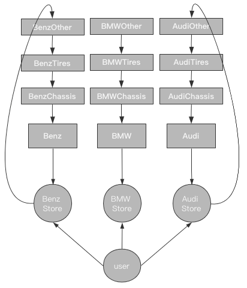

[toc]

# 基本介绍

抽象工厂模式（Abstract Factory Pattern）在其他普通工厂模式的2个分支基础上，能够控制产品的类型。

该设计模式主要围绕一个超级工厂创建其他工厂。

该超级工厂又称为其他工厂的工厂。

> 特定：对外隐藏，可搭配普通工厂模式或者工厂方法模式来指定接口，但在此基础上管控了生成产品的零部件来源

该模式属于创建型模式。

# 案例图示

在普通工厂模式中，造一辆车时如果不对其零部件来源加以控制，可能发现装上了一个不属于该车范畴的配件。

但是在抽象工厂模式下，购车造车时专卖店必须负责车辆配件的来源，如发生假冒伪劣产品必须承担责任，如下图所示：



# 优缺点

优点：

- 将客户端与类的具体实现相分离
- 每个工厂创建了一个完整的产品系列，使得易于交换产品系列
- 有利于产品的一致性

缺点：

- 难以支持新种类的抽象产品，扩展困难

# 代码实现

用Python实现抽象工厂模式：

```python
# 零部件厂商
# 生产奔驰轮胎的厂商
class BenzTiresManufacturer:
    def getInfo(self):
        return "Benz make"


# 生产奔驰底盘的厂商
class BenzChassisManufacturer:
    def getInfo(self):
        return "Benz make"

# 生产奔驰其他零部件的厂商
class BenzOtherManufacturer:
    def getInfo(self):
        return "Benz make"


# 品牌厂商
class Benz:
    def __init__(self, color):
        self.brandMsg = self.__class__.__name__
        self.colorMsg = color
        self.tiresMsg = None
        self.chassisMsg = None
        self.otherMsg = None

    def build_car(self, tiresManufacturer, chassisManufacturer, otherManufacturer):
        # 由厂家内部根据指定零件厂商，开始制造零件
        self.makeTires(tiresManufacturer)
        self.makeChassis(chassisManufacturer)
        self.makeOther(otherManufacturer)

    def getCar(self):
        return self

    def makeTires(self, tiresManufacturer):
        tires = tiresManufacturer()
        self.tiresMsg = tires.getInfo()

    def makeChassis(self, chassisManufacturer):
        chassis = chassisManufacturer()
        self.chassisMsg = chassis.getInfo()

    def makeOther(self, otherManufacturer):
        other = otherManufacturer()
        self.otherMsg = other.getInfo()

    def getInfo(self):
        return "brand:%s\ncolor:%s\ntires:%s\nchassis:%s\nother:%s\n" % (self.brandMsg, self.colorMsg, self.tiresMsg, self.chassisMsg, self.otherMsg)


# 品牌厂商专卖店
class BenzStore:
    def buyCar(self, color):
        # step03：告诉奔驰厂家该车的颜色
        self.brand = Benz(color=color)
        # step04：通知厂家开始造车，专卖店必须要对零部件负责，故此在这里指定
        # 轮胎、底盘、其他零件均为奔驰制造
        self.brand.build_car(
            tiresManufacturer=BenzTiresManufacturer,
            chassisManufacturer=BenzChassisManufacturer,
            otherManufacturer=BenzChassisManufacturer
        )
        # step05：获取造出来的汽车并返回给用户
        return self.brand.getCar()


if __name__ == "__main__":
    # step01：实例化出奔驰专卖店
    benzStore = BenzStore()
    # step02：去专卖店买车
    benzCar = benzStore.buyCar("black")
    print(benzCar.getInfo())

# brand:Benz
# color:black
# tires:Benz make
# chassis:Benz make
# other:Benz make

```

