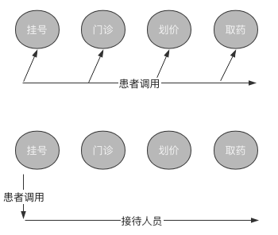

[toc]

# 基本介绍

外观模式（Facade Pattern）隐藏系统的复杂性，并向客户端提供了一个客户端可以访问系统的接口。

这种模式涉及到一个单一的类，该类提供了客户端请求的简化方法和对现有系统类方法的委托调用。

> 特点：为子系统中的一组接口提供一个一致的界面，外观模式定义了一个高层接口，这个接口使得这一子系统更加容易使用

该模式属于结构型模式，它向现有的系统添加一个接口，来隐藏系统的复杂性。

# 案例图示

去医院看病，可能要去挂号、门诊、划价、取药，让患者或患者家属觉得很复杂，如果有提供接待人员，只让接待人员来处理，就很方便，当然现实中这是不可能存在的：



# 优缺点

优点：

- 减少系统相互依赖
- 提高灵活性
- 提高了安全性

缺点：

- 不符合开闭原则，如果要改东西很麻烦，继承重写都不合适

# 代码实现

用Python实现外观模式：

```python
# 行为类
class Hospital:
    def registered(self, name):
        print("patient : %s go to registered" % name)

    def diagnosis(self, name):
        print("patient : %s go to diagnosis" % name)

    def price(self, name):
        print("patient : %s go to calculating price" % name)

    def getMedicine(self, name):
        print("patient : %s go to get medicine" % name)

# 外观类
class Admit:
    def __init__(self, name) -> None:
        self.name = name
        self.hospital = Hospital()

    def see_a_doctors(self):
        print("receptionist ..")
        # 挂号
        self.hospital.registered(self.name)
        # 诊断
        self.hospital.diagnosis(self.name)
        # 计算价格
        self.hospital.price(self.name)
        # 取药
        self.hospital.getMedicine(self.name)

if __name__ == "__main__":
    man = "Ken"
    hospital = Admit(man)
    hospital.see_a_doctors()

# receptionist ..
# patient : Ken go to registered
# patient : Ken go to diagnosis
# patient : Ken go to calculating price
# patient : Ken go to get medicine

```

