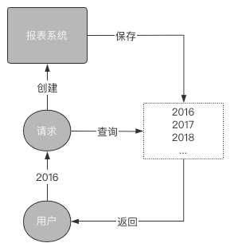

[toc]

# 基本介绍

享元模式（Flyweight Pattern）主要用于减少创建对象的数量，以减少内存占用和提高性能。

享元模式尝试重用现有的同类对象，如果未找到匹配的对象，则创建新对象。

> 特点：运用共享技术有效地支持大量细粒度的对象，用HashMap存储这些对象

该模式属于结构型模式，它提供了减少对象数量从而改善应用所需的对象结构的方式。

# 案例图示

当大多数请求都是同一个结果，为每个请求生成一个实例的代价太高。

故只要请求的是同一个结果，我们就将已存在的实例进行返回。

举个例子，我们有一个报表系统，当第一次请求2016年度报表时会生成并存储该报表，以后再次请求2016年度报表时都不会重复生成该报表而是通过查询直接返回。



# 优缺点

优点：

- 大大减少对象的创建
- 降低系统的内存

缺点：

- 提高了系统的复杂度，需要分离出外部状态和内部状态，而且外部状态具有固有化的性质，不应该随着内部状态的变化而变化，否则会造成系统的混乱

# 代码实现

用[Python](https://so.csdn.net/so/search?q=Python&spm=1001.2101.3001.7020)实现享元模式：

```python
# 报表系统
class Report:
    def __init__(self, year) -> None:
        self.year = year
        self.desc = "%s report" % year

# 请求报表（享元）
class RequestReport:
    def __init__(self) -> None:
        self.savaMap = {}

    def getReport(self, year):
        if not self.savaMap.get(year):
            print("generated report")
            newReport = Report(year)
            self.savaMap[year] = newReport

        return self.savaMap[year]


if __name__ == "__main__":
    client = RequestReport()
    report = client.getReport(2016)
    print(report.desc)

    # 仅生成一次
    report = client.getReport(2016)
    print(report.desc)

# generated report
# 2016 report
# 2016 report

```

