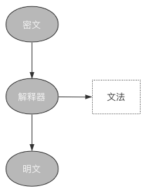

[toc]

# 基本介绍

解释器模式（Interpreter Pattern）提供了评估语言的语法或[表达式](https://so.csdn.net/so/search?q=表达式&spm=1001.2101.3001.7020)的方式。

这种模式实现了一个表达式接口，该接口解释一个特定的上下文，常被用在 SQL 解析、符号处理引擎等。

> 特点：给定一个语言，定义它的文法表示，并定义一个解释器，这个解释器使用对应文法来解释语言中的语句

该模式属于行为型模式。

# 案例图示

使用解释器模式，创建一门新的语言，例如

- A是B，B是C，C是D…

可用于加密的工程上：



# 优缺点

优点：

- 可扩展性比较好，灵活
- 增加了新的解释表达式的方式
- 易于实现简单文法

缺点：

- 可利用场景比较少
- 对于复杂的文法比较难维护

# 代码实现

用Python实现解释器模式：

```python
# 密文
class Code:
    def __init__(self, content) -> None:
        self.content = content

# 解释器
class Interpreter:
    # 定义文法
    grammar = {
        "a" : "b",
        "b" : "c",
        "c" : "d"
    }

    def run(self, document):
        content = document.content
        result = ""
        for ch in content:
            result += __class__.grammar[ch]
        return result

if __name__ == "__main__":
    document = Code("abc")
    result = Interpreter().run(document)
    print(result)

# bcd

```

