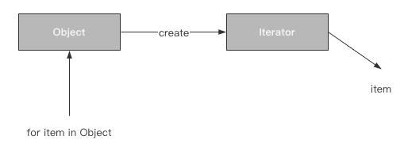

[toc]

# 基本介绍

[迭代器](https://so.csdn.net/so/search?q=迭代器&spm=1001.2101.3001.7020)模式（Iterator Pattern）是 Java 和 .Net 编程环境中非常常用的设计模式。

这种模式用于顺序访问[集合](https://so.csdn.net/so/search?q=集合&spm=1001.2101.3001.7020)对象的元素，而不需要知道集合对象的底层表示。

> 特点：提供一种方法顺序访问一个聚合对象中各个元素，而又无须暴露该对象的内部表示

迭代器模式属于行为型模式。

# 案例图示

一个对象内部的数据[存储结构](https://so.csdn.net/so/search?q=存储结构&spm=1001.2101.3001.7020)并不能被直接获取到，而是通过迭代器进行获取。

Python本身已经实现了迭代器模式，`只需要重写对象中的__iter__()方法和__next__()方法即可。`



# 优缺点

优点：

- 支持以不同的方式遍历一个聚合对象
- 迭代器简化了聚合类
- 在同一个聚合上可以有多个遍历

缺点：

- 由于迭代器模式将存储数据和遍历数据的职责分离，增加新的聚合类需要对应增加新的迭代器类，类的个数成对增加，这在一定程度上增加了系统的复杂性

```python
# 可迭代对象
class BinaryTree:
    def __init__(self, root):
        self.key = root
        self.leftChild = None
        self.rightChild = None
        self.height = 0

    def insertLeft(self, newNode):
        tree = BinaryTree(newNode)
        if not self.leftChild:
            self.leftChild = tree
        else:
            # 如果插入位置已有节点，则整体向下挪
            # 新的子节点与旧的子节点链接，旧的父节点与新的子节点链接
            tree.leftChild = self.leftChild
            self.leftChild = tree
        self.height += 1

    def insertRight(self, newNode):
        tree = BinaryTree(newNode)
        if not self.rightChild:
            self.rightChild = tree
        else:
            tree.rightChild = self.rightChild
            self.rightChild = tree
        self.height += 1

    def getRightChild(self):
        return self.rightChild

    def getLeftChild(self):
        return self.leftChild

    def setRootVal(self, obj):
        self.key = obj

    def getRootVal(self):
        return self.key

    def __iter__(self):
        return TreeIterator(tree=self)

    def __str__(self):
        return "<class 'BinaryTree' value: %r >"%self.getRootVal()

# 迭代器
class TreeIterator:
    def __init__(self, tree) -> None:
        self.tree = tree
        self.treeLst = [self.tree]


    def __iter__(self):
        return self

    def __next__(self):
        # 采用层级遍历
        while len(self.treeLst) > 0:
            node = self.treeLst.pop(0)
            if node.leftChild:
                self.treeLst.append(node.getLeftChild())
            if node.rightChild:
                self.treeLst.append(node.getRightChild())
            return node
        raise StopIteration("Tree iter end")


if __name__ == '__main__':
    binaryTree = BinaryTree("a")
    binaryTree.insertLeft("b")
    binaryTree.insertRight("c")
    binaryTree.leftChild.insertLeft("d")
    binaryTree.leftChild.insertRight("e")
    binaryTree.rightChild.insertLeft("f")
    for node in binaryTree:
        print(node)
        
# <class 'BinaryTree' value: 'a' >
# <class 'BinaryTree' value: 'b' >
# <class 'BinaryTree' value: 'c' >
# <class 'BinaryTree' value: 'd' >
# <class 'BinaryTree' value: 'e' >
# <class 'BinaryTree' value: 'f' >

```

