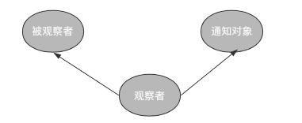

[toc]

# 基本介绍

[观察者模式](https://so.csdn.net/so/search?q=观察者模式&spm=1001.2101.3001.7020)（Observer Pattern）常用于一对多关系依赖中，当某个对象发生改变后，其他对象也会做出相应的调整策略。

> 特点：定义对象间的一种一对多的依赖关系，当一个对象的状态发生改变时，所有依赖于它的对象都得到通知并被自动更新

观察者模式也被称为发布订阅模式，属于行为型模式的一种。

# 案例图示

当客户减少到阀值时，销售通知工厂减少生产、人力资源开始裁人，反之则增加：



# 优缺点

优点：

- 观察者和被观察者是抽象耦合的
- 建立一套触发机制

缺点：

- 如果一个被观察者对象有很多的直接和间接的观察者的话，将所有的观察者都通知到会花费很多时间
- 如果在观察者和观察目标之间有循环依赖的话，观察目标会触发它们之间进行循环调用，可能导致系统崩溃
- 观察者模式没有相应的机制让观察者知道所观察的目标对象是怎么发生变化的，而仅仅只是知道观察目标发生了变化

# 代码实现

用Python实现观察者模式：

```python
# 观察者：销售部门
# 被观察者：客户资源（SalesInstanceObject._customer）
# 通知对象：工厂、人事部门

class Sales:
    """销售部门"""

    def __init__(self):
        # 被观察对象
        self._customer = None
        self._department = []

    @property
    def customer(self):
        return self._customer

    @customer.setter
    def customer(self, value):
        self._customer = value
        print('当前客户数量:{}'.format(self._customer))
        for obj in self._department:
            obj.change(value)
        print('------------------')

    def notice(self, department):
        """相关部门"""
        self._department.append(department)


class Hr:
    """人事部门"""

    def change(self, value):
        if value < 10:
            print("人事变动：裁员")
        elif value > 20:
            print("人事变动：扩员")
        else:
            print("人事不受影响")


class Factory:
    """工厂类"""

    def change(self, value):
        if value < 15:
            print("生产计划变动：减产")
        elif value > 25:
            print("生产计划变动：增产")
        else:
            print("生产计划保持不变")


if __name__ == '__main__':
    sales = Sales()
    hr = Hr()
    factory = Factory()

    # 部门关联
    sales.notice(hr)
    sales.notice(factory)

    # 客户变动
    sales.customer = 10
    sales.customer = 15
    sales.customer = 20
    sales.customer = 25

```

