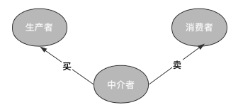

[toc]

# 基本介绍

中介者模式（Mediator Pattern）是用来降低多个对象和类之间的通信复杂性。

这种模式提供了一个中介类，中介类来处理不同类之间的通信，并支持松耦合，使代码易于维护。

也就是说，消费者和生产者不直接接触，而是通过中介者来建立联系。

比如MVC 框架中C（控制器）就是 M（模型）和 V（视图）的中介者。

> 特点：用一个中介对象来封装一系列的对象交互，中介者使各对象不需要显式地相互引用，从而使其耦合松散，而且可以独立地改变它们之间的交互

中介者模式属于行为型模式。

# 案例图示

生产者生成各类产品，中介者购买生产者的产品再转卖给消费者，生产者和消费者不直接进行接触：



# 优缺点

优点：

- 降低了类的复杂度，将一对多转化成了一对一
- 各个类之间的解耦
- 符合迪米特原则

缺点：

- 中介者会随着业务不断增长而变的庞大，这样的后果是中介者代码复杂且难以维护

# 代码实现

用[Python](https://so.csdn.net/so/search?q=Python&spm=1001.2101.3001.7020)实现中介者模式：

```python
class Consumer:
    """消费者类"""

    def __init__(self, product, price):
        self.name = "消费者"
        self.product = product
        self.price = price

    def shopping(self, name):
        """买东西"""
        print("向{} 购买 {}价格内的 {}产品".format(name, self.price, self.product))


class Producer:
    """生产者类"""

    def __init__(self, product, price):
        self.name = "生产者"
        self.product = product
        self.price = price

    def sale(self, name):
        """卖东西"""
        print("向{} 销售 {}价格的 {}产品".format(name, self.price, self.product))


class Mediator:
    """中介者类"""

    def __init__(self):
        self.name = "中介者"
        self.consumer = None
        self.producer = None

    def sale(self):
        """进货"""
        self.consumer.shopping(self.producer.name)

    def shopping(self):
        """出货"""
        self.producer.sale(self.consumer.name)

    def profit(self):
        """利润"""
        print('中介净赚：{}'.format((self.consumer.price - self.producer.price)))

    def complete(self):
        self.sale()
        self.shopping()
        self.profit()


if __name__ == '__main__':
    consumer = Consumer('手机', 3000)
    producer = Producer("手机", 2500)
    mediator = Mediator()
    mediator.consumer = consumer
    mediator.producer = producer
    mediator.complete()

# 向生产者 购买 3000价格内的 手机产品
# 向消费者 销售 2500价格的 手机产品
# 中介净赚：500

```

