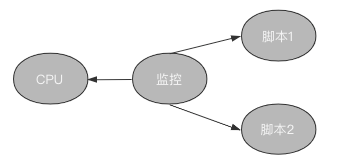

[toc]

# 基本介绍

状态模式（State Pattern）是指当对象的内部状态改变的时候，允许对象执行不同的流程，这样看起来就像改写了一个对象。

核心的方法是把复杂状态变化情况下的流程抽象出来，简化复杂情况状态的判断。

> 特点：允许对象在内部状态发生改变时改变它的行为，对象看起来好像修改了它的类

# 案例图示

定义一个运维脚本，用于监控CPU使用率状态，在不同状态下的自动化运维脚本执行不同的操作：



# 优缺点

优点：

- 封装了转换规则
- 枚举可能的状态，在枚举状态之前需要确定状态种类
- 将所有与某个状态有关的行为放到一个类中，并且可以方便地增加新的状态，只需要改变对象状态即可改变对象的行为
- 允许状态转换逻辑与状态对象合成一体，而不是某一个巨大的条件语句块
- 可以让多个环境对象共享一个状态对象，从而减少系统中对象的个数

缺点：

- 状态模式的使用必然会增加系统类和对象的个数
- 状态模式的结构与实现都较为复杂，如果使用不当将导致程序结构和代码的混乱
- 状态模式对"开闭原则"的支持并不太好，对于可以切换状态的状态模式，增加新的状态类需要修改那些负责状态转换的源代码，否则无法切换到新增状态，而且修改某个状态类的行为也需修改对应类的源代码

# 代码实现

用[Python](https://so.csdn.net/so/search?q=Python&spm=1001.2101.3001.7020)实现状态模式：

```python

class Base:

    def executor(self, value):
        self.run(value)


class Low(Base):

    def __init__(self):
        self.name = "较低占用率状态"

    def run(self, value):
        print("当前：{} 值:{}".format(self.name, value))
        print("无应急情况执行")


class Large(Base):

    def __init__(self):
        self.name = "较高占用率状态"

    def run(self, value):
        print("当前：{} 值：{}".format(self.name, value))
        print("发送警报邮件")


class Status:

    def __init__(self):
        self.value = 0.1
        self.low = Low()
        self.large = Large()
        self.status = None

    def monitor(self):
        if self.value < 0.5:
            self.status = self.low
        else:
            self.status = self.large
        self.status.executor(self.value)


if __name__ == '__main__':
    test = Status()
    test.monitor()
    test.value = 0.9
    test.monitor()

# 当前：较低占用率状态 值:0.1
# 无应急情况执行
# 当前：较高占用率状态 值：0.9
# 发送警报邮件

```

