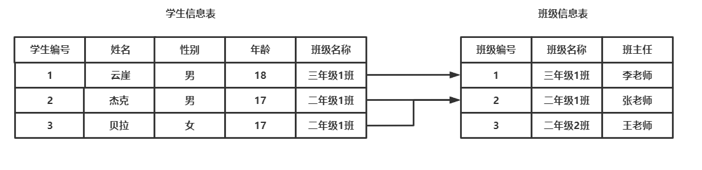
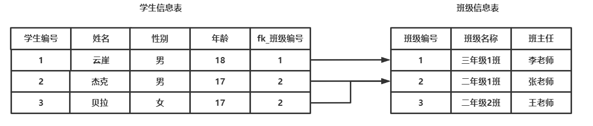
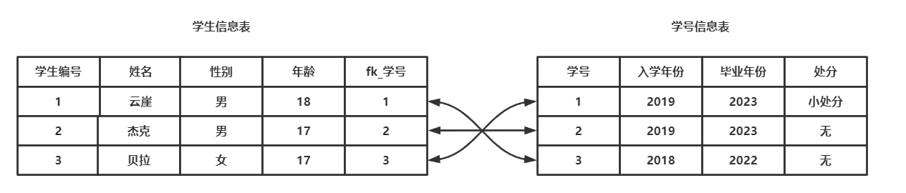
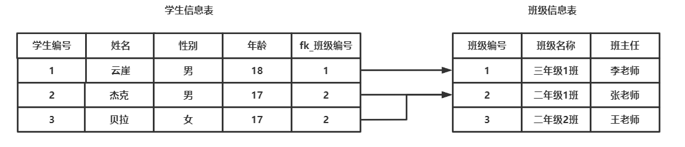
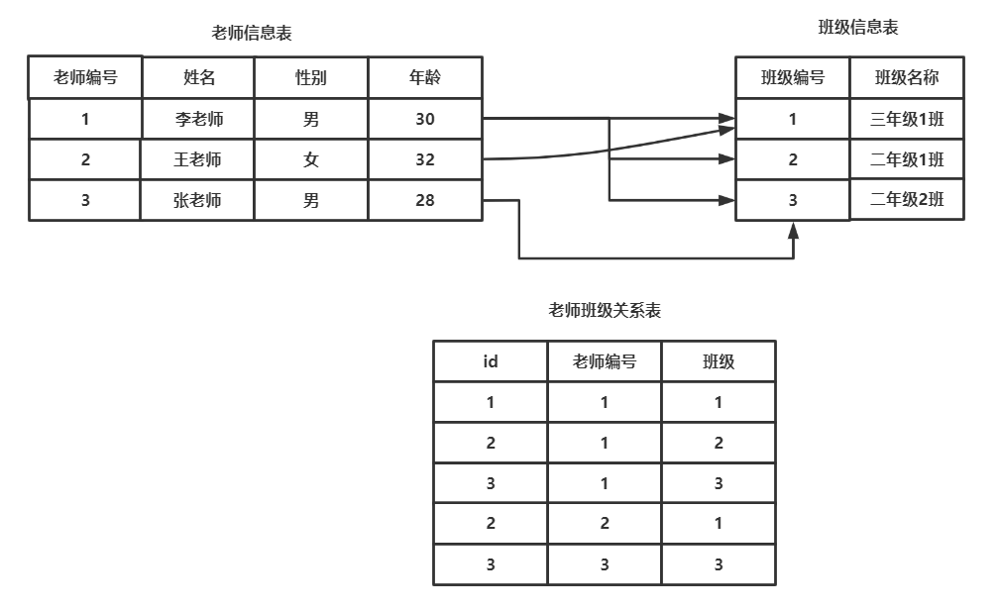

[toc]

# 基础知识

约束条件与数据类型的存储（显示）宽度均为可选参数，其作用在于保证数据的完整性与一致性。

常用完整性约束如下表所示

| 约束条件       | 描述                                           |
| -------------- | ---------------------------------------------- |
| DEFAULT        | 为该字段设置默认值                             |
| NOT NULL       | 标识该字段不能为空（非字符串有效）             |
| UNIQUE KEY     | 标识该字段的值是唯一的                         |
| PRIMARY KEY    | 标识该字段为该表的主键，可以唯一的标识记录     |
| AUTO_INCREMENT | 标识该字段的值自动增长（整数类型，而且为主键） |
| UNSIGNED       | 设定数值类型存入方式为无符号                   |
| ZEROFILL       | 使用0对显示宽度进行填充                        |
| FOREIGN KEY    | 标识该字段为该表的外键                         |

约束条件属于表结构中的一环，所以可以使用`desc 表名;`来进行查看。

```sql
mysql> desc temp;
+-------+-------------+------+-----+---------+-------+
| Field | Type        | Null | Key | Default | Extra |  
+-------+-------------+------+-----+---------+-------+
| id    | smallint(6) | YES  |     | NULL    |       |
+-------+-------------+------+-----+---------+-------+
1 row in set (0.00 sec)

mysql>
# Null，是否可以为空  Key 是否为主键，外键，唯一 Default 是否有默认值，Extra是否具有自增约束
```


# DEFAULT

用于在创建表时为字段设置默认值，当插入时可以省略该字段的数据插入而去使用设定的默认值，如不设定默认值为`NULL`

以下示例将展示为`gender`字段设置默认值

```sql
mysql> create table user(
    ->   user_id int primary key,
    ->   username char(12),
    ->   gender enum("male","famale") default "male",  # 为gender设置默认值
    ->   age tinyint
    -> );
Query OK, 0 rows affected (0.04 sec)

mysql> insert into user(user_id,username,age) values  # 插入的时候不指定gender，会使用默认值
    ->         (0,"Yunya",18);
Query OK, 1 row affected (0.00 sec)

mysql> select * from user;
+---------+--------------+--------+------+
| user_id | username     | gender | age  |
+---------+--------------+--------+------+
|       0 | Yunya        | male   |   18 |
+---------+--------------+--------+------+
1 row in set (0.00 sec)

mysql> desc user;
+----------+-----------------------+------+-----+---------+-------+
| Field    | Type                  | Null | Key | Default | Extra |  # 默认值未设置时为null，设置后就不是null了
+----------+-----------------------+------+-----+---------+-------+
| user_id  | int(11)               | NO   | PRI | NULL    |       |
| username | char(12)              | YES  |     | NULL    |       |
| gender   | enum('male','famale') | YES  |     | male    |       |
| age      | tinyint(4)            | YES  |     | NULL    |       |
+----------+-----------------------+------+-----+---------+-------+
4 rows in set (0.00 sec)

mysql>
```


# NOT NULL

代表非字符类型的字段不能为空，必须为该字段插入值（由于不插入值时使用默认值，不设置默认值是`NULL`，而约束又是`NOT NULL`，就会抛出异常）。

以下示例将展示如果一个设置`NOT NULL`约束的字段没有默认值也没有插入数据，则会抛出异常。

```sql
mysql> create table temp(c1 int not null);
Query OK, 0 rows affected (0.03 sec)

mysql> desc temp;  # c1 字段notnull 默认值是null
+-------+---------+------+-----+---------+-------+
| Field | Type    | Null | Key | Default | Extra |
+-------+---------+------+-----+---------+-------+
| c1    | int(11) | NO   |     | NULL    |       |
+-------+---------+------+-----+---------+-------+
1 row in set (0.01 sec)

mysql> insert into temp values(111); # 插入，使用插入值
Query OK, 1 row affected (0.00 sec)

mysql> insert into temp values(); # 未插入，使用默认值，抛出异常
ERROR 1364 (HY000): Field 'c1' doesn't have a default value
mysql>
```


# UNIQUE

`UNIQUE`具有字段值唯一性的限制


## 单列唯一

单列唯一是指该字段下的值不能重复

以下示例将展示设置了单列唯一的字段如果出现插入值相同的情况将会抛出异常。

```sql
mysql> create table students(
    ->         stu_id int unique, # 设置stu_id单列唯一
    ->         stu_name char(12)
    -> );
Query OK, 0 rows affected (0.03 sec)

mysql> desc students;
+----------+----------+------+-----+---------+-------+
| Field    | Type     | Null | Key | Default | Extra |
+----------+----------+------+-----+---------+-------+
| stu_id   | int(11)  | YES  | UNI | NULL    |       |
| stu_name | char(12) | YES  |     | NULL    |       |
+----------+----------+------+-----+---------+-------+
2 rows in set (0.00 sec)

mysql> insert into students values (1,"YunYa");  # 这里的stu_id插入1，后面就不能再进行插入
Query OK, 1 row affected (0.00 sec)

mysql> select * from students;
+--------+----------+
| stu_id | stu_name |
+--------+----------+
|      1 | YunYa    |
+--------+----------+
1 row in set (0.00 sec)

mysql> insert into students values (1,"Jack"); # 再进行插入就抛出异常
ERROR 1062 (23000): Duplicate entry '1' for key 'stu_id'
mysql>
```


## 联合唯一

联合唯一是指多个字段的值不能重复

比如，世界范围内`ip`可以有多个重复的，`port`也可以有多个重复，而`ip`+`port`则是全世界唯一的，因此`ip`+`port`可以设置联合唯一

```sql
mysql> create table server(
    ->         ip char(15),
    ->         port int,
    ->         unique(ip,port)  # 重新一行，设置ip与port的联合唯一，如果只指定一个则是单列唯一
    -> );
Query OK, 0 rows affected (0.03 sec)

mysql> desc server;
+-------+----------+------+-----+---------+-------+
| Field | Type     | Null | Key | Default | Extra |
+-------+----------+------+-----+---------+-------+
| ip    | char(15) | YES  | MUL | NULL    |       |
| port  | int(11)  | YES  |     | NULL    |       |
+-------+----------+------+-----+---------+-------+
2 rows in set (0.00 sec)

mysql> insert into server values ("127.0.0.1",3306); # 以下的ip+port 不允许出现相同的
Query OK, 1 row affected (0.00 sec)

mysql> insert into server values ("127.0.0.1",8000); # ip相同port相同，不触发约束条件
Query OK, 1 row affected (0.00 sec)

mysql> insert into server values ("127.0.0.1",3306); # 触发联合唯一约束条件，抛出异常
ERROR 1062 (23000): Duplicate entry '127.0.0.1-3306' for key 'ip'
mysql>
```


# PRIMARY KEY

主键是`InnoDB`表中必要的组织数据的依据，可以对查找速度进行质的提升，此外它还有非空且唯一的约束性限制。

一张表中至多只有一个主键(约束只能有一个，但可以作用到好几个字段)。

> 如果`InooDB`表中没有显式的设置主键，那么它会将非空且唯一约束的字段设置为主键，如果没有这种类型的字段则会隐式的创建出一个不可见的主键


## 非空唯一

主键具有非空且唯一的约束，因此我们设置一个非空且唯一的字段时`InnoDB`存储引擎会将他转变为主键。

以下示例将展示将`user_id`字段添加非空且唯一约束，会自动将该字段设置为主键

```sql
mysql> create table user(
    ->         user_id int not null unique,  # 设置约束，非空且唯一
    ->         username char(12)
    -> );
Query OK, 0 rows affected (0.05 sec)

mysql> desc user; # Key 自动设置为primary key
+----------+----------+------+-----+---------+-------+
| Field    | Type     | Null | Key | Default | Extra |
+----------+----------+------+-----+---------+-------+
| user_id  | int(11)  | NO   | PRI | NULL    |       |
| username | char(12) | YES  |     | NULL    |       |
+----------+----------+------+-----+---------+-------+
2 rows in set (0.00 sec)

mysql>
```


## 单列主键

尽管可以用上面的方式设置主键，但这并不是一种常用的手段，我们有更加简便的方式来设置单列主键。

单列主键即为单独的一个字段设置主键。

> 设置单列主键的字段不应该再参与业务逻辑处理，它的功能只应该有两个：1.标识，2.加速查找
>
> 如身份证号这种可能会被引用于业务处理的字段最好不要设置为主键

```sql
mysql> create table user(
    ->         user_id int primary key,  # 设置user_id字段为主键
    ->         username char(12)
    -> );
Query OK, 0 rows affected (0.03 sec)

mysql> desc user;
+----------+----------+------+-----+---------+-------+
| Field    | Type     | Null | Key | Default | Extra |
+----------+----------+------+-----+---------+-------+
| user_id  | int(11)  | NO   | PRI | NULL    |       |
| username | char(12) | YES  |     | NULL    |       |
+----------+----------+------+-----+---------+-------+
2 rows in set (0.00 sec)

mysql>
```


## 复合主键

复合主键即是将多个字段设置为主键（约束限制作用到多个字段上），与联合唯一类似。

```sql
mysql> create table server(
    ->         ip char(15),
    ->         port int,
    ->         primary key(ip,port)  # 重新一行，设置复合主键，如果只指定一个则是单列主键
    -> );
Query OK, 0 rows affected (0.03 sec)

mysql> desc server;
+-------+----------+------+-----+---------+-------+
| Field | Type     | Null | Key | Default | Extra |
+-------+----------+------+-----+---------+-------+
| ip    | char(15) | NO   | PRI | NULL    |       |
| port  | int(11)  | NO   | PRI | NULL    |       |
+-------+----------+------+-----+---------+-------+
2 rows in set (0.00 sec)

mysql>
```


# AUTO_INCREMENT

被约束字段为自动增长，被约束的字段必须同时被`key`约束。

> KEY：UNIQUE KEY 、PRIMARY KEY 、 FOREIGN KEY


## 基本使用

该约束一般都会作用于主键，让其进行自增长。

以下示例将展示将`user_id`添加上自动增长后，插入数据的时候会自动填充`user_id`字段。

```sql
mysql> create table user(
    ->         user_id int primary key auto_increment,
    ->         username char(12)
    -> );
Query OK, 0 rows affected (0.03 sec)

mysql> insert into user(username) values  # 只插入username，不必插入自动增长的主键字段
    ->         ("Yunya"),
    ->         ("Baby");
Query OK, 2 rows affected (0.00 sec)
Records: 2  Duplicates: 0  Warnings: 0

mysql> select * from user;  # 可以看到，默认是从1开始
+---------+----------+
| user_id | username |
+---------+----------+
|       1 | Yunya    |
|       2 | Baby     |
+---------+----------+
2 rows in set (0.00 sec)

mysql>
```


## 插入增长

当我们手动插入`user_id`后，再次插入时将会按照手动插入之后的值进行自增长。

```sql
mysql> select * from user;
+---------+----------+
| user_id | username |
+---------+----------+
|       1 | Yunya    |
|       2 | Baby     |
+---------+----------+
2 rows in set (0.00 sec)

mysql> insert into user(user_id,username) values  # 手动插入，user_id 现在为10
    ->         (10,"Jack");  
Query OK, 1 row affected (0.00 sec)

mysql> insert into user(username) values   # 再让其自增长
    ->         ("Tom"); 
Query OK, 1 row affected (0.00 sec)

mysql> select * from user;  # 可以看到是从手动插入后的值开始自增长
+---------+----------+
| user_id | username |
+---------+----------+
|       1 | Yunya    |
|       2 | Baby     |
|      10 | Jack     |
|      11 | Tom      |
+---------+----------+
4 rows in set (0.00 sec)

mysql>
```


## 记录删除

当某一条记录进行删除后，插入时将继续依照其所记录的增长值进行增长。

```sql
mysql> insert into user(username) values  # 插入4条记录。使其id自增长
    ->         ("YunYa"),
    ->         ("Baby"),
    ->         ("Jack"),
    ->         ("Tom");
Query OK, 4 rows affected (0.00 sec)
Records: 4  Duplicates: 0  Warnings: 0

mysql> show create table user;
+-------+-------------------------------------------------------------------------------------------------------------------------------------------------------------------------------------------+
| Table | Create Table                                                                                                                                                                              |
+-------+-------------------------------------------------------------------------------------------------------------------------------------------------------------------------------------------+
| user  | CREATE TABLE `user` (
  `user_id` int(11) NOT NULL AUTO_INCREMENT,
  `username` char(12) DEFAULT NULL,
  PRIMARY KEY (`user_id`)
) ENGINE=InnoDB AUTO_INCREMENT=5 DEFAULT CHARSET=utf8mb4 |
+-------+-------------------------------------------------------------------------------------------------------------------------------------------------------------------------------------------+
1 row in set (0.00 sec)  # 注意看 AUTO_INCREMENT=5 说明下次插入时自增值应该是5

mysql> delete from user where username="Tom";  # 删除Tom，即user_id=4的记录，现在存在的的user_id应该是1，2，3
Query OK, 1 row affected (0.00 sec)

mysql> insert into user(username) values # 插入ken
    ->         ("Ken");
Query OK, 1 row affected (0.00 sec)

mysql> select * from user; # 结果是5，不会再从4进行插入
+---------+----------+
| user_id | username |
+---------+----------+
|       1 | YunYa    |
|       2 | Baby     |
|       3 | Jack     |
|       5 | Ken      |
+---------+----------+
4 rows in set (0.00 sec)

mysql>
```


## 偏移步长

默认的自增长（偏移量）是从1开始，而默认的步长为1即每次都加一个，我们也可以修改这个值。


> alter table 表名 auto_increment=设定起始值（默认为1）; # 单表的默认自增长初始值设置
>
> set session auto_increment_increment=设定的步长 # 本次会话有效（关闭cmd后失效）
>
> set session auto_increment_offset=设定的起始值; # 本次会话有效（关闭cmd后失效）
>
> set global auto_increment_increment=设定的步长; # 修改全局级别的步长（所有会话都生效）
>
> set global auto_increment_offset=设定的起始值; # 修改全局级别的起始值（所有会话都生效）

以下示例将演示`temp`表初始偏移量为5，步长设置为10发生的现象

```sql
mysql> show session variables like 'auto_inc%';  # 查看当前会话的自动增长步长和起始值
+--------------------------+-------+
| Variable_name            | Value |
+--------------------------+-------+
| auto_increment_increment | 1     |
| auto_increment_offset    | 1     |
+--------------------------+-------+
2 rows in set, 1 warning (0.01 sec)

mysql> set session auto_increment_increment=10; # 设置本次会话的步长为10
Query OK, 0 rows affected (0.00 sec)

mysql> set session auto_increment_offset=5; # 设置本次会话的起始值为5
Query OK, 0 rows affected (0.00 sec)

mysql> show session variables like 'auto_inc%'; # 查看是否修改成功
+--------------------------+-------+
| Variable_name            | Value |
+--------------------------+-------+
| auto_increment_increment | 10    |
| auto_increment_offset    | 5     |
+--------------------------+-------+
2 rows in set, 1 warning (0.00 sec)
 
mysql> create table temp(  # 创建表，id设置为自增长
    ->         id int primary key auto_increment,
    ->         row_name char(12)
    -> );
Query OK, 0 rows affected (0.03 sec)

mysql> insert into temp(row_name) values
    ->         ("第一个"),
    ->         ("第二个"),
    ->         ("第三个");
Query OK, 3 rows affected (0.00 sec)
Records: 3  Duplicates: 0  Warnings: 0

mysql> select * from temp;  # 成功按照设定进行自增长
+----+-----------+
| id | row_name  |
+----+-----------+
|  5 | 第一个    |
| 15 | 第二个    |
| 25 | 第三个    |
+----+-----------+
3 rows in set (0.00 sec)

mysql> show create table temp;  # 下一条记录的id将从 AUTO_INCREMENT=35  35开始
+-------+----------------------------------------------------------------------------------------------------------------------------------------------------------------------------------+
| Table | Create Table                                                                                                                                                                     |
+-------+----------------------------------------------------------------------------------------------------------------------------------------------------------------------------------+
| temp  | CREATE TABLE `temp` (
  `id` int(11) NOT NULL AUTO_INCREMENT,
  `row_name` char(12) DEFAULT NULL,
  PRIMARY KEY (`id`)
) ENGINE=InnoDB AUTO_INCREMENT=35 DEFAULT CHARSET=utf8mb4 |
+-------+----------------------------------------------------------------------------------------------------------------------------------------------------------------------------------+
1 row in set (0.00 sec)

mysql>
```


# FOREIGN KEY

`FOREIGN KEY`是用于将两个表链接在一起的键。

```
FOREIGN KEY`是一个表中的一个字段（或字段集合），它引用另一个表中的`PRIMARY KEY
```

使用外键进行表关系互联后，可以使用级联操作（外键在`MySQL`中与查询关系不大）。

> 表类型必须是`InnoDB`存储引擎

注意，在创建外键时，引用字段和外键字段都需要匹配：

> 1. 引擎应该是相同的，例如`InnoDB`;
> 2. 数据类型应该相同)，并且长度相同;
> 3. 编码应该相同，例如`utf8`；
> 4. 外键应引用引用表中`primary key`的字段;
> 5. 如果一个有`UNSIGNED`，另一个必须也要有.


## 理解外键

如下，我们有这样的两张表。



可以创建一个`FOREIGN KEY`字段，用于专门存储他们之间的关系，只存储班级信息表中的主键列`班级编号`即可。



外键关联有好有坏，好的是可以更加方便的进行多表之间的操作如级联操作等，坏处是表关系中耦合度增加，后期扩展不便。


## 一对一

一对一关系例举：一个学号只能对应一个学生，一个学生只能对应一个学号。

> 一对一关系用两张表即可表达



```sql
create table 学号信息表(
        学号 int(4) unsigned not null primary key auto_increment,
        入学年份 year not null,
        毕业年份 year not null,
        处分 enum("无", "小处分", "大处分") default "无"
);


create table 学生信息表(
        学生编号 int unsigned not null primary key auto_increment,
        学生姓名 char(12) not null,
        性别 enum("男", "女") not null,
        年龄 tinyint unsigned not null,
        fk_学号 int unsigned not null unique,         # 外键必须与主表引用键保持约束一致，唯一性确定一对一关系
        foreign key(fk_学号) references 学号信息表(学号) # 重起一行
);

insert into 学号信息表(入学年份,毕业年份,处分) values
        ("2018","2022","小处分");


insert into 学号信息表(入学年份,毕业年份) values
        ("2019","2023"),
        ("2019","2023");

insert into 学生信息表(学生姓名,性别,年龄,fk_学号) values
        ("云崖","男",18,3),
        ("杰克","男",17,2),
        ("贝拉","女",17,1);

select * from 学生信息表 
        inner join 学号信息表 on 学号信息表.学号 = 学生信息表.fk_学号 order by 学生信息表.学生编号 asc;
   

+--------------+--------------+--------+--------+-----------+--------+--------------+--------------+-----------+
| 学生编号     | 学生姓名     | 性别   | 年龄   | fk_学号   | 学号   | 入学年份     | 毕业年份     | 处分      |
+--------------+--------------+--------+--------+-----------+--------+--------------+--------------+-----------+
|            1 | 云崖         | 男     |     18 |         3 |      3 |         2019 |         2023 | 无        |
|            2 | 杰克         | 男     |     17 |         2 |      2 |         2019 |         2023 | 无        |
|            3 | 贝拉         | 女     |     17 |         1 |      1 |         2018 |         2022 | 小处分    |
+--------------+--------------+--------+--------+-----------+--------+--------------+--------------+-----------+
```


## 一对多&多对一

一对多&多对一关系例举：一个班级可以有多个学生，一个学生只能拥有一个班级。




> 一对多&多对一关系用两张表即可表达

```sql
create table 班级信息表(
        班级编号 int unsigned not null primary key auto_increment,
        班级名称 char(12) not null unique, # 班级名称应该是唯一的
        班主任 char(6) not null
);

create table 学生信息表(
        学生编号 int unsigned not null primary key auto_increment,
        学生姓名 char(12) not null,
        性别 enum("男", "女") not null,
        年龄 tinyint unsigned not null,
        fk_班级编号 int unsigned not null,         # # 外键必须与主表引用键保持约束一致
        foreign key(fk_班级编号) references 班级信息表(班级编号) 	# 重起一行
);

insert into 班级信息表(班级名称,班主任) values
        ("三年级1班","李老师"),
        ("二年级1班","张老师"),
        ("二年级2班","王老师");


insert into 学生信息表(学生姓名,性别,年龄,fk_班级编号) values
        ("云崖","男",18,1),
        ("杰克","男",17,1),
        ("贝拉","女",17,2);
        
select * from 学生信息表 
        inner join 班级信息表 on 学生信息表.fk_班级编号 = 班级信息表.班级编号;

+--------------+--------------+--------+--------+-----------------+--------------+---------------+-----------+
| 学生编号     | 学生姓名     | 性别   | 年龄   | fk_班级编号     | 班级编号     | 班级名称      | 班主任    |
+--------------+--------------+--------+--------+-----------------+--------------+---------------+-----------+
|            1 | 云崖         | 男     |     18 |               1 |            1 | 三年级1班     | 李老师    |
|            2 | 杰克         | 男     |     17 |               1 |            1 | 三年级1班     | 李老师    |
|            3 | 贝拉         | 女     |     17 |               2 |            2 | 二年级1班     | 张老师    |
+--------------+--------------+--------+--------+-----------------+--------------+---------------+-----------+
```


## 多对多

多对多关系例举：一个班级可以有多位教师，一位教师也可以在多个班级中任教

> 多对多关系必须用三张表才可表达



```sql
create table 老师信息表(
        老师编号 int unsigned not null primary key auto_increment,
        老师姓名 char(12) not null,
        性别 enum("男", "女") not null,
        年龄 tinyint unsigned not null
);

create table 班级信息表(
        班级编号 int unsigned not null primary key auto_increment,
        班级名称 char(5)
);

create table 老师班级关系表(
        id int unsigned not null primary key auto_increment,
        老师编号 int unsigned,
        班级编号 int unsigned,
        foreign key(老师编号) references 老师信息表(老师编号,
        foreign key(班级编号) references ) 班级信息表(班级编号),
        unique(老师编号,班级编号)  # 应当设置联合唯一
);

insert into 老师信息表(老师姓名,性别,年龄) values
        ("李老师","男",30),
        ("王老师","女",32),
        ("张老师","男",28);

insert into 班级信息表(班级名称) values
        ("三年级1班"),
        ("二年级1班"),
        ("二年级2班");

insert into 老师班级关系表(老师编号,班级编号) values
        (1,1),
        (1,2),
        (1,3),
        (2,1),
        (3,3);

select * from 老师信息表 
	inner join 老师班级关系表 on 老师信息表.老师编号 = 老师班级关系表.老师编号
	inner join 班级信息表 on 班级信息表.班级编号 = 老师班级关系表.班级编号;

+--------------+--------------+--------+--------+----+--------------+--------------+--------------+---------------+
| 老师编号     | 老师姓名     | 性别   | 年龄   | id | 老师编号     | 班级编号     | 班级编号     | 班级名称      |
+--------------+--------------+--------+--------+----+--------------+--------------+--------------+---------------+
|            1 | 李老师       | 男     |     30 |  1 |            1 |            1 |            1 | 三年级1班     |
|            2 | 王老师       | 女     |     32 |  4 |            2 |            1 |            1 | 三年级1班     |
|            1 | 李老师       | 男     |     30 |  2 |            1 |            2 |            2 | 二年级1班     |
|            1 | 李老师       | 男     |     30 |  3 |            1 |            3 |            3 | 二年级2班     |
|            3 | 张老师       | 男     |     28 |  5 |            3 |            3 |            3 | 二年级2班     |
+--------------+--------------+--------+--------+----+--------------+--------------+--------------+---------------+
```


## 级联操作。

级联操作是指如果删除/更新被关联的主表，子表应该做何种决策

级联操作应该指定在使用`FORKIGN KEY`的表中。

### ON DELETE

级联删除

| 选项                                   | 说明                                                         |
| -------------------------------------- | ------------------------------------------------------------ |
| ON DELETE CASCADE                      | 删除父表记录时，子表记录同时删除                             |
| ON DELETE SET NULL                     | 删除父表记录时，子表记录设置为NULL（子表字段要允许NULL）     |
| ON DELETE NO ACTION ON DELETE RESTRICT | 删除父表记录时，子表不做任何处理，必须把子表处理完才可以删除主表，否则会抛出异常。 |

```sql
create table 班级信息表(
        班级编号 int unsigned not null primary key auto_increment,
        班级名称 char(12) not null unique, # 班级名称应该是唯一的
        班主任 char(6) not null
); // 主表

create table 学生信息表(
        学生编号 int unsigned not null primary key auto_increment,
        学生姓名 char(12) not null,
        性别 enum("男", "女") not null,
        年龄 tinyint unsigned not null,
        fk_班级编号 int unsigned not null,      
        foreign key(fk_班级编号) references 班级信息表(班级编号),
        ON DELETE CASCADE # 删除主表时，该表记录全部清空。
); // 从表
```

### ON UPDATE

级联更新

| 选项                                   | 说明                                                         |
| -------------------------------------- | ------------------------------------------------------------ |
| ON UPDATE CASCADE                      | 更新父表记录时，比如更改父表的主键时，子表记录同时更新       |
| ON UPDATE SET NULL                     | 更新父表记录时，比如更改父表的主键时，子表记录设置为NULL     |
| ON UPDATE NO ACTION ON UPDATE RESTRICT | 更新父表记录时，子表不做任何处理，必须把子表处理完才可以更新主表 |

```sql
create table 班级信息表(
        班级编号 int unsigned not null primary key auto_increment,
        班级名称 char(12) not null unique, # 班级名称应该是唯一的
        班主任 char(6) not null
);

create table 学生信息表(
        学生编号 int unsigned not null primary key auto_increment,
        学生姓名 char(12) not null,
        性别 enum("男", "女") not null,
        年龄 tinyint unsigned not null,
        fk_班级编号 int unsigned not null,      
        foreign key(fk_班级编号) references 班级信息表(班级编号),
        ON UPDATE CASCADE # 主表主键 ‘班级编号’ 进行更新时，子表也会更新。
);
```


## 外键别名

在创建外键时，我们可以对外键取一个别名，这并不是强制性的。

```swift
CONSTRAINT `外键别名` FOREIGN KEY (`fk_班级编号`) REFERENCES `班级信息表` (`班级编号`),
ON DELETE CASCADE,
ON UPDATE CASCADE;
```

进行外键删除时，也可以参照这个别名进行删除

```sql
ALTER TABLE `表名` DROP FOREIGN KEY `外键别名`;
```