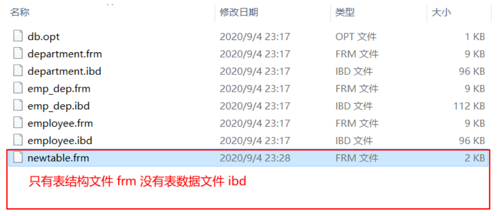

[toc]

# MySQL 视图操作

# 准备数据

以下数据是一组多对多关系的数据表

准备数据

```sql
create table employee (
        id int auto_increment primary key,
        name char(12) not null,
        gender enum("male","famale") not null default "male",
        age tinyint unsigned not null,
        salary int unsigned not null
); -- 员工表

create table department (
        id int unsigned primary key,
        name char(12) not null
); -- 部门表

create table emp_dep(
        id int auto_increment primary key,
        emp_id int unsigned not null,
        dep_id int unsigned not null,
        unique(emp_id,dep_id)  # 应当设置联合唯一
); -- 关系表


insert into employee(name,gender,age,salary) values 
        ("Yunya","male",22,16000),
        ("Jack","male",25,18000),
        ("Bella","famale",24,12000),
        ("Maria","famale",22,8000),
        ("Tom","male",23,6000),
        ("Jason","male",28,32000),
        ("James","male",31,35000),
        ("Lisa","famale",36,28000);


insert into department(id,name) values
        (1001,"研发部"),
        (1002,"开发部"),
        (1003,"财务部"),
        (1004,"人事部");


insert into emp_dep(emp_id,dep_id) values 
        (1,1002),
        (2,1002),
        (3,1003),
        (4,1004),
        (5,1004),
        (6,1001),
        (6,1002),
        (7,1002),
        (7,1001),
        (7,1003),
        (8,1003),
        (8,1004);


```

# 视图概念

`View`说白了就是虚拟表的概念，当一些多表查询操作发生后所产生的虚拟表可能出现重复应用的场景时我们可以利用视图来进行下一次的便捷操作。

举例：没有视图的时候，一张虚拟表当出现被多次应用的场景时在每次调用的时候我们都要大量的书写重复代码，如下我们想取出员工编号，员工姓名，员工性别，部门编号以及部门名字，那么在每次使用这张虚拟表的时候都需要做相同的重复工作

```csharp
select  employee.id,employee.name,employee.gender,emp_dep.dep_id,department.name from employee 
        inner join emp_dep
        on employee.id = emp_dep.emp_id
        inner join department 
        on department.id = emp_dep.dep_id;
```


# 创建视图

视图这张表只有表结构，没有表数据，它的所有数据均来自于其他表中

> 注意：尽量少的去应用视图，因为视图极为依赖真实表数据，因此程序耦合度会又极大的提升
>
> 另外，在创建视图时不应该出现虚拟表中多列字段同名的情况，这会抛出异常1064

以下示例将展示创建视图

```csharp
create view newtable as 
select employee.id,employee.name as emp_name,employee.gender,emp_dep.dep_id,department.name as dep_name from employee 
        inner join emp_dep
        on employee.id = emp_dep.emp_id
        inner join department 
        on department.id = emp_dep.dep_id;
        
-- 为了解决字段name同名问题，使用as取别名即可
```



# 视图使用

视图的使用应该仅限于查询，不应该对视图表进行插入或更新操作，虽然视图表可以当作正常物理表一样进行使用。

```smalltalk
select * from newtable;

+----+----------+--------+--------+-----------+
| id | emp_name | gender | dep_id | dep_name  |
+----+----------+--------+--------+-----------+
|  1 | Yunya    | male   |   1002 | 开发部    |
|  2 | Jack     | male   |   1002 | 开发部    |
|  3 | Bella    | famale |   1003 | 财务部    |
|  4 | Maria    | famale |   1004 | 人事部    |
|  5 | Tom      | male   |   1004 | 人事部    |
|  6 | Jason    | male   |   1001 | 研发部    |
|  6 | Jason    | male   |   1002 | 开发部    |
|  7 | James    | male   |   1001 | 研发部    |
|  7 | James    | male   |   1002 | 开发部    |
|  7 | James    | male   |   1003 | 财务部    |
|  8 | Lisa     | famale |   1003 | 财务部    |
|  8 | Lisa     | famale |   1004 | 人事部    |
+----+----------+--------+--------+-----------+
show create table newtable\G;

*************************** 1. row ***************************
 View: newtable
Create View: CREATE ALGORITHM=UNDEFINED DEFINER=`root`@`localhost` SQL SECURITY DEFINER VIEW `newtable` AS select `employee`.`id` AS `id`,`employee`.`name` AS `emp_name`,`employee`.`gender` AS `gender`,`emp_dep`.`dep_id` AS `dep_id`,`department`.`name` AS `dep_name` from ((`employee` join `emp_dep` on((`employee`.`id` = `emp_dep`.`emp_id`))) join `department` on((`department`.`id` = `emp_dep`.`dep_id`)))

character_set_client: utf8mb4
collation_connection: utf8mb4_general_ci
```


# 视图引用

视图引用的是物理表中的数据，虽然我们只应该对视图进行查询操作，但是也可以修改这个引用让他引用另外的物理表中的数据

语法：ALTER VIEW 视图名称 AS SQL语句

```sql
alter view newtable as select * from employee where id>3;
```


# 删除视图

语法介绍：

```sql
DROP VIEW 视图名称
```

 