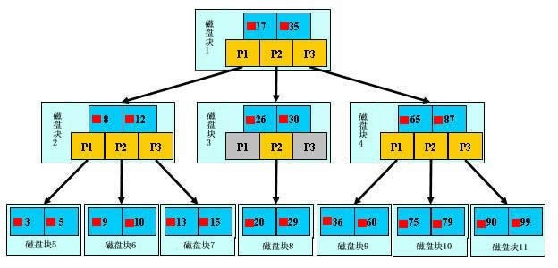

[toc]

# 基础知识

一张数据表中具有百万级的数据时，如何精确且快速的拿出其中某一条或多条记录成为了人们思考的问题。

`InnoDB`存储引擎的出现让这个问题得到了很好的解决，`InnoDB`存储引擎是以索引来进行数据的组织，而索引在`MySQL`中也被称之为键，因此`UNIQUE KEY`，`PRIMARY KEY`约束字段会作为索引字段。

当没有明确指出`PRIMAY KEY`时，`InnoDB`存储引擎会自动的创建一个6字节的隐藏主键用于组织数据，但是由于该主键是隐藏的所以对查询没有任何帮助。

> 索引相当于一本大字典的目录，有了目录来找想要的内容就快很多，否则就只能进行一页一页的遍历查询


# 查找过程

索引的查找过程是依照`B+`树算法进行查找的，而每一张数据表都会有一个且只能有一个与之对应的树



> 只有最下面一层节点中存储一整行记录
>
> 第二层及第一层中黄色部分为指针

如图所示，如果要查找数据项29，那么首先会把磁盘块1由磁盘加载到内存，此时发生一次IO，在内存中用二分查找确定29在17和35之间，锁定磁盘块1的P2指针，内存时间因为非常短（相比磁盘的IO）可以忽略不计，通过磁盘块1的P2指针的磁盘地址把磁盘块3由磁盘加载到内存，发生第二次IO，29在26和30之间，锁定磁盘块3的P2指针，通过指针加载磁盘块8到内存，发生第三次IO，同时内存中做二分查找找到29，结束查询，总计三次IO。真实的情况是，3层的`B+`树可以表示上百万的数据，如果上百万的数据查找只需要三次IO，性能提高将是巨大的，如果没有索引，每个数据项都要发生一次IO，那么总共需要百万次的IO，显然成本非常非常高。


# 索引分类

索引分为聚集索引与辅助索引


## 聚集索引

聚集索引是会直接按照`B+`树进行查询，由于`B+`树的底层叶子节点是一整行记录，所以聚集索引能够十分快速的拿到一整行记录。

值得注意的是，一张数据表中只能有一个聚集索引。


## 辅助索引

辅助索引的树最底层的叶子节点并不会存储一整行记录，而是只存储单列索引的数据，并且还存储了聚集索引的信息。

通过辅助索引进行查询时，先拿到自身索引字段的数据，再通过聚集索引拿到整行记录，也就是说辅助索引拿一整行记录而言需要最少两次查询。

而一张数据表中可以有多个辅助索引。


# 创建索引


## 索引类型

| 索引名                     | 类型                               |
| -------------------------- | ---------------------------------- |
| INDEX(field)               | 普通索引，只加速查找，无约束条件   |
| PRIMARY KEY(field)         | 主键索引，加速查找，非空且唯一约束 |
| UNIQUE(field)              | 唯一索引，加速查找，唯一约束       |
| INDEX(field1,field2)       | 联合普通索引                       |
| PRIMARY KEY(field1,field2) | 联合主键索引                       |
| UNIQUE(field1,field2)      | 联合唯一索引                       |
| FULLTEXT(field)            | 全文索引                           |
| SPATIAL(field)             | 空间索引                           |

```sql
使用场景:

举个例子来说，比如你在为某商场做一个会员卡的系统。

这个系统有一个会员表
有下列字段：
会员编号 INT
会员姓名 VARCHAR(10)
会员身份证号码 VARCHAR(18)
会员电话 VARCHAR(10)
会员住址 VARCHAR(50)
会员备注信息 TEXT

那么这个 会员编号，作为主键，使用 PRIMARY
会员姓名 如果要建索引的话，那么就是普通的 INDEX
会员身份证号码 如果要建索引的话，那么可以选择 UNIQUE （唯一的，不允许重复）

# 除此之外还有全文索引，即FULLTEXT
会员备注信息如果需要建索引的话，可以选择全文搜索。
用于搜索很长一篇文章的时候，效果最好。
用在比较短的文本，如果就一两行字的，普通的 INDEX 也可以。
但其实对于全文搜索，我们并不会使用MySQL自带的该索引，而是会选择第三方软件如Sphinx，专门来做全文搜索。

# 其他的如空间索引SPATIAL，了解即可，几乎不用

各个索引的应用场景

```

## 语法介绍

索引应当再建立表时就进行创建，如果表中已有大量数据，再进行创建索引会花费大量的时间。

```sql
-- 方法一：创建表时
    　　CREATE TABLE 表名 (
                字段名1  数据类型 [完整性约束条件…],
                字段名2  数据类型 [完整性约束条件…],
                [UNIQUE | FULLTEXT | SPATIAL | PK] INDEX
                [索引名]  (字段名[(长度)]  [ASC |DESC]) 
                );


-- 方法二：CREATE在已存在的表上创建索引
        CREATE  [UNIQUE | FULLTEXT | SPATIAL | PK ] INDEX 索引名 
                     ON 表名 (字段名[(长度)]  [ASC |DESC]) ;


-- 方法三：ALTER TABLE在已存在的表上创建索引
        ALTER TABLE 表名 ADD  [UNIQUE | FULLTEXT | SPATIAL | PK ] INDEX
                             索引名 (字段名[(长度)]  [ASC |DESC]) ;
                             
-- 删除索引：DROP INDEX 索引名 ON 表名字;
```


## 功能测试

```sql
--  准备表，注意此时表没有设置任何类型的索引
create table s1(
        id int,
        number varchar(20)
);

-- 创建存储过程，实现批量插入记录
delimiter $$  -- 声明存储过程的结束符号为$$
        create procedure auto_insert1() 
        BEGIN
                declare i int default 1; -- 声明定义变量
                while(i < 1000000) do
                        insert into s1 values
                                (i,concat('第', i, '条记录'));
                set i = i + 1;
                end while;
        END $$ -- 存储过程创建完毕
delimiter ;

-- 调用存储过程，自动插入一百万条数据
call auto_insert1();
```

在无索引的情况下，查找`id`为`567891`的这条记录，耗时`0.03s`

```sql
mysql> select * from s1 where id = 567891;
+--------+--------------------+
| id     | number             |
+--------+--------------------+
| 567891 | 第567891条记录     |
+--------+--------------------+
1 row in set (0.33 sec)
```

接下来为`id`字段建立主键索引后再进行查找，耗时为`0.00s`

```sql
mysql> ALTER TABLE s1 MODIFY id int PRIMARY KEY;
Query OK, 0 rows affected (4.76 sec)  -- 创建索引花费寺庙
Records: 0  Duplicates: 0  Warnings: 0

mysql> select * from s1 where id = 567891;
+--------+--------------------+
| id     | number             |
+--------+--------------------+
| 567891 | 第567891条记录     |
+--------+--------------------+
1 row in set (0.00 sec) 再次查找则快了很多
```


# 索引名词


## 索引结构

如果想更加深刻的了解索引，则需要更底层的认识索引的结构。

它其实是这个样子的。

> 每一列创建一个索引，可以将它理解为单独的创建了一个索引表，包含当前索引字段与值，不同的是聚集索引包含一整行数据表的真实记录，而辅助索引只包含当前的值与聚集索引的地址


## 回表查询

使用辅助索引进行查询时，如果`select`需要的字段没有存在于索引中，则会根据聚集索引再查询一次，这个过程称之为回表查询。

按上图所示，以下查询语句会执行回表查询：

```csharp
selcet age from tb1 where name = "name1";

# name是辅助索引列，并不存在age字段信息，需要通过聚集索引列回表进行查询
# 查两次
```


如果使用聚集索引列进行查询，就不会进行回表二次查询：

```csharp
select age from tb1 where id = 1;

# 聚集索引包含当前一整行的信息，不用再回表进行查询
# 查一次
```


## 覆盖索引

覆盖索引的意思是`select`需要的字段正是索引字段，不必再进行回表查询，如下所示：

```csharp
select name from tb1 where name = "name1";
```


如果`(name,age)`字段为联合索引，则下面这种查询也属于覆盖索引：

```csharp
select age from tb1 where name = "name1";
```


反之，如果查询未在联合索引中的数据，则不属于覆盖索引：

```csharp
select gender from tb1 where name = "name1";  

# gender未在联合索引中
```


有一个特点就是通过主键进行查询时，都是覆盖索引，因为不用再进行回表查询：

```csharp
select name, age, gender from tb1 where id = 1;
```


## 索引合并

使用多个辅助索引（单列，非联合）进行查询时，被称之为索引合并。

索引合并的查询速度小于联合索引，并且不会有最左前缀匹配的限制：

```csharp
select id from tb1 where name = "name1" and age = 18;
```


## 最左前缀匹配特性

这个主要是在联合索引中体现，如下所示，`(name,age)`字段为联合索引，必须从左边查询才会走索引：

```csharp
select gender from tb1 where name = "name1" and age = 18 ;  
# 联合索引是name在前，age在后
# name在前，age在后，走索引
```

如果像下面这样使用，就不会走索引：

```csharp
select gender from tb1 where age = 18 and name = "name1";
# 联合索引是name在前，age在后
# 查询是age在前，name在后，不走索引
```


## 短索引

如果一个字段中，前缀或者后缀都相同的情况下，如：

```scss
字段：name(char)
记录1：user01203023
记录2：user92392023
记录3：user92328823
记录4：user02388322
```

将整条记录完整的做索引显然很浪费空间，只从第四个字符开始向后做索引是最明智的选择，这种索引被称之为短索引。

创建或修改短索引，详见创建索引中的语法。


# 使用索引


## 索引未命中

以下的查询都会造成索引未命中的情况：

1. 使用`like`进行模糊查询：

   ```sql
   select * from tb1 where name like "%yu"
   ```

1. 使用函数进行查询：

   ```csharp
   select * from tb1 where reverse(name) = "yunya" 
   ```

1. 使用`or`进行查询时，如果`or`的两方有一方未建立索引，则失效：

   ```csharp
   select * from tb1 where id = 1 or email = "xxxx@gmail.com"  # email未建立索引
   ```

2. 类型不一致，如果`name`列是字符串类型，而查找时没有加引号，则会造成索引未命中：

   ```csharp
   select * from tb1 where name = 1234; # 不走索引
   select * from tb1 where name = "1234"; # 走索引
   ```

3. 使用`!=`时，不会走索引（主键除外）：

   ```csharp
   select * from tb1 where name != "yunya";  # 不走索引
   select * from tb1 where id != 1; # 走索引
   ```

4. 使用`>`时，如果不是主键或者索引不是整数类型，则不会走索引：

   ```csharp
   select * from tb1 where name > "yunya";  # 不走索引
   select * from tb1 where id > 10;  # 走索引
   select * from tb1 where age > 10; # 走索引
   ```

5. 使用`ordery by`排序时，选择的排序字段如果不是索引，则不走索引，此外，如果是按照主键排序，则走索引：

   ```csharp
   select * from tb1 ordery by gender desc; # gender不是索引，不走索引
   select * from tb1 ordery by id desc; # 主键，走索引
   ```

6. 最左前缀匹配特性，如果`(name,age)`均为索引，则可能发生如下情况：

   ```csharp
   select * from tb1 where name = "yunya" and email = "2323@gamil.com"  # 走索引
   select * from tb1 where name = "yunya";  # 走索引
   select * from tb1 where age = "2323@gamil.com";  # 不走索引
   ```


## 其他注意事项

- 避免使用`select *`进行查询
- 使用`count(1)`或者`count(列)`代替`count(*)`
- 创建表时尽量时 `char`代替 `varchar`
- 表的字段顺序固定长度的字段优先
- 组合索引代替多个单列索引（经常使用多个条件查询时）
- 尽量使用短索引
- 使用连接（`JOIN`）来代替子查询(Sub-Queries)
- 连表时注意条件类型需一致
- 索引散列值（重复少）不适合建索引，例：性别不适合
- 查询一条数据时，使用limit 1来结尾，如select id,name,gender form tb1 where name = "yunya" limit 1; 否则会查询整张表