[toc]

# Navicat

`Navicat`是一款非常强大的可视化工具，可以让我们更加方便快捷的管理数据库，并且它是跨平台的，这意味着你可以在任何平台上使用它。

# 连接数据库

在下载完`Navicat`之后，我们需要对数据库进行连接，连接完成之后就可以做相应的操作了。

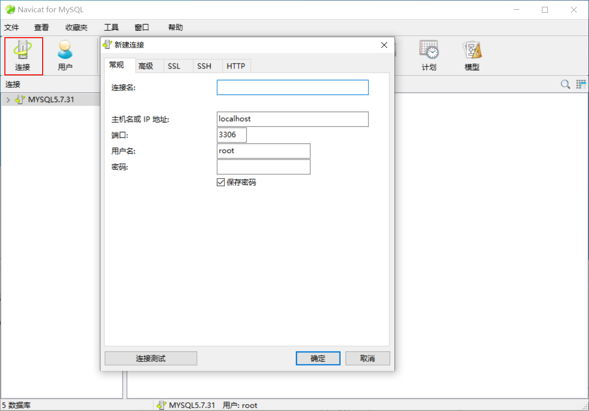

`Navicat`中新建数据库十分简单，但是在创建时需要注意字符集的指定。

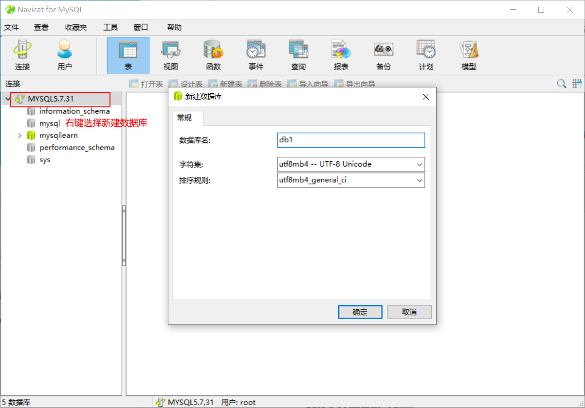

## 主键单表

所有的操作都是可视化的，使用十分便捷。

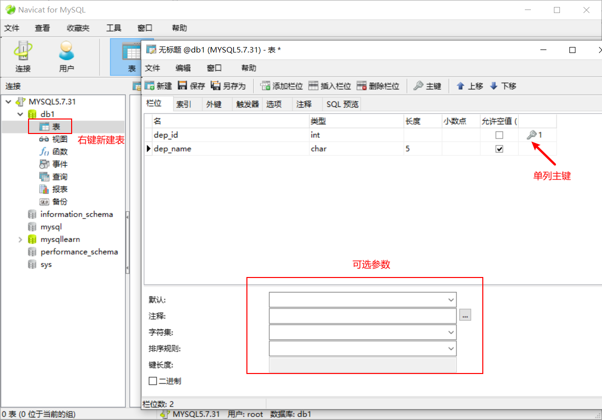

也可以进行`SQL`预览来查看它的`SQL`语句

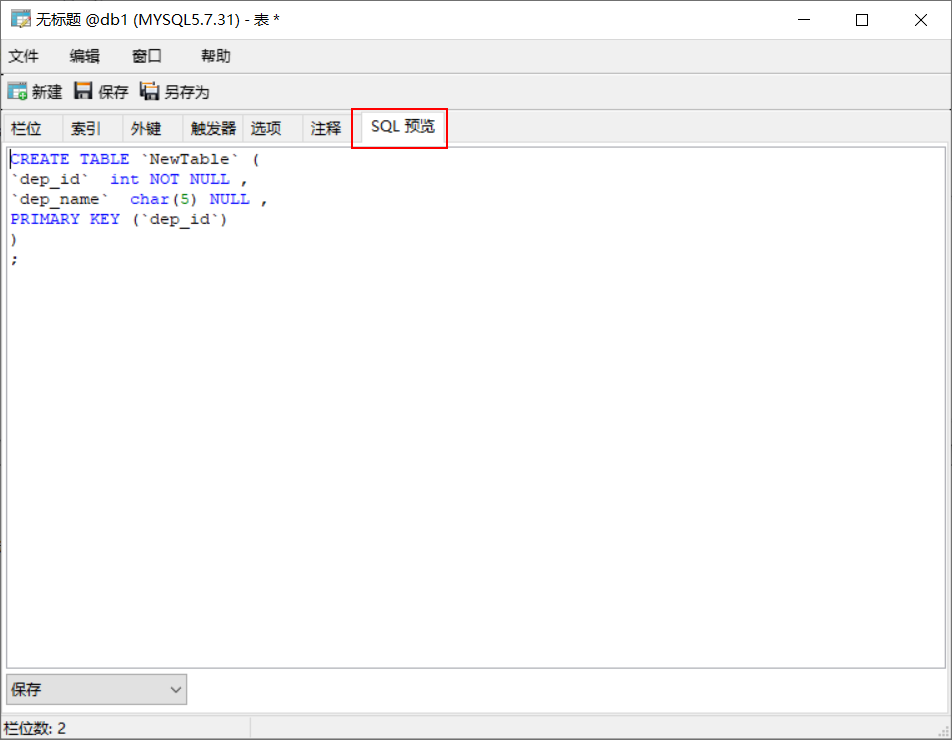

最后记得使用`crtl+s`进行保存，并为你的数据表取一个名字。

接下来我们再来创建一张`emp`表。

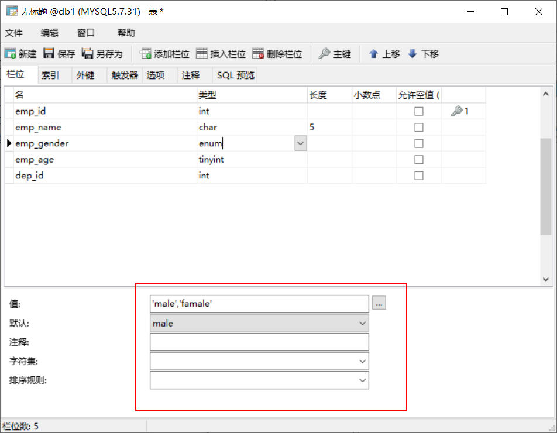

## 外键多表

想让`dep`和`emp`表进行外键约束，我们可以使用设计表的功能。

当然这是在`emp`表上进行外键关联。

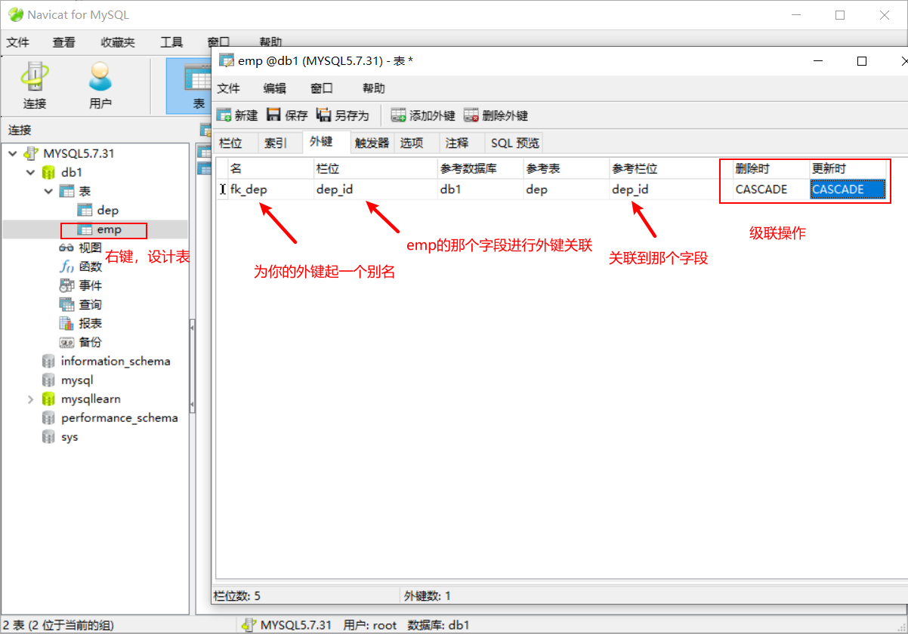

相当于添加了这一句。

```sql
ALTER TABLE `emp` ADD CONSTRAINT `fk_dep` FOREIGN KEY (`dep_id`) REFERENCES `dep` (`dep_id`) ON DELETE CASCADE ON UPDATE CASCADE;
```

# 记录操作

记录操作也都是可视化的，

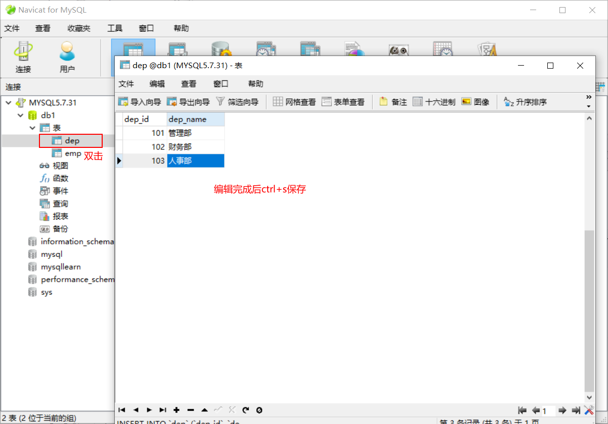

# 备份数据库

`Navicat`最强大的地方莫过于备份数据库。

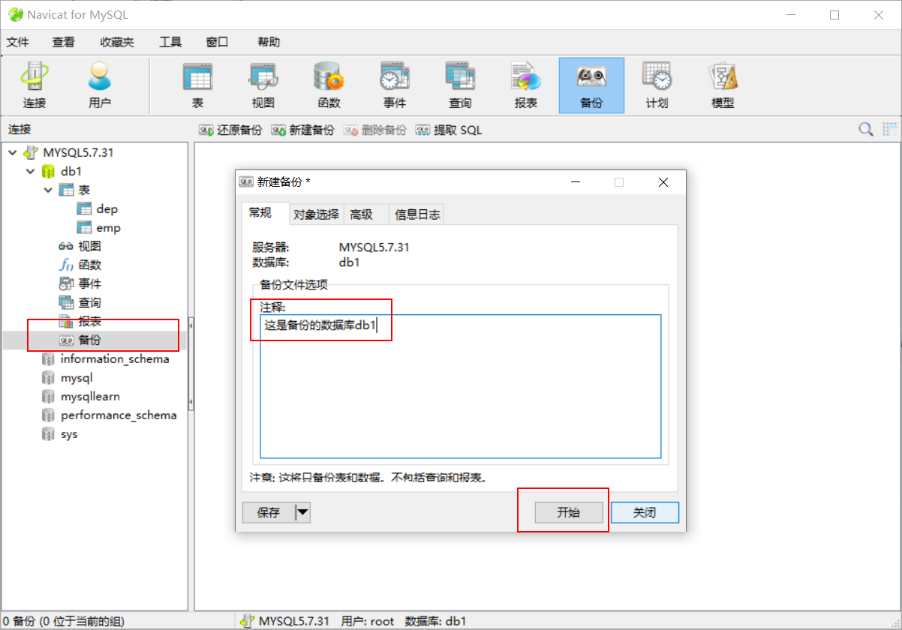

使用提取`SQL`来看看它保存的信息，会依据`psc`生成一个`sql`文件

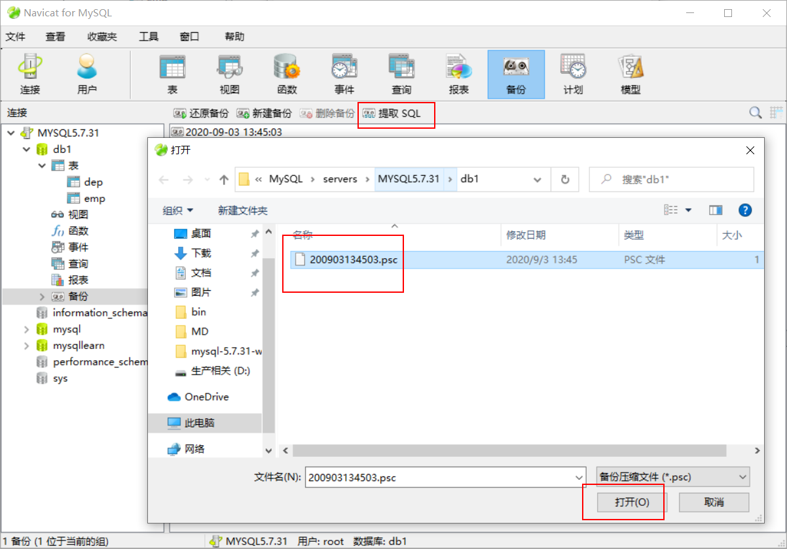

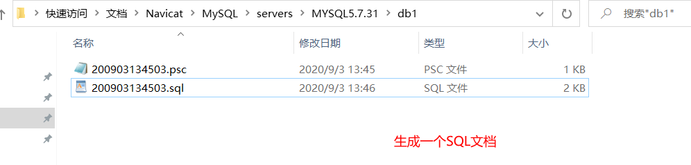

该文档内部全是`SQL`语句。

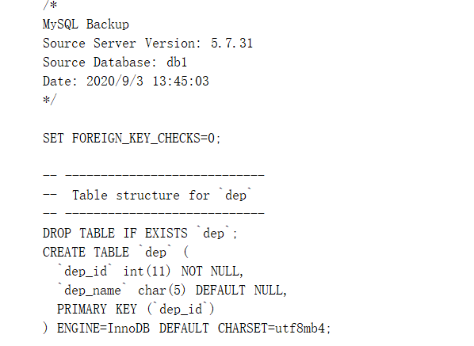

# 恢复数据库

我们只需要保存好原本的`psc`文件，将该文件保存到一个其他的地方。

需要恢复`db1`中的数据时，创建出`db1`数据库，再执行恢复选择`psc`文件即可完成恢复操作。